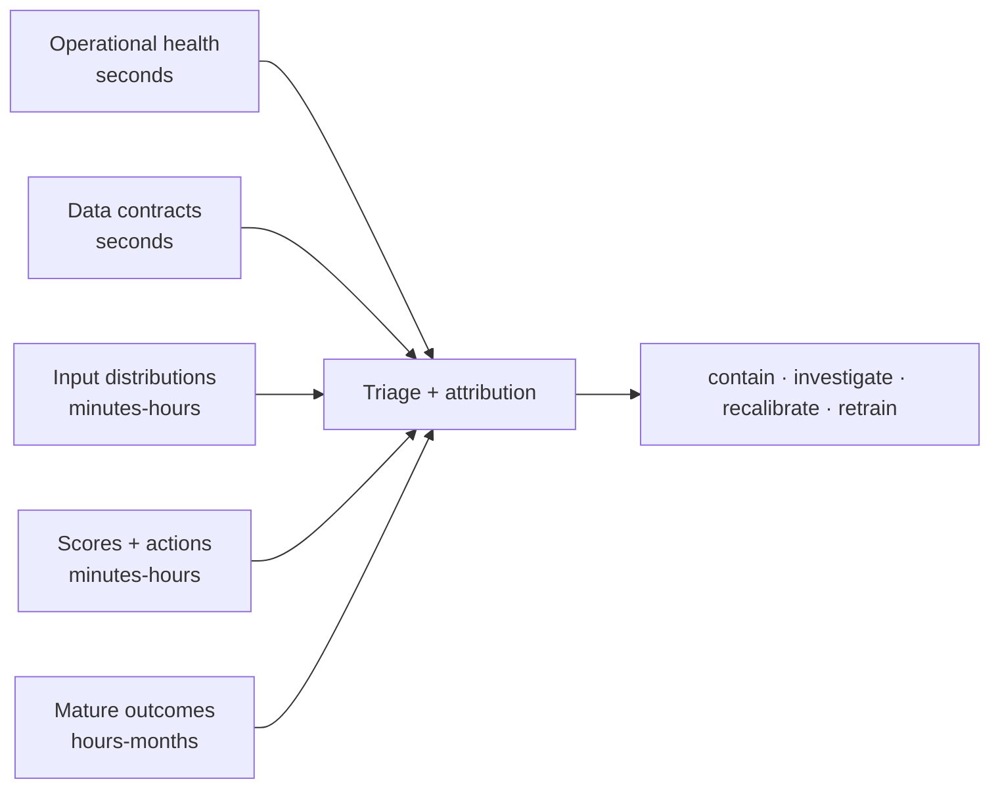
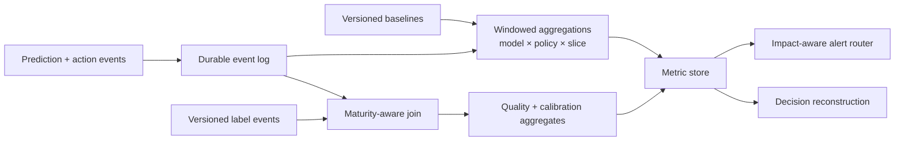
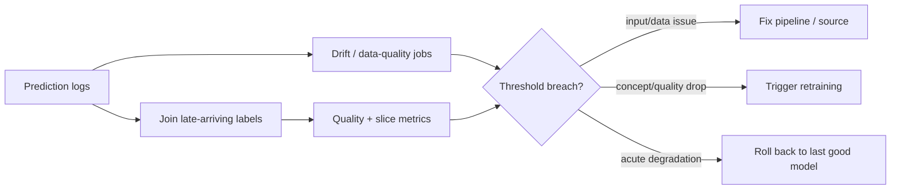

# Model Monitoring

## TL;DR

Model monitoring is observability for a decision system whose empirical quality is statistical and whose ground truth arrives late or never. The label pipeline is its own system-design problem; [Label and Ground-Truth Systems](./10-label-ground-truth-systems.md) covers selective labels, human review, and label-store correctness. A degraded model can return confident, well-formed answers while every HTTP response is a 200. Monitoring must therefore combine immediate operational and data-contract evidence, distributional evidence, and delayed outcome evidence. These signals are not a proof ladder — input drift can be harmless and concept drift can occur with stable inputs — but they differ in latency and causal specificity. The system's value is the action path that turns evidence into the right containment, not the number of dashboards.

> This is the model-quality complement to infrastructure observability. Pair it with [Metrics Systems and Monitoring](../11-observability/02-metrics-monitoring.md) and [Alert Evaluation and Notification](../11-observability/04-alerting.md), express degradation budgets as [SLOs and Error-Budget Control](../11-observability/05-slos-error-budgets.md), and wire the action path into [Incident Command and Learning](../11-observability/07-incident-management.md). For LLM output quality specifically, see [LLM Evaluation](../17-llm-systems/10-llm-evaluation.md).

---

## Silent Quality Failure

A model can miss new fraud patterns, degrade recommendations, or misprice a segment while returning syntactically valid, low-latency HTTP 200 responses. Operational health therefore cannot establish predictive quality. Monitor operational and data contracts immediately, distributions as leading evidence, and delayed outcomes as quality evidence; every alert needs a containment path.

---

## The Ground-Truth-Delay Problem

The reason model quality cannot be measured in real time is that the ground truth arrives late. A prediction is made at time T, but the outcome that would confirm or refute it is realized much later — and the gap defines what monitoring can and cannot see.

Consider the spread. A click-through model learns whether it was right within seconds; the user clicks or does not. A fraud model that approves a transaction may not learn it was wrong until a chargeback posts thirty to ninety days later. A credit-underwriting model may wait months or years for a loan to default. A content-recommendation model that optimizes long-term retention may *never* get a clean label at all, only noisy proxies. In each case the prediction is actionable immediately, but the truth that grades it is not.

The engineering consequence is severe: **you cannot alert on accuracy you do not yet have.** If a fraud model degrades today and the labels that would reveal it arrive in sixty days, then alerting on measured precision means discovering the problem two months and millions of dollars too late. A monitoring system that relies solely on ground-truth quality is, for any label-delayed domain, a system that detects fires by waiting for the insurance claim.

This forces the central architectural move of model monitoring: rely on **proxy signals that are available immediately** as early-warning surrogates for the quality you cannot yet measure. The prediction's *inputs* are available now. The prediction's *output distribution* is available now. Data quality is available now. None of these tells you directly that the model is wrong — but each is correlated with future quality, and each can fire in seconds instead of weeks. Monitoring is the art of assembling these surrogates into a ladder that gives you the earliest possible warning at the cost of certainty.

---

## The Monitoring Evidence Stack

The most useful decomposition is five evidence layers, roughly ordered by time-to-observe. Operational and contract signals can identify a broken mechanism immediately. Input and prediction distributions expose changed conditions but usually cannot establish quality loss. Mature, representative outcomes can estimate quality for the observed population, but even they inherit label and selection bias. Instrument the early layers first because they catch causal infrastructure failures cheaply; never let them substitute permanently for outcome evidence.



**Layer 1 — Operational health.** Latency, error rate, throughput, fallback rate, feature-lookup miss rate. This is ordinary service observability, and it catches the failures that *do* announce themselves: a crashed feature store, a timed-out model server, a deployment that won't load. It says nothing about prediction quality, but it is free, instant, and the right first thing to wire up. A model that cannot respond cannot be wrong correctly.

**Layer 2 — Data quality at serving time.** Schema conformance, value ranges, null rates, enum validity on the *features as the model actually receives them*. This is the highest-leverage layer in practice, because the most common cause of sudden model degradation is not the model at all — it is an upstream pipeline that started sending nulls, changed a unit, or dropped a join. A feature that silently becomes 90% null will quietly destroy a model's predictions while every distribution looks superficially plausible. Validating inputs at the serving boundary catches these before they reach the model.

**Layer 3 — Input (feature) drift.** The features are individually valid, but their *distribution* has shifted relative to the data the current model was trained on. A new market launches, a marketing campaign changes the traffic mix, a sensor recalibrates. The model is now extrapolating into a region of input space it saw little of during training, which is where models silently lose skill. Input drift cannot prove the model is wrong, but it flags the conditions under which it is most likely to be.

**Layer 4 — Prediction (output) drift.** The distribution of the model's *outputs* has shifted — the average score rose, the class mix tilted, the confidence distribution narrowed. This is a strictly cheaper proxy than measured quality because it needs no labels, only the predictions you already log. Its ambiguity is its weakness: a prediction shift can mean the world changed (legitimate), the input changed (drift), or the model broke (degradation), and output drift alone cannot distinguish them.

**Layer 5 — Observed model quality.** Precision, recall, AUC, calibration, and loss are computed once labels join back to the predictions that earned them. They are the closest evidence to the objective, but they estimate quality only for the labeled population under a particular observation policy. Maturity windows, unknown-vs-negative state, selective labels, correction history, and stable prediction-ID joins determine whether that estimate is trustworthy. Those mechanics are covered in [Label and Ground-Truth Systems](./10-label-ground-truth-systems.md).

The engineering implication is a budgeting rule: operational health and serving-time data contracts should exist on day one; distribution and action monitors add early evidence where labels are delayed; outcome metrics close the loop when their cohort matures. None is globally "stronger" than another. A schema violation can identify cause more directly than a quality drop, while a stable feature histogram cannot clear a model of concept drift.

---

## The Monitoring Data Plane and Its Join Contract

Monitoring is a derived-data system, and it can fail independently of the model. Its load-bearing input is an immutable prediction/exposure event emitted after policy execution, not a scrape of whatever model happens to be active later. At minimum the event identifies the decision, release manifest, feature versions, an immutable served-vector reference when parity or reconstruction is required, calibrated score, action, policy/threshold version, experiment assignment, request slice keys, and event time. A hash can verify a retrieved vector but cannot reconstruct one. A later label event joins by stable `prediction_id`; entity-plus-date joins are ambiguous when one entity receives several decisions.



The raw log and metric store have different retention and cardinality economics. At `r` decisions per second, the raw event count is `86,400r` per day; at 10,000/s that is 864 million events before labels. Persist full audit records for decisions whose consequence requires reconstruction, while sampling bulky feature payloads only under a documented design. Sampling must be deterministic by prediction ID so the later label join selects the same cohort, and rare safety slices may require 100% capture even when common traffic is sampled.

Aggregates are keyed by release *and policy*, because a threshold change can move actions and realized precision while the model bytes remain unchanged. Event-time windows need watermark and correction semantics: late predictions and revised labels update a new metric revision rather than silently rewriting a published point. The monitoring pipeline exposes its own SLOs — prediction-event coverage, ingest lag, label-join coverage, oldest unprocessed offset, metric revision age, and alert-delivery success. A flat quality line is untrustworthy when event coverage fell by half.

Privacy constrains observability design. Feature payloads can contain personal or commercially sensitive data; unrestricted logging turns monitoring into a shadow data lake. Prefer stable IDs, approved slice dimensions, feature hashes or bounded summaries where replay is unnecessary, encryption and retention by risk tier, and tightly audited access to reconstructable records. The design must still preserve enough evidence to explain consequential decisions; "log everything forever" and "log nothing sensitive" are both evasions of that trade-off.

---

## The Drift Taxonomy and Why It Dictates the Response

"Drift" is used loosely, but the distinctions matter because each kind of drift demands a different engineering response. The cleanest framing decomposes the joint distribution of inputs `X` and labels `Y` and asks which part moved.

**Covariate drift (feature drift)** is a change in `P(X)` — the distribution of inputs shifts while the underlying input-to-label relationship `P(Y|X)` holds. The classic example is a model trained on one geography now serving traffic from another, or a seasonal shift in user behavior. The model is not *wrong* about the relationship; it is operating where it has thin evidence. The engineering implication is that covariate drift is detectable *immediately and without labels*, by comparing live feature distributions against the training baseline — which makes it the workhorse early-warning signal.

**Concept drift** is a change in `P(Y|X)` — the very relationship the model encodes has changed, even if the inputs look identical. Fraud is the canonical case: attackers adapt to the deployed model, so the same features that meant "legitimate" last month mean "fraud" this month. Concept drift is the most dangerous kind because it is *invisible to input monitoring* — the features can look perfectly stable while the model becomes systematically wrong. The engineering implication is sobering: concept drift can only be confirmed once labels arrive, which means for label-delayed domains it is detected last and hurts most. Prediction drift is the only pre-label hint, and a weak one.

**Prior probability shift** is the narrower condition in which `P(Y)` changes while the class-conditional input distribution `P(X|Y)` remains stable. Under that assumption, a calibrated posterior or threshold can often be adjusted for the new prior without relearning the class-conditional structure. A changed marginal label rate by itself does *not* establish prior shift: it can also arise from covariate drift, concept drift, a changed action/observation policy, or label-pipeline selection. The monitor must test the stability assumption on representative mature cohorts before prescribing prior correction.

| Drift type | What moved | Visible without labels? | Typical response |
|---|---|---|---|
| Covariate / feature | `P(X)` | Yes — compare features to baseline | Investigate traffic source; consider retrain on new region |
| Concept | `P(Y\|X)` | No — only weak prediction-drift hints | Retrain on fresh labels; tighten label collection |
| Prior probability | `P(Y)` with stable `P(X\|Y)` | No; score movement is only a hint | Validate assumption; then prior-correct/recalibrate |

These are hypotheses about a joint distribution, not labels a dashboard can infer from one marginal. A change in `P(X)` can induce a change in `P(Y)` even when `P(Y|X)` is stable, and a score shift can arise from inputs, model release, calibration, or policy. Without representative labels and release context, the monitoring system can localize evidence but cannot identify concept drift. Alerts should therefore say "input distribution changed" or "mature cohort calibration changed," not claim a causal class the data does not establish.

Drift signals form a *triage vocabulary*, not one monitor. Ask which distribution moved under which observation policy. Covariate evidence points to data or population changes; concept drift requires representative labels; prior correction requires established stability of `P(X|Y)`.

A production triage table should distinguish drift from ordinary pipeline breakage:

| Symptom | Likely class | Fastest confirming evidence | Typical first action |
|---|---|---|---|
| Null rate jumps from 1% to 80% on one feature | Pipeline break | Serving-time schema/null monitor | Fail over feature, rollback upstream change |
| Country mix changes after new market launch | Covariate drift | Traffic/source distribution, feature PSI by country | Add slice guardrail; retrain when labels mature |
| Score distribution rises but inputs look stable | Concept, prior, policy, or selection change | Delayed labels, policy and product timeline | Tighten review; identify cause before retrain/recalibration |
| Base positive rate doubles with stable class-conditional inputs | Prior shift candidate | Representative mature labels + `P(X\|Y)` comparison | Validate observation policy; then recalibrate |
| Offline metrics good, online quality bad immediately | Training/serving skew | Served feature vector replay against training path | Block rollout; fix feature parity |

---

## Drift Detection as Comparison Against Versioned Baselines

A drift monitor is mechanically a comparison between a current window and a reference. The reference must match the question; no single baseline answers all of them.

- A **training fingerprint bound to the active release** asks whether the model is operating outside the distribution represented during fitting.
- A **seasonal production peer** such as the same hour and weekday asks whether the live system changed unexpectedly relative to normal operations.
- A **concurrent canary/control** asks whether a new release, rather than shared traffic, caused a difference.
- A **fixed policy or regulatory reference** asks whether a governed limit has been crossed regardless of recent behavior.

Every baseline is an immutable, versioned artifact with population filters, bin edges, time range, source generations, and intended question. A rolling window is useful for acute change detection but dangerous as the only reference because it can follow a slow degradation. A stale training fingerprint can also page forever after a legitimate population expansion while saying nothing about quality. The monitoring system should name the comparison in the alert instead of presenting "drift" as one universal scalar. The training pipeline persists the active release's fingerprint; monitoring adds seasonal and concurrent references without overwriting it.

The choice of statistic is secondary and well-trodden: population stability index and KL/Jensen-Shannon divergence for binned distributions, Kolmogorov-Smirnov for continuous features, simple category-share deltas for enums, and centroid or distance shifts for embeddings where per-dimension comparison is meaningless. Each has a known weakness, and the table below is a triage aid, not a recipe — the point of system design here is the plumbing (windowing, baselining, alerting), not the choice of test.

| Signal | Catches | Weakness |
|---|---|---|
| Null / default rate | Broken pipelines, dropped joins | Blind to semantic drift |
| PSI / JS divergence | Tabular distribution shift | Sensitive to binning choices |
| KS test | Continuous feature shifts | High traffic makes trivial shifts "significant" |
| Category-share delta | Enum / categorical shifts | Long tail is noisy |
| Embedding centroid shift | Representation drift for text/image | Hard to interpret or explain |
| Prediction distribution | Output behavior change | Cannot say whether input or model caused it |

Because PSI is the workhorse, it is worth computing once by hand to demystify what the monitor actually does. PSI compares the fraction of traffic in each bin between baseline and current window:

```text
PSI = Σ over bins:  (curr% − base%) × ln(curr% / base%)

amount_usd, baseline vs. this week:
bin           base%   curr%   (c−b)×ln(c/b)
$0–10         0.18    0.16    0.0024
$10–25        0.22    0.21    0.0005
$25–50        0.20    0.18    0.0021
$50–100       0.16    0.15    0.0006
$100–250      0.14    0.16    0.0027
$250+         0.10    0.14    0.0135   ← the tail is where the shift lives
                              PSI ≈ 0.022
```

Rules of thumb such as PSI 0.1 or 0.25 are widespread but are not universal risk thresholds. A PSI of 0.022 may be irrelevant for one model and consequential for another. Here nearly two-thirds of the total comes from the top bin, precisely where a fraud model may carry the most exposure. Report per-bin contributions and connect the shifted region to score sensitivity or decision loss; a scalar distance alone cannot decide severity. The computation is a few lines, which is why the system-design content is the plumbing and action semantics around it:

```python
def psi(base_hist, curr_hist, eps=1e-4):
    b = np.clip(np.asarray(base_hist), eps, None)
    c = np.clip(np.asarray(curr_hist), eps, None)
    b, c = b / b.sum(), c / c.sum()
    contrib = (c - b) * np.log(c / b)
    return contrib.sum(), contrib          # scalar for the alert, vector for the triage
```

Two operational notes. The `eps` clip is not pedantry: a category present in the baseline but absent this week (or vice versa) makes the log term infinite, and an unclipped PSI job crashes or pages on every new enum value. And the *bins are part of the baseline artifact* — recomputing bins from current data each window makes PSI values incomparable across time, which is why the baseline object above stores explicit bin edges rather than letting the job choose them.

Tooling has consolidated around exactly this comparison pattern: open-source **Evidently** and Google's **TensorFlow Data Validation** compute distribution distances against a reference schema, and managed platforms such as **Arize**, **Fiddler**, and **WhyLabs** productize baseline storage, windowed comparison, and slice-aware alerting. They differ in packaging, not in principle. The principle is always: *version the baseline, window the present, measure the distance, and make the alert actionable.*

A monitoring baseline should be a registry object, not an implicit dashboard setting:

```yaml
monitoring_baseline:
  baseline_id: fraud_classifier:v42.training_fingerprint
  model_version: fraud_classifier:v42
  dataset_snapshot: fraud_train:2026-05-31.7
  created_by_run: train_run_01J2...
  feature_fingerprints:
    amount_usd:
      type: continuous
      bins: [0, 10, 25, 50, 100, 250, 1000]
      histogram: [0.18, 0.22, 0.20, 0.16, 0.14, 0.10]
      null_rate: 0.001
    country:
      type: categorical
      top_values: { US: 0.62, JP: 0.11, GB: 0.08 }
      other_rate: 0.19
  prediction_fingerprint:
    score_bins: [0, 0.1, 0.2, 0.5, 0.8, 1.0]
    histogram: [0.52, 0.22, 0.18, 0.06, 0.02]
  slice_keys:
    - country
    - payment_method
    - new_customer
  valid_until_model_changes: true
```

This object lets monitoring answer "what should this model's inputs look like?" by following the active model pointer. A dashboard-configured baseline will eventually drift from reality because deploys move faster than dashboards.

---

## Training/Serving Skew as a First-Class Monitor

[ML System Fundamentals](./01-ml-system-fundamentals.md) defines the skew hazard, and [Feature Stores](./02-feature-stores.md) owns the temporal contract that should prevent it. Monitoring owns independent evidence that the contract held: deterministically sample decisions, retain or resolve the exact served vector, replay the registered offline path for that decision, and compare under the feature's declared tolerance. The join anchor is the immutable decision identity, not entity and timestamp, because an entity can receive multiple decisions at the same recorded time and timestamps can be normalized differently across systems.

```sql
-- The replay job writes at most one result per sampled prediction_id.
WITH sampled AS (
    SELECT prediction_id, model_version, served_features_ref
    FROM prediction_log
    WHERE predicted_at >= current_date - INTERVAL '1 day'
      AND predicted_at <  current_date
      AND mod(hashtextextended(prediction_id::text, 0), 100) = 0
), joined AS (
    SELECT s.prediction_id,
           s.model_version,
           v.features,
           v.ref AS resolved_features_ref,
           r.prediction_id AS recomputed_prediction_id,
           r.offline_value
    FROM sampled s
    LEFT JOIN served_feature_vectors v ON v.ref = s.served_features_ref
    LEFT JOIN offline_feature_replay_results r ON r.prediction_id = s.prediction_id
)
SELECT model_version,
       COUNT(*) FILTER (
         WHERE resolved_features_ref IS NULL
       )::float / NULLIF(COUNT(*), 0) AS missing_served_vector_rate,
       COUNT(*) FILTER (
         WHERE recomputed_prediction_id IS NULL
       )::float / NULLIF(COUNT(*), 0) AS missing_recomputation_rate,
       COUNT(*) FILTER (
         WHERE resolved_features_ref IS NOT NULL
           AND recomputed_prediction_id IS NOT NULL
           AND ABS((features->>'avg_txn_amount_7d')::float - offline_value)
               > 0.01 * GREATEST(ABS(offline_value), 1.0)   -- >1% relative divergence
       )::float / NULLIF(
         COUNT(*) FILTER (
           WHERE resolved_features_ref IS NOT NULL
             AND recomputed_prediction_id IS NOT NULL
         ), 0
       ) AS skew_rate_among_recomputed
FROM joined
GROUP BY model_version;
```

Missing served vectors and replay results are reported against the whole sampled cohort and excluded from the value-divergence denominator. Treating either lookup as an inner join would make a broken evidence path improve the apparent skew rate by dropping the hardest rows. "Healthy" is not universally bitwise zero: integer, enum, default, and missingness semantics should match exactly, while floating-point transforms may have a versioned tolerance justified by score sensitivity. Compare timestamps and feature-generation IDs as well as values. An entity ID reconstructs what the offline path believes now; only the logged value or immutable served-vector reference proves what the model consumed then.

---

## Why Alerting on Statistical Signals Is Hard

Operational alerting has it easy: error rate crosses 1%, page someone. Statistical alerting is harder in a way that determines whether the monitoring system gets used or ignored, and the difficulty is intrinsic, not a tooling gap.

The first problem is **noise**. Distribution distances jitter constantly from sampling variation alone. A KS test on a high-traffic model will flag a "statistically significant" shift from a difference so small it has no effect on predictions, because with millions of samples *everything* is significant. Statistical significance is not engineering significance, and a monitor that pages on every significant shift pages constantly.

The second problem is **seasonality**. Real input distributions breathe with the day, the week, and the holiday calendar. Traffic at 3 a.m. genuinely differs from traffic at noon; December genuinely differs from July. A naive monitor reads these legitimate rhythms as drift and cries wolf on schedule, training the on-call to ignore it.

The third problem is **alert fatigue**, which is the consequence of the first two and the death of the whole system. A drift dashboard that fires a dozen low-confidence alerts a day is a dashboard no one reads, and a monitor that is ignored is worse than no monitor because it created the illusion of coverage.

The engineering response is to make alerts *actionable rather than merely true*. Three disciplines do most of the work. First, **tie severity to impact, not to statistics** — page only when a signal is both significant *and* plausibly consequential, and route everything else to a review queue instead of a pager. Second, **borrow burn-rate alerting from SLO practice** ([SLOs and Error-Budget Control](../11-observability/05-slos-error-budgets.md)): alert on the *rate and persistence* of degradation against a budget, so a brief blip is tolerated and a sustained slide pages fast. Third, **compare against seasonal baselines** — same-hour-last-week rather than a flat reference — so the monitor stops mistaking the daily rhythm for a problem. The table below sketches a severity model; the organizing idea is that most statistical signals should *inform*, and only a few should *page*.

| Signal | Page? | Response |
|---|---|---|
| Serving error rate high | Yes | Restore availability |
| Critical feature freshness SLO missed | Yes | Fail over or disable the model |
| Sharp prediction-distribution shift | Usually no | Investigate in business hours unless tied to impact |
| Sustained quality metric below guardrail | Sometimes | Roll back or reduce traffic |
| Business KPI regression in a canary | Yes for critical flows | Stop the rollout |

A concrete routing matrix prevents every statistical anomaly from becoming a pager:

| Alert | Severity | Route | Auto-action |
|---|---|---|---|
| Model endpoint p99 or error SLO burn | Sev2/Sev3 | Serving on-call | Scale, shed, or rollback deployment |
| Required feature freshness breached | Sev2 for high-risk, ticket for low-risk | Feature owner + model owner | Use fallback feature/model if configured |
| Data contract violation at serving boundary | Sev2 | Upstream data owner + model owner | Block requests or fail closed depending on risk |
| Input drift high, no quality labels yet | Ticket / review queue | Model owner | Freeze rollout; start investigation |
| Guardrail slice quality below threshold | Sev2 for high-risk | Model owner + risk owner | Roll back or route slice to fallback |
| Canary business KPI regression | Sev2 | Experiment owner + deploy owner | Stop canary ramp |
| Appeal or complaint spike | Sev1/Sev2 depending harm | Risk/governance + model owner | Freeze automated action, route to human review |

The key is that every alert names an owner and a first action. "Drift detected" without owner, model version, baseline, affected slices, and suggested action is not an alert; it is a chart annotation.

Detection power is part of the contract. For an observed binary rate `p̂` over `n` approximately independent decisions, the standard error is roughly

```text
SE(p̂) = sqrt(p̂(1 - p̂) / n)
```

Rare slices and correlated traffic have less effective sample size than their row count suggests, so they need longer windows or hierarchical pooling. A guardrail should state its minimum detectable effect and maximum detection delay. "Alert when recall drops" is underspecified; "detect a 3 percentage-point drop on the high-value-merchant slice within six hours at the chosen false-alarm budget" can be capacity-planned against label rate.

Monitoring hundreds of features across dozens of slices also creates a multiple-testing system: even a 1% false-positive probability produces noise when thousands of tests run each hour. Control the family of alerts, not just each test — pre-register paging slices, combine related feature anomalies into one incident, use effect-size and persistence gates, and apply false-discovery control for exploratory review queues. Never hide a newly observed category merely because it was grouped into an "other" bin; schema novelty is a separate data-contract signal from distribution distance.

---

## Slice-Based Monitoring: Aggregates Hide Regressions

An aggregate metric is an average, and averages conceal exactly the failures that matter most. A model can hold its overall precision flat while a specific segment — a country, a device type, a language, a tenant, a new-user cohort — degrades badly, because the healthy majority masks the suffering minority. This is Simpson's paradox as an operational hazard: the top-line number says "fine" while the system is actively failing the users you can least afford to fail.

The engineering implication is that monitoring must be **sliced along the dimensions where regressions are both likely and costly**, and those slices must be chosen deliberately rather than discovered after an incident. The standard cuts are geography, device and platform, language, customer tenant, traffic source, and — where legally and ethically appropriate — protected classes, because a model that degrades on a protected segment is not merely a quality bug but a fairness and compliance failure. Slice monitoring is more expensive than aggregate monitoring: each slice needs enough traffic to compute a stable metric, and naively slicing every dimension explodes combinatorially. The discipline is to pre-register the slices that carry real risk, set per-slice guardrails, and accept that the cheapest place to discover a per-segment regression is a dashboard, while the most expensive place is a regulator's letter.

---

## The Feedback Loop: Monitoring Triggers Retraining

Monitoring is not an end in itself; in a mature ML platform it is the *trigger* for the system's corrective action. The clearest version of this is triggered retraining: a drift or quality signal crossing a threshold fires a retrain of the model on fresh data, closing the loop between detection and repair. This is precisely the *triggered retraining* strategy described in [Training Pipelines](./05-training-pipelines.md) — retraining driven by observed change rather than by the calendar.



The critical discipline, carried over from the retraining-automation argument, is that **the loop must be only as automatic as its safety nets are trustworthy.** A monitoring signal wired directly to an unsupervised retrain-and-deploy loop is a mechanism for converting a noisy alert or a corrupted data partition into a fast, automated production incident. The strength of the trigger should match the maturity of the validation, canary, and rollback machinery downstream of it. For most systems the right wiring is: monitoring detects, a human confirms, the pipeline retrains under promotion gates, and an automatic rollback stands ready if the new model regresses. Monitoring earns the right to trigger fully-automated action only after it has demonstrated that its signals are clean and its rollback is fast.

---

## Label-Delay Monitoring Contract

Because quality metrics depend on late labels, the label pipeline itself must be monitored. Otherwise the dashboard can confuse "model quality is stable" with "labels stopped arriving."

```yaml
label_monitoring_contract:
  prediction_stream: fraud_predictions:v4
  label_stream: chargeback_labels:v6
  join_key: prediction_id
  maturity_windows:
    early_proxy: 1d
    primary_label: 60d
    final_label: 120d
  expected_label_coverage:
    1d: 0.15
    60d: 0.92
    120d: 0.98
  unknown_state: label_pending       # not negative
  correction_policy:
    allow_label_updates_until: 120d
    preserve_history: true
  quality_metrics:
    - precision_at_review_capacity
    - recall_at_fixed_fpr
    - calibration_by_score_decile
  alerting:
    coverage_drop_threshold: 5pp
    join_failure_threshold: 0.5pp
    delayed_label_backlog_threshold: 24h
```

The `unknown_state` field is load-bearing. Treating missing labels as negatives is a silent metric corruption that makes a model appear better or worse depending on the domain. A mature monitoring platform tracks label coverage, label age, join failures, corrections, and labeler/system outages alongside model quality.

A useful label-delay dashboard separates three curves:

```text
predictions made      ─── how much volume needs labels
labels matured        ─── how much truth has arrived
metric computed on    ─── which prediction cohorts are now trustworthy
```

If the first curve grows and the second stalls, the incident is in the label system, not necessarily the model.

---

## From Signal to Causal Triage

The first response to drift is diagnosis and containment, not retraining. The same alert can be caused by a source bug, traffic-mix change, policy change, label outage, real concept movement, or a monitor bug. Retraining on the first four can encode the incident into the next model.

| Evidence pattern | Most plausible boundary | Safe containment | Evidence required before repair |
|---|---|---|---|
| schema/default/freshness break; scores move | feature or source path | disable feature, use independent fallback, or abstain | served-vector replay and source generation timeline |
| inputs move with known market/campaign; conditional quality stable | traffic population | freeze expansion or add slice-specific limits | mature slice labels and product-change record |
| inputs stable; quality/calibration changes | concept, label definition, or policy | reduce automation or increase review | label-version audit and policy-conditioned metrics |
| scores/actions move exactly at release time | model, calibration, or threshold release | stop ramp or restore previous release manifest | model-and-policy attribution from prediction logs |
| every metric goes flat while event coverage drops | monitoring data plane | treat quality as unknown; restore telemetry | offset, coverage, join, and alert-delivery SLOs |

Causal order matters. Confirm active release and baseline, then the monitor's own coverage, then serving and feature health, then rollout or experiment context, and only then interpret distribution or label evidence. Localize by release, policy, source generation, and pre-registered slice. Containment targets the smallest boundary supported by evidence: freezing one slice is safer than a global rollback when only a new market shifted; rolling back a model is ineffective when both versions consume the same corrupt feature.

Every incident should leave a machine-enforced improvement — a new contract field, source-generation dimension, baseline, slice guardrail, fallback independence rule, or promotion gate. A prose-only postmortem does not shorten the next detection path.

---

## Detection Delay Is a Harm Budget

Monitoring requirements should be derived from how quickly an automated decision can accumulate unacceptable loss. If decisions arrive at rate `r`, a degraded decision creates expected incremental loss `Δc`, and the system takes `T` seconds to detect, decide, and contain, a first-order exposure estimate is

```text
expected incremental harm ≈ r × Δc × T
T = T_signal + T_window + T_alert + T_decision + T_mitigation
```

The equation is deliberately simple: it makes label delay and operational response part of system capacity. If 1,000 decisions/s can each create €0.02 of incremental loss, a one-day truth delay implies €1.728 million of expected exposure under the assumed degradation. The response is not to pretend a drift statistic proves harm. It is to bound actuation while truth is missing: cap transaction value, preserve a control group, route uncertain cases to review, require a canary, or use an independent rule that limits correlated loss.

This yields a design invariant: `T` must be below the product's harm horizon at the maximum permitted decision rate. When truthful labels mature after that horizon, a proxy must trigger reversible containment, not automatic retraining, because it detects changed conditions without identifying the repair. High-consequence systems need lower actuation limits precisely when proxy confidence is low.

---

## Failure Modes

The characteristic failures of model monitoring recur across organizations, and naming them is most of preventing them.

**Silent degradation** is the root failure the whole discipline addresses: the model gets worse while every operational metric stays green, because a degraded model returns confident, well-formed, wrong answers. The defense is the proxy hierarchy — input and prediction drift give a pre-label warning that operational monitoring never will.

**Label-delay masking** is silent degradation's accomplice: because outcome-based quality lags, a model can fail for weeks before measured accuracy reflects it. The defense is to combine early causal contract signals and distributional evidence with maturity-aware quality, rather than using any one as universal proof.

**Baseline substitution** is the monitor that answers the wrong question: a rolling window silently replaces the active model's training fingerprint, or a stale training fingerprint is used to diagnose an acute release change. The first can track slow degradation; the second confounds normal population movement with incidents. The defense is a versioned baseline set whose members state population, time, release/policy, and intended comparison.

**Alert fatigue** is the social failure mode: noisy, seasonal, statistically-significant-but-meaningless alerts train the on-call to ignore the dashboard, so the one real alert is missed in the flood. The defense is impact-based severity, seasonal baselines, burn-rate alerting, and routing low-confidence signals to a review queue instead of a pager.

**Slice masking (Simpson's paradox)** is the aggregate that lies: top-line quality holds while a critical segment fails underneath it. The defense is pre-registered slice monitoring with per-segment guardrails.

**Skew-audit blindness** occurs when replay joins by entity/time, drops failed recomputations, or retains only a feature hash. The monitor then reports parity for the easy surviving rows without possessing the served values. Join by `prediction_id`, report replay coverage separately, and compare actual as-served evidence under the registered tolerance.

**Selective-observation blindness** occurs when quality is computed only on outcomes the current policy allowed the system to observe. A fraud model appears precise because blocked transactions never reveal their counterfactual outcome; a ranker grades only shown candidates. The defense is exposure logging, propensity or experiment metadata, preserved exploration where safe, and metrics that state which population they estimate. More labels from the same selective path do not remove the bias.

**Monitor-pipeline failure** is the false green dashboard caused by missing prediction events, stalled label joins, or an alert-delivery outage. The defense is independent coverage and lag SLOs for every monitoring edge, plus an explicit `quality_unknown` state. Absence of evidence is not evidence that quality held.

**Model/policy attribution loss** occurs when metrics group by model version but thresholds, eligibility, or post-processing change independently. Actions regress while the model dashboard is stable, and rollback targets the wrong component. The defense is to bind and aggregate by the full release manifest, including calibration and policy version.

---

## Decision Framework

Start from the harm horizon and work backward; do not start from a catalog of drift tests.

| Decision | Required evidence | Architecture consequence |
|---|---|---|
| What action can go wrong, at what rate and loss? | decision volume, asymmetric cost, reversibility, concentration by slice | actuation cap, abstention/review path, severity and response deadline |
| When does truth mature? | label-delay distribution, coverage, correction rate, selective-label mechanism | cohort windows, proxy period, exploration/control allocation |
| What fails earlier than quality? | source generations, feature validity, release and policy changes | operational/data contracts and direct skew monitors before generic drift |
| What comparison is meaningful? | active release's training fingerprint, seasonal peer, canary/control | versioned baseline set; never one rolling baseline for every question |
| What effect must be detectable? | minimum harmful change, slice traffic, effective sample size | window duration, capture rate, confidence/effect-size gate |
| Who can act on the signal? | owner and independent fallback for each boundary | alert routing, containment automation, escalation and audit trail |
| Can the observer be trusted? | event coverage, lag, join rate, revision age, delivery success | monitoring-pipeline SLO and explicit unknown state |

Operational health and serving-time data quality are the first layer because they are immediate and causal. Drift and prediction distributions add pre-label evidence only after their baselines and seasonal peers are versioned. Direct skew audits are required where offline and online computation can diverge. Slice quality follows the decision's risk model, not every available dimension. Full automation is appropriate only for actions whose causal interpretation is strong and reversible — stopping a canary on a guardrail breach, for example. A generic drift alert should usually freeze exposure or open investigation, not train and deploy a replacement.

The finished design should satisfy `T_signal + T_window + T_alert + T_decision + T_mitigation ≤ T_harm` for the maximum allowed actuation rate. If it cannot, reduce the action's blast radius; buying another monitoring dashboard does not change the physics of late truth.

---

## Key Takeaways

1. A degraded model fails silently — confident, well-formed, wrong answers while every operational metric is green. Monitoring exists to make that statistical degradation observable.
2. Ground truth arrives late or never, so monitoring must lean on immediate proxy signals rather than waiting for measured accuracy.
3. Structure monitoring as complementary evidence: operational health, data contracts, input distributions, scores/actions, and mature outcomes. Earlier does not mean weaker, and drift is not proof of quality loss.
4. The drift taxonomy constrains the response: covariate drift concerns `P(X)`, concept drift concerns `P(Y|X)`, and prior correction is justified only when `P(Y)` changed while `P(X|Y)` remained stable.
5. Drift detection needs versioned baselines matched to the question: active-release training fingerprint, seasonal peer, concurrent control, or fixed policy reference. One rolling baseline can follow a slow degradation.
6. Skew monitoring joins replay by stable prediction ID, reports missing recomputations separately, and compares actual served vectors; a hash alone is not replay evidence.
7. Alerting on statistical signals is hard because of noise, seasonality, and fatigue; make alerts actionable by tying severity to impact and using burn-rate and seasonal baselines.
8. Label coverage and maturity must be monitored separately; missing labels are not negative labels.
9. Aggregate metrics hide per-segment regressions; pre-register and monitor the slices that carry real business and fairness risk.
10. Monitoring is the trigger for retraining and rollback, but the loop must be only as automatic as its safety nets are trustworthy.
11. Derive monitoring latency from a harm budget: decision rate × incremental loss × time-to-containment bounds how much automation is safe while truth is delayed.
12. Monitoring is itself a production data plane. Coverage, ingest lag, label joins, metric revisions, and alert delivery need independent SLOs and an explicit unknown state.

---

## References

1. [Hidden Technical Debt in Machine Learning Systems](https://proceedings.neurips.cc/paper_files/paper/2015/file/86df7dcfd896fcaf2674f757a2463eba-Paper.pdf) — Sculley et al., 2015
2. [Data Validation for Machine Learning](https://mlsys.org/Conferences/2019/doc/2019/167.pdf) — Breck et al., 2019
3. [TFX: A TensorFlow-Based Production-Scale Machine Learning Platform](https://dl.acm.org/doi/10.1145/3097983.3098021) — Baylor et al., 2017
4. [Rules of Machine Learning: Best Practices for ML Engineering](https://developers.google.com/machine-learning/guides/rules-of-ml) — Zinkevich
5. [Evidently: Open-Source ML Monitoring Documentation](https://docs.evidentlyai.com/)
6. [Arize AI: ML Observability Concepts](https://arize.com/ml-observability/)
