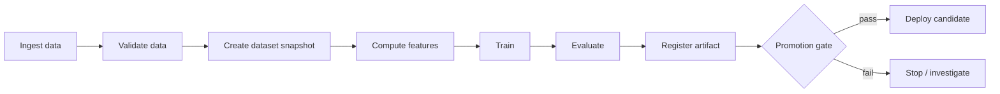

# Training Pipelines

## TL;DR

A training pipeline is the durable transaction that turns versioned inputs into an evaluated model release. The notebook that produces a promising artifact is not a pipeline; the pipeline makes each run reconstructible, validates contracts before expensive work, commits immutable artifacts atomically, records lineage, and hands promotion a complete release candidate rather than a loose file. Reproducibility is necessary but not sufficient: a perfectly reproducible pipeline can faithfully regenerate leaked data or a harmful model. The system must preserve both provenance (what happened) and validity (why this artifact was allowed to advance).

---

## The Training Pipeline Is a System, Not a Script

A script describes computation; a training pipeline also owns durable state, input identity, attempt isolation, artifact visibility, lineage, validation, and recovery. Its public result is not “a file was written.” It is one committed manifest whose declared inputs, execution environment, outputs, and evaluation form a coherent candidate. Replaying the same request either reuses an eligible committed artifact or creates another traceable attempt; it must not race two mutable output paths.

Three guarantees are intentionally separate. **Reconstruction** retrieves the pinned inputs and execution contract needed to reproduce a declared-equivalent artifact. **Promotion** proves that one evaluated candidate is allowed to enter a release lifecycle. **Rollback** restores a retained, previously qualified deployable bundle. A reproducible model can still be unsafe to promote, and rebuilding it during an incident is not rollback.

The chapter therefore owns the transaction from immutable input manifests to one evaluated output manifest. [ML System Fundamentals](./01-ml-system-fundamentals.md) owns the broader data-dependency and lifecycle motivation; [Dataset Management and Versioning](./11-dataset-management-versioning.md) owns snapshot identity; [Offline Evaluation and Metric Design](./12-offline-evaluation-metrics.md) owns measurement; [Model Registry and ML Metadata](./13-model-registry-metadata.md) owns cross-run release metadata; and [Model Deployment and Rollouts](./06-model-deployment-rollouts.md) owns activation and rollback. The interfaces among them remain visible here because the pipeline must commit evidence each downstream owner can verify.

---

## Anatomy of a Training Pipeline

A production pipeline is a directed acyclic graph of idempotent steps, each consuming versioned inputs and producing versioned outputs. The shape is consistent across nearly every mature ML platform.



What makes this a *system* rather than a flowchart is that every edge carries metadata — dataset version, code version, feature definitions, parameters, artifact hash, evaluation report — and every node is owned, monitored, and re-runnable. Dataset snapshots and split assignments are covered in [Dataset Management and Versioning](./11-dataset-management-versioning.md); metric design and leakage checks are covered in [Offline Evaluation and Metric Design](./12-offline-evaluation-metrics.md). A training pipeline is structurally a [batch data pipeline](../13-data-pipelines/01-batch-processing.md) with a model at the end; it inherits the same demands for [idempotent](../01-foundations/08-idempotency.md) steps, snapshot-based reproducibility, and [workflow orchestration](../18-workflow-job-systems/05-dag-orchestration.md) discipline that any derived-data system needs.

### Stage Ownership

Ambiguous ownership is the single most common reason pipelines decay, so the ownership table is not bureaucratic overhead — it is the contract that prevents silent erosion.

| Stage | Owner | Contract it guarantees |
|---|---|---|
| Source ingestion | Data/platform team | Fresh, deduplicated, schema-versioned data |
| Label generation | Product/domain team | Stable label definition and known delay window |
| Feature computation | Feature owner | Point-in-time correct feature values |
| Training | ML team | Reproducible artifact and metrics |
| Evaluation | ML + product + risk | Promotion decision against guardrails |
| Registry | Platform team | Artifact state, lineage, retained release identity |
| Deployment | Serving/platform team | Runtime compatibility and rollout controls |

The contract column matters more than the owner column. When a contract is violated — labels arrive later than the promised window, a feature silently changes meaning — the pipeline should fail loudly at the boundary, not absorb the violation and pass a corrupted dataset downstream.

---

## Run State, Artifact State, and Ownership

A workflow scheduler's `SUCCEEDED` flag is not the commit record for a model release. Three states must be kept distinct:

- **run state** — queued, leased, running, retryable failure, terminal failure, completed;
- **artifact state** — staged, committed, quarantined, expired;
- **release state** — candidate, evaluated, approved, deployed, retired.

A worker may finish computation and lose its lease before reporting success. A retry can then run concurrently and produce a second candidate. If workers publish directly to a mutable final path, the last writer silently chooses the model. The safe protocol gives every attempt a unique staging prefix, writes content-addressed objects, validates their hashes and schemas, then asks the control plane to conditionally commit a manifest against the still-current run lease. Only the manifest transition makes outputs visible to downstream steps. Late workers may leave reclaimable staged objects, but they cannot overwrite the winner.

```text
attempt writes:  staging/run=R/attempt=A/{model, metrics, logs}
attempt proposes: manifest(inputs, object hashes, code, environment, evaluation)
control plane:   COMMIT manifest IF run=R is RUNNING AND lease_token=L
result:          one committed manifest; duplicate attempts are harmless
```

This is an [idempotency](../01-foundations/08-idempotency.md) boundary, not just file organization. The same protocol applies to dataset snapshots, transformed features, checkpoints, and evaluation reports. Downstream tasks consume committed manifest IDs, never paths named `latest`, and promotion consumes a release manifest binding all required artifacts. Garbage collection follows reachability from committed manifests and retention policy; age alone cannot identify an unreferenced artifact safely.

Control-plane availability and worker availability have different consequences. If workers fail, the run retries from committed inputs. If the metadata/control plane is unavailable, workers may continue bounded computation but must not publish or promote, because lineage and uniqueness cannot be proven. This deliberately chooses consistency for release state over availability: an expensive duplicate run is recoverable; two conflicting production candidates with incomplete provenance are not.

---

## The Reproducibility Problem

Reproducibility is a foundation property because every investigation depends on it, but the word hides three different guarantees:

| Level | Guarantee | Needed for |
|---|---|---|
| Reconstructible | immutable inputs, code, environment, parameters, and execution graph can be retrieved | audit, impact analysis, rerun after retirement |
| Statistically reproducible | repeated runs meet a declared metric/distribution tolerance | routine comparison under stochastic training |
| Bitwise reproducible | artifact bytes are identical | forensic debugging, strict regulated workflows, cache eligibility |

Most production pipelines require reconstructibility for every release and statistical reproducibility for routine retrains. Bitwise identity can be costly or unavailable across hardware generations and kernels; demanding it everywhere wastes capacity, while claiming it from a seed alone is false. The release contract must name the level it provides and how equivalence is tested.

A model is reproducible only if five distinct axes are pinned, and most reproducibility failures come from forgetting one of them.

**Code** is the most obvious axis and the one teams handle best, because Git already solves it. The model version must record the exact commit that trained it, including the pipeline definition, not just the model class.

**Data** is the axis teams handle worst, because data is large, mutable, and lives outside version control. The pipeline must pin an immutable snapshot — a specific partition, a specific timestamp, a specific label window — such that the exact training set can be reconstructed. "I trained on last month's data" is not reproducible; "I trained on the snapshot at `2026-06-10T00:00:00Z` with a 30-day label window" is. The label window is not a detail: it is part of the target definition, and premature or selectively missing labels corrupt the training set before the model sees it (see [Label and Ground-Truth Systems](./10-label-ground-truth-systems.md)).

**Features** are a subtle axis because feature definitions evolve independently of model code. A feature named `account_risk` might mean three different things across three versions. The model must pin the feature *view versions* it consumed, and the meaning of those versions must be immutable. (This is why feature stores treat a semantic change as a new feature name, not an in-place edit — see [Feature Stores](./02-feature-stores.md).)

**Parameters** include hyperparameters and random seeds. Without the seed, a model trained twice on identical data can differ, which makes debugging variance from genuine regression impossible. A seed alone does not make a GPU stack deterministic: some operations have nondeterministic implementations, libraries inspect process-level configuration during initialization, and data-loader workers have independent RNG streams. The following is a scoped PyTorch setup, not a universal guarantee across releases, drivers, hardware, or unsupported operators:

```python
# Process-level requirements must be set before importing torch or initializing CUDA.
import os
os.environ["CUBLAS_WORKSPACE_CONFIG"] = ":4096:8"

import random
import numpy as np
import torch
from torch.utils.data import DataLoader


def seed_worker(worker_id):
    # DataLoader assigns each worker a torch seed derived from its generator.
    worker_seed = torch.initial_seed() % (2**32)
    np.random.seed(worker_seed)
    random.seed(worker_seed)

seed = 42
random.seed(seed); np.random.seed(seed); torch.manual_seed(seed)
torch.cuda.manual_seed_all(seed)

torch.use_deterministic_algorithms(True)  # fail if an exercised op lacks a deterministic path
torch.backends.cudnn.benchmark = False

loader_rng = torch.Generator().manual_seed(seed)

loader = DataLoader(ds, num_workers=8, shuffle=True,
                    generator=loader_rng,
                    worker_init_fn=seed_worker)
```

Deterministic modes can reduce throughput or reject unsupported operations, with impact depending on model and hardware. Even when every exercised operation has a deterministic path, cross-version or cross-hardware byte identity is a separate compatibility claim that must be tested. Many teams reserve a tightly pinned deterministic path for forensic or audit work and accept *statistical* reproducibility for routine runs. The tolerance itself must come from repeated baseline runs and cover important slices, not a convenient global metric. Either policy can be defensible; the failure is leaving equivalence undefined, so "the retrain came out different" cannot be classified as expected variance or regression.

**Environment** is the axis that produces the most baffling incidents, because it is invisible. A NumPy upgrade changes floating-point accumulation order. A CUDA version changes kernel behavior. The model trained yesterday cannot be reproduced today because the container image was rebuilt. The pipeline must pin the container image *by digest*, not by tag — `ml-train:latest` is the enemy of reproducibility.

The practical encoding of all five axes is a *reproducibility contract*: a metadata record attached to every registered model that answers, programmatically, "what produced this?" The registry — not a Slack thread, not a wiki, not someone's memory — is the source of truth. The registry control-plane design is covered in [Model Registry and ML Metadata](./13-model-registry-metadata.md).

```yaml
# The reproducibility contract: the minimum required to rebuild a model
model_version: fraud_classifier_v42
code:        { repo: org/ml-models, commit: 441c720, pipeline: pipelines/fraud/pipeline.py }
data:        { snapshot: "2026-06-10T00:00:00Z", label_window_days: 30, split: time_based }
features:    [ "account_risk:v12", "device_velocity:v7" ]
parameters:  { max_depth: 6, learning_rate: 0.05, seed: 42 }
environment: { image_digest: "sha256:9f86d08...", accelerator: A100-40GB }
```

The rule that makes this work: **no artifact enters the registry without a complete contract.** A model without provenance is not a release candidate; it is a liability.

---

## The Validation Problem: Catching Bad Data Before It Becomes a Bad Model

The most expensive way to discover a data problem is in production, weeks after a model trained on corrupted data started making decisions. The second most expensive is after a four-hour GPU training run completes. The cheapest is before training starts. Data validation exists to move detection as early as possible.

The categories of data failure are well understood. **Schema failures** — a column disappears, a type changes — are the easiest to catch and the most common after an upstream refactor. **Range failures** — a negative age, a probability above one, a transaction amount of ten billion dollars — catch corruption that schema checks miss. **Distribution failures** are subtler and more dangerous: the schema is intact, the values are in range, but the *shape* of the data shifted, because a new market launched, a logging bug halved the event volume, or an upstream join started dropping rows. **Completeness failures** — forty percent of labels suddenly missing — silently bias the model toward whatever subpopulation still has labels. **Uniqueness failures** — duplicated events — inflate the apparent frequency of whatever the duplicates represent.

| Failure class | Example | Cheapest check | Misses what |
|---|---|---|---|
| Schema | `amount` column dropped or retyped | type + presence assertion | values that are valid but wrong |
| Range | `age = -3`, `prob = 1.4` | min/max + domain bounds | in-range corruption |
| Distribution | mean order value halves overnight | divergence vs baseline (PSI/KS) | per-slice shifts hidden in aggregate |
| Completeness | 40% of labels missing | null-rate + row-count delta | nulls concentrated in one segment |
| Uniqueness | events double-counted | primary-key dedup + count | near-duplicates that aren't exact |

The validation suite is itself a versioned artifact, declared next to the pipeline and enforced as a gate. A practical encoding looks like an explicit contract rather than scattered `assert` statements:

```yaml
# data_contract: fraud_training_inputs·v7  (evaluated before training starts)
transactions:
  schema:
    transaction_id: { type: string, unique: true, required: true }
    amount_usd:     { type: float,  min: 0, max: 1_000_000, required: true }
    event_type:     { type: enum,   allowed: [purchase, refund, auth] }   # new value = fail
  freshness:
    max_lag_minutes: 90              # else: stale upstream, fail closed
  volume:
    expected_rows_per_day: 50_000_000
    tolerance: 0.20                  # ±20% day-over-day, else page data owner
  distribution:
    amount_usd: { baseline: model_v41_train_fingerprint, max_psi: 0.2 }
labels:
  completeness:
    min_label_rate: 0.95            # <95% labeled → biased training set, fail
  delay:
    max_observed_delay_days: 30     # contract from Label & Ground-Truth Systems
```

The `baseline` reference is the load-bearing part: distribution checks compare against the *statistical fingerprint of the data the current production model was trained on*, persisted as a versioned artifact, not against a rolling recent window (which would silently track the very drift it is meant to catch — the same baseline-drift trap that defeats [model monitoring](./04-model-monitoring.md)).

The deeper principle is that *type compatibility does not imply semantic compatibility*. The `event_type` enum gaining a new value, or `total_spend` switching from gross to net, will pass every type check and every null check while quietly poisoning the model. This is why mature validation compares against a *baseline distribution* — the statistical fingerprint of the data the current production model was trained on — and flags divergence even when every value is individually valid. Google's TensorFlow Data Validation and tools like Great Expectations exist precisely to make these distributional contracts explicit, versioned, and enforced before training consumes a single GPU-hour.

The operational rule is *fail fast, fail loud*. A validation failure should stop the pipeline and page the data owner, not log a warning that scrolls past. A change to an upstream enum is a breaking change to every model downstream of it, and the validation suite is the only place that breaking change can be caught cheaply.

---

## The Leakage Problem: When Good Offline Metrics Lie

Data leakage is the most insidious failure in training pipelines because it makes a broken model look excellent. Leakage occurs when the training data contains information that would not be available at prediction time. The model learns to exploit that information, posts spectacular offline metrics, and then collapses in production where the leaked signal is absent.

The reason leakage is so hard to eliminate is that it hides inside joins and timestamps that look perfectly reasonable. Consider a fraud model that joins each transaction to an `account_status` table. If `account_status` was updated to "closed_for_fraud" *after* the fraud was discovered, then training on the current value of that table tells the model the answer. The join looks innocent; the leak is in the *time dimension*, invisible unless you ask "was this value knowable at the moment of the decision?"

The central defense is *point-in-time correctness*: every training row may use only source facts semantically valid before the decision and feature generations actually servable by then. [Feature Stores](./02-feature-stores.md) owns the bitemporal join mechanics and the distinction among event, ingestion, computation, and servable time. The training pipeline owns making that query reproducible. Its dataset manifest records the example decision-time column, feature versions, source snapshots, as-of query-plan hash, late-event/watermark policy, correction mode (`as_served` or `as_corrected`), and output row-set hash. A free-form analyst SQL query with no recorded plan is not an auditable dataset builder even when its predicate happens to be correct today.

Leakage validation should attack the time boundary. Rebuild a sample using served feature vectors from historical prediction logs and compare it with the dataset builder; assert that shifting a decision timestamp backward cannot reveal a later feature generation; and quarantine any source whose valid or servable clock is unknown. These tests exercise the contract rather than duplicating the feature store's join implementation inside the trainer.

The split strategy is the second leakage defense, and it must mirror the production estimand. When deployment predicts a later time period under temporal drift, a random row split mixes future observations into training and usually overstates prospective performance; rolling-origin or held-out future windows better reproduce that boundary. A random split can still be valid when rows are genuinely exchangeable samples from the target population and no entity, session, source, or time-dependent state crosses the boundary. When the goal is to generalize to *new* entities, an entity-disjoint split is required; a time split alone can still reward memorization of entities seen on both sides.

The split must match the question the production system actually asks:

| Split | Mirrors the question | Leak it prevents | Honest for |
|---|---|---|---|
| Random row | "predict another exchangeable draw" | row overlap only; not temporal/entity leakage | defensibly IID population with no grouped state |
| Time-based | "predict a later deployment window" | training on observations after the cutoff | prospective performance under temporal ordering |
| Entity-disjoint | "score a user/merchant never seen" | memorizing entity history | cold-start / new-entity generalization |
| Group / session | "generalize across correlated groups" | within-group contamination | clustered or repeated-measure data |

No split is honest by name alone. A random split fails when exchangeability is false; a time split can still leak through entities, labels, global aggregates, or feature generations computed after the cutoff, and it may estimate the wrong target when deployment samples an exchangeable population. The split is part of the *measurement instrument*, so its row assignments and rationale are materialized and versioned with the dataset. [Offline Evaluation and Metric Design](./12-offline-evaluation-metrics.md) owns the estimand, repeated-window design, and uncertainty analysis.

Unexpectedly strong performance is evidence to investigate, not a universal AUC threshold. Some domains are genuinely separable, while a subtler leak may lift AUC only slightly and still reverse a business decision. Audit features through lineage and time: ablate each high-influence feature, shift the evaluation cutoff, replay the feature at the original decision timestamp, and compare performance as the gap between train and evaluation windows grows. Identifier-like columns require special scrutiny because they can memorize entities or encode the label-generation workflow. Leakage defenses should be executable invariants on the dataset builder — temporal predicates, group-disjoint split manifests, and forbidden post-outcome sources — rather than a reviewer remembering a checklist.

The cost of getting this wrong is not just a bad model; it is a bad model that *passed every gate*, because the gates were measuring a leaked metric. Leakage defeats the entire promotion process from the inside, which is why it deserves more scrutiny than any other data property.

---

## The Execution Engine: Where Pipeline System Design Lives

The pipeline DSL — whether TFX, Kubeflow Pipelines, Airflow, or Metaflow — describes *what* should run. The execution engine decides *how* and *when* it actually runs, and this is where the genuinely interesting systems problems live: caching, lineage, scheduling, and fault recovery.

The important comparison is not DSL syntax but where each correctness boundary lives:

| Capability | Required semantic | Failure when absent |
|---|---|---|
| durable run state | lease-guarded transitions and attempt identity | duplicate or orphaned work publishes ambiguously |
| artifact commit | immutable objects plus one conditional manifest commit | partial outputs become visible after retry |
| lineage | provenance and reverse impact over committed artifacts | a source incident cannot identify affected releases |
| cache | manifest-derived key plus declared purity/equivalence | stale artifacts are reused under new runs |
| scheduler | quotas, priority, gang allocation, preemption contract | research starves production or partial gangs waste devices |
| secret/identity boundary | per-step least privilege and audited access | arbitrary training code becomes a path to every dataset |
| backfill semantics | parameterized logical interval and idempotent partition commits | reruns duplicate or rewrite historical outputs |

A general workflow scheduler can be the correct control plane, but then the platform must supply the artifact, lineage, and release semantics it does not own. An ML-oriented orchestrator may package those semantics yet still rely on an external object store, metadata database, and cluster scheduler whose failure modes remain yours. Evaluate the complete commit and recovery path, not the product's DAG screenshot.

The architecture separates a control plane from a data plane. The control plane — scheduler, step cache, artifact store, lineage store — decides what to run and records what happened. The data plane — worker pools reading inputs, computing, and writing outputs — does the heavy lifting. The separation matters because the two planes have completely different reliability requirements: the control plane must be durable and consistent (losing lineage is catastrophic), while the data plane must be elastic and cheap (workers are disposable).

### Caching as the Primary Efficiency Lever

The single largest efficiency gain in a mature pipeline comes from *not recomputing work that has already been done*. If the inputs to a feature-computation step are unchanged, there is no reason to recompute the features. But "unchanged" is a deceptively hard predicate.

The correct foundation is *content addressing*: a step's cache key covers the immutable identities of declared inputs, code, environment, and parameters. Matching keys permit reuse only when the step is pure under those declarations. Content addressing detects known changes; it cannot detect an undeclared network read, wall clock, mutable service response, nondeterministic kernel, or secret-dependent behavior.

```text
cache_key(step) = H(
    input_manifest_ids,           # immutable object hashes / table snapshot IDs
    code_version,                 # the transformation logic
    environment_digest,           # libraries, CUDA, base image by digest
    step_parameters               # window sizes, thresholds, seeds
)
# identical key + deterministic, side-effect-free step ⇒ eligible to reuse
```

The failures here are instructive because they all stem from an incomplete key:

| What the key omits | Silent bug it causes |
|---|---|
| input *content* (keys on a mutable path instead) | changed bytes at the same path reuse stale output; moved identical bytes miss the cache |
| code version | a changed transform returns the *old* cached result |
| environment digest | a NumPy/CUDA upgrade that shifts numerics is masked by a stale cache |
| parameters | a new window size or seed reuses results computed under the old one |

A petabyte dataset is not rehashed before every run. Ingestion computes object checksums or a Merkle-style manifest once; transactional table formats expose immutable snapshot IDs that identify a file manifest. The cache key references those committed identities. A mutable URI such as `warehouse.table@latest` is not a content identity even if its path is stable.

A step that reads "latest" data, consults the wall clock, calls a mutable API, or performs stochastic training without an accepted equivalence policy is not safely cacheable under the key above. Some hidden inputs can be made explicit: resolve "latest" to a snapshot, pass the evaluation clock, record a service-response artifact, and pin randomness plus deterministic execution where required. Other steps should have caching disabled. Cache hits are lineage events too: they record that a prior committed artifact was reused and preserve the producing run, rather than pretending the current run recomputed it.

### Lineage as the Foundation of Trust

The lineage store answers two questions that every other reliability property depends on. *Provenance*: given this model, what produced it? *Impact*: given this dataset had a bug, which models must be retrained? It is a queryable DAG of artifacts and step executions, where each execution records its inputs (by content hash), its outputs, and its full execution context.

The impact query is the one teams underinvest in until they desperately need it. When a data engineer discovers that a source table double-counted events for a week, the only question that matters is "which production models trained on that window?" Without forward lineage, the answer is "we don't know, retrain everything," which is both expensive and an admission that the system is not auditable. Google's ML Metadata and the lineage subsystems of every serious ML platform exist to make this query a lookup rather than an investigation.

The storage choice follows the query pattern. A relational database handles provenance and impact well at modest scale and is where most platforms start. A graph database becomes worthwhile only when impact analysis must traverse many hops across thousands of models. An append-only log gives audit-grade immutability at the cost of harder ad-hoc querying. The right answer is almost always "start relational, migrate only when traversal latency hurts."

---

## Training Data I/O: Feeding the Critical Path

Data delivery is a frequent training bottleneck, but low accelerator utilization does not identify it by itself. Input fetch, CPU decode/augmentation, host-to-device copies, small kernels, synchronization, checkpointing, and communication can all leave a device idle. The diagnostic is a step-time decomposition and queue occupancy: if the ready-batch queue empties before each step, the input path is responsible; if it stays full, look at model execution or distributed coordination.

This reframes a large part of pipeline design as a *data delivery* problem. The storage format matters: columnar formats like Parquet excel at feature joins and selective reads; sequential formats like TFRecord and WebDataset excel at the streaming, full-scan reads that training demands; reading directly from the warehouse keeps data fresh but makes the warehouse the bottleneck and the bill. The sharding matters: data must be split into chunks that parallel workers can read disjointly, and the shard size is a genuine tuning parameter — shards too small drown in metadata overhead, shards too large create stragglers that idle every other worker while one finishes.

The decisive technique is *overlapping I/O with compute through prefetching*. While the GPU processes batch N, the data loader should already be fetching batches N+1 through N+4 on separate worker threads, so the accelerator never waits.

The cost of getting this wrong is a direct multiplier on the bill, and the arithmetic is worth doing explicitly:

```text
GPU compute per step:                       80 ms
aggregate input production per batch:      120 ms

Without overlap: step ≈ 80 + 120 = 200 ms; device active fraction ≈ 40%
With prefetch only: steady step ≈ max(80, 120) = 120 ms; upper bound ≈ 67%
With two parallel loaders producing a batch every 60 ms:
                steady step ≈ max(80, 60) = 80 ms; input no longer bottlenecks
```

Prefetching hides latency only when aggregate input throughput meets consumption. It cannot hide a source that produces bytes more slowly than the model consumes them. Remediation follows the measured stage:

| Bottleneck evidence | Mechanism to change | Boundary introduced |
|---|---|---|
| loader CPU saturated, ready queue empty | more workers or cheaper/vectorized decode | CPU quota and process overhead |
| object-store throughput/latency dominates | larger sequential shards, local NVMe cache, co-location | cache invalidation and disk capacity |
| ready queue oscillates despite adequate mean rate | deeper bounded prefetch | host-memory use and wasted prefetched work on failure |
| metadata calls dominate small reads | compact into sequential training shards | extra materialization stage and snapshot lineage |
| device copies serialize with kernels | pinned buffers and asynchronous transfer | host-memory pressure and runtime complexity |

The principle is the same one that governs any pipeline: the slowest steady-state stage sets throughput. Benchmark object reads, decode, augmentation, copies, compute, collectives, and checkpoint stalls separately; then change the bottleneck rather than inferring it from one utilization gauge. [Batch Processing](../13-data-pipelines/01-batch-processing.md) covers the general dataflow mechanics.

---

## Distributed Training: A Cost and Coordination Problem

[Distributed Training Internals](./15-distributed-training-internals.md) owns data, tensor, pipeline, expert, and state-sharding mechanics, their communication equations, and how they compose. Collapsing those dimensions into "data parallel versus model parallel" is misleading: data parallelism is a throughput strategy rather than a response to a dataset not fitting on one device, and model partitioning does not imply pipeline parallelism or pipeline bubbles.

The training pipeline consumes the chosen parallel plan as a versioned execution contract. It records world size, mesh axes, rank-to-device placement, precision, optimizer/sharding configuration, data-sampler partition, and checkpoint schema. Those fields determine whether a retry can resume or must restart: a checkpoint portable across data-parallel world sizes may still be incompatible with a changed tensor partition, pipeline stage layout, optimizer sharding, or runtime version. The scheduler must allocate the plan as a gang and place ranks on a topology that satisfies its communication assumptions; partial allocation is not degraded service, because collectives cannot make progress with missing ranks.

Distributed execution also changes pipeline reliability. More workers and links create more opportunities for interruption, and correlated rack, network, or control-plane failures invalidate an independence-only model. Measure interruption-free job intervals and checkpoint/restart cost for the actual cluster, then choose a committed checkpoint cadence that meets the recovery objective. The pipeline owns resumable state, retry classification, attempt identity, and final artifact commit; chapter 15 owns whether the parallel plan is computationally sound and efficient.

---

## Resource Management: The Multi-Tenant Cluster

A training platform is a shared resource, and shared resources fail in the ways all shared resources fail: one tenant's greed starves the others. A GPU cluster serving a fraud team, a recommendations team, and a swarm of experimenters is a scheduling problem before it is an ML problem.

The mechanisms are the classic ones from cluster management, adapted to the peculiarities of GPU workloads. *Fair-share scheduling* with per-team weights prevents any single team from monopolizing the cluster. *Quotas* on GPU-hours impose backpressure and keep budgets bounded. *Preemption* lets a high-priority production retraining job evict low-priority experiments — which is safe precisely because the experiments checkpoint and resume. *Isolation* between production and experimental pools keeps a researcher's runaway job from degrading a production training run.

The subtlest requirement is *gang scheduling*, and it is unique to distributed jobs. A four-worker training job needs all four workers to start together; if the scheduler grants three GPUs and makes the job wait for the fourth, the job hangs while holding three GPUs hostage. Stack a few such jobs and the cluster reaches one hundred percent allocation with zero percent useful work — every job waiting for one more worker that no one will release. Gang scheduling solves this by making allocation all-or-nothing: a distributed job either gets all its workers at once or none of them, releasing what it holds so another job can proceed. This is the same insight that drives Google's Borg and Kubernetes batch schedulers like Volcano — that partial allocation of an indivisible job is worse than no allocation at all.

---

## The Training Pipeline Is a Security Boundary

Training workers often combine three dangerous properties: arbitrary user-authored code, broad access to sensitive datasets, and network/object-store credentials. Treating them as trusted batch jobs creates a direct exfiltration path. Each step should receive a workload identity scoped to its declared input manifests and output staging prefix, with default-deny network egress where feasible. The trainer does not need permission to mutate source data, change registry state, or deploy a model; those belong to separate control-plane identities. Promotion should verify the manifest created by the pipeline, not inherit the trainer's authority.

Artifact loading is code execution unless the format proves otherwise. Language-native serialization such as Python pickle can execute constructors during load, so an artifact crossing a trust boundary must use a constrained representation or load inside a sandbox before conversion and validation. Container images and dependencies are pinned by digest, scanned and signed under the organization's software-supply-chain policy, and the release records their provenance. A checksum proves bytes did not change after production; it does not prove the bytes were safe when created.

Multi-tenant scheduling adds confidentiality concerns beyond fair share. Process or container isolation does not necessarily erase accelerator memory between untrusted tenants, and shared host caches can retain data shards. Isolation strength should follow data classification: dedicated nodes or pools for highly sensitive training, encrypted scratch and object storage, explicit cache eviction, and auditable dataset access. Debug logs and sample rows require the same retention controls as source data; a failed run must not become an ungoverned copy of the training set.

Security events feed lineage in both directions. Given a compromised image digest or leaked source snapshot, impact analysis must find every run and release that consumed it. Given a production model, provenance must show who authorized the code, data, and environment. This is another reason lineage cannot be optional telemetry: it is the containment index for a supply-chain or data-access incident.

---

## Pipeline Reliability: Surviving Partial Failure

Training pipelines fail partway through. A job dies at hour five of six; a worker is preempted; a transient network blip kills a step. The pipeline's job is to make these partial failures recoverable rather than catastrophic, and the discipline is the same idempotency-and-atomicity discipline that governs any [durable workflow system](../18-workflow-job-systems/06-retry-idempotency-compensation.md).

The foundational invariant is that downstream steps observe either one complete output set or no committed output. The mechanism depends on storage. A local or distributed filesystem may offer an atomic rename within a namespace. Object stores such as S3 do not provide a true directory rename; "rename" is copy plus delete and can expose a partial multi-object dataset. Treating it as the commit point is a correctness bug.

```text
# Each attempt writes immutable, uniquely named objects.
write(shards, "s3://bucket/staging/run=8821/attempt=3/")

# Verify every object's checksum/schema, then create one immutable manifest.
manifest = {
  "run": 8821,
  "attempt": 3,
  "objects": [{"uri": ".../part-0001.parquet", "sha256": "..."}],
  "schema": "fraud_features:v7"
}

# Control plane conditionally records this manifest as the sole committed output.
commit_if_lease_current(run=8821, lease_token="L9", manifest=manifest)
```

Readers resolve the committed manifest from the metadata store and ignore unreferenced staging prefixes. A relaunched pipeline sees a clean logical state — committed manifest or none — even if abandoned objects remain physically present. Table formats such as Iceberg and Delta use the same broad idea: immutable data files become visible through a metadata commit rather than a directory move. Cleanup is asynchronous and never participates in correctness.

Not every failure should be retried, and conflating retriable and non-retriable failures is its own bug. The retry policy is a classification problem, and getting the classification wrong turns a clear bug into an intermittent mystery:

| Failure | Class | Correct response |
|---|---|---|
| Network timeout, throttled read | transient | retry with exponential backoff + jitter |
| Spot-instance preemption, evicted pod | interruption | resume from last checkpoint |
| Schema mismatch, NaN loss, code exception | deterministic | fail fast, page a human — retrying wastes hours |
| OOM at a given batch size | deterministic-ish | fail fast; retrying unchanged repeats the crash |

The trap is retrying a deterministic failure: three automatic retries of a schema mismatch burn time, bury the real error in noise, and turn a clear defect into a flaky-looking one. Retry the failures that are genuinely caused by the environment; surface the ones caused by the data or the code.

For steps long enough to span failures — training itself, large feature computations — checkpoint-as-you-go extends the same logic inside the step. By atomically publishing progress every N steps, a failed job resumes from the latest compatible checkpoint and loses at most N steps of work rather than the entire run. That checkpoint is a recovery point, not the committed output of the pipeline step; downstream tasks still see nothing until the final artifact manifest commits.

```text
step   1000 ── checkpoint {weights, optimizer_state, step=1000, rng_state}
step   2000 ── checkpoint ...
step   2730 ── ⚡ spot preemption
             ↓
 relaunch → load checkpoint@2000 → resume at 2001
            lost work = 730 steps (not 2730)
```

The checkpoint interval is a cost trade-off. With checkpoint duration `C` and mean time between job-level interruptions `M`, the classic first-order optimum is approximately `sqrt(2CM)` when `C` is small relative to `M`; actual systems also include restart time and non-independent failures. Measure checkpoint stalls and interruption history rather than adopting the formula blindly. The checkpoint contract names the equivalence it supports: weights and optimizer state may be enough to resume learning, while bitwise continuation also requires scheduler state, scaler state, step and data-sampler position, RNG streams for every worker, and compatible world size. A checkpoint is itself staged and manifest-committed; a partially uploaded checkpoint is not a recovery point.

---

## Pipeline Observability: Explain Every Minute and Dollar

Pipeline observability must answer why a release is late, expensive, invalid, or different. Every run and attempt carries a stable ID through scheduler events, worker logs, artifact manifests, lineage, cost allocation, and evaluation. A stage span records queue time separately from execution, input/output manifest IDs and bytes, allocated versus used resources, checkpoint stalls, retries by classified cause, and commit result. Without that correlation, a six-hour delay gets misdiagnosed as slow training when the job spent five hours waiting for four GPUs.

Three metric families should remain distinct. **Control-plane metrics** cover scheduling lag, lease expiry, duplicate attempts, metadata commit latency, and cache decisions. **Data-plane metrics** cover source throughput, ready-batch queue occupancy, decode/copy/compute/collective time, device memory, and checkpoint cost. **ML validity metrics** cover contract violations, label coverage, split counts, loss curves, and evaluation results. Combining them in one "run succeeded" status erases causality: infrastructure can be healthy while the dataset is invalid, and a statistically valid candidate can arrive after its product deadline.

The platform SLO is expressed at the deliverable boundary, such as "a scheduled fraud candidate with complete evaluation is committed by 04:00 for 99% of eligible days." Its error budget decomposes into source readiness, scheduler queue, execution critical path, retries, and evaluation. Cost attribution uses committed and wasted accelerator-seconds, storage/scan bytes, and failed-attempt work per release. A cache hit reduces compute but does not erase the producing artifact's original cost or lineage.

High-cardinality labels need restraint. `run_id` belongs in traces and logs; model family, stage, team, result class, and resource pool belong in aggregate metrics. Putting every run or dataset ID into a time-series label can make the monitoring system more expensive than the scheduler. Detailed investigation follows the run ID into the metadata store, where immutable manifests carry the exact cardinality.

---

## Retraining: How Often, and How Automatically

Deciding when to retrain is a risk-management question disguised as a scheduling question. Retrain too rarely and the model drifts away from a changing world; retrain too eagerly and you spend money relearning a world that has not changed, while exposing yourself to the risk that bad data quietly becomes a bad model.

The strategies form a clear progression of automation and risk. *Manual retraining* suits low-change or high-stakes models where a human should be in the loop for every release. *Scheduled retraining* — daily or weekly — fits domains with predictable data arrival, accepting that some runs retrain on data that has not meaningfully changed. *Triggered retraining* fires when a drift or quality metric crosses a threshold, responding to change rather than the calendar, at the cost of noisy triggers. *Continuous training* retrains and redeploys on a tight loop and belongs only to fast-moving domains with mature automation around it.

| Strategy | Trigger | Fits | Prerequisite safety nets |
|---|---|---|---|
| Manual | human decision | high-stakes, slow-changing | review + reproducibility |
| Scheduled | calendar (daily/weekly) | predictable data arrival | validation gates |
| Triggered | drift/quality threshold | non-stationary domains | drift monitoring + baselines |
| Continuous | every eligible data batch | fast-moving (ads, feeds) | qualified auto-promotion, retained rollback bundle, full lineage |

Each row down the table buys faster adaptation and adds a faster path for bad data to reach production.

The critical discipline is that automation must *follow* trust, not precede it. Each move toward continuous candidate creation shortens the path by which bad data can reach evaluation and, if promotion is coupled, production. The permitted automation rate therefore comes from the system's measured detection and containment deadlines, the reversibility of its action, and proof that the previous compatible release bundle remains retained and activatable. Rebuilding a prior model is disaster recovery, not rollback. Candidate training may be automatic while promotion remains human-approved; those are separate control-plane decisions.

---

## The Economics: Estimate Before You Spend

Training cost should be a number the team predicts before a run, not a surprise on the monthly cloud bill. The estimate is not complicated, but making it explicit changes behavior.

For a first estimate, multiply wall time by allocated resources and their rates, then add data scans, storage, network transfer, orchestration, failed attempts, and retained checkpoints. Published device-hour prices are not portable across providers, commitments, regions, or time, so keep the rate symbolic and substitute the organization's current effective price. Hyperparameter search often dominates because it multiplies the base run, although early stopping and shared cached inputs reduce that multiplier.

```text
device_rate = P per accelerator-hour
base run    = 4 devices × 6 h × P = 24P

50-trial search, trials consume 40% of a full run on average:
search      = 50 × 0.40 × 24P = 480P       # 20 base-run equivalents

annualized device allocation:
daily retrain + monthly search = 365 × 24P + 12 × 480P = 14,520P
```

A single run can look cheap while search, cadence, retries, and retained artifacts dominate annual cost. The relevant efficiency metric is useful candidate quality per dollar and per elapsed hour, not nominal GPU utilization. A larger cluster that finishes sooner may cost more, the same, or less depending on scaling efficiency and deadline value.

The operational payoff of estimating cost is not just budgeting; it is *anomaly detection*. When cost is a logged metric on every run, a sudden increase becomes an early warning — data volume grew unexpectedly, the search space expanded, a configuration drifted, a job stopped using spot instances. Cost is a proxy for "something about this pipeline changed," and a pipeline that does not watch its own cost is blind to a whole class of regressions.

---

## Failure Modes

The characteristic failures of training pipelines recur across organizations, and naming them is half of preventing them.

**The non-reproducible model** performs well but cannot be reconstructed — the commit was lost, the snapshot expired, or the image was garbage-collected. This destroys audit, controlled comparison, and disaster recovery. It does not by itself prevent a live rollback if an earlier qualified bundle is still retained; conversely, perfect reproducibility does not make retraining fast enough for incident response. The defenses are mandatory lineage before promotion *and* an independently tested deployment-retention policy.

**The bad backfill** rewrites the apparent past. A correction to historical feature values silently changes future training sets, and the model "improves" — but the improvement is an artifact of corrected data, not a better model. The defense is to version feature definitions, record backfill ranges, compare old and new values on a sample, and never overwrite production data in place.

**Evaluation leakage** is the bad model that passed every gate, because the gates measured a metric corrupted by leakage. It is the most dangerous failure because the entire promotion process certified it. The defense is honest splits, point-in-time features, and ruthless suspicion of any too-good metric.

**Automation amplifying bad data** is the failure mode of premature continuous training: a single corrupted partition becomes a bad model becomes a bad deployment, all without a human in the loop. The defense is validation gates, canary rollout, and human approval for severe distribution shifts.

**Pipeline drift** is the quietest failure: dependencies, base images, default parameters, or accelerator kernels change while the pipeline still reports success. The defense is immutable environment digests, explicit defaults, and periodic reproducibility audits against the release's declared level — byte identity only where promised, otherwise a predeclared statistical equivalence envelope.

**Split-brain publication** occurs when a worker loses its lease after finishing compute, a retry starts, and both attempts publish to the final path. The winner depends on timing rather than lineage. The defense is attempt-scoped immutable objects and a conditional control-plane commit that accepts one manifest for the current lease.

**False cache hits** occur when a key omits code, environment, a parameter, source generation, or another hidden input. The pipeline returns an old artifact under a new run and its lineage appears valid. The defense is pure, declared steps; complete manifest-derived keys; conformance tests; and disabling caching for effects that cannot be pinned.

**Checkpoint recovery illusion** occurs when a checkpoint restores weights but not optimizer, sampler, scaler, RNG, or distributed topology state. The job resumes without error but follows a different training trajectory or repeats data. The defense is a versioned checkpoint schema and a fault-injection test that compares uninterrupted and interrupted runs under the promised reproducibility level.

---

## Decision Framework

Design from the release invariant backward: promotion may consume exactly one committed manifest whose inputs are immutable, evaluation is honest, and ownership is queryable.

| Decision | Evidence or calculation | System consequence |
|---|---|---|
| What reproducibility level is required? | audit need, stochastic variance, retention horizon, hardware lifetime | snapshot and environment retention, deterministic path, equivalence tests |
| What is the unit of commit? | artifacts that must agree: dataset, transforms, model, metrics, baseline, policy contract | immutable manifest and conditional publication protocol |
| Where can knowledge of the future enter? | decision timestamp, event/servable clocks, label maturity, entity correlation | point-in-time builder and materialized split manifest |
| Which failures should stop before training? | source contract, volume/slice completeness, label coverage, leakage invariants | validation gate and owner-specific error, not an automatic retry |
| Which steps are reusable? | purity, declared inputs, determinism/equivalence, artifact size | content key, cache policy, or forced recomputation |
| What is the critical path and bottleneck? | per-stage service time, queue time, bytes, device and network utilization | worker shape, data layout, prefetch, distributed scale, scheduling priority |
| What failure rate must the run survive? | job duration, worker count, interruption distribution, checkpoint cost | checkpoint interval/schema, retry budget, on-demand versus preemptible mix |
| How much automation is safe? | data/quality detection delay, retained-bundle activation time, maximum bad-release harm | independent policies for candidate creation and promotion |

Capacity-plan the DAG rather than only the trainer. For every stage record input/output bytes, p50/p95 duration, resource allocation, retry rate, cache-hit rate, and queue delay. The pipeline's elapsed time is the critical path through the DAG, not the sum of all stage CPU/GPU-hours; optimization should target the stage constraining the delivery objective. Cost planning includes failed and superseded attempts, validation scans, data egress, checkpoints, and HPO—not just the successful trainer.

Finally prove recovery with fault injection: kill a worker during output upload, expire a lease after compute, replay the same run request, corrupt a checkpoint shard, make the metadata store unavailable, and change an upstream schema. The expected result is one committed manifest or an explicit terminal failure, never a plausible partial artifact. A pipeline becomes trustworthy when its invariants survive these transitions, not when its happy-path DAG is attractive.

---

## Key Takeaways

1. A training pipeline is a durable transaction from immutable inputs to one evaluated release manifest; the notebook that produces a model is not the pipeline.
2. State the reproducibility level: every release should be reconstructible, routine retrains need a statistical equivalence policy, and only selected paths require bitwise identity.
3. Validate inputs against a baseline distribution before training, because type-compatible data can still be semantically corrupt.
4. Leakage is the failure that makes bad models look excellent and defeats every promotion gate from the inside; point-in-time correctness and honest splits are the only defense.
5. Run state, artifact state, and release state are distinct. Workers write immutable attempt objects; a lease-guarded manifest commit makes one output visible.
6. Diagnose I/O, decode, copies, compute, collectives, and checkpoint stalls separately; low accelerator utilization alone does not identify the bottleneck.
7. Distributed training is a cost-and-coordination problem; checkpointing makes cheap, failure-prone hardware economically usable.
8. Multi-tenant clusters need fair share, quotas, preemption, and gang scheduling, or one tenant starves the rest.
9. Object stores do not provide atomic directory rename. Atomic visibility comes from immutable data objects plus a conditional metadata/manifest commit.
10. Automate candidate creation and promotion independently; live rollback activates a retained qualified bundle, while rebuilding is a slower reconstruction/disaster-recovery path.
11. Training workers are a security boundary: scope identities per step, separate training from promotion authority, sandbox unsafe artifact formats, and use lineage for supply-chain impact analysis.
12. Observe the deliverable, not just workers: correlate run attempts, queue time, critical-path stages, artifact commits, validity gates, and wasted cost under one stable run identity.

---

## References

1. [Hidden Technical Debt in Machine Learning Systems](https://proceedings.neurips.cc/paper_files/paper/2015/file/86df7dcfd896fcaf2674f757a2463eba-Paper.pdf) — Sculley et al., 2015
2. [TFX: A TensorFlow-Based Production-Scale Machine Learning Platform](https://dl.acm.org/doi/10.1145/3097983.3098021) — Baylor et al., 2017
3. [Data Validation for Machine Learning](https://mlsys.org/Conferences/2019/doc/2019/167.pdf) — Breck et al., 2019
4. [Rules of Machine Learning: Best Practices for ML Engineering](https://developers.google.com/machine-learning/guides/rules-of-ml) — Zinkevich
5. [ZeRO: Memory Optimizations Toward Training Trillion Parameter Models](https://arxiv.org/abs/1910.02054) — Rajbhandari et al., 2019
6. [Large-scale cluster management at Google with Borg](https://research.google/pubs/pub43438/) — Verma et al., 2015
7. [Metaflow: A Human-Centric Framework for Data Science](https://netflixtechblog.com/open-sourcing-metaflow-a-human-centric-framework-for-data-science-fa72e04a5d9) — Netflix, 2019
8. [ML Metadata: A Standard for ML Artifact Lineage](https://www.tensorflow.org/tfx/guide/mlmd)
9. [Kubeflow Pipelines v2 Documentation](https://www.kubeflow.org/docs/components/pipelines/v2/)
