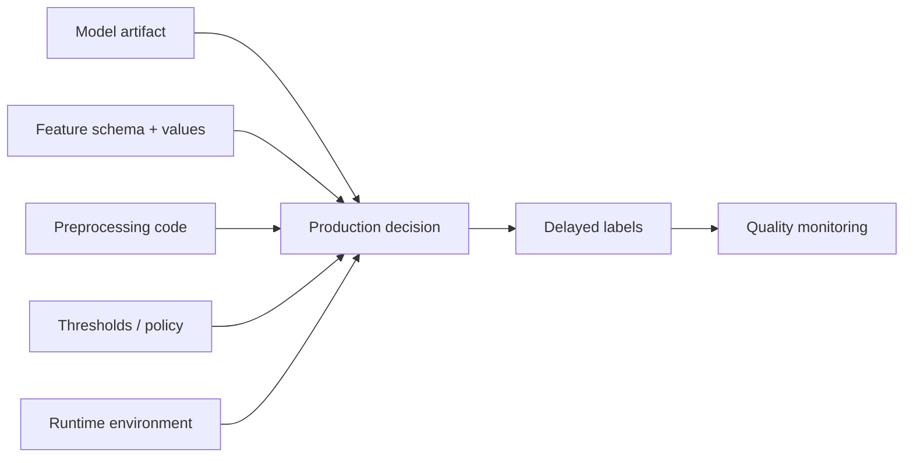
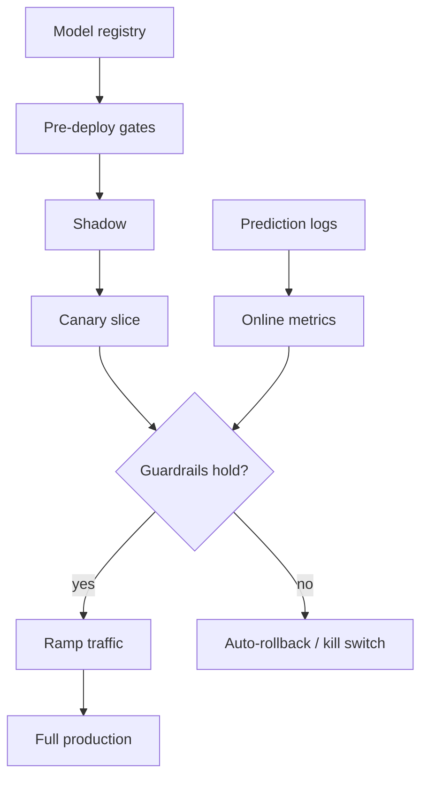

# Model Deployment and Rollouts

## TL;DR

An offline evaluation is evidence about a fixed dataset; a production rollout is evidence about the current decision system. Neither substitutes for the other. Safe model delivery therefore combines immutable release bundles, progressive exposure, explicit promotion evidence, and a tested route to a known-safe state. The release unit is not a model file: it is the model, feature and preprocessing contracts, policy thresholds, runtime, and fallback behavior that jointly produce an action. Rollout state belongs to a control plane; request serving belongs to a data plane that records exactly which release epoch made each decision.

---

## Offline Evidence Has a Boundary

Tests can establish deterministic properties of the serving code, schema compatibility, numerical tolerances, and behavior on curated examples. Offline evaluation can estimate predictive quality on a specified population. What neither establishes is performance after the production population, upstream data, resource contention, or surrounding policy changes. The limitation is statistical and causal, not a reason to weaken pre-production testing: a finite historical sample supports claims only under stated sampling and stationarity assumptions.

Deployment also changes what will be observed. A recommender creates exposure before it observes clicks; a fraud policy suppresses transactions whose counterfactual chargebacks will never be seen. The production policy therefore changes both future inputs and future labels. This feedback is why a shadow comparison can validate runtime behavior yet cannot estimate the outcome of actions the shadow never took, and why a short canary cannot establish quality when labels mature months later.

The engineering response is layered evidence. Unit and integration tests establish deterministic contracts. Replay and offline evaluation test the candidate against historical and adversarial cases. Shadowing tests the live read path without granting decision authority. Canarying bounds exposure while fast operational signals are observed. A controlled experiment estimates causal product impact when randomization is valid. The rollout should claim only what its current evidence can support.

---

## Deploying a Model Is Deploying a Decision System

The second reason model deployment is hard is that the model file is the smallest part of what you are shipping. A serving model is the end of a dependency chain: it runs inside a [model serving](./03-model-serving.md) layer, consumes features computed by a [feature store](./02-feature-stores.md), expects a specific input schema and preprocessing, emits a score, and that score is turned into an action by a threshold or policy layer.

The most dangerous form of this coupling is **train/serve skew at deploy time**. The model learned a feature's distribution during training; if the online serving path computes that feature even slightly differently (a different default for a missing value, a different time window, a unit mismatch), the model sees inputs it was never trained on and degrades silently. This is the same point-in-time-correctness discipline that governs [training pipelines](./05-training-pipelines.md), now enforced at the deployment boundary: the features must be computed the same way in production as they were in training, and the deploy must guarantee it.

Because the model and its dependencies are one system, they must deploy **atomically**. Shipping a new model that expects feature `device_velocity:v7` while the serving path still provides `v6` is not a degraded deploy: it is a broken one. The release unit is the tuple of model artifact, feature schema version, preprocessing code, threshold policy, and runtime environment. The flowchart below shows why: every one of these inputs feeds the production decision, and a mismatch anywhere corrupts the output.



A useful test mirrors the one for training pipelines: if you promote this artifact, can the platform *validate* (not assume) that the feature schema it requires is the schema being served, that the threshold policy matches its score distribution, and that the runtime image can load it? If any of these is a hope rather than a check, you are deploying a decision system you do not understand.

The pre-deploy compatibility matrix should be mechanical:

| Contract field | Example | Gate check | Failure action |
|---|---|---|---|
| Artifact hash | `sha256:9f86...` | artifact exists and hash matches registry | block promotion |
| Runtime image | `serving@sha256:44aa...` | model loads in declared image | block promotion |
| Feature schema | `device_velocity:v7` | online feature registry serves exact version | block promotion |
| Preprocessing | `fraud_preprocess:v5` | same transform available in training and serving | block promotion |
| Output semantics | calibrated probability `[0,1]` | score distribution and calibration report attached | block or require review |
| Threshold policy | `fraud_policy:v9` | decision-rate migration checked vs baseline | block if action rate violates bounds |
| Rollback target | `fraud_classifier:v41` | target artifact, image, features, policy load successfully | block promotion |

A deployment system that validates only "can the file load?" is validating the smallest and least interesting part of the release.

---

## Control Plane, Data Plane, and Release Epochs

The **control plane** owns desired state: immutable release descriptors, eligibility gates, traffic allocation, promotion state, approver identity, and rollback target. The **data plane** owns request execution: it resolves an already-approved release, fetches features, runs inference, applies policy, returns an action, and emits a prediction event. Keeping these responsibilities separate prevents a model process from promoting itself and keeps a control-plane outage from sitting on the synchronous inference path.

Rollout state should advance through compare-and-swap transitions rather than mutable scripts:

```text
qualified deployment binding (from registry eligibility)
        ↓
PLANNED → SHADOWING → CANARYING → RAMPING → ACTIVE → DRAINED
              ↘ ABORTED ←─────────────↙
```

Each transition records the source state, target state, deployment-binding digest, evidence policy/window, actor, and monotonic revision. A stale controller attempting `CANARYING@rev17 → RAMPING` must fail if another controller has already written `ABORTED@rev18`. This optimistic-concurrency invariant prevents an automatic ramp and a human rollback from racing each other.

Configuration dissemination is usually eventually consistent, so "10% canary" is not an instantaneous global fact. A router may briefly serve revision 17 while another serves revision 18. The data plane must therefore log a **release epoch** with every decision and reject unknown or unsigned descriptors. Promotion analysis groups by the epoch actually served, not merely by the control plane's intended state. For a safety rollback, propagation time is part of time-to-mitigate; critical systems use push invalidation or a short-lived local lease, plus a local fail-safe when the lease expires.

The failure behavior is domain-specific. A ranking service may fail open to a cached deterministic list. A credit or safety control may fail closed to manual review. This fallback policy is part of the release bundle because changing it changes decisions just as surely as changing model weights.

---

## The Rollout Ladder

Progressive delivery for models is a ladder of rungs, each trading a different amount of risk for a different quality of feedback. The skill is knowing which rung answers which question, and never confusing them.

**Shadow (dark launch)** runs the new model on production requests but withholds its outputs from the decision path. It removes direct decision risk, not all risk: feature reads, inference load, sensitive-data access, and accidental side effects remain. It catches runtime incompatibility, missing online features, latency regressions, and gross score divergence. Its blind spot is fundamental: because the candidate's actions do not occur, shadow cannot observe their outcomes. Shadow traffic must be sampled, authorized for the same data purpose, and isolated from champion resource pools.

Shadow produces paired observations under one logical request and release epoch. The comparison pipeline performs a one-to-one join in the distributed store, reports unmatched champion and candidate rows separately, and never collects an unbounded traffic window into one process. It computes score and decision deltas, latency/error distributions, feature/fallback divergence, and coverage by workload slice. A deterministic, access-controlled sample of material decision flips retains both release manifests and input-feature references for review.

Paired deltas are often more sensitive than unrelated aggregate distributions, but shadow disagreement is not outcome quality. A large flip rate may indicate threshold, calibration, preprocessing, or model change; a small rate may still concentrate on a high-loss slice. Human review can characterize decisions under available evidence, while causal product impact still requires candidate exposure or another identified design.

**Canary** grants the candidate decision authority over a bounded slice and advances only on declared evidence. The initial allocation comes from blast-radius and measurement constraints, not a universal percentage. Canary is the first rung that exercises candidate actions end to end. With delayed labels, a short canary may support claims about latency, errors, score shape, and fallback rate while providing little evidence about outcome quality. Its promotion record should state that narrower claim.

**A/B / online experiment** estimates causal product impact by retaining a concurrent randomized control under the assumptions described in [online experiments](./08-online-experiments.md). Unlike a canary health check, it is designed to answer whether assigning the candidate changed outcomes. The deployment system preserves stable assignment, release epochs, and exposure evidence; the experiment system owns the estimand and inference.

**Blue-green** is an orthogonal provisioning topology, not an evidence rung. It keeps the prior release warm while another release receives whatever shadow, canary, or experiment allocation the evidence plan permits. It reduces artifact-load time on the recovery path but does not reduce candidate decision risk; recovery remains bounded by router propagation, draining, and in-flight effects.

| Rung | Question it answers | User risk | Blind spot |
|---|---|---|---|
| Offline eval | Was it good on past data? | None | Cannot see live distribution or feedback loops |
| Shadow | Does it run correctly on live traffic? | No direct decision exposure; operational and privacy risk remain | Cannot measure business impact |
| Canary | Is the live decision path safe? | Bounded live decision exposure | Delayed labels hide quality regressions |
| A/B experiment | Is it actually better? | Controlled | Slow; statistically heavy |

The progression is deliberately ordered by risk: each rung admits a little more reality and a little more user exposure, in exchange for feedback the previous rung could not give. Skipping rungs (going straight to a full deploy because offline metrics looked good) is the big-bang anti-pattern, and it discards exactly the live signal that offline testing structurally cannot provide.

Provisioning choices such as blue-green, warm standby, or cold standby sit underneath this ladder. They determine rollback latency, standing cost, and failure-domain exposure, not whether the candidate has earned more authority.

---

## Rollback Is the Foundational Capability, and It Is Harder for Models

Every progressive rollout needs a bounded containment path. For reversible serving changes this is usually traffic return to a known-safe release; for unsafe actions it may be a fail-safe policy or suspension. Without one, increasing candidate authority increases exposure without a tested recovery mechanism.

Rollback requires the previously qualified bundle to remain immutable, compatible, load-tested, and loadable; it does **not** require recreating weights from training inputs during an incident. Rebuildability is a separate audit, investigation, and future-retraining property. The rollback lease covers the exact artifact, feature/preprocessing contract, runtime image, threshold and fallback policy, and any schema reader needed to serve it.

The characteristic failure is *rollback amnesia*. During development of `v42`, the team deprecates a feature required by `v41`, garbage-collects its runtime image, or makes a forward-only policy migration. When `v42` fails, the named target no longer forms a loadable bundle. The rollback horizon must therefore be explicit: retain the artifact, runtime, compatible feature definitions, and policy for at least that horizon; keep a target warm when the recovery-time objective requires it; and load-test the target before exposing the candidate. Indefinite retention is neither necessary nor always lawful, but deleting a declared target before its rollback lease expires is a control-plane error.

For high-risk systems, prefer "disable the candidate" over "redeploy the old service." A traffic router that can shift intended allocation back to the incumbent, or a kill switch that selects a known-safe fallback, removes build and artifact-load work from the containment path. It meets a short recovery objective only when configuration publication, lease expiry, proxy reconciliation, connection draining, and in-flight effects have been measured under failure. The fastest rollback path is usually the one that touches no code, but its bound is still an end-to-end propagation bound:

```text
Rollback by registry (preferred):  registry.set_active("fraud_model", "v41")   # no deploy
Rollback by kill switch:            config.set("kill_switch.fraud_model", true)  # bounded by propagation lease
```

Some decisions, though, cannot be rolled back at all. A model that blocked a legitimate payment, banned a user, deleted content, or repriced inventory has produced an *irreversible action*, and reverting the model does not revert the harm. The architectural answer is to keep irreversible actions behind reversible first steps: let a new model *recommend* before it is allowed to *decide*, route its most consequential outputs through a human review queue, and design compensating actions (the same [idempotency and compensation](../01-foundations/08-idempotency.md) discipline that protects any system from un-undoable side effects) for the cases where review is impractical. This is the staged-authority principle: earn the right to act irreversibly by first proving safe on reversible actions.

---

## Binding the Registry Artifact to Decision Policy

The registry owns artifact identity, lineage, compatibility, lifecycle eligibility, and the full release manifest ([Model Registry and ML Metadata](./13-model-registry-metadata.md)). Rollout owns an immutable **deployment binding** from that manifest digest to the threshold/decision policy, fallback, traffic eligibility, experiment allocation, rollback target and lease, and control-plane revision. Changing any member creates a new binding even if weights are unchanged.

This distinction matters because many models emit a score while a policy maps that score to action. Reusing a numeric threshold after calibration or score-distribution change can alter both action volume and affected population. A paired shadow sample can define a rate-preserving migration baseline. If champion score CDF is $F_b$, candidate CDF is $F_c$, and incumbent threshold $t_b$ yields action rate $a_b=1-F_b(t_b)$, choose

$$
t_c = F_c^{-1}(1-a_b)
$$

as one candidate threshold. This preserves aggregate action rate on the paired sample, not entity-level decisions, calibration, expected loss, capacity, or slice rates. Promotion therefore evaluates the complete model-policy binding: paired flips, consequence-weighted outcomes, calibration, review/queue capacity, and critical slices. The baseline is useful precisely because it isolates population replacement that an unchanged overall rate would hide.

---

## Automated Rollback Triggers Wired to Monitoring

Manual containment authority remains necessary, but the harm-velocity budget may be shorter than human response time. In those classes, a pre-authorized controller consumes qualified signals from [model monitoring](./04-model-monitoring.md) and freezes or reverts allocation according to an explicit policy.

The auto-action decision depends on signal delay, uncertainty, and the safety of the fallback. **Operational guardrails** (model-load failures, elevated timeouts, feature-contract violations, or a collapsed score stream) arrive quickly and often have an unambiguous safe response. **Outcome guardrails** (loss, false-positive rate, or retention) may be delayed, correlated, and repeatedly inspected. They need a declared estimator and evidence window before they can drive automation. A high-confidence harm signal may still justify an automatic stop; a noisy proxy may only freeze the ramp and page an owner.

The controller needs hysteresis. A practical rule requires both a minimum event count and a sustained breach, evaluates the candidate relative to the concurrent champion, and enters a latched `ABORTED` state that cannot automatically ramp again. Multi-window burn-rate alerts work well for service SLOs: a severe short-window breach stops immediately, while a smaller regression must persist across a longer window. This avoids both one-sample rollback flapping and slow accumulation of harm. The control plane below owns traffic, evidence, and transition state so model teams do not reimplement rollout mechanics in request code:



Sizing the canary is where delayed labels bite hardest. For an independent binary outcome with baseline rate `p`, two equal arms, absolute effect `δ`, significance `α`, and power `1−β`, a rough planning relationship is

```text
n_per_arm ≈ 2 × (z_(1−α/2) + z_(1−β))² × p(1−p) / δ²
```

This is a planning approximation, not a gate implementation: unequal allocation, repeated looks, clustering by user, over-dispersion, and multiple guardrails all increase the required evidence. Label delay then adds calendar time independently of event volume. The conclusion is not that canaries never measure quality; it is that a rollout must compute whether its canary can measure the declared regression before claiming that it did. When it cannot, the canary gates fast operational safety while a stable holdout or experiment remains open through label maturation.

---

## Champion-Challenger and Traffic-Splitting Mechanics

Serving more than one qualified release at once is the substrate for shadow, canary, and experiments. The **champion** is the incumbent decision binding; challengers have bounded evidence authority. A router resolves each request against an immutable allocation epoch rather than reading mutable percentages independently.

An allocation record pins incumbent and candidate binding digests, eligibility predicate, randomization unit and hash revision, weights, start/end or evidence boundary, capacity reservation, fallback, and expected prior control-plane revision. Publication uses compare-and-swap, and every prediction records the epoch actually served. Rollback publishes a new epoch assigning eligible traffic to the retained incumbent or fail-safe; it does not mutate historical allocation. Recovery time includes configuration reconciliation, proxy propagation, connection draining, and in-flight effects.

The mechanics that matter are assignment consistency and resource isolation. The experiment design chooses a randomization unit that contains carryover and plausible interference; assignment is deterministic for that unit within an allocation epoch. User-level assignment is appropriate for persistent personalized effects, while request-level assignment may be valid when carryover and cross-request interference are negligible. Shadow traffic reserves its own accelerator, feature-store, and queue capacity so candidate work cannot degrade the champion. The router (not model code) owns allocation, eligibility, release pinning, and the revert switch.

Multi-model serving also forces a capacity decision that single-model deploys avoid: minimizing artifact-load time may require both versions to remain loaded and warm. That can approximately double resident model memory before workload state and may require overlap capacity for champion, candidate, and failure headroom; the actual accelerator increment depends on co-residency, traffic allocation, and isolation. Large models make this expensive enough that teams sometimes accept a longer recovery bound, keeping the previous version on cold standby and measuring its reload plus propagation time. That trade is legitimate, but it must be written into the rollback contract rather than discovered during an incident.

---

## The Promotion Gate

Between each rung of the ladder sits a promotion gate: the explicit decision, by a person or an automated policy, that a candidate has earned the right to the next level of exposure. The gate is where deployment meets [risk governance](./09-ml-risk-governance.md). A low-stakes ranking model might promote automatically when offline metrics and shadow divergence clear thresholds. A high-stakes model (credit decisions, content moderation, anything touching safety or regulation) should require a named human approver, a recorded justification, and a reviewed evaluation report before it advances, mirroring the staged authority used for [deployment strategies](../15-deployment/01-deployment-strategies.md) in ordinary software, with [feature flags](../15-deployment/02-feature-flags.md) as the runtime kill switch.

The pre-deploy gate is the cheapest place to catch the most expensive mistakes, so it should mechanically verify the contract before a single user is exposed: the artifact loads under its declared runtime, every required feature exists online with the right type, the score distribution is not collapsed to a near-constant, critical slices have not regressed below threshold, the fleet has capacity for the serving limits, and, critically, the rollback target actually exists and loads. A model that fails any of these is not a release candidate; it is a liability that has not yet detonated.

A distinguished-engineer version of the gate is policy-as-code over registry metadata:

```yaml
promote_to_canary:
  require:
    lineage: complete
    artifact_load_test: pass
    serving_contract: compatible
    offline_primary_metric: non_regressing
    guardrail_slices: pass
    score_distribution: not_collapsed
    capacity_plan: approved
    rollback_target: load_tested
  risk_overrides:
    high:
      require_human_approval_from: risk-review
      initial_allocation_policy: derived_from_harm_budget_detection_and_capacity
      require_blast_radius_bound: true
      require_kill_switch: true
    critical:
      require_human_review_mode_first: true
      prohibit_auto_full_ramp: true
```

The point is not the YAML; it is that the deploy path reads enforceable state. If a reviewer can bypass the gate by running a one-off script, the gate is advisory, not architectural.

---

## Failure Modes

The recurring failures of model deployment are specific enough to name, and naming them is most of preventing them.

**Schema-compatible but semantically wrong.** A feature exists online with the right type, so every compatibility check passes, but its *meaning* changed: `total_spend_30d` switched from gross to net revenue. The model now scores on inputs that silently mismatch its training, and nothing fails loudly. The defense is semantic feature contracts with owners, validation against baseline distributions, and treating any meaning change as a new feature version, not an in-place edit.

**Silent canary.** The canary's short-term proxy metrics look fine, traffic ramps to 100 percent, and weeks later the mature labels reveal a regression that was present the whole time. The canary was measuring operational health and being read as if it measured quality. The defense is conservative ramps in delayed-label domains, separate tracking of proxy versus delayed metrics, and a champion/challenger window that outlives label maturation.

**Shadow overloads dependencies.** Shadow traffic does not reach users but still fetches features and runs inference; an unbounded, un-isolated shadow can exhaust feature-store, queue, or accelerator headroom and degrade the champion. Reserve capacity and derive the sample rate from measured candidate cost, dependency limits, and the detection target.

**Unbounded first exposure.** Pushing a candidate directly to all eligible traffic couples first live evidence to maximum blast radius. The causal chain is missing live-path evidence → immediate full authority → harm accumulates faster than detection and containment. The required exposure bound follows action severity and recovery time; emergency or indivisible changes need an explicit alternative containment design rather than a ceremonial 1% step.

**Irreproducible rollback target.** The team selects `v41`, but its feature definition or runtime has expired. Retain the complete bundle through its declared rollback lease, keep it warm when the recovery objective requires that capacity, and validate loading plus representative inference before candidate exposure.

**Feature/version mismatch at the boundary.** The model expects feature schema `v7`; the serving path provides `v6`. Because the model and its contract were not versioned and deployed atomically, the system is broken in production while every individual component reports healthy. The defense is atomic deployment of the model-plus-contract tuple and programmatic schema validation at the gate.

**Split-brain rollout state.** One region ramps revision 18 while another has already aborted it, so global dashboards mix incomparable release epochs and rollback is only partial. The causal chain is stale desired state → inconsistent routing → mixed decisions → misleading aggregate metrics. Monotonic revisions, compare-and-swap transitions, bounded configuration leases, and per-decision epoch logging make the inconsistency visible and contain it.

**A safe model with an unsafe fallback.** The candidate times out and request code silently converts “no score” into “allow,” bypassing the policy the rollout was designed to protect. Fallback behavior must be versioned, load-tested, and included in failure-injection tests; it is part of the decision system, not an exception path.

---

## Decision Framework

Choose a rollout from four properties of the decision, not from a standard sequence copied across models.

| Property | Design consequence |
|---|---|
| Action reversibility | Irreversible actions require recommend-only or review stages; model rollback cannot undo them |
| Label maturation | Determines whether a canary can gate quality or only fast operational signals |
| Detectable harm rate | Determines minimum traffic, observation time, and whether small slices are measurable |
| Recovery objective | Determines warm versus cold rollback capacity, configuration propagation, and fallback design |

A reversible ranking change with immediate engagement feedback may move from sampled shadow to a measured canary and experiment quickly. A fraud policy with 90-day labels may use the same traffic mechanics but must retain a concurrent holdout until outcomes mature. A consequential, irreversible decision should first change only a recommendation or review priority; authority to execute the action is a separate promotion dimension.

Promotion is justified only when the evidence names its claim. “Artifact loads under production runtime,” “candidate p99 stays within budget for 30 minutes,” and “14-day outcome interval excludes the harm boundary” are distinct claims with distinct windows. The control plane stores the evidence window and release epoch with the transition. If the evidence expires, a material dependency changes, or rollback validation becomes stale, the candidate is no longer eligible even though its artifact digest has not changed.

Rollback is a state transition plus an impact workflow. The controller latches the candidate at zero traffic and activates a known-safe release; the decision ledger defines the affected epoch and time window; owners compensate reversible downstream actions and escalate irreversible harm; re-promotion requires new evidence. This separation keeps containment fast while preserving the slower work of diagnosis and remediation.

---

## Key Takeaways

1. Offline evaluation and production rollout answer different questions; neither replaces deterministic tests, historical evaluation, or causal measurement.
2. Shadow validates the live read path, canary bounds decision exposure, an experiment estimates causal impact, and warm dual versions reduce recovery time. Each supports a narrower claim than “the model is good.”
3. The release unit is the decision system (model, feature schema, preprocessing, thresholds, runtime) and it must deploy atomically; a mismatch anywhere corrupts the output.
4. Rollback requires a compatible release bundle, not just old weights; retain and test that bundle for the declared rollback horizon.
5. Control-plane transitions need monotonic revisions, concurrency control, bounded propagation, and a per-decision release epoch so abort cannot race with ramp.
6. Automatic action should reflect signal confidence, delay, and fallback safety; use minimum evidence, sustained breaches, and a latched abort to prevent flapping.
7. Version the model with its contract and threshold policy; paired decision-rate matching can propose a migration baseline, but promotion must also evaluate calibration, expected loss, decision flips, capacity, and critical slices.
8. Shadow and challenger traffic still consume features and compute: sample it and isolate its resources, or it becomes its own incident.
9. The promotion gate is where deployment meets governance: match the required approval to the risk and reversibility of the model's actions.
10. Irreversible actions cannot be rolled back by reverting the model; keep them behind reversible first steps, review queues, compensation, and staged authority.

---

## References

1. [Hidden Technical Debt in Machine Learning Systems](https://proceedings.neurips.cc/paper_files/paper/2015/file/86df7dcfd896fcaf2674f757a2463eba-Paper.pdf): Sculley et al., 2015
2. [Meet Michelangelo: Uber's Machine Learning Platform](https://www.uber.com/blog/michelangelo-machine-learning-platform/): Uber Engineering, 2017
3. [TensorFlow Serving: Flexible, High-Performance ML Serving](https://arxiv.org/abs/1712.06139): Olston et al., 2017
4. [MLflow Model Registry](https://mlflow.org/docs/latest/ml/model-registry/)
5. [KServe Documentation](https://kserve.github.io/website/): canary, traffic splitting, and rollout for model serving
6. [SEC Order: Knight Capital Americas LLC (Aug 1, 2012 deployment incident)](https://www.sec.gov/litigation/admin/2013/34-70694.pdf)
7. [Site Reliability Engineering: Canarying Releases](https://sre.google/workbook/canarying-releases/): Google SRE Workbook
8. [Argo Rollouts Concepts](https://argo-rollouts.readthedocs.io/en/stable/concepts/): analysis runs, pauses, promotion, and abort semantics
