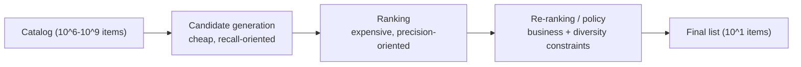

# Recommendation Systems

## TL;DR

A recommendation system selects a bounded list from a much larger eligible inventory under a latency budget, then learns from outcomes produced by its own policy. Model quality matters, but it is inseparable from the funnel, coherent artifact releases, feature hydration, hard eligibility rules, exposure propensities, and controlled exploration. Because the system trains on data it helped create, measurement and feedback-loop design determine whether apparent improvement is real or self-reinforcing bias.

---

## The Funnel Is the Architecture

The single defining constraint of a recommender is the gap between catalog size and latency budget. A catalog has millions of items. The response must arrive in tens of milliseconds. No model that scores a million items one-by-one can meet that budget, so the entire architecture is organized around *progressive narrowing*: cheap operations reduce millions to thousands, more expensive operations reduce thousands to hundreds, and the most expensive operations touch only the few hundred items that survive.



The funnel exploits cost asymmetry. Retrieval uses indexes and restricted representations to avoid evaluating the expensive ranker over the full catalog. Ranking then spends richer computation on a bounded set. The exact asymmetry depends on hardware, batch shape, candidate count, and feature access, but the invariant remains: later-stage precision is affordable only after earlier stages reduce work.

The canonical published example is YouTube's 2016 architecture (Covington et al.): a candidate-generation network narrows a large catalog to a bounded candidate set, and a separate ranking network scores that set with richer features. Capacity uses the work each stage actually performs rather than dividing latency by total catalog size:

| Stage | Cardinality change | Work unit to measure | Quality boundary |
|---|---|---|---|
| Retrieval | eligible catalog → candidates | probes, visited nodes/cells, distance operations, filter work | candidate recall and coverage |
| Ranking | candidates → scored shortlist | feature bytes/reads and batched model examples | conditional utility/calibration |
| Re-ranking/policy | shortlist → slate | constraint/solver work over the set | slate feasibility and list utility |

For each workload slice, benchmark the joint curve of cardinality, work unit, recall/utility, and latency under target concurrency. An ANN index does not evaluate every catalog item, so “time per catalog item” is not a meaningful retrieval capacity metric.

The consequence that teams underappreciate is that **each stage has a different objective, and conflating them is a design error.** Retrieval optimizes coverage of useful items under a resource budget. Ranking estimates utility within the retrieved support. Re-ranking solves list-level objectives and hard eligibility constraints. Ranking cannot recover an item that retrieval omitted, while retrieval quality alone says nothing about final-list utility.

---

## Request Plane and Control Plane

The synchronous **request plane** computes a response from locally available, already-approved artifacts. The asynchronous **control plane** builds and validates those artifacts: embedding snapshots, ANN indexes, ranker releases, feature schemas, policy rules, experiment allocations, and fallback configurations. A request must resolve a coherent release manifest rather than independently asking for “latest” at each stage:

```yaml
surface_release: "home_feed:2026-06-24.7"
user_tower: "user_tower:v31"
item_embedding_snapshot: "item_vectors:2026-06-24T10:00Z"
ann_indexes: { personalized: "ann:v88", fresh: "fresh_index:v17" }
ranker: "feed_ranker:v42"
feature_view: "feed_features:v19"
rerank_policy: "feed_policy:v9"
experiment_config_revision: 1732
fallback_policy: "home_feed_fallback:v6"
```

The manifest is activated atomically by pointer or epoch. Otherwise an index built with item tower `v31` can be queried with user tower `v32`, or a ranker can receive a feature schema it never saw in training. Every response logs the manifest digest and stage-level provenance. That turns “recommendations got worse” into a query over exact artifacts rather than a reconstruction from deployment timestamps.

Control-plane freshness is explicit state. An index can be `BUILDING`, `VALIDATED`, `ACTIVE`, `DRAINING`, or `RETIRED`; only a validated snapshot can become active, and activation retains a loadable predecessor. Deletes and policy blocks travel on a faster invalidation path than ordinary embedding refresh because safety and legal eligibility cannot wait for the next batch build.

---

## Candidate Generation: Recall Under a Bounded Budget

Candidate generation answers one question: *which bounded set is worth expensive scoring?* Its service-level objective is derived from the end-to-end latency budget, not fixed at one millisecond. The dominant pattern is *embedding retrieval*: represent the query context and items as vectors in a shared space, then search for nearby item vectors. The modeling technique is interchangeable; the systems property is asymmetric computation—item representations are precomputed while the query representation is computed online.

Precomputation makes retrieval affordable, but “approximate” is not one scalar trade. HNSW and IVF-PQ exchange memory, build time, update semantics, and query latency for recall relative to a chosen exact-search sample. The target is not the highest ANN recall in isolation; it is final-list quality subject to latency and cost. A lower-recall index can be the better system if other sources recover missed inventory and the saved budget improves ranking. That claim must be demonstrated end to end rather than assumed from an index benchmark.

Mature systems retrieve from several sources: personalized embeddings, popularity, freshness, graph neighborhoods, editorial inventory, or sponsored supply. Their raw scores are not comparable. The blender must deduplicate by canonical item ID, preserve source provenance, and combine candidates through quotas, learned source priors, calibrated scores, or reciprocal-rank fusion. Per-source deadlines and minimum quotas keep a slow or dominant source from consuming the entire budget. Redundancy then becomes a resilience property: if personalized retrieval times out, the surface can still serve fresh and popular candidates under a known degraded mode.

The ANN index has its own lifecycle and SLOs; it is not a static file:

```text
item catalog changes → embedding job → index build → validation → staged load → active pointer flip
                                      ↘ incremental updates ↗
```

| Stage | Gate | Failure it prevents |
|---|---|---|
| Embedding generation | coverage, NaN rate, vector norm distribution | missing or corrupt item vectors |
| Index build | recall@K against exact search sample | fast but wrong retrieval |
| Staged load | memory footprint and warmup time | serving cold-start or OOM |
| Pointer flip | old index retained and warm | rollback amnesia |
| Incremental update | freshness lag and delete handling | stale or ghost items |

A recommender with no index rollback is a deployment system without rollback: one bad embedding job can make the catalog disappear from retrieval while every application endpoint stays healthy.

### The Two-Tower Model as a Systems Contract

Two-tower architectures are common because the model factorization is also a serving plan. The item tower runs asynchronously over the catalog, the query tower runs online, and interaction is restricted to an ANN-compatible similarity such as a dot product:

```python
# Two-tower retrieval model (PyTorch), trained with in-batch negatives.
class TwoTower(nn.Module):
    def __init__(self, user_features, item_features, dim=128):
        super().__init__()
        self.user_tower = MLP(user_features, out=dim)   # runs per request
        self.item_tower = MLP(item_features, out=dim)   # runs in the nightly batch job

    def forward(self, user_x, item_x):
        u = F.normalize(self.user_tower(user_x), dim=-1)
        v = F.normalize(self.item_tower(item_x), dim=-1)
        return u @ v.T          # [batch, batch] similarity matrix

# In-batch negatives: each user's positive item serves as every other user's negative.
logits = model(user_x, item_x) / temperature
targets = torch.arange(len(logits), device=logits.device)
loss = F.cross_entropy(logits, targets)   # diagonal = positives
```

Two production notes hide in those few lines. First, in-batch negatives are cheap but *popularity-biased* — popular items appear in batches more often, so they are over-penalized as negatives; Google's correction (Yi et al., 2019, the "sampling-bias-corrected" paper in the references) subtracts `log(p(item))` from the logit. Second, the architecture forbids user-item cross features by construction — the towers cannot see each other until the dot product — which is precisely why retrieval needs a ranking stage after it: the cross features that carry the most precision are architecturally impossible here and affordable there.

### Inside the ANN Index

"Approximate nearest neighbor" hides two very different engineering designs, and choosing between them is a memory-versus-recall-versus-build-time decision.

**HNSW (Hierarchical Navigable Small World)** is a multi-layer navigable graph. `M` is a construction parameter, not necessarily the stored degree at every layer; implementations commonly allow a larger degree at level 0 (often up to about `2M`). Upper layers are sparse express lanes, while the bottom layer contains every item. A query greedily descends and then explores a beam of `efSearch` candidates at level 0:

```text
Layer 2:   o ─────────── o                (few nodes, long hops)
Layer 1:   o ──── o ──── o ──── o         (more nodes)
Layer 0:   o─o─o─o─o─o─o─o─o─o─o─o        (all items, short links)
             greedy descent, then beam search at layer 0
```

The knobs map directly to SLOs: `M` (links per node) trades memory and construction work for graph connectivity; `efSearch` (search breadth) trades query work for recall at request time. Measurements must use the production dimension, metric, hardware, filters, and concurrency because isolated single-query benchmarks do not predict tail latency under load. A first-order memory estimate still reveals whether an uncompressed graph is plausible:

```text
vector bytes       = N × dimensions × bytes_per_component
level-0 link bytes ≈ N × stored_level0_degree × bytes_per_neighbor_id
total              = vectors + all graph levels + IDs + metadata + allocator overhead
```

Use the built index's measured resident size because neighbor encoding, level distribution, deletion state, alignment, and allocator overhead are implementation inputs.

**IVF-PQ (inverted file with product quantization)** is the answer when vectors stop fitting. IVF clusters the space into `nlist` cells (k-means centroids) and searches only the `nprobe` closest cells — an index in the database sense, pruning the scan. PQ then compresses each vector by splitting it into `m` sub-vectors and replacing each with a 1-byte codebook index:

```text
768-dim fp32 vector:                     3,072 bytes
PQ with m=96 subquantizers (8 bits each):   96 bytes   → 32× compression
500M items × 96 B ≈ 48 GB for codes alone; centroids, IDs, lists, and rerank vectors are additional
```

One coarse-to-fine pattern uses IVF-PQ to retrieve a candidate set and a separate immutable full-precision vector store to rescore those IDs. The compressed index alone does not perform exact reranking:

```python
pq_index = load_index(index_snapshot)
approx_scores, candidate_ids = pq_index.search(query_vectors, k=candidate_budget)

# A separate store is pinned to the same item-vector snapshot.
full_vectors = vector_store.batch_get(vector_snapshot, candidate_ids)
exact_scores = batched_dot(query_vectors, full_vectors)
top_ids = select_top_k(candidate_ids, exact_scores, final_retrieval_budget)
```

The release manifest binds the compressed index and full-vector snapshot. Candidate budget, `nprobe`, fetch bandwidth, and exact-rescore batch shape are independent capacity knobs; evaluate candidate recall before and after exact rescoring.

| | HNSW | IVF-PQ (+ rerank) |
|---|---|---|
| Memory | Full vectors + graph in serving memory | PQ codes are ~32× smaller than fp32 in this example; exact reranking additionally needs pinned full vectors in a declared memory/storage tier, so report total resident footprint and fetch bandwidth |
| Recall | Often high at sufficient search breadth; measure | Compression and probed cells trade recall for cost; measure |
| Query knob | `efSearch` | `nprobe` |
| Incremental adds | Good | Good (but centroids drift; retrain periodically) |
| Deletes | Tombstones, needs rebuild | Tombstones, needs rebuild |
| Often favored when | Memory permits graph plus vectors and low latency matters | Compression is necessary or a coarse-to-fine scan fits the workload |

Delete semantics are implementation-specific: some indexes use tombstones, some support logical deletion or slot reuse, and many recover space or graph quality only on rebuild. In every case, an urgent catalog removal needs a synchronous eligibility filter or invalidation path because physical index maintenance may lag.

---

## Ranking: Precision on a Short List

Once retrieval has narrowed the catalog to a few hundred or few thousand candidates, ranking can afford to be expensive, because it runs on a short list. This inversion is the whole point of the funnel: the per-item budget grew by orders of magnitude precisely because the item count shrank by orders of magnitude. Ranking can now use rich cross-features between the user and each candidate — features that would have been impossibly expensive to compute across the full catalog.

The system-design substance of ranking is not the model architecture; it is *feature hydration*. To score a candidate, the ranker needs features about the user, the item, and their interaction, and those features live in different stores with different latencies. Fetching them naively — one round trip per candidate per feature — turns a few hundred candidates into thousands of sequential lookups and destroys the latency budget. The fix is the same batching-and-caching discipline that governs any latency-bounded service: fetch user features once per request (not once per candidate), batch all item-feature lookups into a single multi-get, cache hot item features in memory, and compute the model forward pass over the whole batch at once. The ranker's quality is bounded by the model, but its *latency* is bounded by how disciplined the feature hydration is, and hydration is where ranking systems most often miss their budget.

A ranker often predicts several outcomes with different label delays: click, long dwell, purchase, hide, or later retention. Some systems learn a joint utility; others combine calibrated predictions with explicit policy weights. In either design, the deployed objective must be versioned and inspectable. A hidden change from `P(purchase)` to a weighted click proxy is a semantic API change even if the ranker's tensor shape is unchanged. Learned objectives do not remove product policy; they move part of that policy into the training artifact and make its lineage more important.

---

## Re-Ranking: Where Policy Becomes Explicit

The ranker produces a utility-ordered list, while many objectives are properties of the list or eligibility set: diversity, freshness, de-duplication, inventory, and policy. Re-ranking makes those constraints explicit on the short list where set-level optimization is affordable.

Diversity is the canonical example and reveals why re-ranking is its own stage. A purely relevance-ordered list tends to be monotonous — ten variations of the same item the user clicked once — because each individually scores well. But a list of ten near-identical items is worse for the user than a varied list of slightly-lower-scoring items, and no per-item relevance score captures that, because the badness is a property of the *set*, not of any item. Re-ranking optimizes the set: it balances relevance against the marginal diversity each item adds, whether through a determinantal point process, a greedy diversity penalty, or explicit category quotas. The mechanism matters less than the architectural point — *set-level objectives require a set-level stage*, and that stage must come after per-item ranking because it operates on the chosen few.

Re-ranking is also where hard eligibility rules live. Inventory status, territorial restrictions, a user's blocklist, and safety policy are not preferences to approximate in a loss. Their sources need freshness and failure semantics: a stale diversity feature may degrade softly, while an unavailable legal-eligibility feed may require fail-closed filtering or a deterministic allowlist. The policy layer emits reason codes for removals and reports when constraints leave too few eligible items; silently backfilling with unfiltered results converts a dependency outage into a policy breach.

---

## Overload, Isolation, and Trust Boundaries

Each request fans out to retrieval sources and feature stores. With request rate `Q`, `S` sources, and average retry factor `r`, downstream call rate is approximately `Q × S × r`; hedged requests and retries can therefore amplify an overload. Stage deadlines, bounded concurrency, retry budgets, and admission control are part of recommendation quality because an overloaded source returns a systematically different candidate population, not merely a slower one.

Degradation should be an ordered policy rather than emergent timeout behavior. A common sequence is: drop an optional retrieval source, reduce candidates before ranking, use cached item features, switch to a smaller ranker, then serve a deterministic eligible list. Each step logs a degradation code so online metrics can distinguish model quality from reduced execution. Hard policy filters remain in every mode.

Behavioral histories and embeddings can expose sensitive interests even when direct identifiers are removed. The request plane should use purpose-scoped identifiers, minimize features in stage logs, encrypt and access-control behavioral data, and carry deletion/tombstone events through caches and indexes. Adversaries also attack the feedback loop through shilling, fake engagement, and item-embedding manipulation; provenance-aware event ingestion and abuse-weighted training protect the learning plane from treating every click as an equally trusted vote.

---

## The Feedback Loop Is the Real System

Everything above describes serving a single request. The property that makes a recommender a *system* — and the source of its deepest failure modes — is that it trains on data it produced. The model decides what to show; the user reacts only to what was shown; that reaction becomes training data for the next model. This closed loop is what lets a recommender improve continuously, and it is also what lets a recommender quietly destroy itself.

The foundational requirement of the loop is *honest logging of what the user was actually shown*. Most engagement data answers "what did the user click," but the question the model needs is "what did the user click *given the specific set of options presented, in the specific order, by the specific model version*." A click on the top item means something very different from a click on the tenth, and a non-click on an item the user never scrolled to is not a signal of dislike — it is no signal at all. The *exposure log* is therefore the most important data artifact in the entire system: for every request it records what was shown, in what positions, by which model and policy version, under which experiment, and what the user did with each. Without this, the system cannot compute unbiased metrics, cannot train a calibrated model, and cannot attribute a behavior change to a model change.

This logging carries the same lineage burden as any auditable system. The exposure record must pin the model version and policy version that produced it, because months later, debugging a regression requires knowing exactly which model showed what. A recommender without disciplined exposure logging is in the same position as a training pipeline without lineage: it works until something breaks, at which point no one can explain what happened or roll it back.

A counterfactual-capable exposure record makes the logging policy explicit:

```yaml
request_id: req_01J...
user_id: user_42
surface: home_feed
timestamp: "2026-06-24T12:01:08Z"
release_manifest_digest: "sha256:..."
allocation: { experiment: feed_ranker_2026q2, epoch: 17, arm: treatment, unit: user_42 }
selection:
  logging_policy: "epsilon_slate:v4"
  action_id: slate_01J...
  action_propensity: 0.014
  propensity_semantics: exact_slate_probability
  eligible_support_ref: support_01J...
degradation_code: none
retrieval_sources:
  embedding: { index: "item_ann:v88", candidates: 1200 }
  popularity: { version: "pop_24h:v12", candidates: 300 }
ranker: "feed_ranker:v42"
rerank_policy: "diversity_policy:v9"
shown:
  - { item_id: item_7, position: 1, score: 0.91, source: embedding }
  - { item_id: item_9, position: 2, score: 0.83, source: freshness }
not_shown_sample:
  - { item_id: item_13, rank_before_policy: 11, reason: diversity_filter,
      inclusion_probability: 0.10 }
```

Propensity semantics must match the estimator: exact-slate probability, item-at-position marginal probability, or another declared action unit are not interchangeable. The support reference identifies the eligible action space before randomization. A sampled record of candidates that lost is valuable for stage attribution, but requires its own inclusion probability and still cannot create outcomes for actions never taken. Release and degradation fields keep policy changes and fallback traffic from being mislabeled as model behavior.

---

## Why the Loop Poisons Itself, and How to Stop It

A recommender trained naively on its own logs degrades in characteristic, well-documented ways. Understanding these failure trajectories matters more than any single countermeasure, because they all stem from the same root: *the model only sees feedback on items it chose to show, so it cannot learn about the items it didn't.*

**Popularity bias** is the gravitational pull of the loop. Popular items receive more exposure and therefore more feedback, which may earn still more exposure. Exposure correction can help only when propensities are estimable and nonzero; it cannot recover preferences for items the policy never exposed. Diversity constraints, source quotas, and randomized exploration address different parts of the causal chain.

**The filter bubble** is the same dynamic applied to a single user. The system learns a user likes one category, shows more of it, gets more confirmation, and narrows relentlessly until the user sees only that category and the system has no idea what else they might enjoy. The defense is the diversity constraint in re-ranking plus deliberate exploration — the system must occasionally show something outside its confident prediction to keep learning.

**Position bias** corrupts the observation process. Top-ranked items are more likely to be examined independently of relevance, so a non-click may mean “not examined,” not “irrelevant.” Logging position is necessary but does not identify the mechanism under a deterministic ranker.

Under a position-based examination model,

\[
P(C_i=1\mid x_i,k_i)
=P(E_i=1\mid k_i,x_i)\,P(R_i=1\mid x_i),
\]

where click \(C_i\) requires examination \(E_i\) and relevance \(R_i\). A randomized position intervention can estimate examination propensity under the model's assumptions. Weighting clicked observations by inverse examination propensity can estimate a positive relevance term, but weighting the entire binary cross-entropy—including ambiguous non-clicks—does not by itself produce unbiased relevance risk. Alternatives include an explicitly fitted joint click/examination model, randomized pairwise learning-to-rank objectives, or direct policy-value estimation using the logged action propensity rather than position alone.

Small propensities create extreme variance; clipping and self-normalization trade bias for stability, while doubly robust estimators still require overlap and a defensible outcome model. Report effective sample size and unsupported slices. Adding position as a predictive feature can improve logged-click prediction, but does not identify position-free relevance without intervention or additional assumptions.

**Objective hacking** is the failure of optimizing a proxy. A system tuned purely for immediate clicks learns to show clickbait — items that earn the click and betray it. The metric improves while the product degrades, because the metric was never the goal, only a measurable stand-in for it. The defense is guardrail metrics and long-term objectives: optimize for engagement that predicts satisfaction and retention, and block any model that improves clicks while harming the guardrails.

The unifying lesson is that **a recommender cannot be trusted to optimize its own training data without explicit countermeasures**, because the loop rewards every shortcut. Exposure correction, diversity constraints, position de-biasing, and guardrail metrics are not refinements; they are the load-bearing structure that keeps the loop from converging on a degenerate equilibrium.

---

## Exploration: Paying to Stay Informed

The feedback loop has a fundamental blind spot: the system never learns about items or matches it never tries. If the model is uncertain whether a user would like a new category, the safe play is to keep showing what it already knows works — but that certainty is self-fulfilling, because the only way to reduce the uncertainty is to show the thing and observe the reaction. A purely exploitative system optimizes itself into ignorance.

Exploration is the deliberate decision to sometimes show an action whose value is uncertain, accepting bounded short-term opportunity cost to learn. The log must capture the policy version, candidate support, selected action, and selection probability—not merely an `explored` Boolean. Off-policy estimators divide by or otherwise use that probability, and cannot evaluate a target policy that selects actions outside the logging policy's support. Safety and eligibility filters define the exploration support before randomization; exploration is never permission to violate them.

The economic framing is useful: exploration is the system spending a known, bounded amount of current engagement to buy information that prevents the filter-bubble and popularity-collapse failures. A system that refuses to spend it saves money today and goes blind tomorrow.

---

## Cold Start: The Loop Has No History to Stand On

The feedback loop assumes history, so it breaks precisely where history is absent: new users and new items. This is not an edge case to be patched later; it is a structural gap that every recommender must design around, because new users and items arrive continuously.

A new item has no embedding learned from interactions, so the embedding-retrieval source cannot surface it — and if it is never surfaced, it never earns the interactions that would give it an embedding, a chicken-and-egg deadlock that exploration alone is too slow to break. The system-level fix is to bootstrap the new item from *content* rather than behavior: derive an initial embedding from its metadata, category, and text so it can be retrieved on day one, then let interaction data progressively refine it. New items also need a deliberate exploration budget — a guaranteed slice of exposure — precisely because the loop would otherwise starve them.

A new *user* presents the mirror problem: the system has nothing to personalize on. The honest design acknowledges this and degrades gracefully — lean on popularity and context (location, device, time, referral) rather than fabricating personalization, and treat the first session as an intensive exploration window to learn preferences quickly. The architectural point is that the blended, multi-source retrieval design pays off exactly here: the popularity and content sources carry the experience while the personalized source has nothing to say, and the system stays useful through the gap.

---

## Embedding Freshness: A Cache-Invalidation Problem

Item embeddings are precomputed and indexed, which is what makes retrieval fast — but precomputation means the index is a *cache*, and like every cache it can go stale. An item whose nature changed, a trend that shifted, a new item awaiting its first index build: each is a case where the served vectors no longer reflect reality, and the system silently retrieves on outdated representations.

This reframes embedding freshness as a versioned publication problem. A full rebuild pins a source snapshot, writes an immutable candidate index, and captures concurrent catalog changes in a delta log. Before publication, replay deltas to a declared watermark, validate coverage/recall/deletions, then atomically move the active alias; keep the previous snapshot through the rollback lease. Incremental updates reduce freshness lag but require ordered idempotent application, tombstones, and reconciliation with periodic rebuilds. The source change rate and tolerated staleness determine the mix.

---

## The Latency Budget Is a System Contract

The funnel exists to meet an end-to-end deadline covering candidate generation, feature hydration, ranking, policy, logging, queueing, and network work. The request carries an absolute deadline; each stage reserves time for downstream mandatory work and emits a typed degradation when its remaining budget cannot support the preferred path.

Feature hydration is often a major cost because one request expands into hundreds of candidate-feature reads, but large rankers can also be compute-bound. The latency budget must be measured by stage under target concurrency. Batch multi-get, local caches, precomputed item blocks, and co-location reduce data movement; dynamic batching, quantization, and smaller fallback models reduce inference cost. The trace, not a rule of thumb, decides which budget to reclaim.

For one request, realized latency is the sum of its stage and queue times. Percentiles do not compose additively: the sum of stage p99s is neither a measured nor generally valid end-to-end p99 because stage tails may be correlated and may occur on different requests. Allocate internal deadlines for control, then validate the joint end-to-end distribution with traces and load tests. Critical-path attribution identifies whether candidate count, feature data movement, inference, or policy work should be reduced; a faster ranker does not repair a feature-store tail.

---

## Metrics: Why Offline Numbers Mislead

Recommender metrics form a hierarchy, and the danger is mistaking a lower rung for the decision metric. Offline recall@K and NDCG are conditional on a candidate set and logged outcomes produced by an older policy. They may be pessimistic or optimistic depending on sampling and negative construction; their deeper limitation is that they do not observe outcomes for unexposed actions. Report retrieval recall against an exact-search sample, ranking utility on a fixed candidate set, and end-to-end replay separately so a gain at one stage cannot hide a loss at another.

Online controlled experiments estimate product impact when assignment and interference assumptions hold, but the metric hierarchy still matters: immediate engagement is fast and manipulable, while satisfaction, retention, supplier welfare, and consumption diversity mature later. A guarded primary metric states both the benefit to seek and harms not to purchase. See [Online Experiments](./08-online-experiments.md) for assignment and inference; this chapter's responsibility is to emit faithful exposure, propensity, release, and degradation context into that measurement system.

Operational metrics preserve stage attribution: source timeout and yield, deduplication rate, retrieval coverage, ANN recall on probes, feature freshness, ranker batch size, hard-filter removal rate, fallback frequency, and latency by stage. Aggregate CTR cannot tell whether a regression came from retrieval omissions, stale features, ranking, or a policy that emptied the list.

---

## Failure Modes

**Popularity collapse.** Unequal exposure produces unequal feedback; naive training interprets feedback volume as preference; the next policy concentrates exposure further. Track concentration and catalog coverage, preserve an unbiased exploration stream, and constrain exposure where concentration is itself a product risk.

**Position-bias contamination.** A deterministic ranker couples relevance with examination, then click labels encode both. Logging position alone does not identify the components. Known randomized propensities, overlap diagnostics, and variance-aware counterfactual estimators are the corrective mechanism.

**Objective substitution.** A fast proxy such as click-through becomes the optimization target, so the system learns actions that move clicks while harming satisfaction or suppliers. Version the utility contract and require long-horizon and ecosystem guardrails before promotion.

**Incoherent artifact epoch.** A user tower and ANN snapshot come from different embedding spaces, or a ranker activates before its feature view. Every component is healthy but similarity and scores are meaningless. Activate a validated release manifest atomically and log its digest per response.

**Ghost or unsafe inventory.** Deleted, blocked, or out-of-stock items remain in an ANN snapshot. Tombstones without a synchronous eligibility filter turn index lag into user or legal harm. Carry urgent invalidations on a fast path and keep hard filters active in degraded modes.

**Retry amplification.** A slow retrieval source triggers retries and hedges across every request; downstream saturation then makes more calls slow. Per-stage deadlines, retry budgets, concurrency limits, and source shedding break the loop.

**Feedback poisoning.** Coordinated accounts manufacture engagement, the model treats it as preference, and the next policy amplifies the attacker. Event provenance, abuse scoring, robust aggregation, and random audits protect the learning plane.

---

## Decision Framework

The first decision is whether learned personalization is justified at all. It earns its cost when the eligible inventory is too large for deterministic presentation, utility varies materially by context, feedback can be collected with a defensible exposure mechanism, and the domain permits bounded exploration. Small catalogs, sparse outcomes, or decisions that require a stable explanation may be better served by search, rules, editorial curation, or contextual popularity.

For the systems that qualify, choose the funnel from binding constraints:

| Binding constraint | Architectural bias |
|---|---|
| Strict latency, moderate catalog | In-memory HNSW or exact vector search, compact ranker |
| Memory-bound very large catalog | Partitioning and compression, coarse retrieval plus exact reranking |
| Rapid inventory change | Incremental index path plus fast invalidation and periodic rebuild |
| Severe cold start | Multiple retrieval sources, content embeddings, explicit exploration |
| Consequential policy constraints | Fail-closed eligibility layer, reason codes, auditable release manifests |
| Strong network or supplier effects | Ecosystem metrics and experiments designed for interference |

Candidate count is a budget allocation, not a universal constant. Increase it until the marginal online quality gain no longer pays for feature hydration and ranking cost; measure per-source marginal recall because union size can grow while useful coverage does not. Select ANN parameters on the Pareto frontier of recall, p99 under target concurrency, memory, build time, and update lag. Finally, define degradation before launch: which stages may shed work, which policy checks may never be skipped, and what deterministic list remains when personalization is unavailable.

---

## Key Takeaways

1. A recommender is a latency-bounded funnel: cheap recall-oriented retrieval narrows millions to thousands, expensive precision-oriented ranking orders the survivors, and policy-oriented re-ranking applies set-level constraints.
2. Each stage has a distinct objective; conflating recall, precision, and constraints is a design error that either blows the latency budget or degrades quality.
3. Retrieval is fast because item-side computation is moved offline; ANN design trades recall, memory, build/update cost, and tail latency, and must be evaluated end to end.
4. The feedback loop is the real system: the model trains on data it generated, so logging, exploration, and de-biasing determine whether it improves or self-destructs.
5. Exposure records need shown actions, positions, policy propensities, release manifest, and degradation context; losing-candidate samples aid diagnosis but do not create counterfactual outcomes.
6. Popularity bias, filter bubbles, position bias, and objective hacking are all loop failures requiring explicit countermeasures, not modeling refinements.
7. Cold start is a structural gap, not an edge case; bootstrap new items from content and reserve exploration budget for them.
8. Treat overload and fallback as recommendation semantics: source shedding changes the candidate population, and hard policy filters must survive every degraded mode.
9. Behavioral data, embeddings, and feedback are security and privacy assets; purpose-scoped access, deletion propagation, and poisoning defenses belong in the architecture.

---

## References

1. [Deep Neural Networks for YouTube Recommendations](https://static.googleusercontent.com/media/research.google.com/en//pubs/archive/45530.pdf)
2. [Wide & Deep Learning for Recommender Systems](https://arxiv.org/abs/1606.07792)
3. [Matrix Factorization Techniques for Recommender Systems](https://datajobs.com/data-science-repo/Recommender-Systems-%5BNetflix%5D.pdf)
4. [The Use of Randomized Experiments in the Evaluation of Recommendation Systems](https://dl.acm.org/doi/10.1145/1864708.1864721)
5. [Sampling-Bias-Corrected Neural Modeling for Large Corpus Item Recommendations](https://research.google/pubs/sampling-bias-corrected-neural-modeling-for-large-corpus-item-recommendations/)
6. [Billion-scale Similarity Search with GPUs (Faiss)](https://arxiv.org/abs/1702.08734)
7. [Efficient and Robust Approximate Nearest Neighbor Search Using HNSW](https://arxiv.org/abs/1603.09320)
8. [Unbiased Learning-to-Rank with Biased Feedback](https://arxiv.org/abs/1608.04468)
9. [Diversity-Promoting Recommendation with Determinantal Point Processes](https://arxiv.org/abs/1603.07645)
