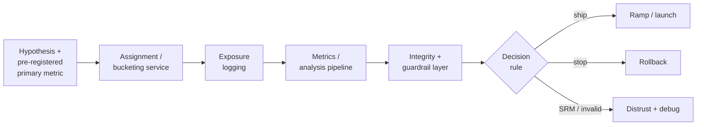

# Online Experiments

## TL;DR

An online experiment estimates what assigning a production change caused, for a declared population, outcome, and time horizon. The platform is a versioned measurement system: stable randomization, assignment and exposure events, metric contracts, reproducible analysis snapshots, integrity gates, uncertainty, and a decision rule. Randomization removes many confounders in expectation, but valid inference still depends on identity, interference, compliance, missingness, late data, and an analysis method that matches stopping and allocation. A canary can bound operational exposure; an experiment supports a causal product claim.

---

## Why Experiments Exist: The Counterfactual Offline Metrics Cannot See

Offline metrics answer performance on a specified dataset; before/after dashboards combine treatment with seasonality, product changes, and external events. Observational causal methods can identify effects under additional assumptions, but ordinary production logs record realized actions and outcomes rather than the missing potential outcome under another policy. Randomization creates a concurrent comparison whose assignment mechanism is known.

Random assignment makes treatment independent of pre-treatment characteristics *in expectation*. A finite realized sample is not identical across arms; chance imbalance remains and is represented by uncertainty intervals. Under correct assignment, no interference, consistent treatment, and complete outcome handling, the difference in outcomes identifies a causal effect for the randomized population. Randomization is powerful because it makes those assumptions inspectable—not because every observed difference is automatically causal.

This matters acutely for ML because deployment changes both decisions and future data. A model may improve logged-data ranking accuracy yet reduce long-term satisfaction, or pass canary latency guardrails while degrading outcomes. [Deployment rollouts](./06-model-deployment-rollouts.md) control exposure; the experiment estimates the effect of that exposure. Keeping those responsibilities separate prevents operational health from being misreported as product value.

---

## The Experiment Is a Measurement System, Not a Traffic Split

It is tempting to think an experiment is "send 50% of traffic to the new model." That is one component of one stage. The system is the chain that turns a hypothesis into a trustworthy decision, and every stage can silently invalidate the result.



Four properties make this a system rather than a flowchart. Assignment must be stable and auditable. Exposure logging must distinguish eligibility, assignment, delivery, and treatment receipt. Metric computation must pin metric definitions, event versions, windows, and late-data cutoffs. An integrity layer must withhold a decision when these contracts fail. The estimand and statistical test matter, but they operate only after the measurement system has produced valid units and outcomes.

---

## Control Plane, Event Plane, and Analysis Snapshots

The **control plane** owns experiment identity, hypothesis, unit, eligibility predicate, layer, allocation, start and stop epochs, metric contracts, and decision rule. Configurations are immutable revisions. Increasing treatment from 5% to 25% creates a new allocation epoch; it must not silently rewrite history or rebucket the original 5% unless the design explicitly permits it.

The **event plane** emits assignment, exposure, and outcome events. These are different facts:

```text
eligible → assigned(control|treatment) → delivered(config revision) → exposed → outcome(s)
```

The **analysis plane** materializes a reproducible snapshot from event-time windows, deduplication rules, identity resolution, exclusion rules declared before treatment, and a metric-definition version. A result should be addressable as

```text
(experiment revision, allocation epoch, metric version, data cutoff, analysis method)
```

so a recomputation either reproduces the number or explains which input changed. “Exactly once” event delivery is unnecessary; globally unique event IDs, idempotent ingestion, and deterministic aggregation are enough. Late events update provisional snapshots until a declared watermark, after which corrections create a new analysis revision rather than silently changing the shipped decision.

---

## Choosing the Right Instrument

The A/B test is one of several instruments. Select by estimand, interference, traffic, and cost rather than treating them as stronger or weaker versions of the same test.

A **shadow** run tests the read path without applying candidate actions. A **canary** bounds live action exposure and gates operational safety. A randomized **A/B test** estimates an assignment effect against a concurrent control. **Interleaving** mixes rankers within a result list and can efficiently estimate a narrow per-query preference, but not general product impact. A **bandit** adapts allocation to reward; it reduces regret but requires logged action probabilities and policy-aware inference because naive fixed-split estimators are invalid. A **switchback** randomizes a shared market over time when user-level arms would interfere.

These instruments are not interchangeable because they target different quantities. The experiment registry records the instrument, estimand, unit, assignment probability, and stopping rule so a downstream analysis cannot interpret a canary, interleaving win, or adaptive reward trace as a fixed-split treatment effect.

---

## Assignment Is a Distributed-Systems Correctness Problem

The bucketing service decides which variant each unit sees, and its correctness requirements are those of a distributed system, not a statistics package. Three invariants must hold simultaneously across every server, region, and request that touches the experiment.

Assignment should be **stable within an allocation epoch**: the same canonical unit and configuration revision resolve to the same bucket on every serving node. A pure hash function avoids a synchronous shared-state lookup, but only if the hash algorithm, byte encoding, identifier namespace, salt, and bucket boundaries are versioned. Changing from signed to unsigned modulo or hashing client IDs on one path and account IDs on another creates cross-service treatment leakage while each implementation looks deterministic in isolation.

Assignment should be **uncorrelated across independently analyzed experiments**. Reusing the same unsalted bucket map can align arms. A per-experiment or per-layer salt creates a separate deterministic shuffle, subject to ordinary hash-quality assumptions. Statistical independence of assignment does not remove product interaction: two treatments may still change the same outcome, which is why interacting parameters share an exclusion layer or require a factorial design.

Assignment must prevent **unplanned leakage across variants** within the causal window. Shared caches keyed without release epoch, inconsistent client/server identity, and rebucketing during a ramp can expose one unit to both policies. Switchbacks and intentional crossovers are exceptions only because their periods, washout, and analysis model the carryover explicitly. One versioned assignment library should define bucket semantics across paths.

```python
def assign(unit_id, experiment_revision, salt, num_buckets=10_000):
    key = canonical_bytes("v1", experiment_revision, salt, unit_id)
    h = stable_hash_v1(key)                    # specified algorithm and unsigned interpretation
    return h % num_buckets                     # immutable bucket map for this allocation epoch
```

At scale, the assignment layer must arbitrate concurrent experiments. In the overlapping-experiment design described by Tang et al. (2010), traffic is divided into **layers**: experiments within one layer partition units exclusively, while allocations in different layers may overlap. Independent per-layer salts make assignments independent by construction:

```text
Layer: ranking        |  exp A (30%)  |  exp B (30%)  |  holdout (40%)  |
Layer: UI             |     exp C (50%)      |       control (50%)      |
Layer: pricing        |  exp D (10%) |            control (90%)         |

user u = (A-treatment, C-control, D-control)   ← one draw per layer, independent salts
```

The layer map is a governance artifact: it encodes which allocations may overlap and which must be mutually exclusive. Independent salts make cross-layer combinations observable; they do not guarantee additive effects. If two treatments interact, an unplanned analysis can be underpowered for that interaction and each marginal effect averages over the other layer's allocation. Put mutually incompatible treatments in one layer, or predeclare a factorial/interaction analysis with adequate cell sizes when learning the combination matters.

The choice of *what* to hash is part of the causal design. Request randomization is valid only when carryover and cross-request interference are negligible. User randomization preserves a coherent personalized experience. Merchant, household, market, or graph-cluster randomization may be necessary when one unit's treatment changes another unit's outcome. Choose the finest unit that plausibly contains treatment spillovers and analyze at the randomized unit; counting lower-level events as independent otherwise produces standard errors that are too small.

---

## Exposure Logging: Measuring Who Was Actually Treated

Assignment says which policy a unit was allocated; delivery and exposure say whether the production path actually presented it. The gap may be ordinary eligibility behavior, noncompliance, or an implementation defect. Exposure events record experiment and allocation epoch, stable unit, delivery token, time, release and policy versions, and surface; ranking exposures additionally record the shown slate and positions. The same event supports [recommendation learning](./07-recommendation-systems.md), while its stable ID anchors delayed outcomes in the [label system](./10-label-ground-truth-systems.md). Missing or arm-asymmetric exposure is therefore both an experiment integrity signal and a training-data bias.

The robust primary analysis is usually **intent-to-treat (ITT)**: compare eligible units by assigned arm whether or not delivery succeeded. It estimates the effect of assigning the production policy, including noncompliance. Filtering to units that received treatment is biased when receipt is affected by treatment or by post-assignment behavior. A triggered analysis can be valid when the trigger is pre-treatment, arm-symmetric, and frozen in the design; a treatment-on-the-treated effect needs additional identification, such as assignment as an instrument. The experiment record must name the estimand rather than switching populations after results appear.

---

## Sample Ratio Mismatch: The Canonical Integrity Alarm

Before interpreting an effect, verify whether the randomized units split according to the configured allocation. A statistically incompatible count is **sample ratio mismatch (SRM)**, an integrity alarm that often indicates assignment, eligibility, identity, filtering, or logging defects. Run the primary SRM test on assignment counts at the randomized unit. Exposure-count imbalance is also diagnostic, but it may be a real treatment effect when treatment changes delivery or triggering; treating that as ordinary assignment SRM can hide the mechanism that should instead appear as noncompliance.

Assignment counts have a known probability under the configured randomizer. A significant mismatch can arise from implementation defects, inconsistent eligibility, identity duplication, arm-dependent filtering, or analysis bugs. Exposure imbalance has a wider causal tree: redirect loss and asymmetric delivery may be defects, while a treatment that legitimately changes triggering may alter exposure. The integrity report should show assignment, delivery, exposure, and outcome attrition separately rather than collapsing them into one ratio.

An unexplained assignment-level SRM invalidates the configured randomized comparison. The platform withholds the ship verdict while retaining diagnostic metrics needed to locate the defect. If investigation identifies a benign analysis mistake, a new reproducible snapshot can restore validity; post-hoc reweighting is not a default repair for unknown arm-dependent missingness.

Detection is a one-line chi-squared goodness-of-fit test, run automatically on every experiment before any metric is displayed:

```python
from scipy.stats import chisquare

observed = [1_004_512, 995_488]           # unique assigned units per arm
expected = [1_000_000, 1_000_000]         # from the configured 50/50 split
stat, p = chisquare(observed, expected)
# p ≈ 1.8e-10  → SRM. A 0.45% imbalance on 2M users is wildly non-random.

if p < 0.001:                             # example policy; repeated looks need their own control
    experiment.mark_invalid("SRM")        # hide metrics, page the owner
```

The example is worth staring at: a 50.2/49.8 split *feels* fine and is astronomically unlikely under correct randomization at this scale. Human intuition about "close enough" ratios fails at large n, which is exactly why the check must be automated and gating rather than an analyst's judgment call.

SRM triage runbook:

```text
Alert: expected 50/50 split, observed 48.7/51.3, p < 1e-6
1. Freeze decision: hide effect metrics and mark experiment invalid.
2. Check assignment logs: bucket function, salt, config rollout, client/server mismatch.
3. Check exposure logs: is one arm logging later, less often, or after an extra redirect?
4. Check filtering: bots, fraud filters, geography, app versions, privacy consent by arm.
5. Check caching: CDN/app cache keys include experiment and variant?
6. Backfill only if the missingness mechanism is proven random; otherwise restart experiment.
```

Most SRMs are not fixable by reweighting because the missing users are usually missing for a reason correlated with the treatment.

---

## Statistical Concepts as Design Constraints

Statistical assumptions are platform contracts because they determine allocation, logging, stopping, and which decision the result can support.

**Statistical power and minimum detectable effect** govern how much traffic an experiment needs. Power is chosen for the decision context rather than fixed universally at 80%. For common mean estimators, halving the target absolute effect roughly quadruples sample size. An inconclusive interval from an underpowered experiment is not evidence of equivalence. The design should start from the smallest effect that would change the ship decision, baseline variance, allocation, clustering, expected attrition, and planned analysis; non-inferiority and equivalence questions need their own margins rather than a failed superiority test.

A first-order equal-allocation estimate for a binary metric is

$$
n_{\mathrm{arm}} \approx
\frac{2p(1-p)\left(z_{1-\alpha/2}+z_{1-\beta}\right)^2}{\delta^2},
$$

where $\delta$ is the predeclared absolute minimum detectable effect, $1-\beta$ is power, and $\alpha$ is the two-sided false-positive rate. Unequal allocation, clustering, covariate adjustment, repeated looks, attrition, and overdispersion change this design.

Halving the MDE to 0.1 percentage points requires roughly four times the users. This is why "just run it for a day" is not an experiment plan; it is a traffic allocation with unknown sensitivity.

The analysis itself, for all the ceremony around it, is a two-sample test whose entire validity rests on the machinery above having worked:

```python
import numpy as np
from scipy import stats

# Per-user outcomes, keyed by ASSIGNED bucket (intent-to-treat).
t, c = outcomes["treatment"], outcomes["control"]

effect = t.mean() - c.mean()
se = np.sqrt(t.var(ddof=1)/len(t) + c.var(ddof=1)/len(c))
z = effect / se
p = 2 * stats.norm.sf(abs(z))
ci = (effect - 1.96*se, effect + 1.96*se)   # report the interval, not just the verdict
```

CUPED, the variance-reduction workhorse, is a four-line addition to this — it subtracts each user's *pre-experiment* behavior, which the treatment cannot have caused, so its variance is pure noise being removed:

```python
# x = same metric per user, measured in the weeks BEFORE assignment
theta = np.cov(y, x)[0, 1] / np.var(x)      # regression coefficient
y_adj = y - theta * (x - x.mean())          # adjusted outcome; unbiased, lower variance
```

In the ideal linear case, variance falls by approximately `ρ²`, where `ρ` is correlation between the pre-treatment covariate and outcome. The gain must be measured on representative pre-period data. Covariates must be determined before assignment; treatment-affected or differentially missing covariates bias the estimate. CUPED improves precision under its contract, but does not repair interference, logging defects, or a wrong randomization unit.

**Peeking** invalidates fixed-horizon error guarantees when the stopping decision depends on intermediate ordinary p-values. The inflation depends on the number and correlation of looks, so a universal percentage is misleading. Either commit to a fixed analysis horizon or use a group-sequential, alpha-spending, confidence-sequence, or other design whose inference matches continuous monitoring. Operational guardrails may always stop an experiment for safety; that stop is distinct from claiming a statistically positive product effect.

**Multiple comparisons** are peeking across metrics instead of across time. Examine fifty metrics and twenty slices and, at a 5% threshold, several will look significant by pure chance. A platform that lets analysts hunt through hundreds of numbers for a green cell manufactures false discoveries by design. The defenses are to *pre-register the primary metric* so that one number carries the decision, and to apply a correction (Bonferroni for strict control, Benjamini-Hochberg for exploratory false-discovery-rate control) to everything else, treating secondary findings as hypotheses to confirm, not conclusions to ship.

**Novelty, primacy, and carryover** make duration part of the estimand. An interface change can have a transient effect; a learned policy may take time to alter behavior; a switchback may retain treatment effects after the arm changes. Choose a horizon from known business cycles and the decision's expected dynamics, inspect time-by-treatment effects as predeclared diagnostics, and define washout where carryover is plausible. A universal “two weeks” rule cannot establish steady state.

---

## Metric Design: One Primary Metric, Guarded

A trustworthy experiment predeclares a decision rule. Often this is one primary metric or a composite Overall Evaluation Criterion plus guardrail non-inferiority limits. Some decisions legitimately require co-primary metrics or a Pareto rule; the cost is multiplicity and more inconclusive outcomes. Diagnostic metrics explain mechanisms but do not become alternate primaries after results arrive.

Guardrails encode harms the primary objective is not allowed to purchase. Each needs a direction, non-inferiority or harm margin, uncertainty rule, maturity window, and action. Merely requiring `p > 0.05` for every guardrail confuses absence of evidence with evidence of safety. This is the same guarded-objective discipline used in [recommendation systems](./07-recommendation-systems.md).

Guardrails make tradeoffs measurable. A relevance treatment that adds latency may improve ranking metrics while reducing completed sessions; neither effect can be inferred safely from a generic industry conversion factor. Measure the latency dose-response on the product and encode the acceptable degradation as a non-inferiority margin.

---

## Metric Contracts and Streaming Correctness

A metric name is not a definition. `conversion_rate` needs a numerator event, denominator population, attribution window, unit of analysis, timezone, bot and fraud policy, identity stitching rule, late-data cutoff, and version. Ratio metrics should be computed from unit-level sufficient statistics; averaging per-event ratios or treating repeated events from one user as independent changes both the estimand and its standard error.

```yaml
metric: purchase_conversion:v5
unit: user_id
population: eligible_and_assigned
numerator: first_purchase_completed
denominator: one_per_assigned_user
attribution: [assignment_time, assignment_time + 7d]
dedupe_key: purchase_id
late_data_watermark: 48h
identity_policy: account_id_at_assignment:v2
variance: user_level
```

Metric pipelines should publish freshness and completeness beside effects. If payment events lag differently by arm, the current estimate is not merely stale; it is biased. Backfills and corrections create a new snapshot revision, preserve the original decision snapshot, and declare whether the conclusion changes. For cluster or switchback experiments, aggregation and variance estimation follow the randomized cluster or time block, including carryover exclusions; event counts do not become independent samples because they are numerous.

Security and privacy are measurement properties. Experiment IDs in client logs can reveal unreleased features; user histories used for covariate adjustment expand the sensitive-data footprint. Minimize client-visible configuration, authenticate exposure events, restrict raw event access, use purpose-scoped identifiers, and apply retention/deletion rules to analysis snapshots. An attacker who can forge exposures or outcomes can manufacture a ship decision without touching model serving.

---

## Network Effects and Interference: When Randomization Breaks

User-level randomization rests on a hidden assumption from causal inference called SUTVA — the *stable unit treatment value assumption* — which says one unit's outcome depends only on its own treatment, not on anyone else's. In many of the most valuable systems, this assumption is simply false, and ignoring it produces confidently wrong results.

Interference appears wherever units share a resource or influence each other. In a two-sided **marketplace**, a treatment that makes treated buyers more aggressive consumes inventory that control buyers can no longer book — the treatment effect bleeds into control through the shared supply, and the measured difference understates or distorts the true effect. In a **social network**, a feature that makes treated users post more changes the feed of their control friends. In **ride-sharing or ads**, treatment and control bid for the same finite drivers or ad slots. In every case, randomizing by user violates SUTVA because the control group is no longer an untouched counterfactual; it has been contaminated by the treatment it was supposed to be compared against.

The architectural responses change the unit of randomization to restore independence. **Cluster randomization** assigns whole groups — geographic regions, social communities, supply markets — to a single arm, so interference happens *within* a cluster (where everyone shares a treatment) rather than *across* the experimental boundary. **Switchback experiments** randomize over *time* instead of users, flipping an entire market between control and treatment in alternating windows, which is the standard design for marketplaces where spatial clusters still leak. Both buy validity at a steep cost in power, because the effective sample size is the number of clusters or time-blocks, not the number of users — a few dozen regions, not a few million people. The engineering judgment is to detect when interference is plausible and accept the power penalty, because a high-powered measurement of the wrong quantity is worthless.

---

## Heterogeneous Effects: A Positive Average Can Hide a Harmed Segment

The headline of an experiment is an average treatment effect, and an average is a summary that can conceal as much as it reveals. A model change that improves the aggregate metric by 1% may be improving the experience for the majority while actively harming a minority — new users, a particular locale, a specific device class, a high-risk tenant, cold-start items with little history. The average ships; the harmed segment is discovered in a support escalation weeks later.

Predeclare slices tied to the product and harm model, then report effects and uncertainty for them even when the aggregate is positive. Many post-hoc slices create false discoveries and low power, while aggregate randomization does not guarantee precise balance inside every small slice. Hierarchical models, multiplicity control, and follow-up confirmation can improve inference. [ML risk governance](./09-ml-risk-governance.md) determines which protected or vulnerable-group limits bind and what insufficient evidence means; the experiment platform supplies traceable estimates rather than inventing legal thresholds.

---

## The Organizational Discipline: Trustworthiness Is a Culture

An experimentation platform needs institutional ownership because validity spans product code, identity, event schemas, statistics, and launch authority. Metric owners version definitions; platform owners maintain assignment and analysis; experiment owners declare hypotheses and respond to guardrails; independent reviewers are appropriate for high-consequence decisions. No role can certify validity from its component alone.

Unexpectedly large effects trigger stronger integrity review because logging leaks, identity defects, caching, and sample loss can create them. The platform preserves negative and inconclusive results, expires experiments and flags, and prevents metric or population changes after observation without a new revision. This is operational skepticism expressed as state and ownership rather than folklore.

A production experiment registry should make the decision auditable:

```yaml
experiment: feed_ranker_2026q2
owner: recommendations-platform
hypothesis: "new ranker improves long-term satisfied sessions"
unit: user_id
assignment: { hash: murmur3, salt: exp_8f21, allocation: { control: 50, treatment: 50 } }
primary_metric: satisfied_sessions_per_user_7d
guardrails:
  - p99_latency_ms
  - hide_report_rate
  - creator_diversity
  - new_user_retention
minimum_duration_days: 14
power: { baseline: 0.42, mde_relative: 0.01, required_users_per_arm: 1_200_000 }
analysis: { method: fixed_horizon, cuped: true, peeking_allowed: false }
status: running
expires_at: 2026-07-31
```

The registry prevents two common long-term failures: orphaned experiments that keep assigning users forever, and undocumented metric changes after a team has seen the result.

---

## Failure Modes

The characteristic ways experiments mislead recur across organizations, and naming them is most of preventing them.

**Sample ratio mismatch** is the broken pipeline masquerading as a result. The traffic split deviated from the design, which means a mechanical bug shaped the data and very likely the conclusion. The defense is automated SRM detection that gates the result before it is read, and a hard rule never to ship on an SRM-failing experiment.

**Peeking-induced false positives** come from stopping a fixed-horizon test on an ordinary intermediate p-value. The amount of inflation depends on the schedule and correlation of looks. Precommit the horizon or use sequential inference designed for the actual monitoring rule.

**Underpowered experiments** consume traffic and return an inconclusive "no difference" that is really a failure to measure. The defense is an up-front power calculation, variance reduction like CUPED, and refusing experiments that cannot reach adequate sample size in a reasonable window.

**Interference** breaks the control group's role as a clean counterfactual when treatment and control share inventory, a social graph, or a supply pool. The defense is cluster or switchback randomization, chosen by recognizing when SUTVA fails.

**Novelty and primacy effects** let a transient reaction to change masquerade as a durable effect. The defense is a minimum duration spanning full behavioral cycles so the steady state, not the spike, is measured.

**Implausible effects without integrity escalation** ship a large apparent win caused by cache leakage, identity duplication, or asymmetric event loss. Compare unaffected invariants, reproduce from raw assignment, and inspect effect timing and slices before authorizing the change.

**Allocation-epoch contamination** occurs when a ramp rebuckets existing units or analysis combines 5%, 25%, and 50% epochs without preserving assignment history. Previously exposed units carry treatment into a nominal control arm. Immutable allocation epochs, sticky assignment, and explicit washout rules preserve the comparison.

**Metric-definition drift** changes event filters, identity stitching, or attribution windows while an experiment runs. The dashboard moves even though user behavior does not. Pin metric versions to the experiment revision and publish backfills as new analysis snapshots.

**Pseudo-replication** counts millions of clicks as independent even though assignment occurred across hundreds of markets or users. The point estimate may be reasonable while the interval is far too narrow. Aggregate or use cluster-robust inference at the randomization unit.

**Forged or asymmetric exposure** lets client bugs—or an adversary—emit treatment events without delivery, manufacturing both SRM and effect. Server-verifiable delivery tokens, schema validation, and arm-symmetric logging make the evidence chain tamper-resistant.

---

## Decision Framework

Select the instrument from the estimand and interference structure:

| Decision | Appropriate design | Principal limitation |
|---|---|---|
| Does a production change improve user outcomes? | Stable-unit randomized A/B test | Needs sufficient traffic, ethical withholding, and limited spillover |
| Which of two rankers wins per query? | Interleaving | Narrow preference estimand; not a product-impact estimate |
| How should reward be maximized while learning? | Contextual bandit | Adaptive data needs policy-aware inference |
| Does treatment alter a shared market? | Cluster or switchback experiment | Few independent units and carryover reduce power |
| Is a safety fix operationally safe? | Progressive rollout with harm guardrails | May not estimate incremental product value |
| Randomization is impossible | Quasi-experimental design | Stronger, less testable identification assumptions |

Then specify the evidence contract. The randomization unit must contain plausible spillovers; the estimand must name ITT, treatment-on-treated, non-inferiority, or another target; the metric window must include the outcome that changes the decision; and the sample calculation must use independent units, expected attrition, and the planned analysis. If the true outcome matures after the launch decision, use fast proxies only for bounded rollout safety and retain a holdout for the slower outcome where doing so is ethical.

Finally, bind operations to inference. Safety guardrails may stop at any time. A positive product claim follows the predeclared fixed or sequential rule. Allocation changes create epochs, not overwritten configuration. An invalid integrity state yields no ship verdict. This prevents rollout urgency from quietly changing the causal question after data arrives.

---

## Key Takeaways

1. Randomization makes treatment independent of pre-treatment characteristics in expectation; causal interpretation still requires correct assignment, a defined estimand, consistency, and controlled interference.
2. The platform is a measurement system — assignment, exposure logging, metrics pipeline, integrity layer, decision rule — not a traffic split. Each stage can silently invalidate the result.
3. Treat assignment as a versioned distributed-systems contract: canonical identity, specified hashing, immutable bucket maps, stable allocation epochs, and no cache or configuration leakage.
4. Randomize at the finest unit that plausibly contains carryover and spillovers, then analyze at that unit; if interference crosses randomized units, redesign or bound the estimand.
5. Assignment-level SRM is a gating integrity failure; exposure imbalance can also reveal treatment-dependent delivery and must be diagnosed rather than mislabeled.
6. Statistics are design constraints: size for adequate power, never peek at a fixed-horizon test, correct for multiple comparisons, and run long enough to outlast novelty effects.
7. Pre-register one guarded primary metric; guardrails block wins that break latency, revenue, or trust, and defend against metric hacking.
8. Interference breaks SUTVA in marketplaces and social systems; cluster and switchback designs restore validity at a real cost in power.
9. A positive average can hide a harmed segment — slice analysis is a required stage and a governance obligation, not an optional drill-down.
10. Metric contracts, late-data revisions, cluster-aware inference, authenticated exposure, and privacy controls are part of causal correctness, not reporting details.

---

## References

1. [Trustworthy Online Controlled Experiments: A Practical Guide to A/B Testing](https://www.cambridge.org/core/books/trustworthy-online-controlled-experiments/6A3B263E7114E81B95669A95B219C1D8) — Kohavi, Tang & Xu, 2020
2. [Controlled Experiments on the Web: Survey and Practical Guide](https://ai.stanford.edu/~ronnyk/2009controlledExperimentsOnTheWebSurvey.pdf) — Kohavi et al., 2009
3. [Diagnosing Sample Ratio Mismatch in Online Controlled Experiments](https://www.exp-platform.com/Documents/2019_KDD_SampleRatioMismatch.pdf) — Fabijan et al., KDD 2019
4. [Overlapping Experiment Infrastructure: More, Better, Faster Experimentation](https://research.google/pubs/overlapping-experiment-infrastructure-more-better-faster-experimentation/) — Tang et al., Google, 2010
5. [Improving the Sensitivity of Online Controlled Experiments by Utilizing Pre-Experiment Data (CUPED)](https://www.exp-platform.com/Documents/2013-02-CUPED-ImprovingSensitivityOfControlledExperiments.pdf) — Deng et al., 2013
6. [Always Valid Inference: Continuous Monitoring of A/B Tests](https://arxiv.org/abs/1512.04922) — Johari, Pekelis & Walsh, 2017
7. [Detecting Network Effects: Randomizing Over Randomized Experiments](https://www.kdd.org/kdd2017/papers/view/detecting-network-effects-randomizing-over-randomized-experiments) — Saint-Jacques et al., LinkedIn, KDD 2017
8. [It's All A/Bout Testing: The Netflix Experimentation Platform](https://netflixtechblog.com/its-all-a-bout-testing-the-netflix-experimentation-platform-4e1ca458c15) — Netflix, 2016
9. [Experiments at Airbnb](https://medium.com/airbnb-engineering/experiments-at-airbnb-e2db3abf39e7) — Airbnb Engineering
