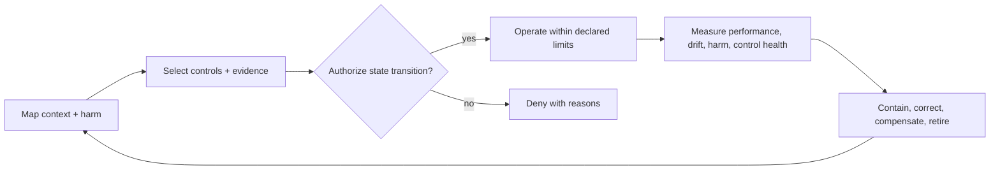
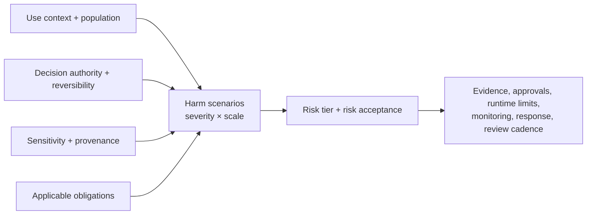
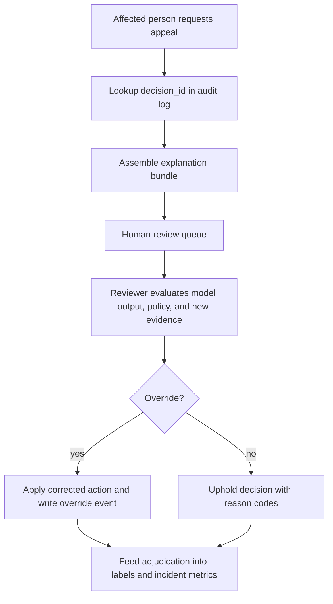

# ML Risk and Governance

## TL;DR

ML governance is the control system that maps a use context to accountable owners, evidence requirements, authorized state transitions, runtime limits, detection, response, and retirement. Preventive controls belong on promotion and policy-change paths; detective controls continuously test whether assumptions still hold; corrective controls contain and remediate harm. Documentation is evidence and interface, but it is not enforcement by itself. The architectural objective is traceable authority: the system can show which approved release and policy produced a decision, which evidence justified that authority, when the evidence expires, who can intervene, and how the system returns to a safer state.

---

## Governance Is a Closed Control Loop

Governance fails when intended controls and effective controls diverge. A model card may correctly describe intended use while an endpoint permits reuse elsewhere. An approval may exist while a threshold can change outside the approved bundle. A launch review may pass while the population and policy drift later. The remedy is not to dismiss documentation; it is to bind structured evidence to enforceable transitions and then measure whether the controls work in operation.



Preventive gates block unsupported promotion. Detective controls such as audit sampling, appeal trends, and slice monitoring may not block a request synchronously, but they are still real controls when they have owners, service levels, and mandatory response transitions. Corrective controls include traffic rollback, decision suspension, human review, notification, and compensation. A governance design that contains only gates is brittle; a design with only dashboards is advisory. The closed loop needs both.

---

## Risk Tiering: Not Every Model Needs the Same Scrutiny

A model that recommends songs and a model that approves loans are both "ML in production," but governing them identically is a category error. Apply the loan model's controls to the song recommender and you bury low-risk work in bureaucracy until teams route around governance entirely. Apply the recommender's controls to the loan model and you ship a life-altering decision system as an ordinary code change. **Risk tiering is the decision framework that allocates scrutiny in proportion to consequence**, and it is the single most important design choice in a governance system because every other control derives from it.

Tiering starts from context and plausible harm, not model accuracy alone. Relevant dimensions include severity and scale of impact, affected populations, action reversibility, human dependence, detectability, abuse potential, data sensitivity, autonomy, and applicable sectoral law. Likelihood is uncertain before deployment, so a low estimated probability does not erase a catastrophic impact. The same artifact can occupy different tiers when used to summarize an internal queue versus autonomously deny a service; **intended use and decision authority are part of model identity**.

| Tier | Example | Controls the system must enforce |
|---|---|---|
| Low | Internal ranking, dev-productivity tooling | Owner, lineage, basic monitoring |
| Medium | Marketing personalization, support routing | + experiment review, guardrails, slice monitoring |
| High | Fraud holds, dynamic pricing, abuse enforcement | + human override, audit log, rollback, policy approval |
| Critical | Credit, hiring, health, legal-access decisions | + explainability, contestability, strict data governance, periodic audit |

The tier parameterizes required evidence, approver roles, rollout authority, monitoring, retention, and review cadence. It is versioned and re-evaluated on material change: new population, new purpose, greater autonomy, policy change, new data source, or changed legal context. A release cannot inherit an old approval merely because its model hash stayed constant.



---

## Auditability and Lineage: You Cannot Govern What You Cannot Reconstruct

Every governance question (*why was this person denied? was this model reviewed? what data did it learn from? can we roll it back?*) reduces to a reconstruction problem. If the system cannot reconstruct the conditions of a past decision, no amount of policy can govern it. **Lineage is therefore the foundation on which every other control rests**, the same way reproducibility is the foundation of the training pipeline.

The governance requirement extends the training pipeline's [reproducibility contract](./05-training-pipelines.md) from “what produced this model” to “what produced this decision.” Trace the model and training lineage, the release and policy versions, the inputs actually used, system fallbacks, and any human intervention. What must be retained, for how long, and in what form depends on purpose and applicable law; retaining every raw feature indefinitely can itself violate data-minimization and retention obligations.

The serving path emits an append-only **decision event** with a unique ID, release epoch, artifact digest, policy version, input snapshot reference or governed digest, output, fallback state, and override. Tamper evidence comes from write-once storage controls, restricted writers, integrity hashes, replication, and audited reads, not from the word “immutable.” Sensitive input values can live in a separately encrypted vault with shorter retention while the decision ledger retains stable references and integrity proofs. Labels and appeals may link to the decision event, but they remain separate ledgers: using the audit stream directly as ground truth would mix what the system decided with whether that decision was correct.

---

## Governance Artifacts: Inventory, Decision Log, and Evidence Bundle

A mature governance system has three first-class artifacts. They are not documents attached after the fact; they are database records and immutable objects the platform writes, validates, and queries.

| Artifact | Written by | Used for | Must be immutable? |
|---|---|---|---|
| Model inventory record | Registry / owner onboarding | Scope, tier, owner, required controls | Mutable by versioned updates |
| Per-decision audit log | Serving path | Reconstruction, appeals, incident impact | Append-only |
| Promotion evidence bundle | Evaluation + registry gate | Deployment approval and rollback proof | Immutable once approved |

A model inventory entry should be structured enough for policy evaluation:

```yaml
model_inventory:
  model_id: credit_limit_decision
  version: inventory_schema:v3
  owner:
    team: credit_platform
    accountable_person: user:alice
    oncall: credit-ml-primary
  risk:
    tier: critical
    domain: credit
    affected_population: external_customers
    decision_effect: legal_or_financial_significance
    reversible: true
    appeal_sla_days: 14
  intended_use:
    allowed:
      - initial_credit_limit_assignment
      - periodic_limit_review
    prohibited:
      - employment_screening
      - insurance_pricing
  data_governance:
    training_datasets:
      - credit_applications:2026-05-31.2
    label_definitions:
      - ninety_day_default:v4
    sensitive_features:
      direct_use: []
      proxy_review_required:
        - postal_code_region:v6
        - employment_tenure_bucket:v2
    retention_policy: regulated_decision_7y
  required_controls:
    lineage: required
    independent_validation: required
    fairness_slices: required
    explanation_artifact: required
    human_appeal_path: required
    kill_switch: required
  production:
    endpoints:
      - credit-api/prod/us/limit_decision
    fallback_policy: manual_review_policy:v8
    rollback_target: credit_limit_model:v41
```

A per-decision audit log should be dense enough to reconstruct the decision without exposing raw sensitive values unnecessarily:

```yaml
decision_audit_event:
  decision_id: dec_01J2Z7K5T4Q6
  request_id: req_8db6a1
  subject_ref: customer_hash:7b3c...       # pseudonymous, not raw PII
  occurred_at: 2026-06-24T10:15:33.481Z
  endpoint: credit-api/prod/us/limit_decision
  model:
    model_id: credit_limit_decision
    model_version: credit_limit_model:v42
    artifact_hash: sha256:9f86d08...
  policy:
    threshold_policy: credit_limit_policy:v12
    decision_policy: credit_limit_assignment:v5
  inputs:
    feature_vector_id: fv_01J2Z7...
    feature_versions:
      income_band: income_band:v3
      delinquency_count_12m: delinquency_count_12m:v9
      utilization_ratio: utilization_ratio:v7
    missing_features: []
  output:
    score: 0.73
    calibrated_probability: 0.19
    action: approve_limit_2500
    explanation_reason_codes:
      - high_utilization_ratio
      - short_credit_history
  human_override:
    applied: false
    reviewer: null
    reason_code: null
  experiment:
    assignment_id: exp_none
  retention:
    policy: regulated_decision_7y
    legal_hold: false
```

The promotion evidence bundle ties inventory and decision logging to deployment. It contains exact evaluation snapshots and uncertainty, slice definitions, approvals, serving-contract validation, rollback evidence, control tests, known limitations, and an expiry policy. The registry stores its digest on the release. If a later incident asks why a release was authorized, the answer is a stable evidence graph rather than a scavenger hunt through mutable dashboards.

---

## Authority Is a Versioned Lease

Approval should grant bounded authority to a complete decision release, not permanent trust to model weights. The lease binds model digest, feature and label contracts, policy, use context, population, endpoint, traffic ceiling, control versions, and expiry. A material change invalidates or narrows the lease.

```text
authority(release) = approved evidence
                     ∩ allowed purpose and population
                     ∩ traffic/autonomy limits
                     ∩ evidence freshness
                     ∩ healthy mandatory controls
```

The governance control plane evaluates this state and issues a signed release authorization. The serving control plane accepts only authorized digests and logs the authorization ID with each decision epoch. This boundary prevents a registry approval from being reused for another endpoint or a threshold edit from bypassing model review. Short control-plane outages need not stop inference immediately: the data plane can use a cached authorization until its lease expires, then follow the declared fail-safe.

Exceptions are also state. A break-glass authorization names the incident, scope, approvers, compensating controls, expiry, and retrospective review. An undocumented bypass is a vulnerability; an expiring, dual-authorized exception is a governable risk decision.

---

## Approval Gates and Separation of Duties

For higher tiers, promotion requires an enforced authorization from roles independent enough to challenge the release. **Separation of duties** reduces conflict of interest and single-principal compromise; it does not assume authors are reckless or reviewers infallible. Required independence and expertise follow the harm model: for example, model validation, domain risk, privacy, security, or legal review may own different claims.

The enforcement boundary spans the **model registry** and deployment controller, the same components that anchor [deployment and rollouts](./06-model-deployment-rollouts.md). The registry stores the model bundle's eligibility lifecycle (registered, evaluated, approved, deprecated, retired), while separate deployment records store environment and rollout state such as staged, shadow, canary, active, and draining. A high-tier bundle cannot become `approved` without the required lineage, evaluation, and authorization; the deployment controller then refuses production canary or active intent unless that approval lease is valid for the exact bundle and use context. This is the governance analogue of the training pipeline's promotion gate: a model whose approval is "someone said yes in Slack" is not approved, because neither controller can enforce Slack.

The engineering implication is that approval must be a *state in the registry*, queryable and enforced, not an event in a human's memory. A small declarative policy, evaluated by the gate, is enough:

```yaml
# Evaluated before any tier>=high bundle receives production traffic
authorize_production_deployment:
  require_model_eligibility: approved
  require_lineage_contract: complete      # else: refuse (no contract, no registry entry)
  require_slice_metrics:    passing       # gated on pre-declared protected slices
  require_approval_from:     "risk-review" # a role distinct from the model's author
  require_rollback_target:   present       # a known-good version to revert to
```

---

## Policy-as-Code Governance Gate

The scalable form of governance is a policy engine over registry metadata. The policy should be declarative, versioned, testable, and evaluated on every promotion and material policy change. Human reviewers still matter, but the platform decides whether the required evidence exists.

```yaml
governance_policy: regulated_model_promotion:v6
applies_to:
  risk_tiers: [high, critical]
  target_environments: [production]
  target_rollout_states: [canary, active]

defaults:
  deny_unless_all_required_controls_pass: true
  approvals_expire_after_days: 90
  evidence_bundle_required: true

rules:
  lineage:
    require_training_run: true
    require_dataset_snapshot: true
    require_feature_schema_versions: true
    require_label_definition_version: true
    require_artifact_hash: true

  evaluation:
    require_baseline_comparison: current_production
    require_uncertainty: bootstrap_95_ci
    require_guardrail_slices:
      - protected_class_proxy_reviewed
      - geography
      - new_customer
    evaluate_guardrails_against: declared_harm_and_noninferiority_limits

  operational_readiness:
    require_serving_contract_validation: true
    require_load_test_p99_below_ms: 120
    require_prediction_logging: decision_audit_event:v4
    require_kill_switch_tested_within_days: 30
    require_rollback_target_loadable: true

  approvals:
    high:
      require_roles: [model_owner, independent_validator]
    critical:
      require_roles: [model_owner, independent_validator, risk_review, legal_or_policy]
      author_cannot_approve: true

  contestability:
    critical:
      require_explanation_artifact: true
      require_appeal_queue: true
      require_human_override_policy: true
```

The gate should return machine-readable denial reasons:

```json
{
  "decision": "deny",
  "model_version": "credit_limit_model:v42",
  "target_environment": "production",
  "target_rollout_state": "canary",
  "failed_controls": [
    "evaluation.guardrail_slices.new_customer.regressed",
    "operational_readiness.kill_switch_tested_within_days.expired"
  ]
}
```

This shape matters operationally. A denial reason that points to a missing registry field can be fixed. A denial reason that says "risk review incomplete" with no failing control becomes another human process.

---

## Access Control: Who Is Allowed to Change a Consequential Model

An approval gate is worthless if anyone can bypass it. Separation of duties only holds when the *permission* to promote, to edit a threshold, or to overwrite a feature definition is itself an enforced control. This is the access-control layer of governance, and it is the one teams most often leave implicit: every engineer has production credentials, and the gate is a convention rather than a constraint.

The blast radius of a change should determine its privilege boundary. Model, feature, threshold, policy, fallback, and authorization changes all affect decisions and require attributed identities and least-privilege roles. High-consequence changes use dual control; production artifacts and policy bundles are signed by the release path; the serving plane verifies digest and signature before activation. A registry that records approvals but permits an unsigned threshold edit is recording fiction. Emergency access is narrow, time-bound, heavily logged, and automatically revoked rather than shared as a standing administrator credential.

---

## Explainability and Contestability: A System Requirement, Not a Model Property

Legal duties are jurisdiction- and use-specific. In the EU, **GDPR Article 22** addresses decisions based solely on automated processing that produce legal or similarly significant effects, subject to stated exceptions; where the contract or consent exceptions apply, Article 22(3) requires safeguards including human intervention, an opportunity to express a view, and contesting the decision. GDPR transparency duties also interact with Articles 13–15 and have been interpreted through case law and regulatory guidance. The **EU AI Act** imposes risk-management, data-governance, logging, transparency, and human-oversight duties for covered actors and systems on a phased schedule. These regimes overlap but are not interchangeable, and architecture is not a substitute for legal scoping.

The engineering implication is that explanation and contestability are end-to-end capabilities. The system needs decision lookup, preserved policy and input context, an explanation appropriate to the audience, a review route, override authority, and downstream correction. Feature attribution can help describe model sensitivity, but it is not automatically a causal explanation, a legal reason, or evidence that the final policy action was justified. Persist the explanation method and version (or enough governed context to recompute it) and validate fidelity and stability for the actual model class.

The model output may also be only one input to the final action. A complete explanation distinguishes model score, deterministic eligibility rules, thresholds, missing-feature fallbacks, and human judgment. Otherwise the system explains the model while leaving the decision unexplained.

---

## Appeal and Contestability Workflow

Contestability is a workflow with state, ownership, evidence access, and deadlines. A model is not contestable because a support agent can file a ticket; it is contestable when the system can route an affected decision to a reviewer with the exact decision evidence and authority to change the outcome.



The workflow needs its own contract:

| Field | Why it matters |
|---|---|
| `decision_id` | Joins the appeal to the immutable audit event |
| `subject_ref` | Identifies the affected person without spreading raw PII |
| `explanation_bundle_id` | Freezes model, policy, features, and reason codes used for review |
| `reviewer_role` | Enforces separation from the model author |
| `appeal_sla_due_at` | Makes contestability measurable |
| `override_action` | Records whether the automated decision was changed |
| `override_reason_code` | Turns appeals into diagnosable product/model feedback |

An appeal system also needs capacity planning. If a critical model makes 1M decisions/day and 0.2% are appealed, that is 2,000 reviews/day. At 8 minutes/review, the workflow needs roughly 267 reviewer-hours/day before QA and escalation. If governance mandates a 14-day appeal SLA but staffing can handle only 500/day, the right conclusion is not "hire later"; it is that the automated decision system is not operationally ready at that decision volume.

Human availability is not equivalent to meaningful oversight. The reviewer needs time, competence, independent evidence, authority to disagree, and a UI that does not anchor them on the model's conclusion. Measure queue age, overturn rate by slice, inter-reviewer consistency, sampled reviewer accuracy, and repeated rubber-stamping. Hide the model recommendation during an initial independent assessment where appropriate, then reveal it for reconciliation. Overrides create append-only events and corrected [label evidence](./10-label-ground-truth-systems.md); they never mutate the original decision record.

---

## Fairness as a Continuous, Gated Operational Concern

Fairness fails most often not because a team ignored it but because they checked it *once*. A model audited for disparate impact at launch and never again will drift, because the population it serves drifts, the data drifts, and an upstream feature quietly changes meaning. **Fairness is an operational property that must be measured continuously and gated on, not a one-time certificate.**

The gate needs numbers, so it is worth seeing what the standard metrics actually compute. For a credit model scored on a mature-label window:

```text
Group A (n=40,000): approval rate 34%   TPR (approved among truly-repaying) 0.81
Group B (n=6,500):  approval rate 25%   TPR                                  0.68

Selection-rate ratio    = 0.25 / 0.34 = 0.74
Equal-opportunity gap   = 0.81 − 0.68 = 0.13     ← qualified members of B are
                                                    13 points less likely to be approved
```

The selection-rate ratio needs no outcome labels and can be computed quickly; it measures a different quantity from equal opportunity, which conditions on a mature outcome. The “four-fifths” heuristic appears in the US Uniform Guidelines for Employee Selection Procedures; it is not a universal fairness definition, legal safe harbor, or appropriate threshold for unrelated domains. Conditional metrics inherit label delay and selective-label bias from [model monitoring](./04-model-monitoring.md). A governance policy must choose metrics from the harm model and legal context, record unavoidable tradeoffs among criteria, and evaluate uncertainty. Confidence intervals depend on the relevant denominators and event rates (not merely the total slice size), and gates need minimum evidence plus an escalation state rather than treating an underpowered slice as passing.

At system level, fairness monitoring needs a versioned cohort definition, lawful and access-controlled handling of protected attributes, maturity and missingness state, uncertainty, and an action policy. Not every alert should blindly roll back: a data-quality failure may freeze promotion, a credible severe disparity may suspend automation, and a low-powered slice may route more cases to review while evidence accumulates. Aggregate performance never overrides a predeclared harm limit, but the control must distinguish “measured safe,” “measured unsafe,” and “not measurable yet.”

---

## Privacy and Data Governance

A model is a derived data artifact. Governance must record source, purpose and legal basis or permission, transformations, retention, access, and onward use for each dataset snapshot. Sensitive attributes and plausible proxies require contextual review; protected attributes may also be necessary for disparity measurement, which argues for a separately controlled analysis path rather than pretending they do not exist.

Deletion and objection requests need forward-lineage impact analysis: which raw records, label events, feature snapshots, training datasets, caches, and artifacts derived from the subject? The required response is jurisdiction- and context-specific; it may involve deleting source and cached data, excluding the record from future training, retraining, unlearning, or documenting why an exception applies. Row deletion alone does not remove memorized content from weights, while blind retraining can conflict with audit-retention duties. The system should surface the dependency graph and evidence so privacy and legal owners can make and execute the scoped decision.

---

## Incident Response and Accountability

Every governed model needs a named accountable owner or on-call rotation with authority to contain harm. An **orphaned model** can continue making consequential decisions after organizational ownership disappears, leaving no actor responsible for monitoring, explanation, or suspension.

ML incidents demand a different playbook from service incidents because a model can be perfectly *healthy* (low latency, no errors) while causing real harm. The relevant severity scale is keyed to harm, not to system health.

| Impact dimension | Classification input | Control consequence |
|---|---|---|
| Irreversibility | Can the decision or disclosure be undone or compensated? | Stronger pre-authorized containment and approval |
| Harm velocity | Affected decisions and expected loss per unit time | Shorter detection and mitigation objective |
| Scope | Subjects, regions, tenants, downstream systems | Escalation, evidence preservation, and communication routes |
| Legal/policy trigger | Applicable regime, actor role, event definition | Counsel/risk-owned notification decision and deadline |
| Evidence confidence | Confirmed harm, credible signal, or monitor anomaly | Fail-safe containment versus bounded investigation |

Containment is a governance control and must follow the recovery objective derived from harm velocity. The serving control plane should suspend an authorization, route to a known-safe release, lower autonomy, or enter manual review without waiting for a rebuild. The target may be seconds for a high-rate irreversible action and longer for a low-rate advisory workflow; the requirement is evidence-backed and tested. Detection without a containment path merely timestamps harm.

---

## Governance Incident Workflow: Harm Signal to Enforced Control

An ML governance incident clock starts from harm detection, not service failure. Workflow deadlines are policy data derived from impact class, harm velocity, contractual commitments, and applicable law; a static chapter cannot supply them.

```text
DETECTED
  -> TRIAGED             classify evidence, impact, owner, and authority
  -> CONTAINING          freeze allocation; suspend or narrow decision authority
  -> CONTAINED           preserve release/policy/data evidence and reconcile in-flight effects
  -> SCOPING             identify affected decisions, subjects, regions, and downstream actions
  -> NOTIFICATION_DECISION
                         risk/legal owner records applicable duties, recipients, and deadlines
  -> REMEDIATING         correct decisions/data/system and validate safe restoration
  -> CLOSED              publish control changes, residual risk, and effectiveness evidence
```

Each transition records actor, evidence bundle, policy revision, deadline, decision, and exceptions. Containment may begin before classification completes when expected loss from waiting exceeds the cost of a fail-safe. Notification is neither automatic for every anomaly nor optional when a scoped obligation applies; the responsible owner makes and records that determination against current authoritative requirements.

The impact query should be prepared before the incident. During a real event, the team should fill parameters, not design joins:

```sql
-- Example: decisions affected by a bad threshold policy in a known window.
SELECT
  decision_id,
  subject_ref,
  occurred_at,
  model_version,
  threshold_policy,
  output_action,
  score,
  slice_country,
  slice_new_customer
FROM decision_audit_log
WHERE endpoint = 'credit-api/prod/us/limit_decision'
  AND threshold_policy = 'credit_limit_policy:v12'
  AND occurred_at >= TIMESTAMP '2026-06-24 09:00:00 UTC'
  AND occurred_at <  TIMESTAMP '2026-06-24 11:30:00 UTC';
```

A complete incident review should always ask four engineering questions:

1. Which gate would have blocked this model, policy, or data state before production?
2. Which monitor should have detected it earlier, and at what severity?
3. Which rollback or fail-safe reduced harm, and was it fast enough?
4. Which registry or audit field was missing when reconstructing impact?

The postmortem output is a pull request against the governance system: a new policy rule, required metadata field, monitor, runbook, or automated test. If the output is only a memo, the same class of harm will recur.

---

## Map Obligations to Evidence, Not Framework Names

Regimes differ in scope, actor roles, definitions, and required evidence. **SR 11-7** applies to covered banking organizations' model risk management and emphasizes inventory, validation, governance, and ongoing monitoring. **GDPR** governs personal-data processing and includes, among many other provisions, Article 22's scoped rules for certain solely automated significant decisions. **Regulation (EU) 2024/1689, the EU AI Act**, applies progressively and assigns obligations by actor and system classification. The original text, subsequent amendments, official implementation timeline, sectoral law, and national enforcement all matter; dates should be checked against current official sources rather than copied into static policy code.

The platform should not encode “GDPR compliant” as a Boolean. It should encode testable obligations and evidence: processing purpose, actor role, system classification, data-governance record, logging period, human-oversight design, conformity or validation artifact, information supplied to affected people, incident route, and responsible owner. Legal or risk specialists own the mapping from law to controls; engineering owns making those controls observable and enforceable. Shared controls reduce compliance work, but no generic registry or fairness dashboard establishes compliance by itself.

---

## Failure Modes

The characteristic ways governance fails recur across organizations, and naming them is half of preventing them.

**Evidence/control divergence** occurs when an approved model card describes one use while an endpoint, threshold, or feature change creates another. Bind an expiring authorization to the complete release and use context; invalidate it on material change.

**The unreconstructable decision** is the audit that cannot answer "why." A regulator or court asks why a person was denied, and the system cannot reconstruct the model version, inputs, and reasoning. The defense is the per-decision audit log, captured automatically and stored immutably.

**Untiered, one-size-fits-all governance** either buries low-risk models in bureaucracy until teams evade it, or ships high-risk models as ordinary code changes. The defense is a tiering framework that allocates scrutiny by impact and parameterizes the gate.

**Fairness-as-a-one-time-check** certifies a model at launch and lets it drift. The defense is continuous slice monitoring with a pre-declared metric that the promotion gate enforces.

**The orphaned model** runs in production with no owner, so no one notices, explains, or stops its harms. The defense is mandatory owner metadata, stale-model alerts, and a retirement path: a model without a retirement plan becomes permanent operational debt.

**Nominal human oversight** places a rushed reviewer after the model without independent evidence or override authority. High agreement alone is not proof of rubber-stamping because easy cases may genuinely agree. Sample expert adjudication, time-to-review, reason diversity, slice-level overturns, and controlled tests of reviewer independence expose automation bias and capacity pressure.

**Expired evidence with persistent authority** lets a release continue after its population, features, law, or controls have materially changed. Time-bound authorizations, dependency-change events, and periodic revalidation prevent “approved once” from becoming “approved forever.”

**Audit-log exfiltration** turns rich decision reconstruction into a concentrated store of sensitive attributes and outcomes. Separate identifiers and sensitive snapshots, encrypt with scoped keys, audit reads, minimize retention, and test deletion/legal-hold behavior.

**Break-glass permanence** uses an emergency bypass during an incident and never removes it. Exception state needs dual authorization, narrow scope, automatic expiry, compensating monitoring, and a mandatory review event.

---

## Decision Framework

Begin with a harm model and use context, then select a control portfolio. The tier is an index into that portfolio, not a substitute for reasoning.

| Control objective | Low consequence | High consequence or regulated context |
|---|---|---|
| Authority | Named owner and release provenance | Scoped, signed, expiring authorization with separation of duties |
| Evidence | Reproducible evaluation and serving contract | Independent validation, uncertainty, protected slices, limitations, legal mapping |
| Decision trace | Release and policy epoch | Governed input snapshot, complete action path, explanation method, tamper evidence |
| Runtime boundary | Monitoring and rollback | Traffic/autonomy ceilings, fail-safe, kill switch, human intervention, appeal |
| Detection | Service and quality signals | Harm, fairness, control health, appeals, audit samples, evidence freshness |
| Response | Owner remediation | Containment objective, impact query, notification, correction/compensation workflow |
| Lifecycle | Periodic ownership check | Material-change review, approval expiry, decommission and retention plan |

The strongest control should sit at the narrowest reliable enforcement point. Artifact integrity belongs at registry admission; use-purpose and traffic limits belong in release authorization; per-decision eligibility belongs in policy execution; slow outcome harm belongs in monitoring and incident state. Duplicating every control in every component creates inconsistency, while leaving a requirement only in a document creates no execution boundary.

Three-valued evidence avoids a dangerous default: `PASS`, `FAIL`, and `INSUFFICIENT`. A sparse protected slice, delayed labels, or unavailable explanation test is not a pass. Policy decides whether insufficient evidence blocks promotion, caps autonomy, routes to review, or requires explicit time-bounded risk acceptance. That decision and its owner become part of the evidence bundle.

Finally, test the controls themselves. Exercise rollback and authorization revocation, inject missing audit fields, verify that an unauthorized threshold is rejected, measure appeal capacity, and query a synthetic incident window. Governance is effective only when control health is observed and failures cause defined state transitions.

---

## Key Takeaways

1. Governance is a closed loop of context mapping, authorization, operation, measurement, response, and retirement, not a document set or a promotion checklist.
2. Risk tiering by impact (who is affected, reversibility, regulatory exposure) is the core decision framework; it parameterizes every other control.
3. Decision traceability spans model and training lineage, release epoch, policy, actual inputs or governed snapshot, fallback state, and human action.
4. Approval gates enforce separation of duties through the model registry: approval is a queryable state, not a memory.
5. Production governance artifacts should be structured: model inventory, per-decision audit log, and immutable promotion evidence bundle.
6. Explanation and contestability require an end-to-end workflow; feature attribution alone is neither a causal explanation nor an appeal mechanism.
7. Fairness controls need contextual metrics, lawful cohort data, uncertainty, mature labels, and an action for `INSUFFICIENT` evidence.
8. Containment targets derive from harm velocity; authorization revocation, lower autonomy, rollback, and manual review must be tested against that objective.
9. Governance incidents should produce new enforced controls (policy rules, metadata requirements, monitors, or runbooks), not only narrative postmortems.
10. Every regulated model needs a named owner and a retirement path, or it becomes an unaccountable, permanent liability.
11. Regulations must be mapped to scoped, testable obligations and current official text; shared platform controls help but do not create a universal “compliant” state.
12. Control health is itself observable: expired approvals, untested fallbacks, audit gaps, review backlogs, and permanent exceptions are governance incidents.

---

## References

1. [SR 11-7: Guidance on Model Risk Management](https://www.federalreserve.gov/supervisionreg/srletters/sr1107.htm): US Federal Reserve / OCC, 2011
2. [Regulation (EU) 2024/1689: Artificial Intelligence Act](https://eur-lex.europa.eu/eli/reg/2024/1689/oj): official text
3. [European Commission AI Act Implementation Timeline](https://ai-act-service-desk.ec.europa.eu/en/ai-act/eu-ai-act-implementation-timeline): verify current application dates
4. [Regulation (EU) 2016/679: GDPR, Article 22 and Recital 71](https://eur-lex.europa.eu/eli/reg/2016/679/oj): official text
5. [NIST AI Risk Management Framework 1.0](https://nvlpubs.nist.gov/nistpubs/ai/NIST.AI.100-1.pdf)
6. [Model Cards for Model Reporting](https://arxiv.org/abs/1810.03993): Mitchell et al., 2019
7. [Datasheets for Datasets](https://arxiv.org/abs/1803.09010): Gebru et al., 2018
8. [Hidden Technical Debt in Machine Learning Systems](https://proceedings.neurips.cc/paper_files/paper/2015/file/86df7dcfd896fcaf2674f757a2463eba-Paper.pdf): Sculley et al., 2015
9. [Uniform Guidelines on Employee Selection Procedures](https://www.ecfr.gov/current/title-29/subtitle-B/chapter-XIV/part-1607): official US text for the four-fifths heuristic's scope
