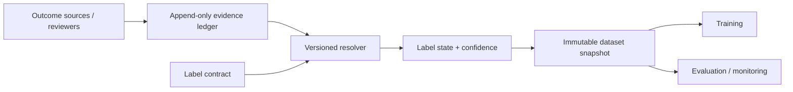
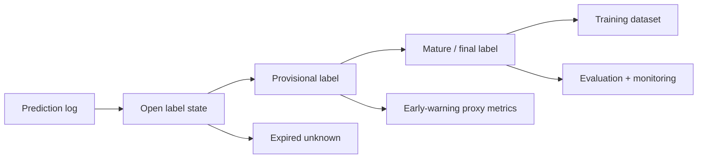
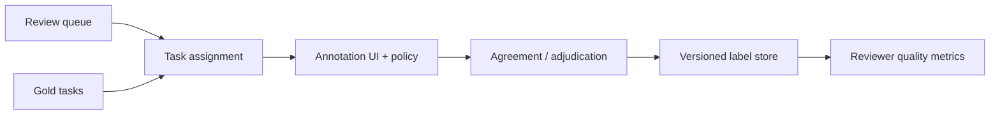

# Label and Ground-Truth Systems

## TL;DR

A label system publishes versioned claims about outcomes for training, evaluation, monitoring, experiments, and governance. Correctness depends on preserving decision context so delayed truth can be joined to the exact prediction, release, feature snapshot, exposure, policy, and action, while missing truth remains explicit. A bad join corrupts every downstream metric and model.

---

## Label Contract and Delayed Truth

A label is an interpretation of an outcome under a versioned definition, collected through a specific process, attached to a prior decision, and reused to judge future models. Each field carries identity, timing, policy, and provenance requirements.

A fraud transaction is not labeled fraudulent the moment the transaction occurs. It may be labeled after a chargeback, after a manual investigation, after a merchant dispute, or after a risk team's rule says the evidence is strong enough. A recommendation is not labeled positive merely because the user clicked; the click might be accidental, position-biased, or followed by immediate abandonment. A medical model may receive a diagnosis code months later, and the code itself may be incomplete because billing workflows shape what gets recorded. In each case the label is not an objective fact emitted by the universe. It is the output of a collection process with latency, bias, missingness, and policy embedded inside it.

The engineering implication is severe: **label quality bounds model quality**. Better model code cannot recover from a label pipeline that joins outcomes to the wrong prediction, silently drops hard cases, or changes the definition of the target halfway through a training window. This is the ML version of a database invariant: downstream correctness is impossible if the upstream ground truth is corrupt.

A useful test: if someone asks why `model_v42` had 8% lower recall than `model_v41` last month, can the platform reconstruct not just the predictions but the labels used to score them: their definitions, arrival times, sources, annotators or outcome events, and correction history? If not, the team has labels, but not a label system.

---

## The Label Is the Specification

In traditional software, the specification is explicit. You can read a requirement and write tests against it. In supervised ML, the label is the executable specification. If `Y = 1` means "fraud," then the model learns whatever the label-generation process calls fraud, not what the product team intended fraud to mean.

This creates a dangerous ambiguity: two models can optimize the same metric while solving different problems because their labels encode different definitions. A support-routing model trained on "ticket escalated" learns the organization's escalation behavior, not necessarily ticket difficulty. A hiring model trained on "historically hired" learns past hiring decisions, including their biases, not candidate quality. A recommender trained on "clicked" learns click propensity, not satisfaction. The model is faithful to the label; the label may be unfaithful to the business objective.

The most important artifact in a label system is therefore the **label definition contract**. It states exactly what the target means, what event or review process produces it, what observation window applies, what exclusions exist, and which version of the definition was active for each training row.

```yaml
label: transaction_fraud
version: v6
positive_definition: "confirmed unauthorized transaction"
negative_definition: "no dispute or chargeback after 90 days"
observation_window_days: 90
source_events:
  - chargeback_confirmed
  - manual_review_confirmed_fraud
exclusions:
  - test_transactions
  - transactions_reversed_before_settlement
owner: risk-data-platform
valid_from: 2026-01-01T00:00:00Z
```

The version matters because label definitions evolve. A fraud team may add a dispute reason; a marketplace may redefine a successful booking after cancellation rules change. A semantic change creates a new label contract. Corrections under the *same* contract supersede earlier evidence; a new contract changes the target and must not be silently mixed into an old evaluation.

---

## Event Plane, Resolution Plane, and Snapshot Plane

Label infrastructure has three ownership boundaries:

- The **event plane** ingests outcome and annotation evidence with source-specific idempotency keys. It preserves what the source asserted and when; it does not decide final truth.
- The **resolution plane** applies a versioned label contract to evidence, handles conflicts and retractions, and advances a label state machine.
- The **snapshot plane** materializes reproducible views for a declared knowledge cutoff, maturity rule, and label-contract version.



The separation preserves conflicting evidence. A chargeback event, its reversal, and an expert adjudication remain independently auditable even if the current resolved label is negative. Retraining can change the resolver without rewriting source history; a snapshot digest pins the resolver, source offsets, watermark, exclusion policy, and rows used by a model.

---

## The Prediction Log Is the Join Anchor

Every trustworthy label system starts with the prediction log. The label arrives later; the prediction context exists only now. If the system does not capture that context at decision time, it cannot be reconstructed later.

A minimal prediction record contains more than the score:

```yaml
prediction_id: 01J2F9K8...
timestamp: 2026-06-24T12:01:08Z
entity_id: txn_9821
subject_id: user_442
model: fraud_classifier
model_version: v42
feature_schema: fraud_features:v12
feature_refs:
  account_risk: account_17@2026-06-24T12:01:00Z
  device_velocity: device_91@2026-06-24T12:00:58Z
score: 0.973
threshold_policy: fraud_policy_v9
action: manual_review
experiment: fraud_model_rollout_2026q2:treatment
request_context:
  country: JP
  amount_bucket: high
```

The prediction ID is the primary key for all future truth. Labels should join to predictions through a stable decision identifier where possible, not through a fuzzy combination of `user_id` and time. Fuzzy joins are one of the most common ways label systems corrupt metrics: a later outcome is attached to the wrong prediction, duplicate predictions race to claim one outcome, or a single outcome labels multiple decisions.

The deeper reason the prediction log matters is that model quality is a property of *decisions under context*, not of entities in isolation. If a fraud model scored the same transaction twice under two different model versions, and only one score caused a manual review, the eventual label must be attributable to the right decision path. If a recommender showed an item in position 1 under one ranker and position 10 under another, the click label has different meaning in each context. The log is the only place where that context exists.

This is why prediction logging links label systems to [model monitoring](./04-model-monitoring.md), [online experiments](./08-online-experiments.md), [recommendation systems](./07-recommendation-systems.md), and [ML risk governance](./09-ml-risk-governance.md). They all need the same thing: a durable record of what the system believed, what it did, and under which version.

---

## Label Delay: The Truth Arrives After the Decision

Label delay is not an inconvenience; it determines the whole architecture. The moment a prediction is made, the system enters an **open-label interval**: the outcome is not yet known, but the decision has already affected the world.

Different domains have radically different delay profiles:

| Domain | Prediction | Label source | Typical delay | Monitoring consequence |
|---|---|---|---|---|
| Ads / recommendations | Show item | Click, dwell, conversion | Seconds to days | Fast but biased labels |
| Fraud authorization | Approve / review / block transaction | Chargeback, investigation | Days to 90+ days | Proxies required for early warning |
| Credit underwriting | Approve loan | Delinquency / default | Months to years | Long holdbacks and vintage analysis |
| Abuse detection | Allow / remove content | User report, moderator review | Minutes to weeks | Strong human-review pipeline needed |
| Healthcare | Risk prediction | Diagnosis / outcome | Weeks to years | Label incompleteness is structural |

The system consequence is a **label-maturation pipeline**. Predictions begin open, may accumulate provisional evidence, may be corrected, and may remain censored when observation ends before an outcome is known. Training and evaluation jobs declare the maturity rule they require. That rule should come from the empirical delay distribution and decision cost, not a round number copied from another product.



For positive-event maturity, define `F_+(d) = P(D \le d \mid Y=1, eventual observation)`, where `D` is observation delay. A window with `F_+(d)=0.9` has observed about 90% of eventually observed positives under that conditioning population; it says nothing by itself about positives that are never observable. Estimate delay, eventual-observation probability, and missingness by source, action, and slice. When outcomes remain right-censored, survival analysis, inverse-probability-of-censoring weights, or explicit bounds are more honest than coercing open cases to negative. Competing events (chargeback, refund, account closure) also need a contract because one event can preclude observation of another.

The failure mode is reading immature labels as final truth. A fraud canary after two hours has measured operational health and perhaps proxies, not mature fraud loss. Every metric should expose observation horizon, fraction mature, censoring rule, and knowledge cutoff.

---

## Negative Labels Are Harder Than Positive Labels

Positive labels often announce themselves: a click happens, a chargeback posts, a moderator confirms abuse. Negative labels are usually defined by the absence of a positive event over a window. That makes them more fragile.

A transaction is not non-fraudulent because no chargeback has appeared after one day. It is non-fraudulent because no chargeback appeared after the full dispute window, perhaps 90 days. A user did not dislike a recommendation merely because they did not click; they may not have seen it, may have been interrupted, or may have clicked a different acceptable item. An applicant who was not hired is not necessarily a bad candidate; they may never have been interviewed.

This creates a common training bug: **premature negatives**. The pipeline labels examples negative before the observation window closes, flooding training with false negatives. The model then learns that risky-but-slow-to-reveal examples are safe. In delayed-label domains, premature negatives are often worse than missing positives because they teach the model the opposite of truth with high confidence.

The defense is a label state machine:

```text
UNLABELED
  ├─ positive event observed before deadline → POSITIVE
  ├─ deadline passed with no positive event   → NEGATIVE
  └─ insufficient observation / data missing  → UNKNOWN
```

`UNKNOWN` is not the same as `NEGATIVE`, and `MATURE` need not mean immutable. The ledger carries at least four times: outcome event time, source observation time, ingestion time, and resolver effective time. A late reversal can supersede a mature label without erasing the snapshot used by an older model. Training may exclude open cases, model censoring, or consume a declared proxy; it must not silently coerce absence into zero.

---

## Selection Bias: You Only Label What You Chose to Observe

A label system does not observe the whole world. It observes the world after the model and product have already filtered it. This is the most important connection between labels and feedback loops.

A fraud model blocks high-risk transactions. Because the transaction never completes, the system may never observe whether it would have become a chargeback. The riskiest population becomes unlabeled precisely because the model intervened. A content moderation model removes content before users report it, so the label distribution of allowed content changes. A recommender logs clicks only for items it showed, so it has no direct label for items it suppressed. A loan model observes repayment only for applicants it approved; rejected applicants have no default outcome.

This is **selective labels**: labels are missing not at random, but because of the decision policy. Naively training on observed labels then reinforces the incumbent policy. The model learns from approved loans and knows nothing about rejected borrowers; learns from shown recommendations and knows nothing about hidden items; learns from allowed transactions and knows less about blocked ones.

Action and assignment propensities belong with every prediction because observed outcomes are conditional on policy. Randomized audit traffic can identify outcomes within the actions it is permitted to explore. When propensities are known and overlap holds, inverse-propensity or doubly robust estimators can correct some selection; extreme weights reveal that the data do not support the target policy. Human review creates adjudicated evidence but not necessarily the counterfactual outcome that would have followed an unchosen action. Where exploration is unsafe or impossible, report partial-identification bounds or the policy-specific estimand rather than claiming population truth.

This is the same reason [online experiments](./08-online-experiments.md) are load-bearing: they manufacture a counterfactual the ordinary logs cannot contain. A label system that ignores selection bias becomes a machine for validating yesterday's policy with yesterday's blind spots.

---

## Human Labeling Is a Measurement System

Human judgments are measurements made through policy, interface, training, incentives, language, and context. Reviewers are not independent replicas voting on an objective bit: their errors can be correlated because they share an ambiguous guideline, anchoring UI, vendor training, or cultural blind spot. Redundancy reduces idiosyncratic error only when the assignment and adjudication design create meaningful independence.

The basic architecture separates four roles:



The review queue chooses what needs human judgment. Task assignment balances load, expertise, language, conflict of interest, and privacy restrictions. The annotation UI presents the policy and captures the decision. Agreement and adjudication turn one or more human judgments into a label. Quality metrics monitor whether the reviewers themselves are drifting.

The key design choice is the **measurement policy**. It specifies reviewer qualifications, blinding, context shown, replication rate, disagreement handling, adjudicator authority, and whether the output is a hard class, distribution, or “insufficient evidence.” More votes cost more and may create false confidence if all reviewers share the same failure mode.

| Task type | Review policy | Why |
|---|---|---|
| Low-risk categorization | Single reviewer + sampling audit | Cheap throughput matters |
| Content safety borderline case | 2-of-3 majority + expert tie-break | Policy ambiguity is high |
| Regulated adverse decision | Expert review + persisted rationale | Contestability and audit required |
| Training-set cleanup | Redundant labels on a stratified sample | Estimate noise before scaling |

Gold tasks and expert-audited samples calibrate reviewer and workflow quality, but gold sets can leak, age, and encode the same policy bias as production labels. Rotate them, stratify by difficulty and slice, and keep some blind. Agreement statistics such as Cohen's kappa or Krippendorff's alpha describe consistency under particular prevalence and assumptions; they do not establish correctness or learnability by themselves.

Kappa is worth computing by hand once, because the naive alternative (raw percent agreement) systematically flatters the labeling process. Two reviewers label 200 items for "policy violation," where violations are rare:

```text
                    Reviewer B: yes   Reviewer B: no
Reviewer A: yes            12                8
Reviewer A: no              6              174

Raw agreement:      p_o = (12 + 174) / 200 = 0.93     ← looks excellent

Chance agreement:   A says yes 10% of the time, B says yes 9%.
                    p_e = (0.10 × 0.09) + (0.90 × 0.91) = 0.828

Cohen's kappa:      κ = (p_o − p_e) / (1 − p_e) = (0.93 − 0.828) / 0.172 ≈ 0.59
```

Ninety-three percent raw agreement becomes `κ ≈ 0.59` because the common negative class creates high chance agreement. Kappa also has a prevalence paradox: it can fall when observed agreement stays high, so universal cutoffs such as “0.8 means ready for automation” are not defensible. Report the confusion matrix, per-class agreement, uncertainty, adjudication rate, and performance on expert-audited cases. Disagreement concentrated in one policy boundary calls for policy or interface repair; diffuse reviewer-specific error calls for training or routing changes.

When more than two reviewers vote, Dawid–Skene-style aggregation can jointly estimate latent labels and reviewer confusion matrices under conditional-independence assumptions. It can fail when reviewers copy each other, item difficulty is unmodeled, or classes are weakly identified. Preserve per-reviewer events, assignment provenance, policy version, and adjudication separately from the resolved label so aggregation can evolve without destroying evidence. Treat posterior confidence as model output with calibration requirements, not as ground truth.

---

## Active Learning: Spend Labeling Budget Where It Buys Information

Labels are expensive, so a mature label system does not label randomly forever. It allocates human attention where the expected information gain is highest.

The simplest strategy is **uncertainty sampling**: send examples near the model's decision boundary to reviewers because those examples teach the model the most. If a classifier scores an example at 0.50, the label is more informative than an example scored 0.999. A second strategy is **disagreement sampling**: send examples where the champion and challenger models disagree, because those are exactly the cases deciding whether the new model is meaningfully different. A third is **slice-targeted labeling**: oversample segments where monitoring shows drift, sparse labels, or fairness risk.

Active learning changes the labeled population. Record the sampler version, candidate pool, inclusion probability where defined, model version that computed uncertainty, and capacity truncation. Reweighting is possible only when inclusion probabilities are known and nonzero; deterministic top-uncertainty sampling gives common examples zero support and cannot be made representative afterward. A separate probability sample provides a stable measurement population.

A good pattern is two streams:

```text
1. Random audit sample: small, unbiased, stable over time
   Purpose: monitoring, calibration, trend detection

2. Targeted active-learning sample: larger, adaptive, model-driven
   Purpose: improve the model where it is uncertain or weak
```

The random stream is the measuring stick. The active stream is the improvement engine. Conflating them is a category error: an adaptive sample is useful for learning but dangerous for measuring.

---

## Weak Labels, Proxy Labels, and Label Debt

Many production systems do not start with clean ground truth. They start with weak labels: heuristics, rules, user reports, distant supervision, search clicks, or labels produced by an older model. Weak labels are often the right bootstrap, but they create **label debt** when the team forgets that the target is approximate.

A weak label has three properties that must be explicit:

1. **Coverage**: which examples it labels.
2. **Precision**: how often positive weak labels are truly positive.
3. **Bias**: which regions of the input space it over- or under-represents.

For example, user reports are useful abuse labels but biased toward content seen by many users and toward categories users recognize as reportable. Clicks are useful recommendation labels but biased by position and presentation. A legacy rule can bootstrap fraud labels but encodes the exact blind spots the new model is supposed to exceed.

The system-design rule is: weak labels may enter training only with provenance and weight. A training row should know whether its label came from a human expert, a chargeback, a heuristic, a user report, or a model-generated pseudo-label. Mixing them into one untyped `label` column destroys the ability to debug why the model learned a behavior.

```yaml
label_value: 1
label_source: user_report
label_source_version: abuse_taxonomy:v4
confidence_weight: 0.65
created_at: 2026-06-18T09:12:00Z
adjudication_state: unreviewed
```

Weak labels are not bad; unlabeled weak labels are bad. The path to maturity is to use weak labels to focus human review, estimate their error on an audited sample, and gradually replace high-impact decisions with stronger labels where the cost is justified.

---

## The Label Store: Append-Only, Versioned, and Correctable

A label store should be designed like an audit log, not like a mutable dimension table. Labels change: disputes are reversed, moderators correct decisions, policies evolve, duplicate events are discovered, fraud investigations reopen. If the store overwrites the old value, it destroys the history needed to reproduce past training runs and explain past decisions.

The correct pattern is append-only label events with versioned materialized views:

```text
label_events
  label_event_id
  source_event_id / idempotency_key
  prediction_id
  label_name
  label_version
  value
  source
  confidence
  outcome_event_time
  source_observed_at
  ingested_at
  effective_at
  supersedes_event_id
  reason

current_labels_view
  latest non-superseded label per prediction_id, label_name, label_version

mature_labels_view
  labels whose observation window has closed and whose state is final
```

The time axes matter. `outcome_event_time` is when the real-world event occurred; `source_observed_at` is when its source recorded it; `ingested_at` is when the platform received it; `effective_at` is when the resolver allowed it to affect a view. A dataset with knowledge cutoff March 1 must not use an event first known on March 10 even if the outcome occurred in February. This bitemporal discipline is the label-side analogue of point-in-time correctness in [feature stores](./02-feature-stores.md).

Ingestion is at-least-once and idempotent by source event key. Watermarks express expected lateness, not permission to drop later truth: events after the watermark create a new snapshot revision and correction metrics. Corrections append superseding events. A training manifest records label contract, resolver digest, source partitions or offsets, knowledge cutoff, watermark, and resulting row-set digest, allowing both “truth as known then” and “best corrected truth now” evaluations.

---

## Joining Labels Back to Predictions

The label join is the most dangerous step because it looks like ordinary ETL and silently determines every metric. The join must answer: which prediction is this outcome evidence for?

There are three common join patterns:

| Pattern | Example | Risk |
|---|---|---|
| Direct decision ID | Chargeback references transaction scored by `prediction_id` | Best case; low ambiguity |
| Entity + time window | User churn label joins to last subscription-risk prediction before renewal | Window boundary errors |
| Exposure + outcome | Recommendation click joins to shown item and position | Position and visibility bias |

Direct IDs should be engineered wherever possible. If the product action creates an outcome later (transaction, moderation decision, application, impression), carry the decision or exposure ID into downstream event streams. The ID proves correlation, not causal attribution: a purchase after several recommendations may relate to multiple exposures, and a default outcome follows an approval policy as well as a score. The label contract must name the attribution rule and estimand.

When only entity-time joins are possible, the window must be part of the label definition contract. "User churned" may label the prediction made at subscription renewal, the last prediction before cancellation, or every weekly prediction in the 30 days before cancellation. These are different targets. An implicit window is a hidden label definition, and hidden definitions become unreproducible metrics.

The join is governed by invariants:

| Invariant | Evidence |
|---|---|
| Cardinality | Distribution of outcomes per prediction and predictions per outcome, with explicit allowed multiplicity |
| Completeness | Source totals reconciled to joined, quarantined, late, duplicate, and unmatched counts |
| Temporal validity | No row uses evidence after the snapshot knowledge cutoff |
| Action consistency | Resolved state accounts for allow, block, review, noncompliance, and unknown counterfactual |
| Contract consistency | Metric and dataset pin the same label definition and resolver version |

Ambiguous joins enter quarantine rather than being assigned by nearest timestamp. Quarantine volume is part of label quality and capacity; silently dropping it biases toward the easy-to-join population.

Most "mysterious" offline metric jumps are label-join changes in disguise.

---

## Label Quality Monitoring

If labels are data, they need data-quality monitoring. If labels are the specification, label monitoring is specification monitoring.

The useful monitors are operational and statistical:

| Signal | Catches |
|---|---|
| Label volume by source | Broken ingestion, vendor outage, missing event stream |
| Positive rate by time and slice | Policy changes, source drift, emerging attacks |
| Label delay distribution | Backlog, late source systems, review queue saturation |
| Unknown / expired-unknown rate | Observation gaps, selection bias, missing outcomes |
| Disagreement rate among reviewers | Ambiguous policy, reviewer drift, poor task design |
| Correction / supersession rate | Low initial label quality, unstable definitions |
| Label-source mix | Silent shift from strong labels to weak labels |
| Join failure rate | Broken correlation IDs, schema changes, ETL bugs |

The label delay distribution is especially important. If 90% of chargebacks normally arrive within 45 days and suddenly arrive within 70, then every 45-day fraud metric is now biased optimistic. If reviewer backlog grows from one day to seven, monitoring based on human labels now detects issues a week later than before. Label latency is part of the model-monitoring SLO because it determines how quickly truth can correct the system.

Alerting should follow the same discipline as model monitoring: page on broken ingestion for critical labels, route noisy distribution shifts to review, and tie severity to downstream impact. A label-source outage for a low-risk recommender may wait until business hours. A chargeback-feed outage for a fraud model is a production incident because it blinds monitoring, retraining, and governance simultaneously.

---

## Capacity Planning for Labeling Queues

Human labeling systems are queueing networks. If offered work exceeds effective service capacity, delay grows, monitoring becomes stale, and active-learning choices expire before review. Little's law relates long-run averages in a stable system:

```text
queue_size = arrival_rate × time_in_system
offered_load_erlangs = arrival_rate × average_handle_time
scheduled_reviewers ≈ offered_load / target_occupancy / (1 − shrinkage)
```

Suppose an abuse system receives 50,000 reviews/day uniformly and mean handle time is 45 seconds. Offered load is about 26 reviewer-erlangs. At 75% target occupancy and 20% shrinkage for breaks, training, QA, and meetings, the mean-load staffing floor is `26 / 0.75 / 0.8 ≈ 44` scheduled reviewers. That is not a tail-SLA answer: arrivals vary by hour, handle times are heavy-tailed, skills and languages partition capacity, and escalations revisit work. Use an Erlang-C or simulation model on interval-level arrival and service distributions, then validate against queue-age percentiles.

As utilization approaches one, waiting time becomes highly sensitive to variability. Priority queues can protect urgent work but starve low-priority random audits, destroying the unbiased measurement stream. Reserve capacity by class, age work into escalation, and apply backpressure to active-learning producers before they consume the audit budget.

The operational SLO should be stated as label freshness:

```text
95% of high-priority abuse labels finalized within 4 hours
99% of fraud manual-review labels finalized within 24 hours
weekly random-audit sample completed within 7 days
```

Once labels are treated as an SLO-backed service, the design choices become clear: priority queues for high-risk items, backpressure when active-learning sampling exceeds review capacity, reviewer specialization for difficult slices, and overflow vendors only when their quality is measured against gold tasks.

---

## Privacy, Security, and Governance of Labels

Labels can reveal allegations, diagnoses, policy violations, defaults, or protected characteristics and may be more sensitive than the features being labeled. Separate subject identity from task content, issue purpose-scoped reviewer tokens, redact fields not needed for judgment, and keep export privileges narrower than review privileges. Every read, assignment, vote, adjudication, and correction is attributable; vendor boundaries, reviewer geography, and conflict-of-interest routing are part of task assignment.

Append-only history does not imply infinite raw-data retention. Retain source evidence, pseudonymous ledger entries, and aggregate quality records under distinct policies; encrypt them with separable keys so identity access can be revoked without destroying permitted aggregate evidence. Lineage supports deletion and objection impact analysis across labels, snapshots, caches, and trained artifacts, while legal holds and audit requirements remain explicit constraints rather than accidental permanent storage.

For high-risk decisions, an appeal creates new adjudication evidence linked to the original decision and label events. The resolver may supersede the current label; new evaluation snapshots quantify the change; forward lineage identifies models and similar cases requiring review. The original record remains intact. This prevents both relearning an overturned judgment and rewriting history as if the initial decision never occurred.

---

## Failure Modes

The characteristic failures of label systems recur across organizations, and naming them is half of preventing them.

**Premature negatives** occur when examples are labeled negative before the observation window closes. A transaction with no chargeback after one day is treated as non-fraud even though the dispute window is 90 days. The defense is an explicit label state machine with `UNKNOWN` distinct from `NEGATIVE`, and maturity windows enforced by the training pipeline.

**Wrong prediction join** attaches an outcome to the wrong decision, often through fuzzy entity-time joins or missing correlation IDs. Offline metrics jump or collapse for no model reason. The defense is to carry `prediction_id` or exposure ID through downstream events and monitor join uniqueness and failure rates.

**Definition drift** changes what the label means without versioning it. A policy team updates the fraud or abuse definition, and new labels become incomparable with old labels. The defense is versioned label contracts and append-only history; semantic changes create new versions.

**Selective-label bias** trains only on outcomes the current policy allowed the system to observe. Rejected loans, blocked transactions, hidden recommendations, and removed content have missing counterfactual outcomes. The defense is exploration, audit samples, human review, and explicit modeling of missingness.

**Reviewer drift** happens when human annotators gradually apply policy differently, often after a guideline update or workforce change. The defense is gold tasks, inter-annotator agreement monitoring, adjudication, and periodic recalibration.

**Weak-label laundering** occurs when heuristic, user-report, or pseudo-label sources are mixed into training as if they were strong ground truth. The model learns the heuristic's bias and the team mistakes it for reality. The defense is source provenance, confidence weights, and audited estimates of weak-label error.

**Mutable label history** overwrites old labels and destroys reproducibility. A model cannot be reevaluated against the truth state that existed when it was trained. The defense is append-only label events with supersession, plus versioned materialized views for current and mature labels.

**Label-pipeline outage disguised as model improvement** happens when positive labels stop arriving, making precision or loss appear better. The defense is label volume, source mix, and delay monitoring that gates interpretation of quality metrics.

**Watermark truncation** drops outcomes that arrive after the expected-lateness boundary, making older cohorts look cleaner and faster sources look more negative. Watermarks close a snapshot revision, not truth ingestion; late events append corrections and update delay models.

**Correlated reviewer error** produces high agreement because reviewers share the same ambiguous policy or anchoring interface. More votes reinforce the error. Blind replication, independent expert audits, slice-level confusion matrices, and policy experiments test validity rather than agreement alone.

**Resolver drift** changes aggregation code while keeping the label version fixed. Source events are stable but resolved labels and metrics move. Resolver digests belong in snapshots, and semantic changes require either a new contract or an explicitly versioned backfill.

**Quarantine bias** discards ambiguous joins and malformed evidence, leaving an easy, systematically different training population. Reconcile every source event to resolved, open, duplicate, late, or quarantined state and monitor each by slice.

---

## Decision Framework

Start from the target and observation process, then choose storage and review mechanics:

| Property of truth | Design consequence |
|---|---|
| Positive event arrives quickly; absence defines negative | Explicit deadline, open/censored state, empirical delay monitoring |
| Outcome depends on action taken | Log policy and propensity; define policy-specific estimand or bounded exploration |
| Several sources can conflict or retract | Preserve evidence ledger; version resolver and adjudication precedence |
| Human policy judgment is central | Calibrated reviewers, blind replication, expert audit, `INSUFFICIENT` state |
| Labels are weak but broad | Source-specific error estimates, confidence calibration, strong-label audit sample |
| Outcomes map ambiguously to decisions | Product-carried correlation IDs; quarantine and explicit attribution contract |
| High correction or legal sensitivity | Bitemporal ledger, reproducible snapshots, restricted evidence vault, forward lineage |

Choose maturity from the cost of false positives and false negatives plus the delay distribution. A training snapshot may favor coverage with provisional weights, while a promotion gate uses only mature evidence; they must not share an unlabeled `label` column that hides this difference. Choose the random audit stream before active-learning capacity so adaptive sampling cannot consume the measuring instrument.

The trust boundary is the snapshot manifest. It pins the label contract and resolver, knowledge cutoff, source offsets, watermark, sampling policies, exclusions, and row digest. Monitoring reconciles every source event into resolved, open, duplicate, late, or quarantined state. Capacity is sized to the label-freshness objective by skill and priority, including QA and adjudication. If these contracts are unavailable, downstream evaluation should report `INSUFFICIENT_LABEL_EVIDENCE` rather than a precise but unauditable metric.

---

## Key Takeaways

1. Labels are not a column; they are delayed, policy-shaped claims about reality, produced by a system with latency, bias, missingness, and corrections.
2. The label is the supervised model's specification. If the label definition is vague or unstable, the model faithfully learns the wrong target.
3. The prediction log is the join anchor: capture model version, feature references, action, policy, experiment, and context at decision time or it cannot be reconstructed later.
4. Label delay determines architecture. Metrics need observation horizon, maturity fraction, censoring rule, and knowledge cutoff, not just a label value.
5. Negative labels are harder than positives because they often mean "no positive event by the deadline"; premature negatives are a major source of silent training corruption.
6. Selective labels create feedback-loop bias: the system observes outcomes under actions its policy took. Randomized or otherwise identified exploration can create supported counterfactual evidence; human review adds adjudicated evidence or proxy labels, not the unchosen action's realized outcome.
7. Human labeling is a measurement system with correlated error. Agreement is not correctness; preserve individual evidence, use independent audits, and model ambiguity explicitly.
8. Active learning should be paired with an unbiased random audit stream; adaptive samples improve models but are dangerous measuring sticks.
9. Weak labels are useful only when their source, coverage, confidence, and bias are recorded. Mixing weak and strong labels into one untyped column creates label debt.
10. The evidence ledger should be append-only and bitemporal; reproducible snapshots pin resolver code, source offsets, watermark, cutoff, and row digest.
11. Label quality needs monitoring: volume, positive rate, delay, unknown rate, source mix, reviewer disagreement, corrections, and join failures.
12. Little's law sizes average work, not tail freshness; interval variability, skills, shrinkage, adjudication, and reserved audit capacity determine staffing.

---

## References

1. [Hidden Technical Debt in Machine Learning Systems](https://proceedings.neurips.cc/paper_files/paper/2015/file/86df7dcfd896fcaf2674f757a2463eba-Paper.pdf): Sculley et al., 2015
2. [Data Cascades in High-Stakes AI](https://research.google/pubs/data-cascades-in-high-stakes-ai/): Sambasivan et al., CHI 2021
3. [Datasheets for Datasets](https://arxiv.org/abs/1803.09010): Gebru et al., 2018
4. [Model Cards for Model Reporting](https://arxiv.org/abs/1810.03993): Mitchell et al., 2019
5. [Snorkel: Rapid Training Data Creation with Weak Supervision](https://arxiv.org/abs/1711.10160): Ratner et al., VLDB 2017
6. [Learning from Delayed Outcomes via Proxies with Applications to Recommender Systems](https://arxiv.org/abs/2010.08942): delayed feedback and proxy-label framing
7. [Selective Labels and Deferential Fairness](https://arxiv.org/abs/1809.05699): selective labels in high-stakes decision systems
8. [Trustworthy Online Controlled Experiments](https://www.cambridge.org/core/books/trustworthy-online-controlled-experiments/6A3B263E7114E81B95669A95B219C1D8): Kohavi, Tang & Xu, 2020
9. [Maximum Likelihood Estimation of Observer Error-Rates Using the EM Algorithm](https://www.jstor.org/stable/2346806): Dawid & Skene, 1979
10. [Survival Analysis: A Self-Learning Text](https://link.springer.com/book/10.1007/978-1-4419-6646-9): Kleinbaum & Klein; censoring foundations
