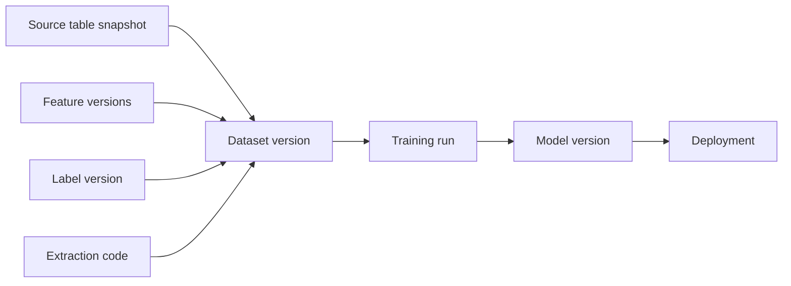
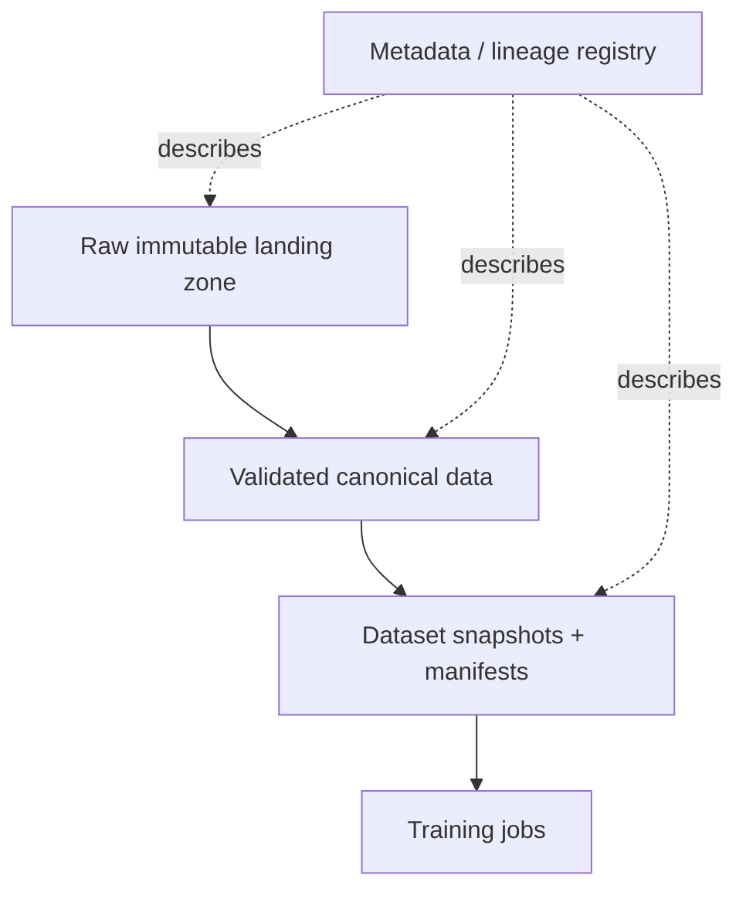

# Dataset Management and Versioning

## TL;DR

A dataset is a versioned, reproducible claim about a population, not a file. Each training release must pin source versions, extraction time, feature and label definitions, observation windows, split assignment, privacy state, and content identity. Immutability, point-in-time reconstruction, lineage, deletion, and semantic-change detection determine whether the model can be explained or rebuilt.

---

## Why Dataset Management Is the Root of ML Reproducibility

Traditional software can usually be rebuilt from source code, dependencies, and compiler settings. ML cannot. The source code is only a recipe; the dataset is one of the ingredients, and often the dominant one. Change the dataset while holding code fixed and the learned behavior changes. That means dataset versioning is not a convenience for data scientists. It is a reliability primitive.

The failure mode is familiar. A team trains a model in March and deploys it. In June, quality regresses. Someone tries to reproduce the March model to compare behavior, but the warehouse tables have been backfilled, late events have arrived, deleted rows are gone, a label policy changed, and a feature definition was updated in place. The query still runs, but it no longer returns the dataset the March model saw. The team can rebuild *a* model, but not *the* model. Rollback, audit, and debugging are now guesswork.

Treat every training dataset as a release artifact with identity, ownership, lineage, retention, and compatibility rules. A model without a dataset contract may run, but it cannot be explained.

---

## Dataset Identity: What Exactly Are You Versioning?

A dataset version must identify more than a storage path. A path like `s3://bucket/train/2026-06` is only a location. It does not state what logical data is represented, which code produced it, which label definition was used, whether late events were included, or whether two readers will see the same bytes tomorrow.

A production dataset version should record at least:

```yaml
dataset: fraud_training_set
version: 2026-06-24.3
purpose: train
created_at: 2026-06-24T03:12:00Z
sources:
  transactions: { table: warehouse.transactions, snapshot: 881204 }
  chargebacks:  { table: warehouse.chargebacks, snapshot: 881198 }
features:
  - account_risk:v12
  - device_velocity:v7
labels:
  name: transaction_fraud
  version: v6
  observation_window_days: 90
extraction_code:
  repo: org/ml-pipelines
  commit: 441c720
split_policy:
  type: time_based
  train_until: 2026-04-01T00:00:00Z
  validation_until: 2026-05-01T00:00:00Z
content_hash: sha256:9f86d08...
row_count: 128941337
schema_hash: sha256:44aa91...
owner: fraud-ml
retention_until: 2031-06-24
```

The identity has three layers. **Logical identity** says what the dataset means: target, population, time range, label definition. **Provenance identity** says what produced it: source snapshots, code commit, feature versions. **Physical identity** says what bytes were materialized: content hash, schema hash, storage location. All three are necessary. Logical identity without physical immutability is a promise. Physical bytes without logical meaning are a pile of Parquet files.

There is also a distinction between a **dataset definition** and a **dataset realization**. `fraud_training_set:v6` can name the governed recipe and contract; `fraud_training_set:v6@sha256:ccc...` names one execution over particular source snapshots. Definitions evolve deliberately. Realizations are immutable. Conflating them makes either every daily build look like a semantic version change or, worse, makes a semantic change hide behind the same daily name.

---

## Snapshots, Not Queries

The most common reproducibility mistake is treating a SQL query as a dataset version. A query is not a snapshot. It is a program that returns whatever the underlying tables mean when it runs.

```sql
SELECT *
FROM transactions t
JOIN chargebacks c USING (transaction_id)
WHERE t.created_at >= '2026-01-01'
```

This query is mutable even if the text never changes. Late events arrive. Backfills rewrite history. Chargeback status changes. Rows are deleted for privacy. Source schemas add enum values. The query is stable; the result is not.

The fix is snapshotting: bind every source read to an immutable version. Warehouses and lakehouse table formats offer different mechanisms (BigQuery snapshots, Snowflake time travel, Iceberg/Delta/Hudi table versions, object-store manifests), but the invariant is the same: the training dataset must be a function of immutable inputs.

```text
dataset_snapshot = extraction_code(commit)
                 + source_table_versions
                 + feature_versions
                 + label_version
                 + split_policy
```

If any term is unpinned, reproducibility is broken. `latest` is the enemy. `current_features` is the enemy. `main` is the enemy. The dataset contract must name exact versions, not moving aliases.

### How Time Travel Actually Works, and When It Silently Stops

Lakehouse table formats make creation of a snapshot metadata-efficient, and understanding the mechanism explains both why the commit is cheap and where long-term retention becomes costly. An Iceberg table is a tree of immutable metadata: a table pointer names a metadata file, which lists *snapshots*; each snapshot points to a manifest list; each manifest names data files with statistics. A commit writes new data files and a new metadata tree: it does not modify the older data-file set in place:

```text
table pointer → metadata.json
                 ├─ snapshot 881198  → manifest-list → [file1, file2, ...]
                 ├─ snapshot 881204  → manifest-list → [file1, file3, ...]   (file2 replaced)
                 └─ snapshot 881219  → manifest-list → [...]
```

Reading an old snapshot is just reading an old tree, which is why pinning `snapshot: 881204` in the dataset contract costs nothing at write time:

```sql
-- Iceberg (Spark SQL)
SELECT * FROM warehouse.transactions VERSION AS OF 881204;
SELECT * FROM warehouse.transactions TIMESTAMP AS OF '2026-06-24 03:00:00';

-- Delta Lake
SELECT * FROM transactions VERSION AS OF 812;
DESCRIBE HISTORY transactions;   -- maps versions to commits, jobs, and operations

-- Snowflake
SELECT * FROM transactions AT (TIMESTAMP => '2026-06-24 03:00:00'::timestamp_tz);
```

The trap is that **time travel has a garbage collector, and its retention horizon may be shorter than the model's lifetime.** Delta `VACUUM`, Iceberg snapshot expiration, and warehouse retention policies can all make an old version unreadable after its unreferenced files are removed. Recording `VERSION AS OF 812` is therefore only a durable promise if the retention controller knows that version is a root. Dataset management must either (a) create a retained table reference or otherwise exempt training-consumed snapshots from expiry, or (b) materialize the training view into its own content-addressed manifest and allow the source table's short operational history to expire. The choice is workload-specific: retaining source snapshots preserves cheap relational time travel, while materializing a view isolates retention and access policy at the cost of another physical copy.

Git-style tools occupy the same design space with different mechanics: **DVC** stores content-hashed data objects in a remote and commits small `.dvc` pointer files to git, so `git checkout && dvc checkout` restores the exact bytes while the referenced objects remain retained; **lakeFS** puts git semantics (branches, commits, merges) over an object-store namespace, so a training job can run against a commit ID and a backfill can be staged on a branch and reviewed before merge. The mechanism differs from Iceberg's, but the invariant is identical: dataset identity is a retained immutable reference, not a mutable path.

---

## Immutability and the Backfill Trap

Backfills are necessary. They correct bugs, load late data, and repair historical gaps. They are also dangerous because they rewrite the apparent past.

Suppose a feature pipeline undercounted failed logins for two weeks. A data engineer fixes the bug and backfills the feature table. Future training should use corrected values. But a model trained last month used the incorrect values because those were what production actually served. If the backfill overwrites history in place, the platform loses the ability to reconstruct the model's real training data and the served-time world it corresponded to.

The correct pattern is **append correction, do not overwrite meaning**:

```text
feature_values_v7_original
  account_id, feature_time, value, observed_at

feature_values_v7_correction_2026_06_24
  account_id, feature_time, corrected_value, observed_at, correction_reason

feature_values_v8
  new canonical definition after correction
```

For training, the pipeline must choose which truth it wants. To reproduce a historical model, use the view as it existed then. To train a new model after the bug fix, use the corrected version or a new feature version. Both are legitimate; conflating them is not.

This mirrors database temporal modeling. There is **valid time**, when a fact was true in the domain, and **transaction time**, when the system learned or stored it. ML datasets often need both. A label may be valid for a transaction in January but observed in March. A feature may describe an event at 10:00 but become available at 10:10. Reproducible datasets must respect what was available to the model at the time of decision or training.

---

## Split Reproducibility: The Hidden Source of Metric Drift

Train/validation/test splits are part of the dataset version. If they are not pinned, offline metrics are not comparable.

Random splits are common because they are easy, but random without a recorded seed and assignment table is not reproducible. Worse, random row splits are often semantically wrong. A future-prediction model should use time-based splits. A model that must generalize to new users, merchants, documents, or patients should use entity-disjoint splits. A recommender may need user-level splits to prevent interactions from the same user leaking across train and test.

| Split type | Correct when | Leakage it prevents |
|---|---|---|
| Random row | IID examples, no temporal or entity dependency | Minimal; often too weak |
| Time-based | Predicting future behavior | Training on the future |
| Entity-disjoint | Generalizing to unseen entities | Memorizing entity history |
| Group / cluster | Examples within group are correlated | Cross-group contamination |
| Policy-era split | Evaluating under new serving policy | Old policy logs contaminating new-policy readout |

A split should be materialized as assignment, not recomputed ad hoc:

```text
split_assignments
  example_id
  dataset_version
  split: train | validation | test | holdback
  assignment_reason
  assignment_seed
```

This seems bureaucratic until a metric changes because someone reran the split with a different seed. If the validation set is part of the measurement instrument, changing it changes the instrument. Treat it accordingly.

For entity-disjoint splits, the strongest implementation is *stateless hashing* rather than a seeded shuffle, because it stays stable as the dataset grows: an entity keeps its assignment forever, even across dataset versions, without storing or coordinating anything:

```python
import hashlib

def split_of(entity_id: str, salt: str = "fraud_v6") -> str:
    h = int(hashlib.sha256(f"{salt}:{entity_id}".encode()).hexdigest(), 16) % 100
    if h < 80:  return "train"
    if h < 90:  return "validation"
    return "test"
```

The salt plays the same role as an experiment salt in [online experiments](./08-online-experiments.md): changing it re-shuffles the population, so it is part of the dataset contract and must never change silently. A seeded `random.shuffle` can change assignment when rows are inserted or an implementation changes its random stream. A hash is stable only if the contract also pins canonical identifier encoding, hash algorithm, salt, modulus, and bucket boundaries; different Unicode normalization or integer serialization can otherwise split the same entity differently across languages. The materialized `split_assignments` table is still worth writing (it is what auditors and debuggers read), but with a fully specified hash it becomes a *record* of assignments rather than the *source* of them, and the two can be cross-checked.

---

## Dataset Manifests: Content Addressing for ML Data

A large dataset is usually many files or partitions. The dataset version should be represented by a manifest: a list of immutable objects and their hashes.

```text
manifest fraud_training_set@2026-06-24.3
  part-00001.parquet sha256:aaa... rows=1048576 bytes=88MB
  part-00002.parquet sha256:bbb... rows=1048576 bytes=91MB
  ...
manifest_hash sha256:ccc...
```

The manifest gives three properties:

1. **Reproducible reads**: a training job reads the files named in the manifest, not whatever files happen to match a prefix.
2. **Integrity checking**: corrupted or replaced files are detected by hash mismatch.
3. **Cacheability**: pipeline steps can key on manifest hash, not path or timestamp.

Content addressing also prevents a subtle cache bug. If a dataset path is reused for new contents, a pipeline cache keyed on path may return stale features or stale evaluation results. If the key includes the manifest hash, new bytes create a new cache key automatically.

---

## Schema Is Not Semantics

Dataset validation usually starts with schema checks: required columns, types, nullability. These are necessary and insufficient. Most dangerous dataset changes are schema-compatible semantic changes.

Examples:

- `amount` changes from dollars to cents.
- `country` switches from billing country to IP-derived country.
- `active_user` changes from 7-day active to 30-day active.
- `label=1` changes from confirmed fraud to suspected fraud.
- rows now include test accounts that were previously excluded.

Every one of these can pass type checks. A dataset contract therefore needs **semantic validation**: distribution checks, known invariants, source-population counts, and owner-reviewed definition changes.

```yaml
expectations:
  amount:
    min: 0
    p99_max_change_vs_baseline: 0.25
    unit: USD_cents
  country:
    allowed_values_source: iso_3166
    max_unknown_rate: 0.001
  population:
    exclude_test_accounts: true
    expected_daily_volume_change: [-0.20, 0.20]
```

The unit field is not decorative. It is a semantic assertion. The system cannot prove every semantic property, but it can force the team to state the ones that matter and alert when observable proxies move.

Schema evolution also needs stable field identity. Renaming a Parquet column can look like “drop `merchant_id`, add `seller_id`” to a name-based reader even if the logical field is unchanged; reusing a removed field name can make old readers interpret a new meaning as the old one. Table formats that assign field IDs can preserve a rename without positional confusion, but IDs cannot decide whether the meaning is compatible. The dataset contract must classify changes:

| Change | Compatibility judgment | Safe publication behavior |
|---|---|---|
| Add optional field with defined default | Often backward compatible | Minor definition revision; old consumers continue |
| Rename while preserving field identity and meaning | Reader/tool dependent | Validate all readers against the field-ID mapping |
| Change unit, population, label, or observation window | Semantically breaking | New dataset definition; do not move old aliases silently |
| Narrow type or introduce new enum behavior | Potentially breaking | Shadow-read representative consumers before publish |
| Delete or redact subjects | Deliberate loss of historical equivalence | Record redaction generation and affected descendants |

Compatibility is a relation between producer and consumer contracts, not a property of the schema alone. Publication should therefore evaluate registered consumers or declared compatibility ranges. “The table accepted the write” proves storage validity; it says nothing about whether a trainer, evaluator, or audit reader will preserve meaning.

---

## Dataset Lineage: Provenance and Impact

Dataset lineage answers two questions:

1. **Provenance**: what produced this dataset?
2. **Impact**: what depends on this dataset or source?

Provenance is needed for debugging and audit. Impact is needed during incidents. If a source table double-counted transactions for a week, the platform must answer which datasets included that source version, which models trained on those datasets, and which deployments served those models.



The lineage store can begin as relational tables. A graph database is rarely necessary at first. What matters is that every edge is written automatically by the pipeline, not manually in a wiki. Manual lineage is stale lineage.

---

## Privacy Deletion and the Reproducibility Conflict

Dataset retention collides with privacy. Reproducibility says keep immutable snapshots. Privacy law may require deleting or anonymizing a subject's data. This is not a documentation problem; it is a system-design trade-off.

There are three common approaches:

**Hard deletion** removes records from retained datasets. This satisfies deletion strongly but breaks bit-for-bit reproducibility. The platform must record that older models can no longer be exactly rebuilt.

**Tombstoning with rebuild** marks deleted subjects and excludes them from future materialized views. Historical manifests remain encrypted or access-restricted until retention expires. This preserves audit under strict access but may not satisfy all deletion requirements.

**Aggregated or anonymized retention** stores derived statistics or irreversibly anonymized rows for reproducibility of aggregate behavior, while deleting direct identifiers. This reduces privacy risk but may not support exact retraining.

The important property is honesty. A registry should record whether a dataset is **rebuildable**, **retained**, **privacy-redacted**, or **expired**. A rollback plan that depends on an expired dataset is not a plan.

Deletion is a lineage workflow, not a one-table mutation. A subject lookup or privacy index maps the deletion key to raw objects, canonical records, materialized datasets, feature values, evaluation sets, caches, and prediction logs. Each descendant records one of four outcomes: physically deleted, cryptographically erased by destroying an object-specific key, irreversibly anonymized under an approved policy, or retained under a documented legal basis. The deletion coordinator is idempotent and records a monotonically increasing **redaction generation** so a restored backup cannot silently resurrect an older generation.

Models create the hardest boundary: deleting a row from storage does not remove its influence from already learned weights. The governance policy must say when affected models may continue serving, when retraining is required, and what evidence closes the request. This is a legal and risk decision, not something the storage layer can infer. The registry chapter describes how retained models and their transitive inputs become lifecycle roots: [Model Registry and ML Metadata](./13-model-registry-metadata.md).

---

## Dataset Storage Architecture

A practical dataset platform has four stores:



**Raw immutable landing** preserves what arrived from sources. It is append-only and used for replay.

**Canonical validated data** applies parsing, deduplication, schema normalization, and quality gates.

**Dataset snapshots** are purpose-built training/evaluation datasets with manifests, split assignments, and label/feature versions.

**Metadata registry** records ownership, lineage, quality reports, retention, and usage.

The anti-pattern is training directly from mutable production tables. It is fast for the first model and expensive forever after, because every future debugging session must reverse-engineer what the data meant at training time.

---

## Publication Protocol: A Dataset Version Is a Transaction

Materializing files is not the same as publishing a dataset. A distributed job may write thousands of partitions, retry some tasks, speculate duplicate tasks, or die after writing 99% of the output. If consumers discover data by listing a prefix, they can observe a mixture of attempts and treat a partial write as a complete version. The dataset platform therefore needs a commit protocol analogous to a database transaction:

1. Allocate an immutable candidate ID and write into a private staging namespace.
2. Write each object with an attempt-independent content key; verify its checksum after upload.
3. Build the manifest from successful task commits, rejecting duplicate partition ownership and schema disagreement.
4. Run dataset-level gates: expected partitions, row counts, uniqueness, label coverage, distribution checks, privacy policy, and split invariants.
5. Persist lineage and the complete quality report alongside the manifest.
6. Atomically create the published-version record that points to the manifest hash.
7. Only after publication may aliases such as `candidate` or `latest-approved` move to the new immutable version.

```text
STAGING ──validate──▶ SEALED ──register lineage──▶ PUBLISHED ──approval──▶ ELIGIBLE
   │                    │                              │
   └── failed/expired ──┴──────────────▶ GARBAGE-COLLECTABLE
```

The only atomic operation required is small: a conditional insert or compare-and-swap of the metadata record. Petabytes of files can be written non-transactionally because none are visible as a dataset until that record commits. Readers resolve the version to one manifest and never list a mutable directory. If two builders race for the same logical version, only one metadata commit wins; the loser becomes an unreferenced candidate that the janitor can remove after a safety window.

The metadata store owns the public state; workers own only staged objects. That ownership boundary resolves retry ambiguity. A builder that times out after submitting the publish transaction must query by idempotency key and manifest hash before retrying. It must never assume “timeout means failure” and publish a second logical version. Readers similarly pin the returned manifest hash for the lifetime of a job so an alias move cannot create a mixed read halfway through training.

| State | Owner | Consumer visibility | Recovery rule |
|---|---|---|---|
| `STAGING` | build attempt | none | retry tasks; expire abandoned attempts after a safety window |
| `SEALED` | manifest builder | explicit candidate readers only | checksums and partition ownership are immutable |
| `PUBLISHED` | metadata transaction | immutable-version readers | publication is idempotent by manifest hash and request ID |
| `ELIGIBLE` | policy/approval service | moving aliases may target it | approval revocation creates a new state event; history remains |
| `REDACTED` / `EXPIRED` | retention controller | resolution fails with a typed reason | never fall through to a similarly named newer version |

Typed resolution failures matter. `NOT_FOUND`, `REDACTED`, `EXPIRED`, `CORRUPT`, and `ACCESS_DENIED` imply different incident and governance paths; flattening them into “file missing” makes a privacy action look like storage loss and invites unsafe reconstruction attempts.

Garbage collection is a reachability problem, not an age query. Start from retained model versions, evaluation reports, legal holds, rollback policies, active experiments, and dataset aliases; traverse lineage to manifests and source snapshots; delete only objects not reachable from any retained root. “Delete every object older than 90 days” will eventually delete the only reconstructable input of a still-serving model. Conversely, “keep everything” creates unbounded cost and privacy exposure. Reachability plus explicit retention class makes the trade-off reviewable.

## Trust Boundaries and Supply-Chain Controls

Training data is executable influence over a model. An attacker or buggy upstream producer may not need access to model code if they can inject mislabeled examples, poison a high-leverage slice, replace a manifest object, or move a source pointer. Dataset security therefore protects both confidentiality and integrity.

Separate identities should write source data, build candidates, approve governed datasets, and consume restricted snapshots. Builders receive read access to exact source versions and write access only to their staging prefix; the publication service alone creates the public version record. Manifests and quality reports are hash-linked, and high-risk datasets can be signed or attested by the build identity so a trainer can verify both bytes and producer. Secrets and direct identifiers do not belong in the general metadata graph; store opaque references and enforce column-, row-, or purpose-level access at resolution time.

Integrity monitoring looks for provenance changes as well as distributions: unexpected writer identity, source snapshot outside the approved branch, a sudden rise in one contributor's rows, duplicate clusters, labeler concentration, and changes to exclusion rules. These signals do not prove poisoning, but they narrow causality before the contaminated dataset produces many descendants. Quarantine blocks alias movement while retaining the candidate and evidence for investigation.

## Dataset Observability and Service Levels

A dataset platform has consumers and therefore needs service levels. Useful signals cover three different moments:

- **Build health:** source watermark, partition completion, retry rate, bytes and rows processed, quality-gate failures, and time spent in each stage.
- **Published artifact health:** manifest integrity, schema and semantic-contract status, split sizes, label coverage, class balance, duplicate/entity leakage, and lineage completeness.
- **Consumption health:** time-to-first-byte, read throughput, missing/corrupt objects, cache hit rate, consumers per version, and failures to reconstruct a registered run.

Freshness by itself is dangerous. A fresh but semantically broken dataset should not meet the SLO. Define *usable freshness*: the age of the newest snapshot that has passed every required quality and governance gate. Track publication lag from source event time separately from compute duration so responders can distinguish “upstream truth is late” from “our materialization is slow.” Periodically choose retained models and perform a dry reconstruction through dataset resolution, checksum validation, split loading, and a small training smoke test. That is the dataset equivalent of restoring a backup: the registry saying a snapshot exists is weaker evidence than successfully reading it.

---

## Failure Modes

**Query-as-version** is the root reproducibility failure: the team stores SQL text but not immutable source snapshots or output manifests. Rerunning the query returns a different dataset. Defense: snapshot source versions and materialize content-addressed manifests.

**Backfill rewrites history** occurs when corrected data overwrites what older models actually saw. Defense: append corrections, version semantic changes, and preserve transaction-time history.

**Split drift** happens when validation/test membership changes between runs, making metric comparisons meaningless. Defense: materialized split assignments with seeds and policies recorded.

**Schema-compatible semantic drift** changes units, definitions, populations, or label meaning while types stay valid. Defense: semantic contracts, distribution checks, and owner-reviewed version changes.

**Lineage gaps** leave the team unable to answer which models used a corrupted source. Defense: automatic pipeline-written lineage edges from sources to datasets to training runs to models.

**Privacy deletion breaks rollback** when a retained model depends on a dataset that can no longer be reconstructed. Defense: dataset state tracking (retained, redacted, expired) and rollback validation that checks data availability.

**Manifest/path mismatch** occurs when files under a path change but the dataset version name does not. Defense: content hashes and manifest hashes as the actual identity.

**Ambiguous publish retry** creates two versions or moves an alias twice when a builder times out after a successful commit. Defense: idempotency keys, manifest-hash uniqueness, and read-after-timeout reconciliation against the metadata authority.

**Snapshot garbage collection outruns model retention** leaves a registry pointer whose source files have expired. Defense: make retained models roots in reachability analysis or materialize an independently retained manifest.

**Cross-language split skew** sends the same entity to different splits because identifier encoding or normalization differs. Defense: specify canonical bytes and publish conformance vectors for every split implementation.

**Deletion resurrection** restores a backup or cache that predates a privacy deletion. Defense: monotonic redaction generations and restore-time reconciliation before data becomes readable.

**Poisoned but schema-valid input** passes types and range checks while a compromised source changes labels or population. Defense: writer provenance, contribution and duplicate analysis, signed manifests, quarantine, and separation of build from approval.

---

## Decision Framework

Choose the physical versioning mechanism from the lifetime and reconstruction requirement, not from fashion:

| Requirement | Prefer | Accept the cost |
|---|---|---|
| Short-lived experimentation over governed tables | Retained table snapshot/tag | Coupled to table maintenance and access policy |
| Long-lived training or audit evidence | Materialized content-addressed manifest | Additional storage and publication pipeline |
| Large derived view cheap to recompute | Immutable inputs + pinned code, with periodic rebuild test | Recovery consumes compute and depends on every input remaining reachable |
| Privacy-sensitive population | Redactable partitions or object-specific encryption boundaries | More objects, indexes, and deletion orchestration |
| Stable entity-disjoint evaluation | Contracted hash assignment + materialized record | Hash/encoding specification becomes governed API |

Then require the design review to establish these invariants:

1. Every production model names an immutable realization, not only a dataset definition or query.
2. Source snapshots, labels, features, extraction code, split policy, and canonical identity encoding are pinned.
3. The system can distinguish historical observed truth from a later corrected truth without overwriting either meaning.
4. Publication has one metadata authority, idempotent recovery, and typed terminal states.
5. Semantic compatibility and important population invariants are evaluated in addition to schema.
6. Forward lineage can identify every deployed descendant of a bad source or deletion request.
7. Retention roots, redaction behavior, and restore reconciliation agree with the model lifecycle.
8. Build, approval, publication, and consumption cross explicit trust boundaries.

If the answer to any of these is no, model metrics may still exist, but they are not audit-grade. The dataset is the model's specification; manage it with the same seriousness as code.

---

## Key Takeaways

1. A dataset is a reproducible claim about a slice of the world, not a file path or SQL query.
2. Dataset versioning is the ML equivalent of source control because changing data changes model behavior.
3. Pin immutable source snapshots, feature versions, label definitions, extraction code, split assignments, schema, and content hashes.
4. Backfills must not erase the historical data older models actually saw; append corrections and version semantic changes.
5. Splits are part of the measurement instrument and must be materialized, not casually recomputed.
6. Content-addressed manifests make large datasets reproducible, integrity-checkable, and cacheable.
7. Schema checks catch only shallow failures; semantic drift requires distribution checks, invariants, and owner-reviewed contracts.
8. Lineage must answer both provenance and impact, automatically.
9. Privacy deletion and reproducibility conflict; track whether snapshots are retained, redacted, expired, or rebuildable.
10. Training directly from mutable production tables is the dataset-management equivalent of deploying unversioned code.
11. Publication is a metadata transaction over immutable staged objects; retries reconcile with that authority instead of guessing.
12. Dataset security includes integrity and provenance because poisoned examples are an input supply-chain attack.
13. Retention and deletion are lineage operations: backups, caches, models, and evaluation artifacts must agree on the redaction generation.

---

## References

1. [Hidden Technical Debt in Machine Learning Systems](https://proceedings.neurips.cc/paper_files/paper/2015/file/86df7dcfd896fcaf2674f757a2463eba-Paper.pdf): Sculley et al., 2015
2. [Data Validation for Machine Learning](https://mlsys.org/Conferences/2019/doc/2019/167.pdf): Breck et al., 2019
3. [Datasheets for Datasets](https://arxiv.org/abs/1803.09010): Gebru et al., 2018
4. [Delta Lake: High-Performance ACID Table Storage over Cloud Object Stores](https://www.vldb.org/pvldb/vol13/p3411-armbrust.pdf): Armbrust et al., VLDB 2020
5. [Apache Iceberg Table Format](https://iceberg.apache.org/spec/): snapshot and manifest-based lakehouse tables
6. [DVC Documentation](https://dvc.org/doc): data and model versioning concepts
7. [Lakehouse and Open Table Formats](../13-data-pipelines/05-lakehouse-table-formats.md)
8. [Apache Iceberg Snapshot Retention](https://iceberg.apache.org/docs/latest/maintenance/): expiration and reachability of snapshot files
