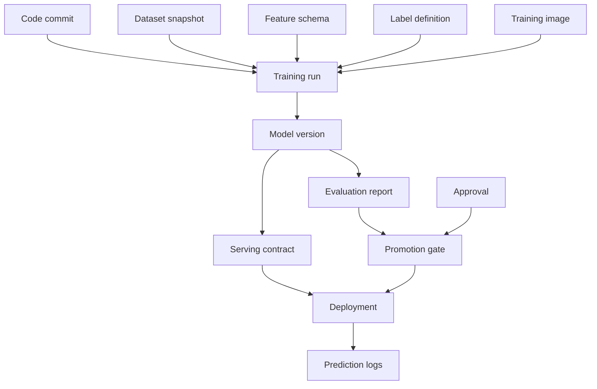

# Model Registry and ML Metadata

## TL;DR

A model registry is not a folder of model files. It is the control plane for ML releases: the system of record that says which artifacts exist, what produced them, what they depend on, which eligibility state they are in, which gates they passed, who approved them, where they are deployed, and how to roll them back. The model binary is only one object in a graph of metadata — dataset snapshot, feature schema, label definition, training code, runtime image, evaluation report, threshold policy, approvals, deployments, and prediction logs. If that graph is incomplete, the platform cannot answer the questions that matter during incidents: what is serving, why was it promoted, what changed, who approved it, what can we roll back to, and which decisions did it affect? The core invariant is **no model reaches production unless the registry can reconstruct its provenance, validate its serving contract, and name a loadable rollback target.**

---

## The Registry Is the ML Control Plane

In ordinary software, the release artifact is usually a container image or binary, and CI/CD metadata records source commit, tests, and deployment state. In ML, the release artifact is a decision system. The model file is necessary but insufficient. A serving decision also depends on feature definitions, preprocessing, runtime libraries, thresholds, calibration, label definitions, and rollout policy.

The registry exists because those dependencies need a durable, queryable control plane. Without one, teams store model files in object storage, track versions in spreadsheets, approve releases in Slack, and rely on tribal memory for rollback. That works until the first serious incident. Then the questions arrive faster than humans can answer:

- Which model version is serving this endpoint right now?
- What dataset and label definition trained it?
- Which feature schema does it require?
- Which evaluation report justified promotion?
- Who approved the high-risk rollout?
- What version can be rolled back to, and is it still loadable?
- Which users or decisions did this model affect?

A registry turns these from investigations into queries.

---

## The Metadata Graph

A model version should be represented as a node in a metadata graph, not as a row with a path.



The useful property of this graph is bidirectionality. From a deployed model, traverse backward to provenance. From a bad dataset, traverse forward to impacted models. From a user decision, traverse to model version and policy. From a model version, traverse to deployments and prediction logs.

This is the same provenance/impact split that appears in dataset lineage and training pipelines. The registry is where those edges become operational.

A production registry usually stores the graph as relational tables plus immutable object references, not as a literal graph database. The critical part is the edges:

```yaml
model_version_record:
  model_id: fraud_classifier
  version: v42
  artifact:
    uri: s3://ml-artifacts/fraud/v42/model.onnx
    hash: sha256:9f86d08...
    format: onnx
  provenance:
    training_run_id: train_run_01J2
    code_commit: 4f3c9ab
    training_image: registry.example.com/train@sha256:91aa...
    dataset_snapshots:
      - fraud_train:2026-05-31.7
    feature_schema: fraud_features:v18
    label_definition: confirmed_chargeback:v6
  evaluation:
    report_id: eval_report_01J2
    primary_estimand: recall_at_fixed_false_positive_rate
    primary_metric_delta: 0.014
    confidence_interval_95: [0.006, 0.021]
    guardrails:
      decision_set_id: guardrails_01J2
      decision_set_hash: sha256:71ac...
      all_required_passed: true
    uncertainty_method: stratified_bootstrap
  serving_contract:
    contract_id: fraud_serving_contract:v42
    runtime_image: registry.example.com/serve@sha256:44aa...
    threshold_policy: fraud_policy:v10
    rollback_target: fraud_classifier:v41
  governance:
    risk_tier: high
    approvals:
      - role: model_owner
        actor: user:alice
        approved_at: 2026-06-24T08:10:00Z
      - role: independent_validator
        actor: user:bob
        approved_at: 2026-06-24T09:02:00Z
  eligibility_state: approved
```

This record is the join point for release engineering, monitoring, governance, and incident response. The model file can be stored anywhere durable; the registry record is what makes it operable.

---

## Model Identity: Artifact Hash Beats Version Name

Human-readable versions are useful but not sufficient. `fraud_model_v42` is a name; it is not proof of bytes. The registry should identify artifacts by cryptographic hash and immutable storage URI.

```yaml
model: fraud_classifier
version: v42
artifact_uri: s3://ml-artifacts/fraud/v42/model.onnx
artifact_hash: sha256:9f86d08...
format: onnx
created_by_run: train_run_01J2...
created_at: 2026-06-24T03:12:00Z
```

The artifact hash protects against accidental overwrite, corrupted upload, and ambiguous rollback. If a model at the same path changes bytes, it is a different artifact and must be a different model version. Mutable artifact paths are the model equivalent of editing a database row without a transaction log.

The registry should also store environment identity by digest, not tag:

```yaml
runtime_image: registry.example.com/ml-serving/fraud@sha256:44aa...
```

`ml-serving:latest` is not a reproducible runtime. A model that loads today and fails tomorrow after a base-image rebuild was never properly versioned.

Registration itself needs a commit protocol. Training workers upload into an attempt-scoped staging location, compute hashes while streaming, and submit a descriptor containing expected objects, sizes, media types, and training-run identity. The registry or an artifact finalizer verifies those objects, copies or promotes them into an immutable namespace if necessary, then transactionally creates the model version. A database row must never become `created` before every required object is durably readable and hash-valid.

```text
TRAINING_COMPLETE
  → ARTIFACTS_STAGED
  → ARTIFACTS_VERIFIED
  → VERSION_REGISTERED
  → EVIDENCE_ATTACHED
```

Retries use the training-run ID plus artifact-set hash as an idempotency key. If the client loses the response after registration, it queries that key; it does not invent `v43` for the same bytes. A candidate whose upload is incomplete remains an expiring staging attempt, never a model version. Conversely, deleting an artifact behind an existing version is corruption, not retirement—the lifecycle controller must first remove every deployment and retention root.

For higher-assurance systems, attach a signed provenance statement: builder workload identity, source and data references, build parameters, runtime digest, artifact hashes, and policy under which the build ran. The signature does not prove the model is good; it proves which trusted process produced the bytes and lets deployment reject an artifact substituted after evaluation.

---

## The Serving Contract

A model artifact is promotable only if it declares the contract it expects at serving time. The contract is what lets the platform validate compatibility before traffic reaches the model.

```yaml
serving_contract:
  input_schema:
    account_risk: { type: float32, feature_version: "account_risk:v12", required: true }
    device_velocity: { type: float32, feature_version: "device_velocity:v7", required: true }
  preprocessing: fraud_preprocess:v5
  output_schema:
    score: { type: float32, range: [0, 1], meaning: calibrated_probability }
  threshold_policy: fraud_policy:v9
  latency_budget_ms: 45
  fallback: fraud_rules_policy:v3
  rollback_target: fraud_classifier:v41
```

This contract turns deployment from hope into validation. The gate can check whether online features exist, whether the serving runtime supports the model format, whether the threshold policy matches the score semantics, whether the fallback exists, and whether rollback is loadable.

The most common production failure this prevents is a feature/version mismatch: the model expects `device_velocity:v7`, but serving provides `v6`. Every component is individually healthy, yet the decision is wrong. The registry should make such a deployment impossible.

---

## Lifecycle Eligibility and Deployment State Are Separate

A model version has an **eligibility lifecycle**. A deployment has an independent **rollout state**. Mixing the two makes the registry unable to represent ordinary reality: the same approved model can be serving production traffic in one region, shadowing in another, and absent from a third.

```text
model-version eligibility:
  registered → evaluated → approved → deprecated → retired
  evaluated → rejected
  approved → suspended → approved | deprecated

endpoint deployment generation:
  proposed → staged → shadow → canary → active → draining → removed
                         └───── rollback creates a newer generation ─────┘
```

Eligibility answers, “may this artifact-contract-evidence bundle be deployed under this policy?” Deployment state answers, “where is a particular immutable bundle intended and observed to serve traffic?” `production` is an environment or traffic destination, not evidence that a model is eligible; `shadow` and `canary` are deployment modes, not properties of the model artifact.

Eligibility transitions are registry transactions:

| From → To | Actor | Gate | Atomic writes |
|---|---|---|---|
| registered → evaluated | evaluation pipeline | lineage and artifact validation | evaluation-report edge, estimands, uncertainty, state event |
| evaluated → approved | policy engine plus required approvers | predeclared promotion policy | approvals, evidence-bundle hash, policy version, state event |
| evaluated → rejected | policy engine or model owner | failed or withdrawn evidence | reason, evidence revision, state event |
| approved → suspended | risk owner or incident automation | evidence invalidation or safety incident | suspension reason, affected deployments, state event |
| approved → deprecated | model owner | replacement and retention policy | successor edge, deployment prohibition date, state event |
| deprecated → retired | lifecycle controller | no deployment or rollback roots | tombstone, retention schedule, state event |

Rollout transitions belong to the deployment control plane and reference an eligible evidence bundle:

| Deployment transition | Gate | Authoritative write |
|---|---|---|
| proposed → staged | artifact, runtime, feature, and policy compatibility | desired generation with zero traffic |
| staged → shadow | load/readiness conformance | shadow traffic policy and monitor binding |
| shadow → canary | runtime and distribution guardrails | bounded live-traffic allocation |
| canary → active | sequential rollout policy and approvals | newer desired generation or traffic allocation |
| any live state → rollback | retained target is eligible and loadable | newer generation naming the rollback bundle |

Both state machines are safety boundaries, but they have different owners and cardinality. The registry prevents an ineligible bundle from becoming desired deployment state; the rollout controller reconciles one desired generation into many regional observations. No write to model eligibility should pretend that traffic has moved.

---

## Promotion Gates as Policy Evaluation

A promotion gate is a policy engine over registry metadata. It should not be custom logic buried in a deploy script. Declarative policy makes requirements reviewable and consistent across models.

```yaml
policies:
  production_promotion:
    primary_estimand: recall_at_fixed_false_positive_rate
    uncertainty_method: stratified_bootstrap
    noninferiority_floor_delta: -0.003
    minimum_practical_effect_delta: 0.005
    all:
      - lineage.complete == true
      - evaluation.primary_estimand == policy.primary_estimand
      - evaluation.uncertainty_method == policy.uncertainty_method
      - evaluation.confidence_interval_95.lower >= policy.noninferiority_floor_delta
      - if: promotion_reason == quality_improvement
        then: evaluation.confidence_interval_95.lower >= policy.minimum_practical_effect_delta
      - evaluation.guardrails.all_required_passed == true
      - serving_contract.validated == true
      - rollback_target.load_tested == true
      - risk.required_approvals_present == true
      - owner.oncall_rotation_present == true
```

The threshold is declared before reading candidate results. A point estimate above zero is not a promotion rule: sampling noise can make an unchanged or worse model look positive. A noninferiority promotion requires the lower uncertainty bound to exceed the predeclared noninferiority margin and a separate predeclared benefit—for example latency, cost, or robustness—to justify the change. A claimed quality improvement requires the bound to exceed the **minimum practical effect** (MPE), not merely zero. The report also binds the estimand, population weighting, slice definitions, uncertainty method, sample-size or stopping rule, and multiplicity treatment. Otherwise a pipeline can obtain a passing result by changing what was measured or repeatedly peeking at the same experiment.

The gate can be stricter by risk tier. A playlist recommender may require lineage, evaluation, and rollback. A credit model may additionally require independent validation, fairness slice metrics, explainability artifacts, legal approval, and contestability paths. Guardrails need uncertainty-aware thresholds of their own; `all_required_passed` is a derived summary bound to a hashed, versioned set of per-slice decisions, not a Boolean asserted by the training job.

The important property is that the gate reads registry state. If approval happened in Slack but not in the registry, it did not happen for deployment purposes.

Gate evaluation and transition must not have a time-of-check/time-of-use gap. The gate produces an immutable **evidence bundle hash** over the candidate artifact, serving contract, evaluation report, approvals, policy version, and rollback validation. The state transition performs a compare-and-swap from the expected lifecycle revision and records that bundle hash atomically. If any dependency changes—threshold policy, evaluation attachment, approval status—the revision changes and the old decision cannot promote the new bundle.

Approvals should bind to evidence, not only to a model name. “Alice approved v42” is ambiguous if v42's threshold or runtime can change afterward. An approval records subject hash, role, scope, expiry or revocation state, and justification. Revocation is append-only: it prevents later transitions and may trigger a deployment-policy response, while preserving the historical fact that the earlier promotion was authorized at that time.

---

## Rollback Metadata

Rollback is only real if the registry can name and validate the rollback target. For model systems, this is harder than code rollback because the previous model's dependencies may have rotted.

A rollback target must include:

- artifact hash and storage URI,
- runtime image digest,
- feature schema versions,
- preprocessing version,
- threshold policy,
- fallback policy,
- last load-test result,
- capacity status if it must stay warm.

```yaml
rollback:
  target_model: fraud_classifier:v41
  validated_at: 2026-06-24T02:00:00Z
  load_test: pass
  feature_schema_available: true
  runtime_image_available: true
  warm_replicas: 3
  rollback_method: registry_pointer_flip
  expected_recovery_time_seconds: 10
```

A registry that stores only the current production pointer cannot guarantee rollback. It must continuously validate that rollback remains possible, especially when feature schemas and runtime images are deprecated.

---

## Registry Versus Artifact Store

The artifact store holds bytes. The registry holds meaning.

| Component | Stores | Optimized for |
|---|---|---|
| Artifact store | model binaries, preprocessors, explainability artifacts | durability, large object storage |
| Metadata store | lineage, states, contracts, approvals, metrics | consistency, queryability |
| Deployment control plane | active version pointers, traffic splits | fast safe changes |
| Prediction log | served decisions and contexts | append-only audit and monitoring |

These can be implemented by one product or multiple systems. The boundary matters conceptually: object storage cannot answer whether a model passed fairness review; a registry cannot serve a 5GB artifact efficiently; a deployment control plane should not depend on scanning evaluation reports during a rollback.

---

## Consistency Requirements

The registry is a control plane, so its consistency requirements are stronger than many data-plane systems. Two operators must not be able to concurrently write conflicting desired deployment generations for the same endpoint without a deterministic result. A rollback pointer flip must be atomic. An eligibility transition must either record all required metadata or not happen.

This suggests ordinary transactional storage for the control-plane core. Use a relational database or strongly consistent metadata store for eligibility and approvals, and an equally explicit transactional record for desired deployment generations. They may share a database, but they should not share an enum or mutation API. Large artifacts and logs can live elsewhere. Desired production state should not be eventually consistent unless the serving system can tolerate conflicting active generations.

The active-model pointer is especially sensitive:

```text
endpoint fraud_authorization → active_model fraud_classifier:v42
```

Changing it should be an atomic compare-and-swap with audit logging:

```text
if active_model == v42:
    set active_model = v41
    append audit event rollback(v42 → v41, actor, reason)
```

In database terms, the pointer flip should look like a small transaction:

```sql
BEGIN;

-- The INSERT reads only from the successful compare-and-swap. If another
-- controller already changed the pointer, `moved` is empty and no false
-- rollback event is written.
WITH moved AS (
  UPDATE endpoint_active_model
  SET active_model_version = 'fraud_classifier:v41',
      updated_at = CURRENT_TIMESTAMP,
      updated_by = 'user:oncall'
  WHERE endpoint = 'fraud_authorization'
    AND active_model_version = 'fraud_classifier:v42'
  RETURNING endpoint
)
INSERT INTO registry_audit_log(
  event_type, endpoint, previous_model_version, new_model_version, actor, reason
)
SELECT
  'rollback', endpoint, 'fraud_classifier:v42', 'fraud_classifier:v41',
  'user:oncall', 'canary false_positive_rate guardrail breach'
FROM moved
RETURNING event_id;

COMMIT;
```

The caller treats exactly one returned audit row as success. Zero rows is a compare-and-swap conflict: the transaction is rolled back or committed as a no-op, current desired state is reread, and policy decides whether a different rollback is still valid. The update and audit cannot be two independent statements whose row counts are ignored; that would let the audit log claim a rollback that never changed serving intent.

Serving nodes should observe the new pointer through a watch/cache protocol with bounded staleness. If the pointer cache TTL is 60 seconds, a "10 second rollback" claim is false no matter how fast the registry transaction is. The serving contract should state pointer propagation SLO, cache invalidation behavior, and what happens if the registry is unavailable.

This is the same reason feature flags and deployment control planes require careful consistency: they decide what users experience.

## Desired State, Observed State, and Fencing

The registry owns **eligibility**; the deployment control plane owns **desired deployment state**; serving controllers and workers own **observed application state**. Writing `active_model=v42` does not mean v42 is serving. A controller must first verify that the referenced evidence bundle remains eligible, then resolve the immutable bundle, fetch and verify it, load it, pass health checks, and acknowledge the applied generation. Until then the endpoint may intentionally continue serving the last-known-good generation.

```text
desired:
  endpoint=fraud_authorization generation=184 bundle=v42/policy_v10 traffic=5%

observed:
  region=eu-west generation=184 ready=97/100 traffic_seen=4.9%
  region=us-east generation=183 reason=artifact_fetch_failed
```

Each desired-state mutation increments a monotonic generation. Controllers include that generation in leases and worker configuration; workers reject commands older than the highest generation they have applied. This fences a delayed rollout controller from reasserting v42 after an emergency rollback to generation 185. The controller continuously reconciles desired and observed state, while the registry records rollout condition rather than pretending the pointer write completed the rollout.

Rollback is another desired-state transition, not an imperative RPC sent to every node. It creates a newer generation pointing to the retained bundle. The recovery-time objective decomposes into registry commit, watch propagation, artifact/load readiness, and traffic convergence. Measuring only the pointer transaction hides the dominant term and creates fictitious rollback claims.

During a control-plane partition, existing workers keep serving their verified generation. New eligibility and desired-deployment changes fail closed. Bootstrap may use a signed, non-expired last-known-good snapshot if policy permits, but a snapshot cannot authorize either transition. This asymmetric availability—continue known-good data plane, freeze control-plane change—is the safe default for most online inference.

---

## Audit Log: Who Changed What, When, and Why

Every registry mutation that affects production must be audited:

- model registered,
- evaluation attached,
- approval granted,
- eligibility state changed,
- traffic percentage changed,
- active version changed,
- threshold policy changed,
- rollback executed,
- model retired.

The audit event should record actor, timestamp, previous state, new state, reason, and request ID. For regulated systems, threshold changes are as important as model changes. A score cutoff can alter thousands of decisions without changing the model artifact at all.

```yaml
registry_audit_event:
  event_id: reg_evt_01J2Z
  occurred_at: 2026-06-24T11:04:19Z
  actor: user:oncall
  request_id: req_deploy_7781
  event_type: traffic_split_changed
  endpoint: fraud_authorization
  previous:
    model_version: fraud_classifier:v41
    traffic_percent: 100
    threshold_policy: fraud_policy:v9
  new:
    model_version: fraud_classifier:v42
    traffic_percent: 5
    threshold_policy: fraud_policy:v10
  gate_result: promotion_gate_run_01J2Y
  reason: canary_ramp_step_1
  rollback_target: fraud_classifier:v41
```

An append-only audit log also helps incident review. The question after a bad rollout is not only "which model caused this?" but "which gate failed to catch it, and who had the information when the decision was made?"

---

## Multi-Environment Deployment

Deployments move across dev, staging, and production environments and through shadow, canary, active, and draining traffic modes. The registry should track these environment-specific deployment records separately from model eligibility.

```text
model fraud_classifier:v42
  eligibility_state: approved
  deployments:
    staging: active 100%
    shadow-prod-us: active 5% shadow
    canary-prod-us: active 1% user traffic
    prod-eu: not deployed
```

This prevents a common ambiguity: a model can be approved but not deployed, deployed in shadow but not production, active in one region but blocked in another. Eligibility state is about permission under evidence and policy. Deployment state is about where traffic is intended and observed to flow.

---

## Model Registry API Shape

A minimal registry API exposes operations around state transitions and queries, not raw database writes.

```text
register_model(training_run_id, artifact_uri, artifact_hash)
attach_evaluation(model_version, evaluation_report_id)
validate_serving_contract(model_version, endpoint)
request_eligibility(model_version, target_eligibility)
approve(model_version, approver, role, justification)
transition_eligibility(model_version, expected_revision, target_eligibility)
create_deployment(endpoint, environment, evidence_bundle_hash)
set_traffic(deployment_id, expected_generation, allocation)
rollback(endpoint, target_model_version, reason)
retire(model_version)
```

Queries matter just as much:

```text
get_active_model(endpoint)
get_lineage(model_version)
get_impacted_models(dataset_version)
get_deployments(model_version)
get_decisions(model_version, time_range)
get_rollback_target(endpoint)
```

If impact queries require ad hoc SQL written during an incident, the registry has not done its job.

A useful API property is idempotency. Deployment controllers retry, CI jobs retry, and on-call engineers double-submit under stress. Registry mutations should accept request IDs and make repeated calls safe:

```text
set_traffic(deployment_id=dep_42, expected_generation=184,
            allocation={v42: 5%, v41: 95%}, request_id=req_123)
```

If the first call succeeds and the client times out, the retry should return the existing deployment generation, not create a duplicate approval or apply the traffic change twice. Eligibility APIs and deployment APIs can share an audit substrate without sharing a state machine. The registry is a control plane; idempotency is part of safety.

---

## Capability Boundaries When Selecting Registry Technology

Products change names, APIs, and bundled features. The durable selection problem is to assign each control-plane invariant to a component and verify the boundary where responsibility passes. A platform may provide several rows of this table, but no product label proves the required semantics.

| Capability boundary | Required guarantee | Integration question |
|---|---|---|
| Artifact finalization → registry | A version is visible only after every immutable object is hash-valid | Who commits the artifact set and registry row atomically or through a recoverable protocol? |
| Training/evaluation → eligibility | Evidence is immutable, uncertainty-aware, and bound to the candidate | Can policy evaluate a versioned evidence bundle rather than mutable tags? |
| Approval → eligibility transition | Role, subject hash, scope, and revocation are durable | Does approval authorize exact bytes and policy, or only a friendly version name? |
| Registry → deployment control plane | Only eligible bundles can become desired state | Is the handoff transactional or fenced against stale and concurrent writers? |
| Deployment → serving workers | Desired generations converge with bounded, observable staleness | Which watch, lease, acknowledgement, and last-known-good semantics apply? |
| Serving → decision log | Every consequential result resolves to model, policy, and generation | Can impact be queried without joining ephemeral operational logs by hand? |
| Eligibility and deployment roots → retention | Active, rollback, audit, and legal roots remain reachable | Who prevents garbage collection from deleting a transitive dependency? |

A mutable alias can be a useful desired pointer, a version table can store model identity, and a webhook can trigger reconciliation. None of those primitives alone establishes compare-and-swap behavior, policy atomicity, propagation SLOs, separation of duties, or rollback completeness. Test those properties against the exact metadata backend and deployment integration: race two promotions, revoke evidence during evaluation, restore from backup, load a retained rollback bundle, and trace one served decision back to immutable provenance.

This capability decomposition also preserves portability. If artifact identity, eligibility, deployment intent, observed serving state, and audit history have explicit interfaces, one component can be replaced without redefining the safety model. If all semantics live in product-specific labels and callbacks, a migration becomes an uncontrolled release-system rewrite.

---

## Availability, Security, and Disaster Recovery

The registry should be outside the hot prediction path. Serving workers resolve a deployment, fetch immutable artifacts, verify hashes, and continue from local state; a transient control-plane outage must not terminate healthy predictions. That separation does not make registry availability unimportant. An unavailable registry can block deploys, rollback, scale-out, node replacement, investigation, and policy changes—the exact operations needed during an incident.

There are two materially different read paths. **Deployment reads** require current, strongly consistent eligibility and desired-generation state. If either control-plane authority is partitioned, new changes fail closed rather than guessing which candidate is approved or active. **Serving bootstrap reads** can use a signed last-known-good deployment snapshot containing artifact hashes, serving contract, and active policy. This lets a replacement worker start during a control-plane outage without permitting a new deployment. The snapshot carries a monotonic generation or fencing token, and workers reject generations older than the one already applied; otherwise a delayed control-plane update can revert a fleet after a newer rollout.

Authorization must be transition-aware. Permission to register an experiment is not permission to approve it; permission to approve is not permission to move production traffic; emergency rollback should not silently grant permission to lower a fraud threshold. Use workload identity for pipelines, short-lived operator credentials, separation of duties for high-risk transitions, and conditional policy over model risk, environment, state change, and organization. Treat artifact locations, training-data lineage, evaluation slices, and decision-log links as sensitive metadata. Even when model weights are public, the graph can reveal customer populations, proprietary sources, and known weaknesses.

Backup and restore have an ordering contract. Restore transactional metadata and the append-only audit log, then verify that every referenced artifact, evaluation bundle, runtime image, schema, and rollback target exists and matches its hash. A database restore whose rows point to expired objects has recovered a catalog of broken promises. Periodically restore into an isolated environment and resolve a sample of active and retained versions all the way through model loading. A useful durability SLI is the fraction of production and rollback roots whose complete transitive artifact graph can be verified.

## Retention, Reachability, and Retirement

Deleting model artifacts by age is unsafe because age and operational value are different. The prior champion may be old and still be the only approved rollback. A model retired from traffic may be held to reconstruct a consequential decision years later. Conversely, thousands of failed experiments can disappear once no evaluation, report, or downstream model references them.

Garbage collection is therefore graph reachability from explicit roots: active deployments, rollback targets, approved candidates, open experiments, incident evidence, legal holds, and retained decision logs. Unreachable objects enter quarantine, remain recoverable for a safety interval, and are checked again before physical deletion. Retirement should prevent new deployments, record the retention class, and clean dependencies in a safe order. Deleting a base model before its adapters, a feature schema before a retained serving contract, or a runtime image before a rollback window ends converts lineage into dangling references.

Registry SLOs must describe control-plane truth rather than HTTP uptime alone: state-transition latency, active-pointer propagation, audit-event durability, percentage of roots with complete artifacts, restore success, stale ownership, and impact-query latency. A registry that returns `200 OK` while its provenance graph is incomplete is available only in the least useful sense.

---

## Failure Modes

**Artifact folder masquerading as registry** stores model files but not lineage, state, approvals, contracts, or deployments. Defense: metadata graph with enforced eligibility transitions and separate deployment records.

**Mutable artifact path** lets bytes change under the same version name. Defense: artifact hashes and immutable URIs; version identity follows content.

**Approval outside the control plane** records sign-off in Slack or a ticket but not in registry state. Defense: promotion gates read only registry approvals.

**Feature contract mismatch** deploys a model against incompatible online features. Defense: serving contracts validated before promotion.

**Rollback amnesia** discovers during an incident that the previous artifact, image, feature schema, or threshold policy is gone. Defense: rollback metadata and continuous load validation.

**Split-brain production pointer** occurs when concurrent deploy operations leave different serving nodes reading different active versions unintentionally. Defense: strongly consistent active pointers and atomic traffic changes.

**Orphaned model** remains in production after the owning team disappears. Defense: owner metadata, on-call validation, stale ownership alerts, and retirement policy.

**Threshold-only incident** changes a policy value without registry audit because the model artifact did not change. Defense: threshold policies are versioned production artifacts governed like models.

**Metadata-before-bytes registration** publishes a model version whose artifact upload later fails or is only partially visible. Defense: verify the complete artifact set before transactionally creating the immutable version.

**Stale-evidence promotion** evaluates gates, then promotes after the runtime, threshold, report, or approval has changed. Defense: hash the complete evidence bundle and compare-and-swap the lifecycle revision with the transition.

**Pointer equals reality fallacy** declares rollout success when desired state changed even though one region never loaded the bundle. Defense: separate desired from observed state and reconcile per-generation readiness and traffic.

**Stale controller resurrection** applies an old rollout command after a newer rollback. Defense: monotonic generations, leases, and worker-side fencing.

**Registry outage stops healthy serving** puts control-plane lookup on the prediction path. Defense: workers serve a verified last-known-good generation; new changes fail closed while serving continues.

**Artifact substitution after evaluation** preserves a friendly version name while changing bytes. Defense: immutable hashes, runtime verification, and signed build provenance bound into the gate evidence.

---

## Decision Framework

Assign one authority to each kind of truth before choosing a product:

| Truth | Authoritative owner | Consistency / recovery requirement |
|---|---|---|
| Immutable model and evidence identity | Registry transaction + artifact hashes | No partial registration; idempotent retry |
| Lifecycle eligibility | Registry policy state machine | Serializable transition over an evidence revision |
| Desired endpoint generation | Deployment control plane | Atomic fenced update and durable audit |
| Observed loaded/serving generation | Regional controllers and workers | Continuously reconciled; stale acknowledgements ignored |
| Historical mutation record | Append-only audit log | Durable, attributable, ordered per governed object |
| Consequential prediction | Decision log | Resolves to model, policy, feature, and deployment generation |

A model registry is production-grade when it can answer these questions programmatically:

1. What model version is active for each endpoint, region, and traffic segment?
2. What exact artifact bytes and runtime image are serving?
3. What training run, dataset, features, labels, and code produced the model?
4. What evaluation report and guardrails justified promotion?
5. Which risk tier and approvals applied?
6. What feature and output contract does the model require?
7. What rollback target is valid right now, and how fast can it be activated?
8. Which deployments and prediction logs used this model?
9. Who changed eligibility, desired generation, traffic, thresholds, or active version?
10. Which models are impacted by a bad dataset, feature, or label definition?
11. Which desired generation has each region actually applied, and what blocks convergence?
12. Does every approval and promotion bind to the exact artifact-policy-evidence bundle now deployed?

If these are manual investigations, the registry is incomplete. If they are queries, the registry is a real control plane.

---

## Key Takeaways

1. A model registry is the ML release control plane, not a file catalog.
2. The core object is a metadata graph connecting code, data, features, labels, training runs, model artifacts, evaluation, approvals, deployments, and prediction logs.
3. Identify artifacts by immutable URI and cryptographic hash; names are not proof of bytes.
4. A serving contract declares required features, preprocessing, output semantics, thresholds, fallback, latency budget, and rollback target.
5. Eligibility states should be enforced guardrails and kept separate from deployment environments and rollout modes.
6. Promotion gates are policy evaluation over registry metadata; approvals outside registry state do not count.
7. Rollback requires validated metadata for the previous artifact and all dependencies.
8. Eligibility transitions and desired deployment generations need explicit strong consistency; active pointer flips should be atomic and audited.
9. Serving nodes need bounded pointer-propagation behavior, or rollback-time claims are fiction.
10. Threshold and policy changes are production changes and must be versioned and audited.
11. Registry mutation APIs should be idempotent because deploy controllers and humans retry.
12. The registry is successful when provenance, impact, active deployment, approval, and rollback questions are all queries.
13. Registration is a transaction over verified immutable artifacts; a database row must never race ahead of its bytes.
14. Eligibility, desired deployment, and observed serving are distinct states with distinct owners.
15. Evidence-bound approvals and monotonic deployment generations close promotion races and stale-controller rollback hazards.

---

## References

1. [TFX: A TensorFlow-Based Production-Scale Machine Learning Platform](https://dl.acm.org/doi/10.1145/3097983.3098021) — Baylor et al., 2017
2. [Hidden Technical Debt in Machine Learning Systems](https://proceedings.neurips.cc/paper_files/paper/2015/file/86df7dcfd896fcaf2674f757a2463eba-Paper.pdf) — Sculley et al., 2015
3. [Uber Michelangelo: Machine Learning Platform](https://www.uber.com/blog/michelangelo-machine-learning-platform/) — an early end-to-end platform case study
4. [Model Cards for Model Reporting](https://arxiv.org/abs/1810.03993) — Mitchell et al., 2019
5. [ML Metadata](https://www.tensorflow.org/tfx/guide/mlmd) — metadata and lineage concepts
6. [Deployment Strategies](../15-deployment/01-deployment-strategies.md)
7. [SLSA Provenance](https://slsa.dev/spec/v1.0/provenance) — attested artifact build provenance
8. [Model Deployment and Rollouts](./06-model-deployment-rollouts.md)
