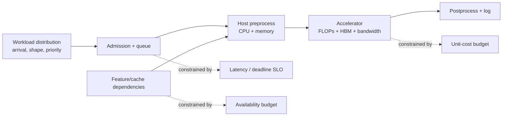

# ML Capacity and Cost Planning

## TL;DR

ML capacity planning turns measured workload envelopes and versioned per-replica benchmarks into ready-capacity, placement, and cost commitments. Size the complete system against safe goodput for named peak, rollout, failure, and quota scenarios, not averages or hardware peaks. Batch inference is bounded by deadline throughput; training by resource-hours, I/O, scheduler delay, and time-to-quality. [Model Serving](./03-model-serving.md) covers per-replica mechanics; [Distributed Training Internals](./15-distributed-training-internals.md) covers parallelism and collective behavior.

---

## The Units That Matter

Every ML capacity estimate starts with four units:

```text
requests/second       incoming prediction or training examples
seconds/request       service time per item or batch
bytes/request         features, embeddings, prompts, outputs
accelerator memory    model weights + activations + batch/KV/cache state
```

From these, derive the rest:

```text
resident_work = arrival_rate × residence_time                 (Little's law)
resource_load = arrival_rate × visits × service_demand
steady_replicas = ceil(scenario_demand / measured_safe_replica_goodput)
unit_cost = total_resource_cost / successful_in_policy_outcomes
```

The numbers do not need to be exact at first. They need to be explicit. A wrong estimate with visible assumptions can be corrected. An architecture with no estimate discovers its costs in production.

All dollar rates in the worked examples below are **illustrative planning inputs, not vendor quotes**. Replace them with a dated rate card or contract that records provider, region, accelerator/instance shape, purchase model, currency, tax/transfer treatment, and effective date. The examples demonstrate dimensional analysis; copying `$4/hour` into a budget would discard the variables that determine a real price.

---

## Capacity Is a Feasible Region, Not One Number

A replica does not have a single capacity. It has a **capacity envelope** bounded simultaneously by compute, memory, memory bandwidth, host preprocessing, network, feature dependencies, and the latency SLO. A configuration that sustains 2,000 predictions/s may be invalid because its p99 is 300 ms; a configuration meeting 50 ms at batch one may be economically invalid because it uses only 8% of the accelerator. The useful capacity is the highest offered load for which *all* constraints remain true.



The serving benchmark produces this envelope as a surface over workload, configuration, and hardware. The planner rejects every cell that violates a latency, quality, memory, or reliability constraint, then treats the remaining cells as supply alternatives. Keeping the full surface matters because minimum-cost, minimum-latency, and maximum-goodput plans may select different feasible points, and a failure scenario can make the normal-peak choice unavailable.

The workload input to this exercise is a distribution. Retain per-route arrival series at a resolution fine enough to preserve the bursts relevant to the latency budget, plus input shapes, feature count, model choice, output size, cacheability, tenant/priority, and correlation with external events. Independent averages erase the worst interaction. A promotion may simultaneously increase model compute, reduce cache hit rate, and expand the eligible population during the daily peak. Replaying joined production traces catches that combination; multiplying separate averages does not.

## Bottleneck Accounting: FLOPs, Bandwidth, and Serial Work

Peak accelerator FLOPs are useful only when the kernel has enough arithmetic per byte moved. A roofline bound expresses the two ceilings:

```text
attainable_compute ≤ min(device_peak_FLOP/s,
                         memory_bandwidth_byte/s × arithmetic_intensity_FLOP/byte)
```

A small embedding lookup or low-batch matrix multiplication can be memory- or launch-bound even while reported accelerator utilization is high. A large dense batch may approach the compute ceiling but violate latency through queue wait. Host tokenization, feature deserialization, device copies, and postprocessing add serial stages that accelerator benchmarks omit. Measure stage service demand in a common unit:

```text
resource_demand_r = visits_per_request_r × service_time_per_visit_r
utilization_r      = arrival_rate × resource_demand_r / capacity_units_r
```

The resource with the smallest remaining utilization margin constrains throughput. If the feature-store tier reaches its safe envelope first, more GPUs increase cost without capacity. If host preprocessing reaches it first, model-kernel optimization is locally impressive and globally irrelevant. The plan should name the binding constraint for each important request class and show evidence from a profile or load sweep; “GPU-bound” is not a model architecture property.

Pipeline capacity is also bounded by serial fractions. For a batch path with ideal parallel speedup on part of the work, Amdahl's law gives a useful skepticism bound:

```text
speedup(N) ≤ 1 / (serial_fraction + parallel_fraction / N)
```

This does not predict a real heterogeneous pipeline, but it exposes why adding workers stops helping when a single writer, coordinator, metadata call, or shuffle boundary remains serial. Feed measured distributed-training throughput into fleet and cost decisions.

---

## Serving Regimes Have Different Capacity Goals

The first capacity decision is not hardware. It is serving regime.

| Regime | Goal | Main constraint | Typical metric |
|---|---|---|---|
| Online synchronous | Answer inside user request | p99 latency | p99, timeout rate, queue wait |
| Online async | Process soon after event | queue lag | end-to-end lag, backlog |
| Batch scoring | Finish by deadline cheaply | throughput/cost | predictions/hour, cost/run |
| Training | Produce artifact by deadline | accelerator-hours + I/O | time-to-train, cost/run |

A daily churn score does not need online GPU serving. A checkout fraud decision does. Moving work to the cheapest regime that satisfies freshness is the highest-leverage cost optimization in ML systems.

## Demand Is a Scenario, Not a Single Forecast

Traffic history is not a capacity requirement until it is translated into scenarios. Preserve seasonality, event bursts, tenant concentration, geographic correlation, product launches, and model-routing mix. Then construct at least a normal peak, plausible upside, named failure, and launch/backfill overlap scenario. Quantiles from a forecaster are useful, but they do not include events absent from history, such as a new default-on feature or a region evacuation.

For each scenario, propagate demand through the dependency graph rather than applying one growth percentage everywhere:

```text
model_rps[m]       = ingress_rps × route_share[m] × shadow_multiplier[m]
feature_qps[f]     = Σ_m model_rps[m] × reads_per_request[m,f] × miss_rate[m,f]
log_bytes_per_sec  = Σ_m model_rps[m] × bytes_logged[m]
batch_backlog_work = arrivals_before_deadline × service_demand
```

Routing shares are often the largest forecast uncertainty. A candidate can route more requests to an expensive expert, generate longer outputs, or reduce cache locality without changing ingress RPS. Capacity review belongs in model promotion because the artifact changes the workload transformation.

Forecast error must have an owner and a response. Record predicted and actual peak, mix, warmup, service demand, and unit cost after launches. Systematic underprediction should update the model; one-off named events should update scenario design. A forecast with no backtest becomes a ceremonial spreadsheet.

---

## The Serving Benchmark Contract

[Model Serving](./03-model-serving.md) owns the mechanics of latency budgets, dynamic batching, bounded queues, accelerator memory, warm-up, and open-loop load testing. Capacity planning should not re-derive those mechanisms from a remembered batch size or an advertised device peak. It consumes a **versioned benchmark surface** produced for the exact model, runtime, hardware, input distribution, dependency behavior, and admission policy under consideration.

One benchmark record needs enough identity and output to be replayable:

```yaml
serving_benchmark:
  subject:
    model_hash: sha256:...
    runtime_image: sha256:...
    hardware_profile: accelerator_class/topology/runtime
    serving_config_hash: sha256:...
    workload_trace: checkout_peak:v7
  constraints:
    latency_slo: route-specific percentile and deadline
    quality_policy: model, fallback, and rejection semantics
    dependency_profile: feature/cache/logging failure and latency distributions
  observations_by_offered_load:
    - offered_rate
    - admitted_rate
    - device_completion_rate
    - in_slo_goodput
    - queue_wait_distribution
    - device_service_distribution
    - achieved_batch_and_shape_distribution
    - memory_high_watermark
    - dependency_service_demand
    - rejected_timed_out_and_wasted_work
  supply_transitions:
    ready_time_distribution: artifact fetch through conformance readiness
    drain_time_distribution: deadline-aware removal from service
```

For model `m`, hardware/configuration `h`, and workload class `w`, define the safe single-replica envelope as:

```text
c_safe[m,h,w] = max offered load λ such that
  latency_percentile(λ)       ≤ deadline[w]
  error_and_timeout_rate(λ)  ≤ policy[w]
  memory_high_watermark(λ)   ≤ memory_limit[h] - required_margin
  quality_and_fallback(λ)    satisfy release policy
```

`c_safe` is a measured feasible point, not a constant attached to the model. A traffic-mix change can alter shape, batching efficiency, feature misses, and fallback behavior, invalidating it. Store the full surface rather than only the selected point so a planner can evaluate alternate utilization margins and hardware mixes without pretending extrapolation is measurement.

### Device Service Capacity and Queue Residence Use Different Clocks

Queue wait consumes the request's deadline but does not consume accelerator service time. For a measured batching configuration, long-run device capacity is derived from completions over device-busy time, or, as a diagnostic approximation, achieved batch completions divided by device batch service time:

```text
device_completion_capacity ≈ completed_items / device_busy_seconds
request_latency = upstream + admission_wait + batch_queue_wait
                + device_service + downstream
```

Do **not** divide achieved batch size by `device_service_time + queue_wait`. That denominator mixes residence time with resource service demand and understates the device's ability to complete work. Queue wait still determines whether an offered load is safe: it appears in the end-to-end constraint and therefore in measured `c_safe`. The fleet planner uses safe goodput from the benchmark; it does not manufacture a new per-replica capacity by adding latency components to device service.

The same distinction applies to shared dependencies. Convert the scenario's routed demand into service demand at each constrained resource:

```text
resource_load[r,s] = Σ_w demand[w,s]
                         × visits_per_request[w,r]
                         × service_demand_per_visit[w,r]

required_units[r,s] = ceil(resource_load[r,s] / safe_capacity_per_unit[r,s])
```

Cache miss, feature fanout, logging bytes, host preprocessing, and retry ownership are scenario parameters because they transform ingress into resource load. The plan is invalid if model replicas fit but a shared dependency crosses its safe envelope.

## From the Envelope to a Ready Fleet

The first replica count for scenario `s` is a lower bound:

```text
steady_replicas[m,h,s] = ceil(routed_demand[m,h,s] / c_safe[m,h,w_s])
```

It assumes independent replicas and no shared bottleneck. Fleet calibration then measures interference, load-balancer skew, model residency, host/NIC contention, and dependency saturation. Represent that loss explicitly rather than hiding it in a folklore utilization target:

```text
fleet_safe_goodput[n,s] = measured in-SLO goodput with n ready replicas
fleet_efficiency[n,s]   = fleet_safe_goodput[n,s] / (n × c_safe[s])
```

Capacity is **ready** only after placement, artifact fetch, hash verification, runtime initialization, model loading, and a representative conformance inference. Let `L_actuate,p` be the chosen percentile from scale decision through readiness. A warm-capacity plan covers the demand that can arrive before new supply becomes ready:

```text
required_ready_capacity(t) ≥
  max projected_admitted_demand(u) for u in [t, t + L_actuate,p]
```

Known launches and daily peaks can reserve capacity ahead of the interval; unforecast bursts consume failure/burst margin or invoke admission and degradation policy. Scale-to-zero is feasible only when the product contract permits queueing, fallback, or cold latency for the first request. The planner prices that contract; the serving chapter defines how the runtime implements it.

State ownership prevents competing control loops. The capacity allocator owns reservations and quotas; the cluster scheduler owns placement; the serving autoscaler owns desired replica count within those bounds; the rollout controller owns traffic allocation. Each publishes desired and observed generations. A capacity forecast is not ready supply, an accelerator quota is not a placed replica, and a placed replica is not serving capacity until the readiness contract is observed.

---

## Batch Inference Sizing

Batch scoring is throughput planning. The question is: can the job finish before its deadline at acceptable cost?

Example:

```text
Users to score: 200M
Deadline: 4 hours
Required throughput: 200M / (4 × 3600) ≈ 13,900 predictions/s
```

If one worker scores 2,000 predictions/s safely:

```text
workers = 13,900 / 2,000 ≈ 7 workers
```

Add straggler and retry headroom; provision 10. Then estimate cost:

```text
10 workers × 4 hours × $3/hour = $120 per run
```

Batch inference often becomes I/O-bound. Reading features, writing predictions, and shuffling candidate sets can dominate model compute. Measure throughput by pipeline stage:

```text
read features → preprocess → inference → write outputs
```

The slowest stage sets throughput. If inference is 50,000/s but writes are 10,000/s, buying more GPUs does nothing.

---

## Training Cost Planning

Training cost is the sum of resource-time products plus metered storage and orchestration work. A dimensionless experiment multiplier cannot be added to a currency-valued base run; it scales that cost.

```text
base_run_cost = accelerator_hours × accelerator_rate
              + CPU_hours × CPU_rate
              + memory_GiB_hours × memory_rate
              + storage_and_transfer_cost

experiment_portfolio_cost = Σ_i (run_fraction_i × comparable_base_run_cost_i)
                          + shared_search_orchestration_cost

# Only when trials use the same resource shape and rate:
experiment_portfolio_cost ≈ base_run_cost × equivalent_full_run_count
```

The equivalent-full-run count is what surprises teams. Early-stopped and full trials contribute different fractions, while heterogeneous trials use their own resource-time ledger.

```text
base run: 8 GPUs × 6h × $4/h = $192
50 trials with early stopping at 40% average length:
  50 × 0.4 × $192 = $3,840
weekly search: ≈ $200K/year
```

Cost planning should be attached to the training pipeline. Every run records estimated cost, actual cost, dataset size, accelerator type, utilization, and reason. Cost anomalies often reveal pipeline bugs: data doubled, cache missed, distributed training slowed, spot instances stopped being used, or hyperparameter search exploded.

---

## Training Throughput and I/O

Accelerator utilization during training is often limited by data I/O. If GPUs wait for batches, cost burns without learning.

Estimate data demand:

```text
batch_size = 1024 examples
example_size = 200 KB
steps_per_second = 20
data_rate = 1024 × 200KB × 20 ≈ 4 GB/s
```

If the storage path cannot deliver 4 GB/s sustained, the GPUs idle. Fixes include:

- sharding data into appropriately sized files,
- sequential formats for full scans,
- local NVMe caching,
- prefetching and parallel data loaders,
- co-locating compute with storage,
- avoiding per-example remote reads.

Training capacity is therefore not only GPU quota. It is GPU + storage bandwidth + CPU preprocessing + network.

---

## Distributed Training Scaling Efficiency

Adding GPUs does not linearly reduce training time. Communication grows.

```text
speedup_N = single_gpu_time / N_gpu_time
scaling_efficiency = speedup_N / N
```

If 8 GPUs give 6× speedup, efficiency is 75%. If 64 GPUs give 20× speedup, efficiency is 31%; cost per useful training step may be worse than a smaller job.

A capacity plan should measure throughput per dollar, not only time-to-train. Sometimes the right answer is fewer GPUs for longer because queue wait and communication overhead make the larger job wasteful. Sometimes the product deadline justifies the waste. Make the trade explicit.

---

## Multi-Tenant GPU Clusters

A shared ML cluster is a scheduling system. Without policy, one team can starve others.

Multi-tenant GPU scheduling requires these controls:

| Control | Purpose |
|---|---|
| Quotas | Bound team spend and usage |
| Fair share | Allocate idle capacity without permanent monopolies |
| Priority classes | Let production retraining preempt experiments |
| Gang scheduling | Start distributed jobs all at once or not at all |
| Checkpointing | Make preemption safe |
| Idle detection | Kill jobs holding GPUs without progress |
| Budget alerts | Stop runaway searches |

Gang scheduling is crucial. A distributed job needing 8 GPUs cannot make progress with 7. Partial allocation can deadlock the cluster: jobs hold some GPUs while waiting for the rest. All-or-nothing allocation avoids this.

A multi-tenant cluster also needs a fairness contract, not only quotas:

```yaml
gpu_cluster_policy:
  quota_window: weekly
  teams:
    search:
      guaranteed_gpu_hours: 1200
      max_burst_gpus: 64
      budget_usd: 18000
    fraud:
      guaranteed_gpu_hours: 800
      max_burst_gpus: 32
      budget_usd: 12000
  priority_classes:
    production_retraining:
      preemptible: false
      max_queue_wait: 30m
    launch_blocking_experiment:
      preemptible: true
      max_queue_wait: 4h
    exploratory_notebook:
      preemptible: true
      max_runtime: 6h
  preemption:
    require_checkpoint_age_below: 15m
    grace_period: 5m
  idle_detection:
    observation_window: 20m
    require_all:
      - progress_counter_unchanged_for_window
      - worker_heartbeats_healthy
      - input_pipeline_not_waiting_on_declared_dependency
      - phase_not_startup_checkpoint_evaluation_or_rendezvous
      - recent_checkpoint_or_other_recoverable_state
      - gpu_utilization_below_5_percent
    response:
      notify_owner: true
      grace_period: 15m
      recheck_all_signals: true
      terminate_only_if_preemptible_and_recoverable: true
```

Fair-share scheduling should answer two questions separately: what capacity is guaranteed when the cluster is busy, and who may opportunistically use idle capacity when it is not. Without this distinction, either the cluster sits idle under rigid quotas or one team squats on shared GPUs and calls it efficiency.

Accelerator utilization is only one idleness signal and must never authorize termination by itself. Compilation, input backpressure, evaluation, checkpoint publication, collective rendezvous, and elastic membership changes can all produce legitimate low-utilization windows. Reclamation requires a phase-aware absence of progress, healthy-enough telemetry to distinguish idleness from worker failure, confirmation that the input path is not waiting on a declared dependency, and a recoverable checkpoint or explicitly disposable job. After notification and a grace interval, the controller reevaluates every signal against the same job attempt; a missing heartbeat enters failure recovery, not an “idle job” kill path.

---

## Cost per Prediction

Serving cost should be reduced to cost per prediction or cost per 1,000 predictions.

```text
cost_per_prediction = hourly_instance_cost / predictions_per_hour
```

Example:

```text
GPU instance: $4/hour
Throughput: 1,000 predictions/s = 3.6M/hour
Cost: $4 / 3.6M = $0.0000011 per prediction
```

At 10% utilization:

```text
effective throughput: 360K/hour
Cost: $4 / 360K = $0.000011 per prediction
```

A 10× utilization drop creates a 10× unit-cost increase. This is why batching, consolidation, and right-sizing matter more for ML serving than for many ordinary services.

Include the full serving stack, not only the model server:

```text
unit_cost = (model_server_cost
           + feature_store_incremental_cost
           + cache_cost
           + logging/storage_cost
           + monitoring_cost) / predictions
```

Example:

```text
model servers:       16 replicas × $4/h      = $64/h
feature store load:                           = $18/h
prediction logging:  12K rps × 2KB × storage  = $6/h
monitoring/vendor:                            = $4/h
total:                                        = $92/h
predictions/hour:    12,000 × 3600            = 43.2M
cost/prediction:     $92 / 43.2M              ≈ $0.00000213
cost/1K predictions:                           ≈ $0.00213
```

This view catches misleading optimizations. Halving model GPU cost while doubling feature-store load is not a win; lowering p99 by adding a cache that costs more than the saved compute may or may not be justified depending on product value.

---

## CPU Versus GPU Crossover

GPU is not automatically cheaper or faster. The crossover depends on model size, traffic, latency budget, and achievable batching.

Use this comparison:

```text
CPU fleet cost at required p99 and RPS
vs
GPU fleet cost at required p99 and RPS, including warm idle capacity
```

Small models at low traffic may belong on CPU because accelerator warm-idle and batching constraints can dominate their arithmetic advantage. Quantization, distillation, pruning, and compilation can shift the crossover by making CPU viable or reducing the required accelerator class. Only the measured fleet comparison establishes the crossover.

The hardware decision should be per model, not platform-wide ideology.

## Heterogeneous Fleets and Routing Mix

A production endpoint may serve several variants: a default model, a high-quality expensive path, a distilled fallback, tenant-specific adapters, and the previous model kept for rollback. Capacity is then a routing problem as well as a replica problem. Pools differ in hardware, service-time distribution, model residency, and failure domain; an aggregate “GPU count” hides whether the right memory class is available in the right place.

Let `q[m,h]` be the prediction rate of model `m` routed to hardware class `h`, `D[m]` the model's total admitted demand, `d[m,h]` its measured safe device-service demand per prediction, and `C[h]` the ready pool's safe device-service capacity. A planning model constrains:

```text
Σ_h q[m,h] = D[m]                                      requests/s
Σ_m q[m,h] × d[m,h] ≤ C[h]                        device-s/s
resident_weights[h] + runtime_state[h] ≤ memory[h]
latency[m,h] ≤ deadline[m] for admitted routes
```

If a solver instead uses dimensionless route shares `x[m,h]`, then `Σ_h x[m,h] = 1` and `q[m,h] = D[m] × x[m,h]`; shares must not be equated directly to a request rate.

Minimize total cost subject to those constraints and failure scenarios. In practice the inputs are benchmark surfaces and the solver may be a spreadsheet, linear program, or policy heuristic. The value is the explicit coupling: moving traffic to a cheaper device can violate latency; co-locating models can exceed memory; reserving rollback residency consumes capacity even when it serves no traffic.

Multi-model servers improve utilization when model demand is sparse, but eviction and loading turn memory into a cache. Track model hit rate, load bytes, eviction rate, load queue, and request deadlines. A popular large model can thrash smaller tenants out of memory; admission and residency policy should reserve critical models or isolate pools. Where request inputs can amplify work (long sequences, huge candidate sets, adversarial sparse features), apply per-tenant limits before expensive preprocessing so one tenant cannot convert a small QPS share into most of the device time.

---

## Failure Domains and Effective Fleet Capacity

Headroom is not a flat percentage or a list of things that might go wrong. It is the additional ready capacity required by a named combination of demand, failure, rollout, warm-up, and dependency states. Fleet size is constrained by placement. Suppose steady peak requires 24 replicas and the service spans three zones. Placing eight per zone has zero zone-failure headroom: losing one zone leaves 16. To survive one-zone loss without violating safe utilization, each remaining zone must be able to carry half the required load, so the fleet needs at least 12 per zone, or 36 total, before accounting for rolling deploys. If a deploy temporarily removes 10% of replicas, the policy needs still more or must prohibit deploys near peak.

This is why a flat “30% headroom” rule can be wrong. Derive placement from named scenarios. For each demand scenario `s` and concurrent failure/maintenance state `f`, only capacity in available domains counts:

```text
∀ s,f:
  Σ_d available[d,f] × fleet_safe_goodput[d,s]
    ≥ admitted_demand[s]

  dependency_capacity[r,d,f] ≥ transformed_resource_load[r,d,s]
  resident_memory[d,s,f]     ≤ usable_memory[d,f]
```

The normal-state difference between provisioned and required goodput is an output of these constraints, not an input percentage. A rollout can be represented as a state in which some capacity is draining while old and new artifacts both occupy memory; a zone loss removes both replicas and any colocated dependency or quota.

Correlated resources matter. Twelve model replicas in one zone backed by a feature cache in another do not form two independent failure domains. GPU type may be unavailable in the failover region; a previous-model fallback may use the same incompatible feature version; spot nodes may all be reclaimed together. Draw the full dependency and quota topology, then test the loss, not only the replica count.

Long procurement or quota lead times turn forecasting into architecture. Record a base, peak, launch, and failure scenario over the hardware lead-time horizon. Separate committed baseline from burst capacity and specify which demand can be delayed, downgraded, routed to an alternate model/hardware class, or rejected. Forecast error is inevitable; irreversible capacity with no degradation ladder makes it expensive.

## Admission Control and Degradation Economics

When offered load exceeds feasible capacity, the system must choose which work not to do. An unbounded queue makes that choice implicitly and badly: requests expire after consuming memory and perhaps compute. A bounded queue plus deadline-aware admission rejects work before its cost is sunk. Priority should be based on product semantics (checkout decisions before dashboard refreshes), not merely arrival order.

Common degradation steps are: serve a smaller/distilled model, reuse a bounded-staleness prediction, omit expensive feature groups, switch personalization to a deterministic baseline, move synchronous work to async, or shed low-priority tenants according to an explicit fairness policy. Each step changes quality and possibly risk, so it is a versioned policy with evaluation evidence, not an infrastructure improvisation. A fraud system may fail closed for a high-risk amount and fall back to rules for a low-risk one; a recommender can safely return popular items. Capacity and product policy meet at this boundary.

Measure the economic result as cost per **successful decision satisfying the SLO and quality policy**. Cheap outputs that time out, violate a guardrail, or are discarded by a downstream deadline are not savings. This denominator also makes fallback trade-offs visible: a smaller model may increase raw prediction volume per dollar but create enough business loss to be more expensive overall.

---

## Fleet Scenario Validation

The serving benchmark establishes a per-configuration envelope. Fleet validation asks whether topology, shared resources, and controllers preserve it. Replay the same versioned workload and constraints at planned fleet scale, then introduce the named scenario while keeping offered demand independent of responses as specified by the serving test contract.

| Scenario dimension | State to inject | Planning fact to recover |
|---|---|---|
| Placement loss | remove the largest schedulable or dependency failure domain | residual in-SLO goodput and redistribution time |
| Rollout overlap | old and new model residency plus shadow/canary allocation | memory fit, dependency amplification, deploy-safe capacity |
| Supply delay | scheduler backlog, artifact throttling, slow readiness | actual actuation-time distribution and warm floor |
| Workload shift | route, shape, tenant, cache-miss, and fallback mix | whether the selected benchmark cell remains representative |
| Shared-resource degradation | feature, storage, host, network, or logging slowdown | new binding constraint and degradation trigger |
| Quota loss | remove burst or failover hardware class | feasible alternate placement and admission volume |

The result updates `fleet_safe_goodput[n,s]`, actuation latency, and failure-domain residuals used by the solver. Passing a single-replica benchmark does not validate linear scaling; passing a healthy fleet test does not validate failover. Each capacity claim should resolve to the benchmark identity and fleet scenario that established it, so a model, runtime, topology, or policy change invalidates the right evidence rather than every estimate or none of them.

## Capacity Observability and Reconciliation

Capacity telemetry should let an operator move from user symptom to binding resource without guessing. Preserve arrival, admission, queue, service, and completion timestamps so end-to-end latency decomposes cleanly. Join them with request class, input shape, route/model, batch ID, host/device, feature dependencies, fallback, deadline outcome, and deployment generation. Aggregate utilization alone cannot establish causality.

The key views answer different questions:

| View | Signals | Question answered |
|---|---|---|
| Demand | offered/admitted/rejected rate, route and shape mix | What work arrived, including shed work? |
| Queue | depth/age by priority, deadline slack, batch fill | Is work waiting, and will adding capacity arrive in time? |
| Service | host/device/dependency time, achieved FLOPs/bandwidth | Which resource is binding? |
| Supply | ready/loading/draining replicas, memory residency, quotas | What capacity is usable now rather than merely allocated? |
| Goodput | on-time correct completions, fallback and wasted work | How much product-valid capacity did the fleet deliver? |
| Economics | cost by model/tenant/hardware and successful decision | Which workload or inefficiency moved unit cost? |

Reconcile forecasts, reservations, scheduler allocations, ready capacity, and observed goodput. A quota for unavailable accelerator types is not supply; an allocated node with a model still loading is not ready capacity; a completed response after its deadline is not goodput. Alert on the earliest causal signal (arrival or service-demand shift, queue-age slope, ready-capacity loss), not only on the terminal p99 breach. Fleet-scenario evidence establishes whether the intended degradation order and tenant allocation remain feasible; an operational procedure responds to deviations but does not substitute for that evidence.

---

## Failure Modes

**Peak-throughput transposition** treats device completion throughput as safe request capacity even though the benchmark cell violates the end-to-end deadline or quality policy. Defense: plan with `c_safe` and retain the constraints that made the cell feasible.

**Queue residence counted as device service** adds batch or admission wait to accelerator service time when calculating replica throughput. Defense: derive resource capacity from device-busy completions and use queue wait only in the end-to-end feasibility constraint.

**Benchmark identity drift** applies an envelope from another model hash, runtime, traffic shape, dependency profile, or serving policy. Defense: make the benchmark key part of the plan and invalidate estimates when any keyed input changes.

**Linear fleet extrapolation** multiplies single-replica capacity by replica count while ignoring load-balancer skew, host/NIC contention, shared dependencies, and model residency. Defense: measure `fleet_safe_goodput[n,s]` at representative scale and record fleet efficiency explicitly.

**Cold-start supply illusion** counts reserved, placed, or loading replicas as usable capacity. Defense: use the measured readiness contract and cover demand over the actuation interval with already-ready capacity or an explicit fallback policy.

**Dependency-blind sizing** buys more model servers while a feature, cache, logging, storage, or network tier reaches its envelope first. Defense: propagate scenario demand into service demand for every constrained resource.

**Training GPU starvation** pays for accelerators that wait on data loading. Defense: measure data throughput, prefetch, shard correctly, and cache locally.

**Hyperparameter cost explosion** multiplies a cheap base run into a large bill. Defense: budget per search, early stopping, trial caps, and cost logging.

**Cluster deadlock from partial allocation** gives distributed jobs some but not all GPUs. Defense: gang scheduling.

**Rollout-state omission** sizes steady production but not double residency, shadow work, draining replicas, or the previous rollback model. Defense: represent rollout overlap as a named scenario in both memory and transformed dependency demand.

**Autoscaler oscillation** repeatedly unloads and reloads models because measurement and startup delay exceed the controller's stabilization window. Defense: warm floors, hysteresis, predictive schedules, and one declared owner for replica desired state.

**Wrong accelerator mix** has enough aggregate devices but not enough memory class or topology for the routed models. Defense: plan per model-hardware compatibility and failure domain, not aggregate GPU count.

**Retry load omitted from the scenario** assumes ingress equals admitted work although ambiguous failures create additional visits. Defense: assign one retry owner and include its bounded amplification in transformed resource demand.

**Failover without quota** has a valid regional architecture but no reserved accelerator, IP, storage, or feature capacity in the recovery region. Defense: include quotas and artifact/model warmability in failure-scenario tests.

**Resource-amplification abuse** lets a low-QPS tenant dominate compute with long inputs or huge candidate sets. Defense: price and limit admitted work by service demand, isolate critical pools, and enforce bounds before preprocessing.

**Allocated-is-ready accounting** counts nodes that are pending placement, downloading artifacts, warming, or unhealthy. Defense: reconcile reserved, allocated, ready, and goodput capacity as different states.

**Failure-domain arithmetic on replicas alone** removes compute for a zone loss but leaves correlated feature capacity, artifact access, network paths, and quotas untouched in the model. Defense: evaluate the complete dependency and placement topology for every named `f` state.

---

## Decision Framework

Choose the dominant planning method from the workload contract:

| Workload | Primary constraint model | Validation method |
|---|---|---|
| Synchronous inference | Goodput envelope under deadline and failure | Open-loop production-trace replay |
| Asynchronous inference | Arrival/service balance and backlog-age deadline | Burst plus drain/recovery test |
| Batch scoring | Total stage service demand before completion deadline | Full-scale or calibrated stage benchmark |
| Distributed training | Memory fit, achieved step throughput, queue wait, failure loss | Topology-matched scaling and restart run |
| Multi-model endpoint | Routing/residency optimization over hardware classes | Mix replay including eviction and fallback |
| Shared accelerator cluster | Reservations, fair share, gang placement, preemption recovery | Saturation and named-tenant contention drill |

For any ML workload, answer:

1. Is this online, async, batch, or training? What freshness or deadline is required?
2. Which demand scenarios preserve burst, tenant, route, shape, cache, retry, rollout, and dependency correlation?
3. Which exact benchmark identity supplies the feasible envelope, and which change invalidates it?
4. What is measured `c_safe` for each model-hardware-workload class, and how does fleet efficiency change with scale?
5. Which compute, memory, I/O, dependency, or scheduler constraint binds in each scenario?
6. How much capacity is ready now, and what demand can arrive during the measured actuation-time percentile?
7. Does every named failure and maintenance state retain enough correctly placed capacity and dependency quota?
8. How do rollout traffic, double residency, rollback retention, and draining replicas change the feasible fleet?
9. What happens when feasible capacity is exhausted (delay, degrade, reroute, shed, or fail closed) and what quality/economic policy authorizes it?
10. What is cost per successful in-policy outcome or accepted training result under expected utilization and experiment volume?
11. Which controller owns reservation, placement, replica intent, and traffic allocation, and how are delayed actions fenced?
12. How are forecast, reserved, allocated, ready, and delivered-goodput states reconciled after every material event?

A plan that cannot answer these is not capacity planning; it is hoping the cloud bill and p99 are friendly.

---

## Key Takeaways

1. Capacity planning consumes versioned benchmark envelopes; model-serving mechanics and benchmark generation remain owned by the serving design.
2. A replica's safe capacity is workload-, runtime-, hardware-, dependency-, and policy-specific, not a property of the model name.
3. Queue residence consumes the latency budget but not device service capacity; never add queue wait to the device-service denominator.
4. Single-replica capacity is only a lower-bound input until fleet interference and shared-resource limits are calibrated.
5. Demand is a set of correlated scenarios, and every route transforms ingress into compute, memory, I/O, dependency, logging, and retry work.
6. Ready supply is distinct from quota, reservation, allocation, placement, loading, and health; actuation delay determines the warm-capacity horizon.
7. Failure headroom is the result of placement constraints over named concurrent losses and rollout states, not a universal percentage.
8. Heterogeneous fleets require explicit model-to-hardware routing, residency, rollback, and failure-domain constraints.
9. Batch inference is sized by stage throughput before a deadline; training is sized by resource-time, data supply, scaling efficiency, and time-to-quality.
10. Experiment volume multiplies base-run cost dimensionally; early-stopped and heterogeneous trials belong in an equivalent-resource ledger.
11. Shared accelerator clusters need guarantees, opportunistic fair share, gang placement, checkpoint-aware preemption, and budget ownership.
12. Cost uses successful in-SLO, in-policy outcomes as the denominator and includes the complete dependency stack.
13. Fleet validation must exercise topology loss, rollout overlap, supply delay, workload shift, dependency degradation, and quota loss.
14. Capacity ownership is split across allocation, placement, replica intent, and traffic control; generations prevent delayed controllers from rewriting newer state.
15. Reconcile forecast demand, reserved supply, allocated resources, ready capacity, delivered goodput, and actual cost as distinct states.

---

## References

1. [Capacity Planning and Back-of-the-Envelope Estimation](../01-foundations/10-capacity-planning.md)
2. [Model Serving](./03-model-serving.md)
3. [Training Pipelines](./05-training-pipelines.md)
4. [The Tail at Scale](https://research.google/pubs/pub40801/): Dean & Barroso, 2013
5. [Clipper: A Low-Latency Online Prediction Serving System](https://www.usenix.org/conference/nsdi17/technical-sessions/presentation/crankshaw): Crankshaw et al., NSDI 2017
6. [FinOps and Cost Engineering](../11-observability/06-finops-cost-engineering.md)
7. [Distributed Training Internals](./15-distributed-training-internals.md)
8. [Roofline: An Insightful Visual Performance Model for Multicore Architectures](https://dl.acm.org/doi/10.1145/1498765.1498785): Williams, Waterman & Patterson, 2009
9. [Autopilot: Workload Autoscaling at Google](https://research.google/pubs/autopilot-workload-autoscaling-at-google/): Rzadca et al., 2020
