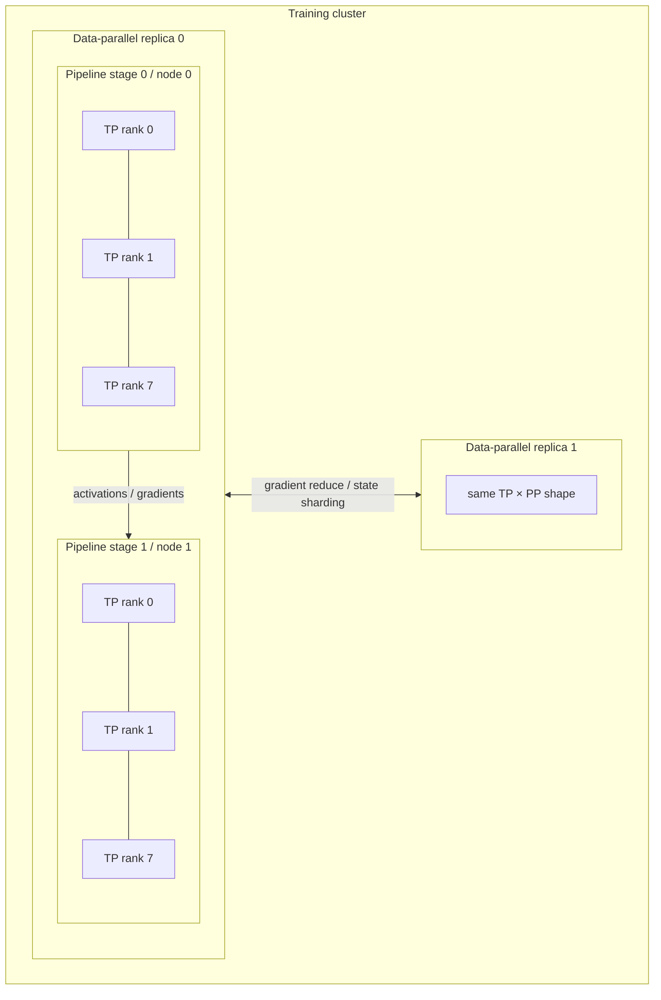

# Distributed Training Internals

## TL;DR

Distributed training is a placement problem over two ledgers: bytes that must be resident and operations that must finish before a deadline. Data parallelism replicates computation and synchronizes gradients; FSDP/ZeRO shards replicated state; tensor, sequence, context, pipeline, and expert parallelism partition different axes of the computation. None is “the scaling strategy” in isolation. The useful composition maps high-frequency communication to the fastest links, keeps each kernel large enough to use the device, stays below the optimization system's effective-batch limit, and leaves recoverable state at well-defined step boundaries. Synchronous jobs inherit the slowest rank and every collective dependency, so topology, stragglers, checkpoint commit semantics, data cursors, and numerical state are part of model correctness—not cluster plumbing. The central invariant is: **a distributed step either becomes one globally committed optimizer step with reproducible input and state, or recovery discards it everywhere.**

The orchestration layer above this — pipelines, retraining, reproducibility — is [Training Pipelines](./05-training-pipelines.md); the sibling problem of extracting FLOPs from a single accelerator at inference time is [GPU Inference Internals](../17-llm-systems/11-gpu-inference-internals.md); cluster-level sizing and cost is [ML Capacity & Cost Planning](./14-ml-capacity-cost-planning.md).

---

## Why Distribute: The Two Ledgers

### The memory ledger

Training state can be far bigger than the inference weights. For one illustrative mixed-precision Adam configuration, every parameter carries:

```
bf16 weights                     2 bytes
bf16 gradients                   2 bytes
fp32 master weights              4 bytes
fp32 Adam momentum (m)           4 bytes
fp32 Adam variance (v)           4 bytes
────────────────────────────────────────
                                16 bytes per parameter

  7B model:   112 GB of state
 70B model:   1.12 TB of state
405B model:   6.48 TB of state
```

The multiplier is not universal. An optimizer may omit fp32 master weights, quantize or factor its state, accumulate gradients in another dtype, or add auxiliary parameters. Start with an inventory of actual tensors and their sharding/replication groups instead of multiplying parameter count by a remembered constant.

That inventory still excludes **activations**—intermediate tensors retained for backward—which depend on microbatch size, sequence length, hidden dimensions, layer structure, attention algorithm, and which operations are recomputed. Activation checkpointing discards selected tensors and recomputes them during backward, trading additional compute for a lower memory high-water mark. The exact exchange depends on the checkpoint partition and fused kernels; profile it rather than assuming one fixed overhead.

### The compute ledger

For a dense decoder-only Transformer, training FLOPs are often estimated as `6 × parameters × tokens` (forward roughly `2·P·T`, backward roughly twice forward). Embeddings, attention's sequence-length-dependent terms, recomputation, sparsity, and auxiliary losses make it an estimate, not an accounting identity:

```
P = 70B parameters, T = 15T tokens
estimated useful work = 6PT ≈ 6.3 × 10²⁴ FLOPs

If a measured configuration sustains 4 × 10¹⁴ useful FLOP/s per device:
  device-seconds ≈ 6.3e24 / 4e14 ≈ 1.6 × 10¹⁰
  ideal wall time on N devices = device-seconds / N
```

The achieved rate must come from a topology-matched benchmark and include the chosen recomputation and parallel schedule. The ideal wall-time division still omits initialization, evaluation, checkpointing, failures, and lost steps. The ledgers make the design space concrete without choosing the answer: memory yields a minimum feasible placement; deadline and achieved rate yield a throughput placement; cost and optimization efficiency decide whether that placement is worth using.

---

## Data Parallelism: Replicate the Model, Average the Gradients

The baseline strategy: every worker holds a full model replica, processes a different slice of each batch, and workers reduce gradients before stepping. With the same global batch, loss reduction, optimizer definition, and numerical semantics, this targets the same mathematical update as one worker processing that global batch. Bitwise identity is a stronger promise and may fail when reduction order, kernels, or random-number streams differ.

The averaging is an **all-reduce**, and its cost is worth knowing exactly because it recurs every single step. The bandwidth-optimal ring algorithm has each of N workers send and receive

```
2 × (N-1)/N × D  ≈  2D bytes        (D = gradient bytes, N large)

Illustration: 70B parameters with 2-byte gradients gives D = 140 GB,
so a large ring moves about 280 GB per rank per synchronization.
If 50 GB/s is the achievable effective-bandwidth ceiling, bytes/bandwidth
gives a bandwidth-only transfer-time lower-bound estimate of about 5.6 s.
Collective startup, contention, topology imbalance, and protocol effects
can make the transfer longer; overlap can hide part of that elapsed
communication from the step's exposed critical path, not make the bytes
move faster than the measured path permits.
```

Three mechanisms keep this from being fatal:

- **Overlap**: gradients for late layers are ready while early layers are still doing backward. Frameworks bucket gradients and launch all-reduce on each bucket as it completes, hiding communication behind computation. A well-tuned job hides most of the 2D; a poorly-tuned one serializes compute-then-communicate and loses a third of its throughput to the network.
- **Gradient accumulation**: run k micro-batches locally, sync once. Divides communication frequency by k at the cost of a k×-larger effective batch — which is only free if you *wanted* a bigger batch (see below).
- **Hierarchical topology**: reduce or reduce-scatter within a fast locality domain, exchange the smaller necessary state across slower domains, then complete the local collective. The exact hierarchy follows measured GPU, PCIe, NUMA, NIC, node, and switch paths; advertised link rates do not equal collective bandwidth.

### The ceiling nobody escapes: batch size

Data parallelism has both a communication limit and an *optimization* limit. Holding microbatch size fixed while adding replicas enlarges the global batch. Beyond a model-, data-, optimizer-, and training-phase-dependent **critical batch size**, larger batches may stop reducing steps-to-target enough to justify their additional examples. The practical symptom is that step throughput rises while time-to-quality does not. Learning-rate schedules can change the boundary but do not create unlimited statistical efficiency. Measure tokens or examples and wall time to a fixed validation target—not only steps per second—before declaring a scaling win.

---

## ZeRO / FSDP: Shard the State Across the Replicas

Plain data parallelism replicates model state at every data rank. ZeRO and PyTorch FSDP belong to the same state-sharding family and remove different parts of that redundancy. Under the illustrative 16-byte Adam ledger above, the persistent-state floor is:

```
Persistent bytes per rank (P params, N data-parallel workers), excluding
activations, temporary all-gather buffers, allocator fragmentation, and metadata:

  Plain DP:        16P                    all state replicated
  ZeRO-1:          4P  + 12P/N            optimizer state sharded
  ZeRO-2:          2P  + 14P/N            + gradients sharded
  ZeRO-3 / FSDP:         16P/N            + parameters sharded

  70B on 64 ranks with ZeRO-3: 1.12 TB / 64 ≈ 17.5 GB per-rank
  parameter/gradient/optimizer shard, before activations and workspaces.
```

The mechanics of full sharding: parameters live sharded outside computation; before a wrapped unit runs, workers **all-gather** the needed parameters; after computation they can reshard them; gradients are **reduce-scattered** so each worker keeps its shard. Whether parameters remain materialized between forward and backward, how units are wrapped, and how far prefetch runs change both peak memory and communication. Byte-count comparisons such as “about 1.5× plain data parallel communication” assume a particular full-shard schedule and no caching; use the actual collective trace for the configuration being evaluated.

The design sensibility to absorb: **full sharding trades repeated materialization traffic for removal of replica-state redundancy.** It remains data-parallel computation; every rank participates in each wrapped unit. It is attractive when aggregate shard-group memory fits the state and parameter collectives can be hidden or tolerated. When a unit's gathered working set, activations, or collective path is still infeasible, the computation itself must be partitioned.

---

## Tensor and Pipeline Parallelism: Split the Computation

### Tensor parallelism: split the matrices

Tensor parallelism splits individual operators—commonly matrix dimensions—across ranks. Each rank computes a partial result, and collective communication assembles or redistributes activations for the next operator. The exact sequence may use all-reduce, reduce-scatter, all-gather, or fused variants, but it occurs inside the layer and microbatch dependency path; it has less opportunity for coarse overlap than end-of-backward data-parallel synchronization.

```
Consequence: TP lives or dies on measured interconnect latency and
bandwidth at the activation message sizes it generates. Keep its group
inside the fastest useful locality domain unless cross-domain profiling
proves the latency and kernel-size trade acceptable. Increasing degree
shrinks per-rank matrices; eventually communication and small kernels
cost more than the memory reduction saves.
```

### Pipeline parallelism: split the layers

Pipeline parallelism assigns contiguous layer blocks to *stages* on different nodes; activations flow forward stage-to-stage and gradients flow back. It usually communicates at fewer dependency points than tensor parallelism and can therefore tolerate a slower cross-domain path **when** activation messages, microbatch cadence, and bidirectional traffic fit the link budget and overlap with stage compute. It does not cross slow links for free: large activations, small stages, many virtual stages, congestion, or a latency-sensitive schedule can make the boundary dominant. Place and size pipeline boundaries from measured stage-to-stage transfer time, not from the categorical rule that pipeline parallelism belongs across nodes.

Its tax includes the **bubble**: stages idle while the pipeline fills and drains. For a simple flush schedule with `p` balanced stages and `m` microbatches:

```
bubble fraction = (p − 1) / (m + p − 1)

  p=8,  m=8:    47% idealized bubble
  p=8,  m=64:   ~10% idealized bubble
  p=8,  m=256:  ~3% idealized bubble

The example shows why more microbatches amortize fill/drain time, but
the formula is schedule-specific. 1F1B, interleaving, virtual stages,
and bidirectional schedules change memory and bubble behavior; stage
imbalance and communication add idle time not present in the formula.
Microbatch count also participates in global batch and activation
memory, so it is not an unconstrained bubble knob.
```

### Composing them: 3D parallelism

Real large-model jobs use all three, and the composition follows the hardware hierarchy rather than taste:

```
  TP  on the fastest useful links      → frequent activation collectives
  PP  across stage boundaries          → activation/gradient streams
  DP  across replicas                  → gradient/state synchronization

  Illustrative factorization on 512 accelerators (64 eight-device nodes):
  TP=8 (one node) × PP=4 (4 nodes = one model replica of 32 GPUs)
  × DP=16 replicas
  Per-GPU: one of 4 pipeline layer groups and one of 8 tensor shards of
  the local matrices—approximately 1/(4×8) = 1/32 of dense parameters
  when stages are balanced, not 1/32 of the layers times another 1/8.
  The placement must also fit activations; global batch =
  16 × microbatches × micro size.
```

The knobs interact: raising pipeline degree can ease per-stage parameter memory but increases scheduling and balance pressure; raising tensor degree shrinks per-rank kernels and increases frequent communication; raising data-parallel degree enlarges the global batch unless another dimension changes. Published configurations are hypotheses tied to their model and topology. Build a memory/communication estimate, then profile candidate layouts on the real placement before committing a full run.



The diagram is a topology contract. High-frequency tensor collectives stay on the node's fastest fabric; pipeline boundaries cross nodes with one activation stream; data-parallel synchronization spans replicas and is overlapped with backward. A scheduler that assigns the right number of accelerators but maps these dimensions onto the wrong links can make a mathematically sensible plan unusable.

## Collective Cost and Topology Mapping

Collective communication follows an `α–β` model:

```text
time(message_bytes M) ≈ α × synchronization_rounds + β × bytes_transferred

α = per-round latency and software synchronization cost
β = inverse effective bandwidth (seconds/byte)
```

Large gradient buckets are bandwidth-bound, so ring all-reduce—with many rounds but near-optimal bytes—is effective. Tiny per-layer tensor-parallel messages can be latency-bound, so a tree or topology-specific collective may win despite moving different bytes. “The fabric is 400 Gb/s” is not an input to the model until benchmarked through the actual collective, message-size range, rank count, NIC/GPU direct-memory path, and concurrent traffic. Effective bandwidth can be far below line rate because PCIe topology, NUMA placement, switch oversubscription, routing, protocol overhead, or another job shares the path.

Model a hierarchical all-reduce as two collectives, not one average link: reduce-scatter inside each node, inter-node collective among node representatives or shards, then all-gather inside the node. The slow fabric sees less traffic and the fast fabric absorbs the local expansion. Modern libraries choose algorithms dynamically, but the training team still needs per-bucket traces: a library cannot fix ranks placed across a split PCIe tree or an oversubscribed rack.

Overlap is also a dependency graph, not a checkbox. A gradient bucket can launch only when every parameter in it has a gradient; a single late layer delays the whole bucket. Buckets that are too large expose little overlap, while buckets that are too small pay `α` repeatedly and increase launch overhead. Parameter order, bucket construction, backward graph, and network streams together determine whether the advertised communication is actually hidden. The decisive profile is a timeline showing kernels, collectives, input, and idle gaps on every rank—not a single utilization percentage.

## Sequence, Context, and Expert Parallelism

Long sequences create an activation problem even when parameters fit. **Sequence parallelism** shards operations whose inputs can be partitioned along tokens—layer normalization, dropout, and parts of attention/MLP processing—across tensor-parallel ranks, avoiding replicated activations. **Context parallelism** goes further and partitions the attention sequence itself. Each rank owns a span of queries and must obtain the keys/values needed to attend across the full context, commonly through ring-style exchange. The memory reduction is close to the context-parallel degree, but communication grows with activation size and the attention algorithm must preserve causal masking and numerical equivalence across partitions.

The placement rule mirrors TP: context exchange happens every layer, so keep the group on fast links when possible. It is attractive when context length, rather than parameter state, is the limiting dimension; it is wasteful for short sequences where communication and smaller kernels dominate. Sequence packing matters too. Padding every example to the longest sequence in a batch can burn most FLOPs on padding, while naive packing can let tokens attend across document boundaries or leak examples. The attention mask and position IDs are part of training correctness, not loader optimization details.

Mixture-of-experts models add **expert parallelism**. A router sends each token to a small top-k subset of experts, and ranks exchange token activations with an all-to-all before and after expert computation:

```text
tokens per rank
  → router probabilities
  → top-k expert assignments
  → all-to-all dispatch
  → local expert MLPs
  → all-to-all combine
  → weighted output
```

Unlike dense TP, communication volume depends on routing and can become imbalanced. One popular expert receives more tokens, fills its capacity, and becomes both a straggler and a quality problem if overflow tokens are dropped. Capacity factor reserves slots above the expected uniform load; auxiliary load-balancing loss encourages even routing; expert replication places hot experts more than once; token dropping or rerouting defines overload semantics. Each choice couples systems and learning behavior. A tight capacity factor saves memory but changes which tokens receive expert computation. An aggressive balancing loss protects throughput but may make the model choose less appropriate experts. Monitor per-expert token counts, dropped/rerouted tokens, dispatch bytes, all-to-all time, and expert utilization alongside training loss.

For sparse models, distinguish **active parameters per token** from total stored parameters. Compute scales mainly with active experts, but memory and checkpoint size scale with total experts, and all-to-all scales with routed activation traffic. Capacity plans that use only active parameter count underestimate model load and recovery; plans that use total count for FLOPs overestimate compute. The two ledgers diverge more sharply than in a dense model.

## Precision, Numerics, and Distributed Correctness

Mixed precision is part of the parallel system. `bf16` has fp32's exponent range and usually avoids loss scaling; `fp16` has a narrower range and commonly needs dynamic loss scaling; fp8 paths require per-tensor or block scaling, delayed scale updates, and kernels/hardware that implement the assumed format. Master weights and optimizer states may remain fp32 even when matmuls use lower precision. Reductions accumulate values from many ranks, so accumulation dtype and reduction order affect error.

Floating-point addition is not associative: `(a+b)+c` can differ from `a+(b+c)`. Changing world size, collective algorithm, bucket order, compiler fusion, or pipeline schedule can change rounding and therefore the exact trajectory. Reproducibility must declare its level: bitwise replay on identical topology, statistically equivalent training within tolerances, or only comparable final evaluation. Promising bitwise identity while allowing the collective tree and kernel set to change is incoherent.

Numerical safety signals need rank-level provenance. Track loss scale, non-finite gradients, gradient norm before and after clipping, parameter/update norms, activation extrema, router statistics, and optimizer state health. A global mean can hide one rank producing corrupt values just before all-reduce spreads them everywhere. Sample per-rank checksums or known-answer kernels during burn-in, quarantine hardware with repeatable deviations, and record the exact topology and library versions in the training run. “Loss became NaN” is the final symptom; the useful signal is which tensor, rank, and step first violated its expected range.

## Global-Step Semantics and State Ownership

A parallel job needs one definition of a training step. For data-parallel degree `D`, `M` accumulation microbatches per replica, and microbatch size `b`, the nominal global batch is:

```text
B_global = b × M × D
```

Tensor and pipeline ranks cooperate on the same examples and do not multiply `B_global`. Sequence/context ranks split tokens of those examples. Expert ranks receive routed tokens. Confusing a compute-partition dimension with a data-replica dimension changes loss normalization and learning-rate semantics without an obvious crash.

The coordinator owns the monotonically increasing **committed optimizer step** and the global data cursor. Ranks own temporary activations and gradient shards for the current attempt. A synchronous attempt follows a logical state machine:

```text
PREPARED(step, data_range, rng_epoch)
  → FORWARD_COMPLETE
  → GRADIENTS_REDUCED
  → OPTIMIZER_APPLIED
  → STEP_COMMITTED(step + 1)
```

The implementation does not need a database transaction per step, but it needs fail-stop semantics across the process groups. If a rank disappears or collective completion is ambiguous before every shard has applied the update, the surviving ranks cannot safely continue by assuming their local step is authoritative. Abort the affected job membership and restore a globally consistent checkpoint, unless the algorithm explicitly provides a consensus/reconstruction protocol for in-memory state. A heartbeat that says “rank alive” is weaker than collective progress; monitor both.

Loss normalization belongs in the contract. Variable-length packing, dropped samples, expert token dropping, or a final short microbatch can make the number of contributing tokens differ by rank. Reducing per-rank mean gradients weights small and large token sets equally; reducing summed loss gradients and dividing by the global valid-token count gives different mathematics. Record and reduce the denominator that matches the objective.

### Membership changes are optimizer changes

Elastic infrastructure can replace ranks, but changing data-parallel degree changes `B_global` unless accumulation or microbatching changes with it. It can also change collective order, shard ownership, data assignment, and optimizer hyperparameter assumptions. Safe resize occurs at a committed boundary: stop admitting a new step, publish or materialize consistent state, establish a new membership epoch, reshard, restore data/RNG state, recompute the batch plan, and only then resume. “Elastic” should mean the protocol automates those changes—not that convergence is invariant to them.

Parallel groups and rank placement are versioned run metadata:

```yaml
membership_epoch: 7
world_size: 512
dimensions: {data: 16, pipeline: 4, tensor: 8}
rank_mapping_hash: sha256:...
global_batch: 2048
loss_denominator: valid_tokens
data_cursor: {manifest: "corpus@sha256:...", global_sequence: 918273645}
```

This makes a resume explainable and lets tooling detect a world-size change that would silently alter the optimizer trajectory.

## Checkpoints Are Distributed Transactions

A valid checkpoint is a consistent cut across model parameters, optimizer state, scheduler, gradient scaler, RNG streams, data sampler/cursor, curriculum state, and parallelism metadata. A directory containing most rank shards is not a degraded checkpoint; it is an uncommitted attempt.

1. Freeze or copy a state associated with committed step `s` using a barrier, copy-on-write buffers, or a framework protocol with equivalent consistency.
2. Each rank writes its shard to an attempt-scoped namespace and reports hash, size, and logical shard ownership.
3. A finalizer verifies the expected shard set, rejects duplicate/missing ownership, and writes a manifest that also pins code, runtime, dataset, topology, and state-schema versions.
4. One atomic metadata commit publishes `checkpoint(s) → manifest_hash`.
5. Only published manifests may become restart or retention roots; abandoned attempts are garbage-collected after in-flight writes cannot be mistaken for orphans.

Asynchronous checkpointing shortens the training pause only if the in-memory snapshot is stable while background I/O runs. Draining live optimizer buffers while the next step mutates them produces a fast, corrupt checkpoint. Double buffering, host snapshots, or explicit copy completion owns that consistency cost. Incremental checkpoints add a dependency chain: recovery time and garbage collection must include every reachable base and delta, and periodic compaction prevents an old base from becoming a single point of failure.

Restore is a tested protocol, not the inverse of write by assumption. Verify manifest and shard hashes, state-schema compatibility, resharding rules, data availability, membership epoch, and a short known-answer continuation. Periodically restore onto a different but supported topology if that is part of disaster recovery. The [dataset chapter](./11-dataset-management-versioning.md) defines how the data manifest remains reachable; the [model registry](./13-model-registry-metadata.md) defines how a completed training result becomes a governed release artifact.

---

## The Parts That Aren't Matrix Math

### The input pipeline must outrun the GPUs

A training step consumes the global batch's valid tokens; the storage and preprocessing path has to deliver them before the compute schedule needs them:

```
required_examples/s = committed_steps/s × examples/step
required_bytes/s    = required_examples/s × encoded_bytes/example
```

The byte rate must use encoded/decompressed representation at the constrained stage; compressed object-store throughput and host-to-device throughput are different ledgers. This is a storage-systems problem ([Training Pipelines](./05-training-pipelines.md) covers formats and sharding); the distributed-training-specific requirements are **global assignment and resumability**. Every data replica must receive the intended disjoint range, and a restart must continue from the checkpoint's global sequence without silently repeating or skipping examples. Exact sample order may or may not be a reproducibility requirement, but the chosen guarantee must be stated and tested. Data-order bugs surface as unexplained loss differences, sample duplication, or evaluation contamination long after ingestion.

### Stragglers: the max() over workers

A synchronous step completes when the *slowest* participant finishes. At scale this transforms rare slowness into constant slowness:

```
If each of N ranks independently has probability p of a slow event in
a step, the chance at least one rank is slow is:

  P(any slow) = 1 - (1 - p)^N

Even small p becomes visible at large N. Correlated events such as a
congested switch or shared storage pause are worse than this independent
model and must be measured at their failure-domain level.
```

Defenses include pre-flight burn-in to quarantine repeatably weak hardware, per-rank and per-collective timing, topology-aware placement, and a replacement/restart policy that is faster than debugging a live collective. Asynchronous optimization changes the learning algorithm by admitting stale updates; it is a valid design only when its convergence behavior is intentionally evaluated, not a transparent infrastructure fix for synchronous stragglers.

### Failure math and checkpointing

An independent constant-hazard model is a useful first estimate, although real failures are correlated and non-stationary:

```
If one component's assumed mean time between failure is M and there are
N independent required components, the first-order fleet MTBF is M/N.

As one empirical case, Meta reported 466 interruptions during a 54-day
observation window of Llama 3 405B pre-training. Treat this as evidence
that recovery dominates at that scale, not as a failure rate portable
to another fleet.

For a synchronous job whose process group fails as a unit, one required
rank failure stops useful progress. Under failures uniform within the
checkpoint interval, expected lost device-time per failure is roughly:
  (checkpoint_interval / 2 + restart_time) × allocated_devices

Optimal checkpoint interval (Young/Daly):
  τ* ≈ sqrt(2 × δ × MTBF)      δ = time to write a checkpoint
```

The interval approximation is a starting point. Its independent-failure assumptions, checkpoint cost, restart time, and lost-work distribution must be checked against the fleet's measurements; maintenance events and network failures can interrupt many ranks together.

The optimization pressure is why checkpoint architecture matters: shard writes across ranks instead of funneling multi-terabyte state through one coordinator; snapshot stable buffers and drain to [object storage](../03-storage-engines/08-object-storage.md) asynchronously where bandwidth permits; or add peer/local redundancy when the recovery protocol can reconstruct a globally consistent state. Lower pause time permits more frequent protection, but background bandwidth, incremental-chain restore time, and publication consistency remain in the ledger.

The end-to-end operational metric is **training goodput**: the fraction of allocated device-time spent on committed work that contributes to the retained run, after replay, stalls, initialization, and recovery. Define the denominator and treatment of evaluation/checkpoint work explicitly. A high step-throughput job can have poor goodput when it repeatedly loses recent steps.

---

## MFU and Goodput Answer Different Questions

**Model FLOPs Utilization (MFU)** compares estimated model work with device peak:

```text
MFU = estimated_model_FLOPs_per_token × committed_tokens_per_second
      -------------------------------------------------------------
      devices × applicable_peak_FLOPs_per_device
```

For the dense-Transformer approximation, the numerator may use `6P × tokens/s`. The denominator must name precision, dense-versus-sparse peak convention, and device SKU. MoE needs active-parameter or operator-aware accounting; activation recomputation performs real hardware work that the simple useful-model numerator intentionally does not credit. Those choices make MFU a defined metric for one workload family, not an absolute ranking across arbitrary models.

MFU answers “how effectively does this configuration turn theoretical arithmetic capacity into modeled useful computation while it runs?” It does not include whether the chosen global batch reaches quality efficiently, whether recent steps will be discarded after failure, or whether the allocated job sat queued. **Time-to-quality** captures optimization efficiency; **training goodput** captures retained progress over elapsed allocated time; cost per accepted model captures the economic result. A complete comparison reports all three.

Decompose step time on the measured critical path:

```text
T_step = T_device_compute
       + T_exposed_collective
       + T_pipeline_idle
       + T_input_wait
       + T_host_or_launch
       + T_straggler_excess
```

Overlapped work is counted only in the dominant term, so the decomposition comes from a rank-correlated timeline rather than adding profiler summaries. Compare candidates at the same model, sequence mix, precision, checkpoint policy, and quality target. There is no universal “good MFU” threshold: small models, long-context attention, MoE routing, network topology, and recomputation have different ceilings. The useful baseline is a roofline or best-known configuration for the same workload and hardware, followed by attribution of the measured gap.

## Operational Observability and Security Boundaries

Fleet averages erase the causal rank. Emit step, microbatch, and collective IDs so timelines across ranks can be joined. Track data-ready time, kernel and collective spans, message bytes, effective collective bandwidth, pipeline-stage idle, valid tokens, memory high-water mark, allocator retries, thermal/ECC/NIC signals, checkpoint pause/background bandwidth, membership epoch, and committed step. Keep low-rate per-rank detail plus triggered high-resolution traces around stalls, non-finite values, membership change, and checkpoint/restore. An accelerator “utilization” gauge cannot distinguish useful matmul, a spinning collective, or work that will be replayed.

Progress monitoring must run outside the blocked process group. A rank may be alive while its training thread waits forever in a collective; conversely, a long compilation or checkpoint can look stalled unless the phase is known. Watchdog policy uses phase-specific deadlines, identifies the earliest rank/collective that stopped advancing, captures evidence, then aborts and recovers consistently. Killing one process without fencing the rest can leave old ranks communicating with a replacement membership.

Training infrastructure crosses valuable trust boundaries. Checkpoints contain model weights and often optimizer statistics that may reveal more than the final release; dataset manifests expose sensitive provenance; worker credentials can read large corpora and write trusted artifacts. Use workload identity scoped to exact input manifests and attempt prefixes, isolate tenants at scheduler/network/storage layers, encrypt checkpoint and transport paths, and prevent arbitrary experiment code from acquiring registry-promotion credentials. The finalizer—not a worker rank—publishes checkpoint and model manifests.

Integrity is equally important. Pin and attest training images and extensions, verify checkpoint shards and dataset manifests by hash, record code/runtime/topology provenance, and quarantine nodes with repeatable numerical or communication anomalies. A compromised or faulty rank can contaminate a collective before global loss changes. Per-rank numeric sentinels and sampled checksums provide earlier evidence, while the immutable lineage path supports impact analysis after discovery.

---

## Failure Modes

**Collective stall that looks like compute.** One rank or link stops advancing; every dependent rank blocks inside a collective while device activity may remain nonzero. Defense: phase-aware collective timeouts, progress heartbeats outside the process group, earliest-rank traces, membership fencing, and automated restore from a published checkpoint.

**Dataloader starvation misdiagnosed as device inefficiency.** Step time is high, coarse utilization looks busy, and kernel tuning cannot move throughput. Defense: correlate data-ready spans across ranks and locate whether object reads, decompression, tokenization, host memory, or device copies precede the idle gap.

**Silent semantic divergence after restart.** Resume mishandles the data cursor, scheduler, scaler, RNG, or membership-dependent batch plan; loss remains plausible but the resumed run is a different experiment. Defense: publish complete state, run controlled interrupted-versus-uninterrupted continuations, and compare at the declared reproducibility level rather than promising bitwise identity on unsupported topology changes.

**One-rank numerical corruption becomes global.** A non-finite or silently incorrect shard enters a reduction and contaminates every replica. Defense: per-rank pre-collective numeric checks where affordable, gradient/update norms, hardware error correlation, deterministic burn-in tests, and a globally coordinated abort/skip policy that advances optimizer and data state consistently on every rank.

**Topology-blind placement.** The scheduler grants 512 GPUs scattered across the datacenter; rings cross oversubscribed spine links; all-reduce runs at a fraction of node-local speed. Gang scheduling with topology awareness (whole racks/pods, [ML Capacity & Cost Planning](./14-ml-capacity-cost-planning.md)) is a first-order throughput factor, not an infra nicety.

**Cargo-culted parallelism configs.** A 3D config tuned for one fabric (NVLink+NDR InfiniBand) transplanted onto slower cloud networking inverts its trade-offs — TP across nodes, PP with too few microbatches. The published config encodes someone else's hardware; re-derive from your own bandwidth numbers.

**Partial optimizer step survives a failure.** Some ranks apply an update before another rank dies, and survivors continue under a replacement membership. Defense: treat ambiguous step completion as uncommitted, fence the old membership, and restore one globally consistent state.

**Fast asynchronous checkpoint captures mixed steps.** Background writers read buffers while the optimizer mutates them. Every file is present and checksum-valid, but the set never existed at one logical step. Defense: stable snapshot buffers or copy-on-write plus a manifest published only after global step-consistency checks.

**Loss normalization changes with packing.** Ranks average gradients over different valid-token counts, so padding or dropped examples changes their weight in the global update. Defense: reduce the numerator and the intended global denominator explicitly and test irregular final microbatches.

**Membership resize silently changes optimization.** Elastic recovery adds or removes data replicas, changing global batch and sample order. Defense: resize at a committed epoch boundary, reshard deliberately, and recompute/record batch and schedule semantics.

**Expert hot spot becomes a learning bug.** Router imbalance saturates an expert; overflow is dropped or rerouted, changing both step time and the learned objective. Defense: observe per-expert load and overflow, model all-to-all capacity, and evaluate the quality effect of capacity/balancing policy.

**Checkpoint access bypasses release governance.** Experiment workers can overwrite retained state or publish a checkpoint as an approved model. Defense: attempt-scoped write identities, immutable hashes, a separate finalizer, and registry promotion credentials unavailable to training code.

---

## Decision Framework

Choose parallelism by the tensor or schedule that fails the feasibility test:

| Binding condition | Candidate mechanism | Cost to validate |
|---|---|---|
| Full state fits per device and global batch can use more replicas | Data parallelism | Gradient collective exposure and time-to-quality at larger batch |
| Replicated optimizer/gradient/parameter state exceeds memory | FSDP/ZeRO sharding | Gather/reduce-scatter bytes, wrap granularity, memory high-water mark |
| Individual operators or their working sets remain too large | Tensor parallelism | Critical-path activation collectives and shrinking per-rank kernels |
| Layer groups fit but whole depth does not | Pipeline parallelism | Schedule bubble, stage balance, activation transfer, microbatch budget |
| Long-sequence activations or attention state dominate | Activation recomputation, sequence/context parallelism | Extra compute, token exchange, masking and numerical correctness |
| Sparse experts dominate storage/routing | Expert parallelism and possibly expert replication | All-to-all, hot experts, overflow semantics, quality impact |
| Calendar deadline requires more devices but DP batch is inefficient | Increase model-parallel work per replica before DP degree | Memory/communication trade and measured time-to-target |

Then require the operating design to answer:

1. What exact tensor inventory sets the memory high-water mark at each rank, including activations and temporary workspaces?
2. Which collective messages cross which physical links, at what sizes and frequency, and how much is exposed on the step critical path?
3. What is the global-batch and valid-token denominator, and how does it behave under accumulation, packing, and membership change?
4. What state makes a step committed, and what happens after ambiguous collective or optimizer completion?
5. Does a checkpoint represent one committed step across model, optimizer, RNG, scheduler, and data cursor, and can it be restored on the promised topology?
6. Which rank, stage, expert, link, or input shard causes a slow step, and is telemetry sufficient to establish that causality?
7. Are MFU, training goodput, time-to-quality, and cost compared under the same workload and recovery policy?
8. Which identities may read data, write attempts, finalize checkpoints, and promote a release artifact?

---

## Key Takeaways

1. Build the actual tensor-state and operation ledgers; bytes per parameter and `6PT` are explicit approximations, not universal constants.
2. Data parallelism is constrained by both exposed gradient communication and optimization efficiency at the resulting global batch.
3. FSDP/ZeRO removes replicated state by paying parameter-materialization and gradient-sharding communication; wrap and reshard policy determine the real exchange.
4. Tensor, pipeline, sequence/context, and expert parallelism split different dependencies and must be mapped to the physical topology they communicate over.
5. A synchronous step is a global state transition: ambiguous partial completion is discarded across the affected membership.
6. Global loss denominators, data cursors, RNG, scheduler, scaler, and membership epoch are training state, not incidental process memory.
7. Checkpoints are distributed transactions whose manifest publishes one consistent committed step; asynchronous I/O still requires a stable snapshot.
8. Elastic resize changes batch, shard, collective, and often numerical semantics, so it occurs at an explicit membership boundary.
9. Synchronous speed is controlled by the slowest required dependency; per-rank correlated timelines are more useful than fleet-average utilization.
10. MFU measures arithmetic efficiency for a defined workload, training goodput measures retained progress, and time-to-quality measures optimization outcome.
11. Security boundaries separate experiment code, checkpoint finalization, and registry promotion while hashes and attestations protect lineage integrity.
12. Recovery claims require repeated restore-and-continue tests, including any alternate topology promised for disaster recovery.

---

## References

1. [Megatron-LM: Training Multi-Billion Parameter Language Models Using Model Parallelism](https://arxiv.org/abs/1909.08053) — Shoeybi et al., 2019
2. [ZeRO: Memory Optimizations Toward Training Trillion Parameter Models](https://arxiv.org/abs/1910.02054) — Rajbhandari et al., 2020
3. [GPipe: Efficient Training of Giant Neural Networks Using Pipeline Parallelism](https://arxiv.org/abs/1811.06965) — Huang et al., 2019
4. [Efficient Large-Scale Language Model Training on GPU Clusters Using Megatron-LM](https://arxiv.org/abs/2104.04473) — Narayanan et al., 2021
5. [Accurate, Large Minibatch SGD: Training ImageNet in 1 Hour](https://arxiv.org/abs/1706.02677) — Goyal et al., 2017
6. [An Empirical Model of Large-Batch Training](https://arxiv.org/abs/1812.06162) — McCandlish et al., 2018
7. [PaLM: Scaling Language Modeling with Pathways](https://arxiv.org/abs/2204.02311) — Chowdhery et al., 2022
8. [The Llama 3 Herd of Models](https://arxiv.org/abs/2407.21783) — Grattafiori et al., 2024
9. [MegaScale: Scaling Large Language Model Training to More Than 10,000 GPUs](https://www.usenix.org/conference/nsdi24/presentation/jiang-ziheng) — Jiang et al., NSDI 2024
10. [A Higher Order Estimate of the Optimum Checkpoint Interval for Restart Dumps](https://doi.org/10.1016/j.future.2004.11.016) — Daly, 2006
11. [PyTorch FSDP: Experiences on Scaling Fully Sharded Data Parallel](https://arxiv.org/abs/2304.11277) — Zhao et al., 2023
12. [PyTorch FullyShardedDataParallel Documentation](https://docs.pytorch.org/docs/stable/fsdp.html) — sharding and reshard semantics
13. [NVIDIA NCCL Collective Operations](https://docs.nvidia.com/deeplearning/nccl/user-guide/docs/usage/collectives.html)
