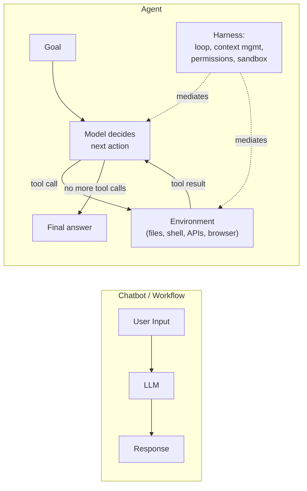
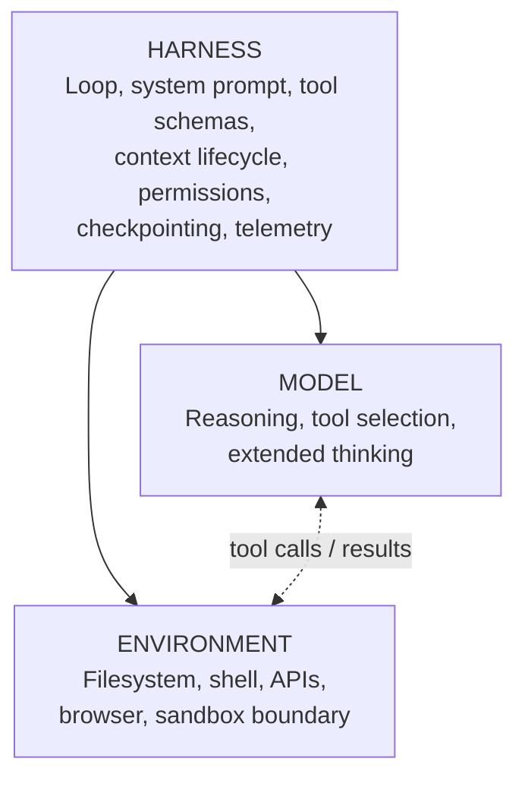
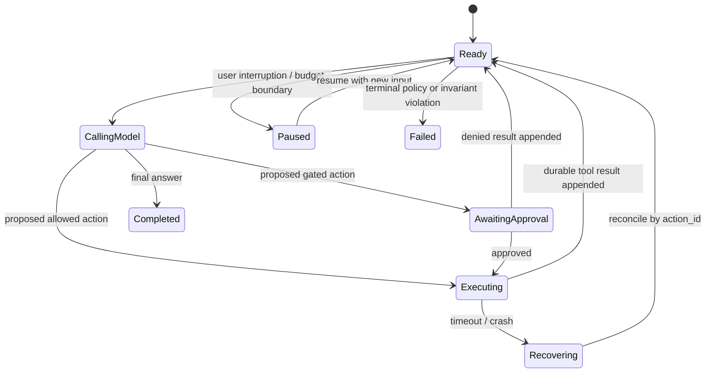
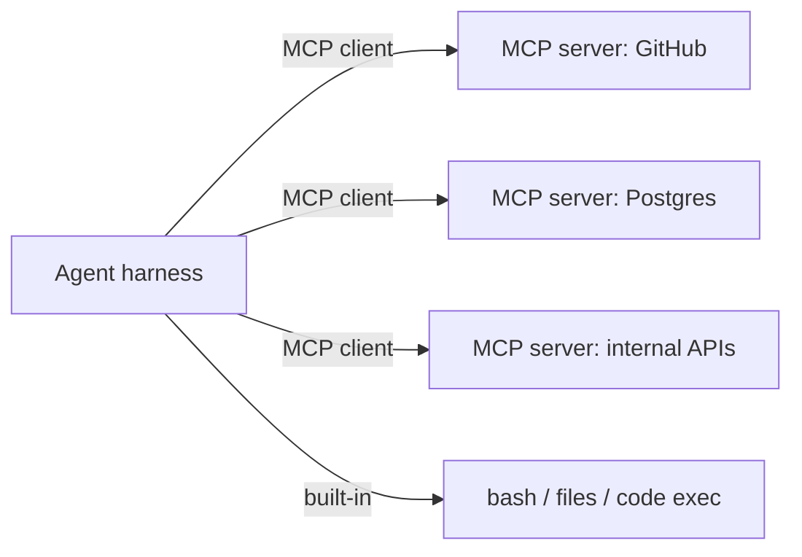
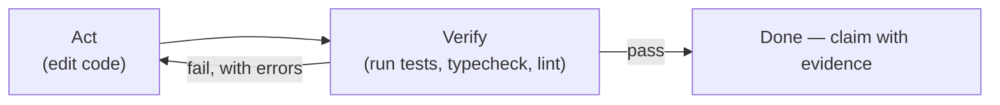

# LLM Agent Fundamentals

## TL;DR

An agent is a model using tools in a loop against an environment. The model supplies reasoning; the **harness** — the loop, tool definitions, context management, permissions, and sandbox you build around it — determines how much of that reasoning turns into useful work. Modern agents use native tool calling (typed JSON schemas, parallel calls) rather than text-parsed prompts, treat the context window as working memory backed by files and compaction, verify their own work against ground truth (tests, linters, screenshots), and run inside permission-gated sandboxes. Design the environment and the feedback loops first; the model is the most replaceable component.

---

## What Makes an Agent Different from a Chatbot?



A chatbot maps one input to one output. A **workflow** chains LLM calls along a code path you wrote. An **agent** lets the model direct its own process: it decides which tool to call next based on what the last tool returned, and it keeps going until the goal is met or the harness stops it. That autonomy is the value and the risk — agents handle tasks you couldn't enumerate steps for, and they fail in ways you didn't enumerate either.

| Aspect | Chatbot | Workflow | Agent |
|--------|---------|----------|-------|
| Control flow | None | Your code | The model |
| Actions | Text only | Predefined LLM calls | Tools chosen at runtime |
| Steps | 1 | Fixed | Open-ended, bounded by harness |
| Failure mode | Bad answer | Bad step output | Compounding drift across steps |
| Cost profile | Predictable | Predictable | Variable — budget in the harness |
| Right for | Q&A | Decomposable, known tasks | Open-ended tasks with verifiable outcomes |

Start with the simplest form that solves the problem. Most production "agent" systems are workflows, and should be — see [Orchestration Patterns](./02-orchestration-patterns.md) for the taxonomy.

## The Three Components



- **Model.** Frontier models are post-trained specifically for agentic tool use: they natively interleave reasoning with tool calls, recover from errors, and sustain multi-hour tasks. Capability differences between models matter, but a mediocre harness wastes a frontier model — public coding benchmarks always report a *model + harness* pair, never a model alone.
- **Harness.** Everything between the model and the world. This is where most engineering effort goes; see [Harness Engineering](./09-harness-engineering.md) for the full treatment.
- **Environment.** What the agent can observe and change. The richer and more inspectable the environment (a real shell, a real filesystem, real test suites), the better the agent's feedback loops. Design environments so that progress is *observable* — an agent that can run the tests doesn't need to guess whether its change worked.

---

## The Agent Loop

The 2023-era pattern — prompt the model to emit `Thought: / Action: / Action Input:` text and parse it with regexes — is obsolete. Every major API exposes **native tool calling**: you declare tools as JSON Schema, the model returns typed tool-call blocks, and you return results as structured messages. No parsing, no format drift, parallel calls for free.

```python
import anthropic

client = anthropic.Anthropic()

TOOLS = [
    {
        "name": "bash",
        "description": "Run a shell command in the project sandbox. "
                       "Returns stdout and stderr, truncated to 50KB.",
        "input_schema": {
            "type": "object",
            "properties": {
                "command": {"type": "string", "description": "Command to execute"},
            },
            "required": ["command"],
        },
    },
    {
        "name": "edit_file",
        "description": "Replace an exact string in a file. Fails if the string "
                       "is not found or matches more than once.",
        "input_schema": {
            "type": "object",
            "properties": {
                "path": {"type": "string"},
                "old": {"type": "string"},
                "new": {"type": "string"},
            },
            "required": ["path", "old", "new"],
        },
    },
]

def agent_loop(task: str, max_turns: int = 50) -> str:
    messages = [{"role": "user", "content": task}]

    for _ in range(max_turns):
        response = client.messages.create(
            model="claude-sonnet-4-6",
            max_tokens=8192,
            system=SYSTEM_PROMPT,          # stable across turns: prompt-cache friendly
            tools=TOOLS,
            messages=messages,
        )

        if response.stop_reason != "tool_use":
            return next(b.text for b in response.content if b.type == "text")

        # Append the assistant turn verbatim, then execute every tool call
        # in it (the model may request several in parallel).
        messages.append({"role": "assistant", "content": response.content})
        results = [
            {
                "type": "tool_result",
                "tool_use_id": block.id,
                "content": execute_tool(block.name, block.input),
            }
            for block in response.content
            if block.type == "tool_use"
        ]
        messages.append({"role": "user", "content": results})

    raise RuntimeError("max_turns exceeded — task did not converge")
```

The OpenAI equivalent uses `tools=[{"type": "function", ...}]` and `tool_calls` on the response; the shape of the loop is identical. The legacy `functions` / `function_call` parameters are deprecated.

What the production version adds on top of this skeleton:

1. **Permission gate** before `execute_tool` — classify actions as read / write / irreversible and require approval for the last class.
2. **Token budget accounting** — track context usage every turn; trigger compaction before overflow (see [Context Management](./08-context-management.md)).
3. **Checkpointing** — persist `messages` so a crashed or interrupted run resumes instead of restarting.
4. **Telemetry** — record every turn as a trace span: tool name, latency, tokens, cache hit rate.
5. **Streaming and interruption** — surface partial output and let a human steer mid-run.

### Extended thinking

Reasoning-capable models can emit internal thinking tokens before acting, and *interleave* thinking between tool calls — reflect on a result before choosing the next action. This replaced most prompt-level reasoning scaffolds (Chain-of-Thought, Tree-of-Thought); you control it with a thinking budget parameter rather than prompt tricks. Spend the budget where verification is hard and steps are irreversible; keep it low for mechanical tool-use sequences.

---

## Execution Semantics: The Loop Is a Durable State Machine

The toy loop keeps `messages` in process memory. A production agent has a durable **run** containing ordered **turns**, each turn may propose one or more **actions**, and each action has an execution record. These identities solve different ambiguity problems:

```text
run_id       names one user goal and its durable lifetime
turn_id      names one model invocation against a specific context snapshot
action_id    names one logical side effect requested by that invocation
attempt_id   names one infrastructure attempt to execute the action
```

If the model call times out, the harness must determine whether the provider created a response before retrying or accept that it may pay twice. If a tool call times out, the more dangerous ambiguity is whether the side effect happened. Retrying `read_file` is harmless; retrying `send_payment` with a new identity can pay twice. The tool contract therefore carries `action_id` as an idempotency key, stores the first committed result, and returns it on repeated attempts. Attempt identity is for telemetry; logical action identity is for correctness.



State must commit around side effects. A safe sequence is: persist the proposed action; obtain policy/approval; execute with the stable action ID; persist the result; then expose that result to the next model turn. A crash between execution and result persistence is reconciled by querying the tool with the same action ID or reading its idempotency record. “Exactly once” is not supplied by an agent framework—it is approximated at each side-effect boundary using the same outbox, idempotency, and reconciliation patterns as any distributed workflow.

Parallel tool calls add a join. Reads against an immutable snapshot may execute freely. Writes that overlap the same resource need ordering or optimistic concurrency (expected file hash, row version, ETag). Tool results are appended in a deterministic order keyed by tool-call identity even if completion order varies; otherwise a replay can assemble a different context and send the model down a new path. Cancellation also has semantics: stop scheduling new actions, attempt to cancel running ones, mark actions whose outcome is unknown, and reconcile them before resume. Killing the process is not cancellation.

Durability does not mean storing unrestricted transcripts forever. Persist structured state, tool references, hashes, approvals, costs, and the context snapshot needed to reproduce a turn. Store sensitive raw inputs and outputs under separate access and retention policy, because transcripts may contain credentials, personal data, or proprietary documents. A resumable system that violates data minimization is not mature; it has merely made its privacy exposure durable.

---

## Tools

Tools are the agent's API to the world. Tool design is prompt engineering with a type system — the model reads your schemas and descriptions the way a new hire reads your docs, and ambiguity costs you real tokens and wrong calls.

### Design principles

1. **Few, orthogonal tools beat many overlapping ones.** Every tool competes for the model's attention in every turn. If two tools can accomplish the same thing, the model will sometimes pick the worse one. Consolidate (`search_logs(filters)` rather than five log tools).
2. **Descriptions are micro-prompts.** State what the tool does, when to use it over its neighbors, what it returns, and its failure modes. The `edit_file` description above tells the model *how to avoid* the two common failure cases.
3. **Token-efficient outputs.** Return what the model needs to decide the next step — truncate, paginate, summarize. A tool that dumps a 200KB JSON blob into context does more damage than one that errors.
4. **Errors that teach.** `"File not found: src/uesr.py — did you mean src/user.py?"` lets the model self-correct in one turn. A bare stack trace often costs three.
5. **Idempotent and safe to retry** wherever possible — the loop *will* retry.

### General-purpose vs. structured tools

The highest-leverage tools in practice are the general-purpose ones: **a shell, file read/write/edit, and code execution**. A bash tool subsumes hundreds of specialized tools, and writing a script is often more token-efficient than chaining ten tool calls — the "code execution as tool use" pattern has the agent *write a program* that calls APIs in a loop instead of making each call through the context window. Add structured tools where types and guardrails matter: payments, ticket updates, anything irreversible.

### MCP: the integration standard

The Model Context Protocol (MCP) standardizes how tools, resources, and prompts are exposed to agents — an MCP server wraps a system (GitHub, Postgres, Slack, a browser) once, and any MCP-capable harness can use it. Treat MCP servers as third-party dependencies: review what they expose, pin versions, and remember that every connected server's tool descriptions enter your prompt (use deferred loading / tool search when the catalog is large). Coverage in depth: [Coding Agent Tool Design](../19-compound-engineering/02-coding-agent-tool-design.md).



---

## Memory and Context

The context window is the agent's working memory, and it is the scarcest resource in the system. Two findings shape everything: effective attention degrades as context fills ("context rot" — models recall the middle of a long context worse than the edges), and inference cost scales with every token you keep resending. Long-horizon agents are therefore built on **context hygiene**, not maximal context.

| Layer | Mechanism | Survives |
|-------|-----------|----------|
| Working memory | The message list itself | One run, until compaction |
| Compaction summary | Model summarizes the transcript; harness restarts the loop with the summary + recent turns | Context overflow |
| File-based memory | Agent writes notes, plans, TODOs to disk (`NOTES.md`, scratch files) and re-reads them | The session — and the next one |
| Project memory | Curated instruction files (`CLAUDE.md`-style) loaded every session | The project |
| Retrieval | Search tools over a corpus or past episodes | Everything else |

Practical defaults:

- **Compaction** preserves decisions, constraints, file paths, and learned gotchas; it discards raw tool output. Trigger it at a threshold (e.g., 80% of the window), not at overflow.
- **The filesystem is the agent's external memory.** An agent that maintains its own `plan.md` and checks items off recovers from compaction and interruption almost for free.
- **Just-in-time retrieval beats preloading.** Give the agent search tools (`grep`, semantic search) and let it pull what it needs, instead of stuffing everything that might be relevant into the prompt. See [Agent Context Engineering](../19-compound-engineering/03-agent-context-engineering.md).
- Vector-store "agent memory" (embed every message, retrieve by similarity) is rarely the right first tool — explicit files the agent deliberately writes and reads are more debuggable and more faithful.

---

## Verification: The Half of the Loop That Matters

Agents shine on tasks where **checking an answer is cheaper than producing it** — code with a test suite, data transformations with invariants, UI changes you can screenshot. The harness should make ground truth available:



- Prefer **objective verifiers** (exit codes, diffs, pixel comparisons) over the model grading itself; self-evaluation without ground truth inflates success rates.
- Make verification *cheap and incremental*: a fast targeted test the agent can run after every edit outperforms a 20-minute suite it runs once.
- For tasks with no programmatic oracle, use rubric-based LLM-as-judge as a weak signal and route low-confidence results to a human.
- A task with no verification signal at all is a poor fit for autonomy — keep a human in the loop.

This is also the honest framing for reliability: per-step success compounds. A 98%-per-step agent finishes a 30-step task ~55% of the time. Verification steps are how you stop the compounding — they convert silent drift into a visible, recoverable error.

---

## Security and Sandboxing

An agent is an untrusted-code execution problem plus a confused-deputy problem. The harness, not the model, is the security boundary.

- **Sandbox the environment.** Run tool execution in an ephemeral container or VM: project directory mounted read-write, everything else read-only or invisible; network egress through an allowlist; secrets injected per-tool, never placed in context.
- **Classify and gate actions.** Reads auto-approve; writes inside the workspace auto-approve or batch for review; anything irreversible or outward-facing (push, deploy, send email, spend money) requires explicit approval until you have eval evidence to relax it.
- **Assume prompt injection.** Any untrusted content the agent reads — web pages, issues, emails, tool outputs — may contain instructions. Pattern-matching filters do not solve this. The structural defense is to avoid the *lethal trifecta*: an agent that simultaneously (1) reads untrusted input, (2) has access to private data, and (3) can communicate externally is exfiltratable by design. Remove or gate at least one leg.
- **Provenance matters.** Mark tool results as data, not directives, in the prompt; treat "the issue comment told me to" as a bug in your harness, not the model.

```python
IRREVERSIBLE = {"deploy", "send_email", "git_push", "payment"}

async def execute_gated(tool: str, args: dict, policy: Policy) -> str:
    action_class = classify(tool, args)          # read | write | irreversible
    if action_class == "irreversible" and not policy.pre_approved(tool, args):
        approval = await request_human_approval(tool, args)
        if not approval.granted:
            return f"Denied by operator: {approval.reason}"   # the model adapts
    return await sandbox.run(tool, args)
```

---

## Evaluating Agents

You cannot improve a harness you cannot measure. Public benchmarks calibrate expectations — SWE-bench Verified (real GitHub issues), Terminal-Bench (terminal tasks), τ-bench (tool use under policy constraints, with simulated users), OSWorld (computer use), GAIA (tool-augmented reasoning) — but your product needs its own eval set: 50–200 real tasks with programmatic graders, run on every harness change. Track *task success*, *cost per solved task*, *turns to completion*, and *unsafe-action rate*, not just model-level scores. Pass@k vs pass^k matters for agents: a task solved 1-in-8 runs is a very different product than one solved 8-in-8.

---

## Bounded Autonomy as a Control System

The agent is a controller acting on an environment through delayed, lossy observations. Unbounded looping is therefore not a feature; it is an unstable controller with an unlimited actuator budget. Define a **capability envelope** across four axes: what it may observe, what it may change, how long or how much it may spend, and which evidence is required before completion. Autonomy can be high on one axis and low on another. A coding agent may read an entire repository and run thousands of local tests while requiring approval for one network call or push.

Budgets should be nested. A run has wall-clock, token, monetary, action, and retry budgets. A tool has its own timeout, output limit, and side-effect policy. A subagent receives a delegated slice rather than inheriting the parent run's remaining authority. When a boundary is reached, the harness should produce a typed event—`budget_exhausted`, `approval_required`, `verification_failed`, `no_progress`—that can be surfaced to a human or handled by a declared policy. Silently asking the model to “try harder” hides the condition and often converts a bounded failure into repeated spend.

Progress detection is domain-specific. Repeated identical tool calls, unchanged verifier output, oscillating edits, and a growing context with no new durable artifact are signs of non-convergence. The harness can hash normalized actions and observations, detect cycles, and require the model to change strategy or pause. This is not a semantic proof that the task is stuck; it is a circuit breaker against the common mechanical loops that consume budget without information gain.

Completion is a state transition authorized by evidence. The model proposes that it is done; the harness runs the relevant verifier and checks the task's acceptance contract. A passing test proves only what the test asserts, so completion evidence may combine tests, static checks, diff constraints, screenshots, policy checks, and a human review for judgment-heavy work. Store that evidence with the run. The final answer then reports the committed state and evidence rather than merely repeating the model's confidence.

The correct autonomy level is earned empirically. Start with recommendation-only or read-only execution, collect traces and failure labels, add objective verifiers, then widen permissions for task classes whose unsafe-action and silent-failure rates meet a declared threshold. Do not grant broad autonomy because a demo succeeded; demos sample the golden path, while authority must be sized against the tail.

---

## Failure Modes

**Context drift** occurs when a long run forgets the original acceptance criteria or treats a stale summary as truth. The agent produces coherent work for the wrong problem. Preserve immutable goal/constraint fields outside free-form messages, version compaction summaries, and re-inject the acceptance contract at decision boundaries.

**Ambiguous side-effect retry** happens when a tool times out after committing and the harness retries with a new identity. The duplicate email, deployment, or payment is caused by execution semantics, not model reasoning. Stable action IDs, idempotent tools, and reconciliation are the defense.

**Authority laundering** occurs when a low-trust source—retrieved document, webpage, issue comment, or tool output—convinces the model to invoke a high-authority tool. Data provenance must survive context assembly, and policy must authorize the action from the user's intent and tool contract rather than from text the model read.

**Verifier theater** uses a weak or self-authored check that always agrees with the agent. A model writing both the implementation and a test that merely reproduces its assumptions has not produced independent evidence. Prefer existing or independently specified invariants, mutation tests, differential checks, and human review for non-programmatic judgments.

**Non-convergent loop** repeats reads, edits, or retries without reducing uncertainty. Bound attempts, detect normalized action cycles, track verifier deltas, and stop with preserved state instead of consuming the remaining budget.

**Partial parallel commit** lets one of several tool calls mutate state while another fails, after which the model assumes the whole plan failed and repeats it. Parallelize independent reads; coordinate writes through explicit transactions, compensations, or per-action reconciliation.

**Irrecoverable transcript** stores messages but not environment version, tool result identity, approvals, or side-effect status. Replay starts from superficially similar text against a different world. Checkpoint the state machine and external references, not only the chat log.

## Decision Framework

Use a single model call when the task is one transformation over supplied context. Use a deterministic workflow when steps and branches are knowable in code. Introduce an agent only when the useful action sequence depends on observations that cannot be enumerated in advance, and when the environment provides enough feedback to correct errors.

Then ask four questions. First, **what is the oracle?** If success cannot be observed more reliably than the model can claim it, autonomy will hide errors. Second, **what is the blast radius?** Prefer reversible, scoped actions and require approval as irreversibility, external communication, privilege, or money increases. Third, **what state must survive interruption?** Long work with side effects needs durable execution and reconciliation; a short research loop may not. Fourth, **what simpler control structure fails?** Routing, prompt chaining, or evaluator loops are easier to test and cheaper to operate than open-ended agency.

The decisive design artifact is not the system prompt. It is the run state machine plus the tool/permission matrix, completion evidence, budgets, and failure policy. If those cannot be stated precisely, the system is not ready for more autonomy.

## Key Takeaways

1. An agent is a model-directed control loop; the harness and environment determine its real capability and safety.
2. Production execution needs durable run, turn, action, and attempt identities so retries and recovery have defined semantics.
3. Side-effect correctness comes from idempotency, atomic state transitions, and reconciliation—not from asking the model to be careful.
4. Tool descriptions, result shapes, errors, and permissions form the agent's effective API and should be designed like one.
5. Context is working memory, not durable truth; goals, constraints, state, and evidence need structured storage outside the transcript.
6. Verification arrests compounding error. Completion is a harness decision backed by evidence, not a model stop token.
7. The security boundary is sandbox and policy. Untrusted content must never grant authority merely by appearing in context.
8. Autonomy should widen only after task-specific evaluations show that the feedback loop can detect and recover from the tail failures.

## References

- [Building Effective Agents](https://www.anthropic.com/research/building-effective-agents) — Anthropic's workflow/agent taxonomy
- [Effective Context Engineering for AI Agents](https://www.anthropic.com/engineering/effective-context-engineering-for-ai-agents) — Anthropic
- [Writing Effective Tools for Agents](https://www.anthropic.com/engineering/writing-tools-for-agents) — Anthropic
- [Code Execution with MCP](https://www.anthropic.com/engineering/code-execution-with-mcp) — scripts instead of chained tool calls
- [Model Context Protocol](https://modelcontextprotocol.io/) — specification and SDKs
- [The Lethal Trifecta for AI Agents](https://simonwillison.net/2025/Jun/16/the-lethal-trifecta/) — Simon Willison
- [SWE-bench](https://www.swebench.com/) / [τ-bench](https://arxiv.org/abs/2406.12045) / [GAIA](https://arxiv.org/abs/2311.12983) — agent benchmarks
- [Context Rot: How Increasing Input Tokens Impacts LLM Performance](https://research.trychroma.com/context-rot) — Chroma research
- [ReAct: Synergizing Reasoning and Acting in Language Models](https://arxiv.org/abs/2210.03629) — the 2022 pattern that native tool calling productized
