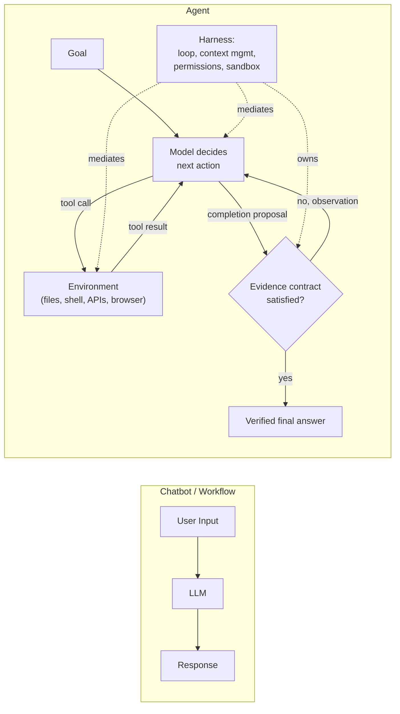
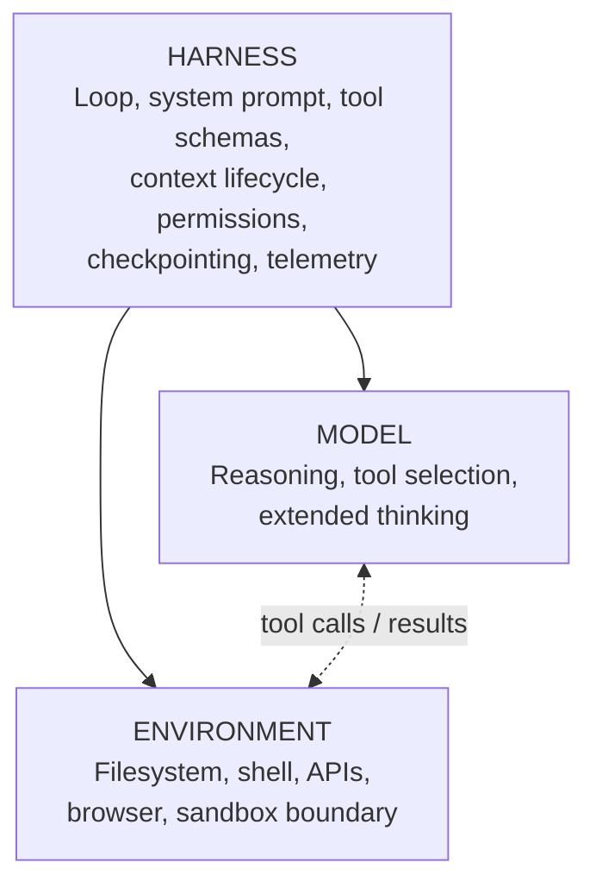
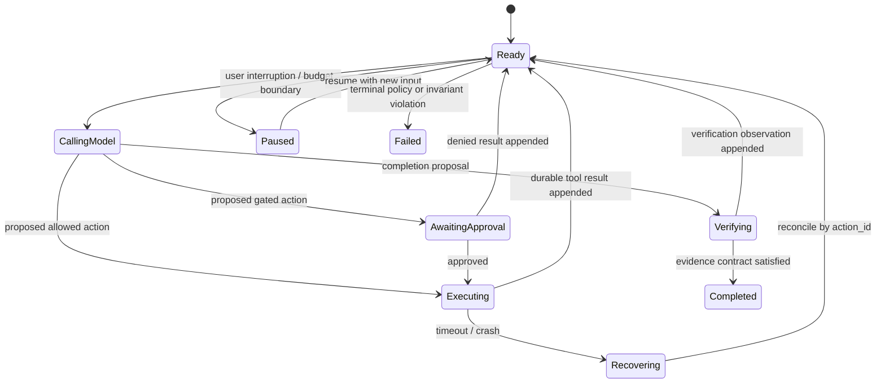
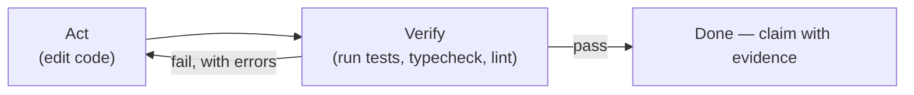

# LLM Agent Fundamentals

## TL;DR

An agent is a model-directed feedback controller: it observes a partial view of an environment, proposes an action, receives a delayed and possibly lossy observation, and repeats until an externally defined completion condition holds. The model supplies adaptive policy; the harness owns state, authority, budgets, execution, and evidence. The environment determines what is observable, reversible, and verifiable.

The central design question is therefore not “which agent framework?” It is whether the task exposes a feedback signal strong enough to correct model error before the permitted actions cause unacceptable loss. Use a deterministic workflow when control flow is knowable; introduce agency only for decisions that genuinely depend on observations made at runtime.

---

## What Makes an Agent Different from a Chatbot?



A chatbot maps one input to one output. A **workflow** chains LLM calls along a code path you wrote. An **agent** lets the model direct its own process: it decides which tool to call next based on what the last tool returned, and it keeps going until the goal is met or the harness stops it. That autonomy is the value and the risk — agents handle tasks you couldn't enumerate steps for, and they fail in ways you didn't enumerate either.

| Aspect | Chatbot | Workflow | Agent |
|--------|---------|----------|-------|
| Control flow | None | Your code | The model |
| Actions | Text only | Predefined LLM calls | Tools chosen at runtime |
| Steps | 1 | Fixed | Open-ended, bounded by harness |
| Failure mode | Bad answer | Bad step output | Compounding drift across steps |
| Cost profile | One admitted call | Sum of known branches and retries | Input-dependent; bounded by admission |
| Right for | Q&A | Decomposable, known tasks | Open-ended tasks with verifiable outcomes |

Start with the least adaptive form that reaches the workload. A workflow preserves explicit control when branches are enumerable; an agent earns authority only where observations reveal useful branches that could not be encoded economically. See [Orchestration Patterns](./02-orchestration-patterns.md) for the taxonomy and composition rules.

## The Three Components



- **Model.** The model implements a probabilistic policy over proposed actions and final responses. Its useful capability depends on the tool protocol, context, feedback latency, and verifier; model-only benchmark results do not determine system performance.
- **Harness.** Everything between the model and the world. This is where most engineering effort goes; see [Harness Engineering](./09-harness-engineering.md) for the full treatment.
- **Environment.** What the agent can observe and change. Capability comes from task-relevant observations and effects, not raw tool breadth. A shell or filesystem helps only when its state is scoped, versioned, and connected to an independent success signal; otherwise it increases blast radius without closing the feedback loop.

---

## The Agent Loop

The abstract loop has four boundaries:

```text
state snapshot → model proposal → policy/execution → observation → new state
```

The model proposal is not an action. It is untrusted structured data containing either a candidate tool invocation, a request for information, or a completion claim. The harness validates schema and preconditions, resolves authority, assigns a stable logical action identity, executes through the appropriate isolation boundary, and records the observation. This distinction prevents a model-generated tool call from bypassing authentication merely because it parsed correctly.

Native structured tool calling removes a syntax failure class, but not semantic failure: a valid argument can name the wrong account, use a stale resource revision, or request an unauthorized effect. Tool schemas should therefore encode representable structure while deterministic code enforces business invariants and policy.

Multiple proposed actions are concurrent only when their read/write sets and snapshot semantics permit it. Independent reads may run together. Overlapping writes require serialization or optimistic revision checks. A read following a write must either observe the committed result or be explicitly bound to the prior snapshot. Parallel syntax in a model response does not imply safe parallel execution.

The loop terminates through typed reasons—verified completion, user pause, approval wait, deadline, budget exhaustion, policy denial, non-convergence, or unrecoverable error. A natural-language “done” is a completion proposal; the harness decides whether the evidence contract is satisfied. [Harness Engineering](./09-harness-engineering.md) develops the runtime mechanics, while [Orchestration Patterns](./02-orchestration-patterns.md) covers the surrounding control-flow choices.

### Reasoning effort is a resource allocation

Some model APIs expose reasoning-effort controls, while others express the trade-off through model choice or decoding configuration. Treat reasoning compute as one budget dimension. Additional deliberation is most valuable where a decision is hard to verify or commits an expensive branch; it has less value inside a tight loop with immediate deterministic feedback. Measure task success against total tokens, wall time, and action count rather than assuming more internal computation is uniformly better.

---

## Execution Semantics: The Loop Is a Durable State Machine

The toy loop keeps `messages` in process memory. A long-running agent has a durable **run** containing ordered **turns**, each turn may propose one or more **actions**, and each action has an execution record. These identities solve different ambiguity problems:

```text
run_id       names one user goal and its durable lifetime
turn_id      names one model invocation against a specific context snapshot
action_id    names one logical side effect requested by that invocation
attempt_id   names one infrastructure attempt to execute the action
```

If the model call times out, the harness must determine whether the provider created a response before retrying or accept that it may pay twice. If a tool call times out, the more dangerous ambiguity is whether the side effect happened. Retrying `read_file` is harmless; retrying `send_payment` with a new identity can pay twice. The tool contract therefore carries `action_id` as an idempotency key, stores the first committed result, and returns it on repeated attempts. Attempt identity is for telemetry; logical action identity is for correctness.



State must commit around side effects. A safe sequence is: persist the proposed action; obtain policy/approval; execute with the stable action ID; persist the result; then expose that result to the next model turn. A crash between execution and result persistence is reconciled by querying the tool with the same action ID or reading its idempotency record. “Exactly once” is not supplied by an agent framework—it is approximated at each side-effect boundary using the same outbox, idempotency, and reconciliation patterns as any distributed workflow.

Parallel tool calls add a join. Reads against an immutable snapshot may execute freely. Writes that overlap the same resource need ordering or optimistic concurrency (expected file hash, row version, ETag). Tool results are appended in a deterministic order keyed by tool-call identity even if completion order varies; otherwise a replay can assemble a different context and send the model down a new path. Cancellation also has semantics: stop scheduling new actions, attempt to cancel running ones, mark actions whose outcome is unknown, and reconcile them before resume. Killing the process is not cancellation.

Durability does not mean storing unrestricted transcripts forever. Persist structured state, tool references, hashes, approvals, costs, and the context snapshot needed to reproduce a turn. Store sensitive raw inputs and outputs under separate access and retention policy, because transcripts may contain credentials, personal data, or proprietary documents. A resumable system that violates data minimization is not mature; it has merely made its privacy exposure durable.

---

## Tools as Effect Contracts

A tool is an effect contract, not merely a function description. Its control-plane record should declare input and output schemas, authenticated principal requirements, read/write set, reversibility, idempotency behavior, timeout, maximum result size, data classification, and reconciliation procedure. The model-visible description explains selection; the harness-visible contract determines execution.

General-purpose execution tools offer reach but make effects harder to classify statically. Narrow structured tools expose better validation and least privilege but expand the catalog and can force inefficient call sequences. The right surface combines a small orthogonal core with typed tools at high-impact boundaries. Catalog discovery can defer rarely used schemas so tool breadth does not consume every context.

Result design closes the feedback loop. Return a typed status, concise observation, stable artifact or receipt reference, source revision, truncation indicator, and actionable error class. Large data belongs behind pagination or an artifact reference. An error should state which precondition failed without leaking secrets or encouraging the model to bypass policy.

Protocols such as MCP standardize discovery and transport but do not establish trust. A connected server is another dependency and authority boundary: authenticate it, constrain exposed capabilities, pin compatible protocol/schema versions, and treat returned content as untrusted unless policy says otherwise. Detailed tool-surface design lives in [Harness Engineering](./09-harness-engineering.md) and [Coding Agent Tool Design](../19-compound-engineering/02-coding-agent-tool-design.md).

---

## State, Context, and Memory

Do not conflate three stores. **Run state** is authoritative structured data: goal, constraints, action status, approvals, budgets, and completion evidence. **Context** is the bounded view compiled for one model turn. **Memory** is information retained across a longer scope, such as a project convention or user preference. The transcript is neither the source of truth nor a safe cross-session memory database.

This separation enables recovery and minimization. The runtime can rebuild a prompt from canonical state, retain sensitive artifacts under their own access policy, and compact conversational material without losing action receipts or constraints. Memory records need provenance, scope, expiry, and revocation; context items need trust labels and token budgets. [Context Management](./08-context-management.md) owns the selection, compaction, caching, and memory lifecycle details.

---

## Verification as an Observation Channel

Agency is tractable when the environment exposes observations that discriminate progress from plausible failure. Code tests, database invariants, simulators, artifact diffs, and reviewed screenshots are possible channels. They differ in coverage, latency, independence, and false-accept cost; none becomes ground truth merely because it is executable.



Model the verifier as a sensor. A false acceptance commits bad state; a false rejection spends more work or blocks a valid result. Verification cadence therefore depends on the expected loss of undetected drift versus the cost and latency of sensing. Cheap local invariants can guard each transition; expensive end-to-end or human checks belong at risk boundaries. Self-evaluation is useful for proposing defects, but it is correlated with the generator and cannot be treated as independent acceptance evidence without calibration.

If a path contains conditional transition-success probabilities \(p_i\), the first-order probability that all transitions are correct is \(\prod_i p_i\). In practice the errors are correlated through shared context and evidence, so multiplying global average accuracies is not a reliability estimate. A verifier changes the state graph by detecting some failures and routing them into recovery; its recall, false-positive rate, and recovery-success distribution determine the actual gain. The evaluation methodology belongs to [LLM Evaluation](./10-llm-evaluation.md); this chapter's foundational rule is that completion authority stays outside the model.

---

## Security Model

An agent combines an untrusted decision-maker with a confused-deputy risk. The principal's authority must be attenuated to the current action: tool, resource, verb, tenant, expiry, and approved argument digest. The model never authenticates itself, grants itself access, or converts text found in a document into authority.

Isolation limits what executed code can observe and change; policy decides whether the proposed effect is permitted; approval delegates a specific effect; provenance distinguishes user intent from untrusted data. These controls are complementary. A sandbox with unrestricted network credentials still leaks data, while a policy gate without isolation cannot contain a compromised interpreter. The concrete sandbox, egress, secret-broker, and approval architecture is developed in [Harness Engineering](./09-harness-engineering.md).

---

## Evaluating Agents

Agent evaluation separates end state, trajectory, and operating envelope. End-state checks determine whether the environment satisfies the task contract. Trajectory checks capture redundant actions, unsafe proposals, policy interventions, recovery, and irreversible effects that a good final answer could hide. Operating metrics include wall time, tail latency, tokens, tool cost, and human attention per successful task.

Because execution is stochastic, report the distribution across repeated runs and distinguish “at least one success” from “all repeated runs succeed.” Public benchmarks compare model–harness pairs on standardized environments; product release decisions require representative internal tasks and real policy boundaries. [LLM Evaluation and Observability](./10-llm-evaluation.md) covers dataset design, judge calibration, statistics, and production feedback.

---

## Bounded Autonomy as a Control System

The agent is a controller acting on an environment through delayed, lossy observations. Unbounded looping is therefore not a feature; it is an unstable controller with an unlimited actuator budget. Define a **capability envelope** across four axes: what it may observe, what it may change, how long or how much it may spend, and which evidence is required before completion. Autonomy can be high on one axis and low on another. A coding agent may read an entire repository and run thousands of local tests while requiring approval for one network call or push.

Budgets should be nested. A run has wall-clock, token, monetary, action, and retry budgets. A tool has its own timeout, output limit, and side-effect policy. A subagent receives a delegated slice rather than inheriting the parent run's remaining authority. When a boundary is reached, the harness should produce a typed event—`budget_exhausted`, `approval_required`, `verification_failed`, `no_progress`—that can be surfaced to a human or handled by a declared policy. Silently asking the model to “try harder” hides the condition and often converts a bounded failure into repeated spend.

Progress detection is domain-specific. Repeated identical tool calls, unchanged verifier output, oscillating edits, and a growing context with no new durable artifact are signs of non-convergence. The harness can hash normalized actions and observations, detect cycles, and require the model to change strategy or pause. This is not a semantic proof that the task is stuck; it is a circuit breaker against the common mechanical loops that consume budget without information gain.

Completion is a state transition authorized by evidence. The model proposes that it is done; the harness runs the relevant verifier and checks the task's acceptance contract. A passing test proves only what the test asserts, so completion evidence may combine tests, static checks, diff constraints, screenshots, policy checks, and a human review for judgment-heavy work. Store that evidence with the run. The final answer then reports the committed state and evidence rather than merely repeating the model's confidence.

The correct autonomy level is earned empirically. Start with recommendation-only or read-only execution, collect traces and failure labels, add objective verifiers, then widen permissions for task classes whose unsafe-action and silent-failure rates meet a declared threshold. Do not grant broad autonomy because a demo succeeded; demos sample the golden path, while authority must be sized against the tail.

---

## Failure Modes

**Context drift** occurs when a long run forgets the original acceptance criteria or treats a stale summary as truth. The agent produces coherent work for the wrong problem. Preserve immutable goal/constraint fields outside free-form messages, version compaction summaries, and re-inject the acceptance contract at decision boundaries.

**Ambiguous side-effect retry** happens when a tool times out after committing and the harness retries with a new identity. The duplicate email, deployment, or payment is caused by execution semantics, not model reasoning. Stable action IDs, idempotent tools, and reconciliation are the defense.

**Authority laundering** occurs when a low-trust source—retrieved document, webpage, issue comment, or tool output—convinces the model to invoke a high-authority tool. Data provenance must survive context assembly, and policy must authorize the action from the user's intent and tool contract rather than from text the model read.

**Verifier theater** uses a weak or self-authored check that always agrees with the agent. A model writing both the implementation and a test that merely reproduces its assumptions has not produced independent evidence. Prefer existing or independently specified invariants, mutation tests, differential checks, and human review for non-programmatic judgments.

**Non-convergent loop** repeats reads, edits, or retries without reducing uncertainty. Bound attempts, detect normalized action cycles, track verifier deltas, and stop with preserved state instead of consuming the remaining budget.

**Partial parallel commit** lets one of several tool calls mutate state while another fails, after which the model assumes the whole plan failed and repeats it. Parallelize independent reads; coordinate writes through explicit transactions, compensations, or per-action reconciliation.

**Irrecoverable transcript** stores messages but not environment version, tool result identity, approvals, or side-effect status. Replay starts from superficially similar text against a different world. Checkpoint the state machine and external references, not only the chat log.

## Decision Framework

Use a single model call when the task is one transformation over supplied context. Use a deterministic workflow when steps and branches are knowable in code. Introduce an agent only when the useful action sequence depends on observations that cannot be enumerated in advance, and when the environment provides enough feedback to correct errors.

Then ask four questions. First, **what is the oracle?** If success cannot be observed more reliably than the model can claim it, autonomy will hide errors. Second, **what is the blast radius?** Prefer reversible, scoped actions and require approval as irreversibility, external communication, privilege, or money increases. Third, **what state must survive interruption?** Long work with side effects needs durable execution and reconciliation; a short research loop may not. Fourth, **what simpler control structure fails?** Routing, prompt chaining, or evaluator loops are easier to test and cheaper to operate than open-ended agency.

The decisive design artifact is not the system prompt. It is the run state machine plus the tool/permission matrix, completion evidence, budgets, and failure policy. If those cannot be stated precisely, the system is not ready for more autonomy.

## Key Takeaways

1. An agent is a model-directed control loop; the harness and environment determine its real capability and safety.
2. Durable execution needs distinct run, turn, action, and attempt identities so retries and recovery have defined semantics.
3. Side-effect correctness comes from idempotency, atomic state transitions, and reconciliation—not from asking the model to be careful.
4. Tool descriptions, result shapes, errors, and permissions form the agent's effective API and should be designed like one.
5. Context is working memory, not durable truth; goals, constraints, state, and evidence need structured storage outside the transcript.
6. Verification arrests compounding error. Completion is a harness decision backed by evidence, not a model stop token.
7. The security boundary is sandbox and policy. Untrusted content cannot grant authority merely by appearing in context.
8. Autonomy should widen only after task-specific evaluations show that the feedback loop can detect and recover from the tail failures.

## References

- [Building Effective Agents](https://www.anthropic.com/research/building-effective-agents) — Anthropic's workflow/agent taxonomy
- [Effective Context Engineering for AI Agents](https://www.anthropic.com/engineering/effective-context-engineering-for-ai-agents) — Anthropic
- [Writing Effective Tools for Agents](https://www.anthropic.com/engineering/writing-tools-for-agents) — Anthropic
- [Code Execution with MCP](https://www.anthropic.com/engineering/code-execution-with-mcp) — scripts instead of chained tool calls
- [Model Context Protocol](https://modelcontextprotocol.io/) — specification and SDKs
- [The Lethal Trifecta for AI Agents](https://simonwillison.net/2025/Jun/16/the-lethal-trifecta/) — Simon Willison
- [SWE-bench](https://www.swebench.com/) / [τ-bench](https://arxiv.org/abs/2406.12045) / [GAIA](https://arxiv.org/abs/2311.12983) — agent benchmarks
- [Context Rot: How Increasing Input Tokens Impacts LLM Performance](https://research.trychroma.com/context-rot) — Chroma research
- [ReAct: Synergizing Reasoning and Acting in Language Models](https://arxiv.org/abs/2210.03629) — reasoning-and-action feedback-loop formulation
