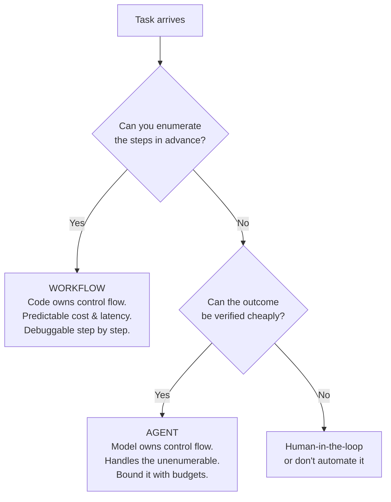
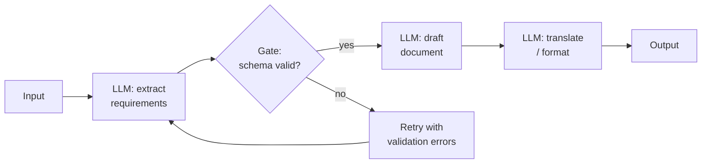
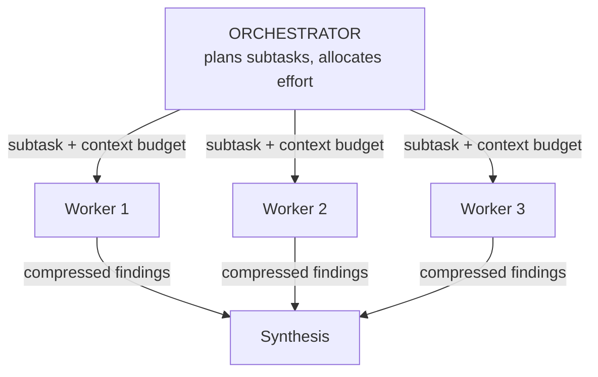
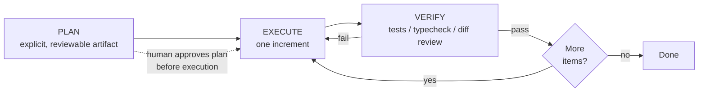
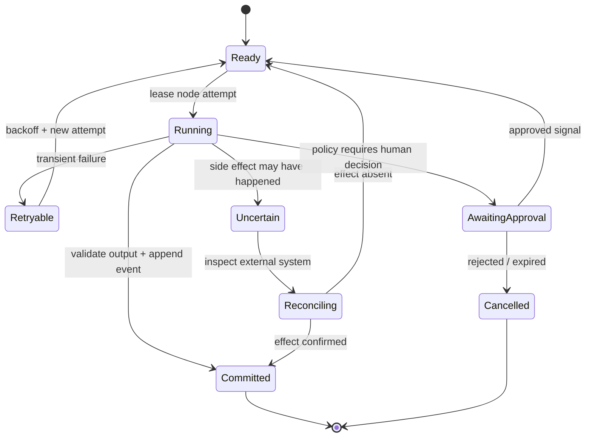

# Agent Orchestration Patterns

## TL;DR

Orchestration is how you structure LLM calls and control flow. The fundamental split: **workflows** (your code decides the steps, the model fills them in) versus **agents** (the model decides the steps). Production systems should use the simplest pattern that meets the bar — chaining, routing, parallelization, orchestrator–workers, evaluator–optimizer — and graduate to an autonomous loop only for open-ended tasks with verifiable outcomes. Reasoning models internalized most 2023-era prompt scaffolds (Chain-of-Thought, Tree-of-Thought, self-consistency); the modern levers are thinking budgets, plan–execute–verify structure, subagent context isolation, and durable execution.

---

## Workflows vs. Agents



This distinction (popularized by Anthropic's *Building Effective Agents*) is the most useful one in the field. Workflows trade flexibility for predictability — when you know the steps, encoding them in code is strictly better than asking a model to rediscover them on every request. Agents trade predictability for reach. The most common architecture mistake of the past two years was building an agent (or a multi-agent system) where a three-step workflow would do.

A useful corollary: **autonomy is a dial, not a binary.** The same task can ship as a workflow with one agentic step inside it, or as an agent constrained by a workflow-shaped plan. Move the dial toward autonomy only when evals show the rigid version failing on real inputs.

---

## Workflow Patterns

### Prompt Chaining

Decompose a task into a fixed sequence where each call consumes the previous call's output. Add programmatic **gates** between steps — cheap checks that catch derailment early instead of letting errors compound.



```python
async def marketing_chain(brief: str) -> str:
    outline = await llm(f"Extract a structured outline from this brief:\n{brief}",
                        response_format=Outline)          # typed gate: pydantic validation
    if len(outline.sections) < 3:
        outline = await llm(f"Outline too thin ({len(outline.sections)} sections). "
                            f"Expand to 4-6:\n{outline.model_dump_json()}",
                            response_format=Outline)
    draft = await llm(f"Write copy for each section:\n{outline.model_dump_json()}")
    return await llm(f"Edit for tone and tighten by 20%:\n{draft}")
```

Use when: the decomposition is stable and each step has a checkable contract. The gates are the point — a chain without validation is just a slower single prompt.

### Routing

Classify the input, then dispatch to a specialized prompt, toolset, or model. Routing is also the standard **cost-tiering** mechanism: send the easy 80% to a small fast model, escalate the hard 20%.

```python
ROUTES = {
    "refund":    {"model": SMALL, "system": REFUND_PROMPT,  "tools": [refund_lookup]},
    "technical": {"model": LARGE, "system": DEBUG_PROMPT,   "tools": [search_docs, run_repro]},
    "general":   {"model": SMALL, "system": GENERAL_PROMPT, "tools": []},
}

async def handle(ticket: str) -> str:
    route = await llm(f"Classify this ticket: {ticket}",
                      response_format=Route, model=SMALL)
    cfg = ROUTES[route.category]
    return await run(cfg, ticket)
```

Use when: inputs cluster into categories with different optimal handling. Keep the classifier's label set small and mutually exclusive; route "unknown" to the most capable path, not the cheapest.

### Parallelization

Two distinct forms:

- **Sectioning** — split independent subtasks, run concurrently, merge. (Review a PR for security, performance, and style in three parallel calls.)
- **Voting** — run the *same* task N times, aggregate. Majority vote for classification; union for issue-finding; best-of-N with a grader for generation. This is the production descendant of self-consistency: you pay N× for a reliability bump where it matters.

```python
findings = await asyncio.gather(
    llm(SECURITY_REVIEW + diff),
    llm(PERF_REVIEW + diff),
    llm(STYLE_REVIEW + diff),
)                                   # sectioning

verdicts = await asyncio.gather(*[
    llm(f"Does this diff introduce a breaking API change? yes/no + evidence:\n{diff}")
    for _ in range(5)
])                                  # voting: flag if ≥2 say yes
```

Use when: subtasks are independent (sectioning) or single-shot reliability is below the bar and verification is hard (voting). Latency ≈ the slowest branch instead of the sum.

### Orchestrator–Workers

A capable model decomposes the task *at runtime* and dispatches subtasks to worker calls (often cheaper models, or parallel instances), then synthesizes. Unlike sectioning, the subtasks aren't known in advance — the decomposition is itself model output. This is the backbone pattern of deep-research systems and most production "multi-agent" deployments; the full treatment, including context-sharing economics, is in [Multi-Agent Systems](./03-multi-agent-systems.md).



### Evaluator–Optimizer

One call generates; another grades against explicit criteria and returns actionable feedback; loop until pass or budget exhausted. This works when evaluation is genuinely easier than generation — translation nuance, search-result relevance, matching a style guide.

```python
async def refine(task: str, max_rounds: int = 3) -> str:
    draft = await llm(task)
    for _ in range(max_rounds):
        review = await llm(f"Grade against the rubric. PASS or revisions needed.\n"
                           f"Rubric:\n{RUBRIC}\n\nDraft:\n{draft}",
                           response_format=Review)
        if review.verdict == "PASS":
            break
        draft = await llm(f"Revise. Address every point.\n"
                          f"Feedback:\n{review.feedback}\n\nDraft:\n{draft}")
    return draft
```

Caution: an LLM grader without ground truth drifts toward leniency, and generator/grader pairs from the same model family share blind spots. Anchor the rubric with objective checks (length, schema, banned claims, citation presence) wherever possible.

---

## The Agent Loop

When steps can't be enumerated, hand control flow to the model: tools in a loop, environment feedback each turn, harness-enforced budgets. The mechanics live in [Agent Fundamentals](./01-agent-fundamentals.md); what matters here is the macro-structure that makes loops reliable.

### Plan–Execute–Verify

The dominant macro-pattern for agentic work. Make the agent externalize a plan *as an artifact* (a markdown checklist, a TODO list the harness renders), execute against it, and verify each increment against ground truth before moving on.



Why it works:

- The plan is a **checkpoint for humans** — reviewing a plan costs seconds; reviewing a 2,000-line surprise diff costs an afternoon.
- The plan **survives compaction** — after a context reset, the agent re-reads its own plan and continues; goal drift drops sharply.
- Verification per increment stops error compounding (the 98%-per-step problem) at the increment boundary.

Plan-and-Execute as a *rigid* pattern (plan once, execute blindly) failed; the version that won keeps the plan live — the agent updates it as reality pushes back.

### Subagent Delegation

Spawning a fresh agent for a subtask is primarily a **context-isolation** move, not a parallelism move. A subagent can burn 200K tokens grepping through a codebase and return a 2K-token answer; the orchestrator's context stays clean. Delegate when the subtask is self-contained and its intermediate state is noise to the parent; don't delegate tightly-coupled work — each handoff loses unwritten context, and subagents that each "see only slices" of a shared artifact produce incoherent results.

### Long-Horizon Loops: Compaction and Memory

For tasks longer than one context window, the harness owns continuity:

- **Compaction** — summarize the transcript (decisions, file paths, constraints, open items), restart the loop with summary + recent turns.
- **File-based state** — the agent maintains `plan.md` / `notes.md`; the loop survives process restarts, not just context resets.
- **One-writer rule** — a long-running agent session should be the only writer to its workspace; concurrent mutation invalidates its world model.

### Durable Execution

Agent loops in production are long-running, stateful, failure-prone processes — the same problem shape as payment workflows, and the same solution applies: durable execution engines (Temporal-style) that persist each step, replay on crash, and resume from the last checkpoint. Tool calls become activities with retry policies; human approvals become signals; "the pod died at turn 37" stops being a lost task. If you're not adopting an engine, you still need its invariants: every turn persisted, every tool idempotent or compensatable, resume-from-checkpoint tested.

## Orchestration as a Typed State Graph

The diagrams above describe control flow, but a production orchestrator needs a more exact model. Treat every workflow or agent run as a graph of **logical nodes**, and every execution of a node as an **attempt**. A node is not merely a prompt. It is a contract:

\[
N = (I, O, P, S, R, C, B)
\]

where \(I\) and \(O\) are versioned input and output schemas, \(P\) is the precondition, \(S\) is the success predicate, \(R\) is the retry policy, \(C\) is the compensation or reconciliation procedure, and \(B\) is the node's resource budget. The model invocation is one implementation detail inside that contract. This distinction lets a model, a deterministic function, a human approval, and a remote tool participate in the same graph without pretending that they have the same failure semantics.



Persist transitions in an append-only event log and derive the current state from those events or from a transactionally maintained projection. A useful identity hierarchy is `run_id -> node_id -> logical_action_id -> attempt_id`. Retries receive a new `attempt_id` but retain the `logical_action_id`, which is also the idempotency key sent to external tools. Without that separation, a timeout followed by retry can create two refunds, two tickets, or two deployments while the trace misleadingly presents them as one action.

Control-plane decisions and data-plane effects should commit in a deliberate order. For a read-only model call, writing the result before advancing the graph is enough. For a side-effecting call, the orchestrator usually cannot atomically commit both its database transaction and a third-party API. It therefore needs one of three patterns: an idempotent remote operation, an outbox/inbox protocol, or reconciliation of an **uncertain** outcome. Treating a network timeout as evidence that an operation failed is a correctness bug.

Branching introduces another semantic choice: what does a join mean? `all` requires every child to satisfy its success predicate; `any` accepts the first valid child and cancels or ignores the rest; `quorum(k)` waits for enough independent evidence; `best-of-n` requires a ranking function and a deterministic tie policy. The join policy belongs in persisted workflow state. If it exists only in a prompt such as “combine the best answers,” restart behavior and auditability are undefined.

Cancellation is a propagated state transition, not process termination. Stop scheduling descendants, signal cancellable work, let non-cancellable external effects finish, and reconcile them before declaring the run cancelled. Compensation is similarly domain-specific: deleting an unpublished draft may reverse an action, while a sent email cannot be unsent and must instead be followed by a corrective action. “Rollback” is an unsafe abstraction unless every tool declares what reversal actually means.

### Determinism and Replay

Durable engines replay orchestration code to reconstruct decisions. Anything that can vary—wall-clock time, random numbers, model output, a feature flag, routing state—must be recorded as an event rather than recomputed during replay. The model call itself is never replay-deterministic. Persist its provider, model revision or alias resolution, request hash, response, finish condition, usage, and policy decision, then replay the recorded result. New orchestration code must be versioned so an old run does not encounter a branch that did not exist when it started.

This produces a useful boundary: **orchestration should be deterministic over recorded nondeterministic events**. That invariant is what makes crash recovery testable rather than hopeful.

## Reliability, Latency, and Cost Composition

Orchestration patterns compose quality, latency, and cost differently. If a sequential chain has independent per-stage success probabilities \(p_i\), its first-order end-to-end success probability is

\[
P(\text{success}) = \prod_{i=1}^{n} p_i.
\]

A ten-stage chain whose stages each succeed 98% of the time succeeds only about 81.7% of the time before retries. Independence is optimistic: adjacent LLM stages often share the same mistaken premise, so correlated semantic failures make the actual result worse. Gates help only when they detect errors with sufficient recall and do not introduce many false rejections.

For a sequential path, latency is approximately the sum of stage latencies plus queueing and retry time. For a parallel fork, completion latency is the maximum branch latency plus fork/join overhead:

\[
L_{\text{chain}} \approx \sum_i (Q_i + E_i), \qquad
L_{\text{fork-all}} \approx \max_i(Q_i + E_i) + J.
\]

The tail of the maximum gets worse as the fan-out grows. Ten parallel workers may improve mean wall-clock time while making p99 latency dependent on the slowest provider call. Hedging can reduce the tail, but duplicates spend and must not duplicate side effects. Prefer bounded fan-out, per-child deadlines derived from the parent deadline, and partial-result semantics when the product can use them.

Cost is additive across every attempted call, including discarded candidates, graders, retries, retrieval, tool execution, and context re-sent at each turn:

\[
C_{run} = \sum_{a \in attempts}
  (t^{in}_a c^{in}_{m_a} + t^{out}_a c^{out}_{m_a} + c^{tool}_a + c^{infra}_a).
\]

Budget admission must happen before expensive fan-out. Each child receives a reservation; unused budget returns to the parent; overruns cannot silently borrow from unrelated runs. A max-turn count alone is insufficient because one turn may contain a large context, multiple tool calls, or a high reasoning budget. Track tokens, currency, wall time, external operations, and concurrency separately.

Voting deserves special caution. If five samples share a model, prompt, retrieved context, and decoding regime, their errors are correlated; the textbook binomial majority-vote gain does not apply. Diversity must come from evidence sources, decomposition, model families, prompts, or independent execution paths. Even then, majority agreement establishes consensus, not truth. High-impact decisions need a ground-truth verifier or human authority.

Evaluator–optimizer loops need a **progress measure**. Store rubric scores by dimension, require the next revision to address named defects, reject regressions on dimensions that previously passed, and terminate when improvement falls below a threshold. Otherwise the loop can oscillate between two stylistic variants while spending until its cap.

## Human Control and Policy Boundaries

Human review is most reliable when represented as a first-class state with a frozen evidence package: proposed action, diff from prior state, tool arguments, provenance, predicted impact, and the policy rule that requested approval. An approval should authorize that exact action digest, not a vague future intent. If the action changes after feedback, its digest changes and previous approval no longer applies.

Policy enforcement belongs outside the model. The model may propose a route or claim that an action is safe; a policy service decides whether the authenticated principal, tenant, environment, data classification, and action parameters permit it. This prevents a retrieved document or tool response from “instructing” the agent to expand its own authority. The orchestrator should mint short-lived, least-privilege credentials for the selected tool call rather than place broad credentials in the model-visible environment.

Pause and resume are also policy operations. A paused run must release compute leases while retaining durable state; secrets or signed URLs may expire and need re-issuance on resume; the policy must be evaluated again because permissions and environment state may have changed. A month-old approved plan is not automatically authorized to execute against today's production system.

---

## What Reasoning Models Changed

The 2023 orchestration canon — ReAct, Chain-of-Thought, Tree-of-Thought, self-consistency, Reflexion — was a set of *prompt-level workarounds* for models that couldn't deliberate. RL-trained reasoning models (the o-series, DeepSeek-R1, Claude's extended thinking, Gemini's thinking modes) internalized that deliberation: the model explores, backtracks, and self-corrects inside its thinking tokens, and you buy more of it with a **thinking-budget parameter** instead of prompt scaffolding. Test-time compute became a dial.

| 2023 pattern | What it did | Where it went |
|---|---|---|
| ReAct (`Thought:/Action:` text) | Interleaved reasoning + tool use via parsed text | Native tool calling + interleaved thinking. The *idea* won; the prompt format died. |
| Chain-of-Thought ("think step by step") | Elicited intermediate reasoning | Internalized by reasoning RL. Still useful on small/non-reasoning models, and for *auditable* reasoning you must log. |
| Self-consistency (sample N, vote) | Reliability via diversity | Survives as the voting form of parallelization — applied at the *task* level where verification is hard. |
| Tree-of-Thought (explicit search) | Explored alternative reasoning paths | Internalized (models backtrack in-thought). Explicit search survives in domains with cheap programmatic evaluators (game states, formal proofs). |
| Reflexion (verbal self-critique across retries) | Learning from failed episodes | Survives as plan–execute–verify with *real* verifier feedback instead of self-generated critique — and as RL training data on the provider side. |

Practical guidance:

- **Don't stack scaffolds on reasoning models.** Forcing a hand-written CoT format on a model with native thinking typically wastes tokens and can degrade quality. Set the budget, state the goal and constraints, give it tools.
- **Match budget to verifiability.** High thinking budget for one-shot, hard-to-verify decisions (architecture, migration plans); low budget for tight tool loops where the environment gives feedback every few seconds anyway.
- **Scaffolds still earn their keep** on small models (cost tiering), in regulated settings where reasoning must be externalized and stored, and for structured aggregation (voting) where you need statistical confidence rather than one model's conviction.

---

## Pattern Selection

| Pattern | Control flow | Cost profile | Reach | Use when |
|---|---|---|---|---|
| Single call + good prompt | — | 1× | Low | Always try first |
| Prompt chaining | Code | n× sequential | Low | Stable decomposition, checkable steps |
| Routing | Code | ~1× + classifier | Low | Heterogeneous inputs, cost tiering |
| Parallel: sectioning | Code | n× concurrent | Medium | Independent subtasks |
| Parallel: voting | Code | n× concurrent | Medium | Reliability below bar, weak verifiers |
| Orchestrator–workers | Model plans, code executes | Variable | High | Unpredictable decomposition (research, search) |
| Evaluator–optimizer | Code loop | 2–6× | Medium | Grading easier than generating |
| Agent loop | Model | Unbounded — budget it | Highest | Open-ended, verifiable, tool-rich tasks |

Composition is the norm: a router in front, an agent loop for the hard branch, plan–execute–verify inside the loop, a voting step at the end for the release gate. Compose patterns the way you compose functions — each addition must pay for itself in eval results, not vibes. Every layer adds latency, cost, and a new way to fail silently.

---

## Failure Modes to Design Against

**Scaffold ossification** occurs when a workflow tuned around one model becomes a ceiling on its successor. A redundant extraction stage can add latency and lose information even after a newer model can perform the full task in one call. Re-run ablations—full workflow versus each simplified variant—during every model or prompt migration. Preserve a stage because it produces measured error containment, not because it appears architecturally sophisticated.

**Grader drift and shared blindness** turn an evaluator into a confidence amplifier. LLM judges can anchor on length, fluent explanations, or the same false premise used by the generator. Calibrate each rubric dimension against blinded human labels, track disagreement by slice, and send objective claims to executable or retrieval-backed verifiers. A grader's `PASS` is an observation with a known error rate, not a proof.

**Silent loop divergence** appears as repeated tool calls with cosmetically changed arguments, cyclic edits, or plans that grow without retiring work. Detect normalized action-signature repetition, unchanged environment state, score oscillation, and failure to reduce the open-goal set. The harness should force a strategy transition, request missing information, or terminate; another unconstrained retry is not recovery.

**Ambiguous side effects** are the most dangerous retry failure. A tool times out after committing, the orchestrator marks the node failed, and a retry repeats the operation. Idempotency keys and reconciliation of uncertain attempts must be designed before enabling automatic retries on write tools.

**Budget-free autonomy** converts a correctness bug into an unbounded resource incident. Parent deadlines and spend ceilings must be subdivided across children, and every retry or fan-out decision must reserve budget. Use observed workload distributions and product loss limits, not a convenient fixed number copied across tasks.

**Coordination without ownership** lets parallel workers mutate the same artifact or external state from inconsistent snapshots. The result may be syntactically mergeable and semantically contradictory. Partition write sets, use optimistic version checks at commit, and make synthesis a controlled merge step; [Multi-Agent Systems](./03-multi-agent-systems.md) develops these consistency models.

**Cancellation leakage** happens when the root run is reported cancelled while child jobs, provider streams, or tool operations continue. Propagate cancellation tokens, record which activities acknowledge them, and reconcile non-cancellable work. Otherwise a user sees a stopped workflow while costs and side effects continue in the background.

## Decision Framework

Start from the shape of uncertainty rather than from a fashionable agent pattern.

| Design question | Architectural consequence |
|---|---|
| Can valid steps be enumerated before seeing the request? | Encode them as a workflow; use the model only inside bounded nodes. |
| Is decomposition input-dependent but the final result cheaply verifiable? | Use orchestrator–workers or an agent loop with verifier-controlled commit. |
| Are subtasks independent in both reads and writes? | Parallel sectioning is safe; otherwise establish ownership or serialize commits. |
| Is failure transient, semantic, or an uncertain side effect? | Retry transient faults; revise strategy for semantic faults; reconcile uncertain effects. |
| Does evaluation have lower entropy than generation? | An evaluator–optimizer loop may pay for itself; otherwise it compounds model opinion. |
| Must a human authorize impact? | Persist an approval state bound to an exact action digest and revalidate on change. |
| Is p99 latency strict? | Bound fan-out, stream partial results, route by deadline, and avoid slowest-child joins. |
| Is spend strict? | Reserve hierarchical budgets before calls and degrade to cheaper bounded paths. |

Build the minimum graph that passes offline evaluations and shadow traffic. Then add one control-flow feature at a time and measure its marginal quality gain, latency cost, spend, and new operational failure surface. A useful decision record names the alternative that was rejected, the workload slice that justified the chosen pattern, and the evidence required to remove it later.

## Key Takeaways

- An orchestration step is a typed, versioned state transition with explicit retry and side-effect semantics; a prompt alone is not a production node.
- Workflow reliability multiplies across sequential stages, parallel latency inherits the slowest branch, and all attempted work contributes to cost.
- Durable execution requires stable logical identities, recorded nondeterminism, idempotency or reconciliation, versioned replay, and propagated cancellation.
- Voting and LLM grading reduce error only when their failures are sufficiently independent and calibrated against real ground truth.
- Models propose actions; policy code controls authority, approvals bind to exact actions, and external effects determine what compensation can mean.
- Choose autonomy only for uncertainty that code cannot enumerate and outcomes that the system can verify.

---

## References

- [Building Effective Agents](https://www.anthropic.com/research/building-effective-agents) — Anthropic; the workflow/agent taxonomy this article follows
- [DeepSeek-R1: Incentivizing Reasoning Capability in LLMs via Reinforcement Learning](https://arxiv.org/abs/2501.12948) — how reasoning got internalized
- [ReAct: Synergizing Reasoning and Acting](https://arxiv.org/abs/2210.03629), [Tree of Thoughts](https://arxiv.org/abs/2305.10601), [Reflexion](https://arxiv.org/abs/2303.11366), [Self-Consistency](https://arxiv.org/abs/2203.11171) — the historical scaffolds and what they taught the field
- [How We Built Our Multi-Agent Research System](https://www.anthropic.com/engineering/built-multi-agent-research-system) — orchestrator–workers at production scale
- [Don't Build Multi-Agents](https://cognition.ai/blog/dont-build-multi-agents) — Cognition; the context-sharing counterargument
- [Temporal](https://temporal.io/) — durable execution for long-running workflows
