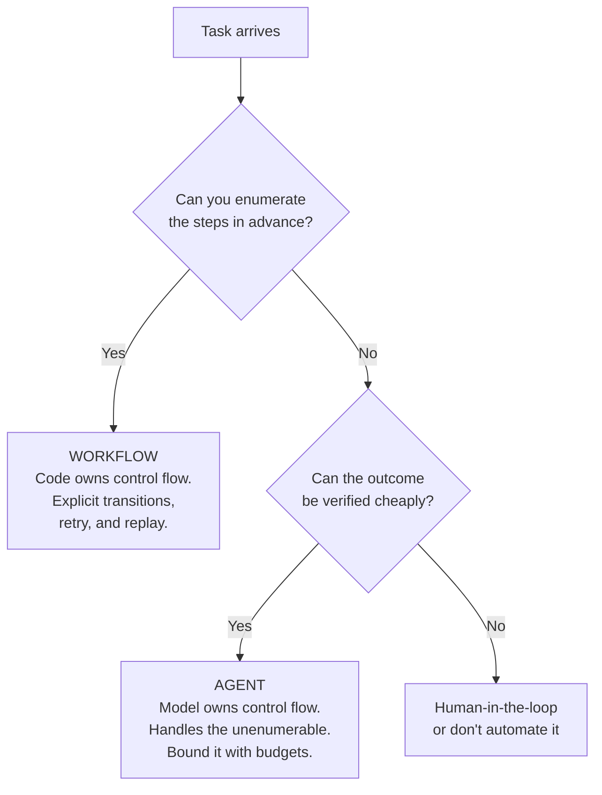
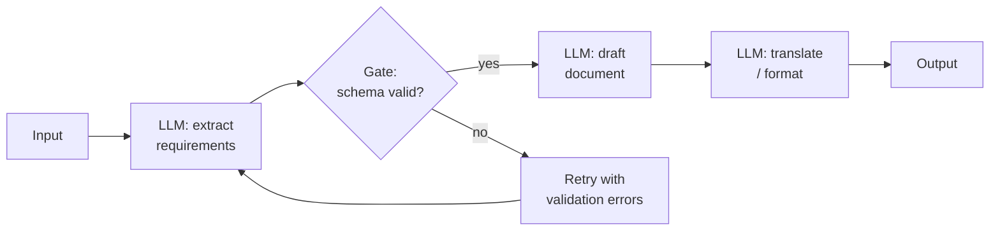
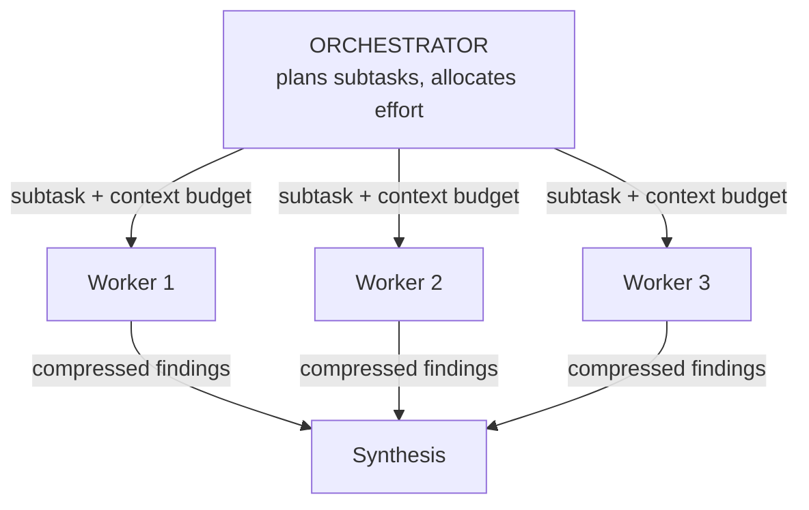
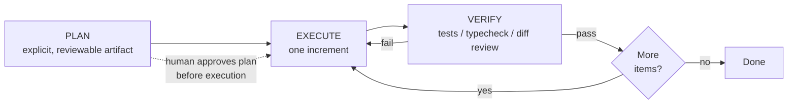
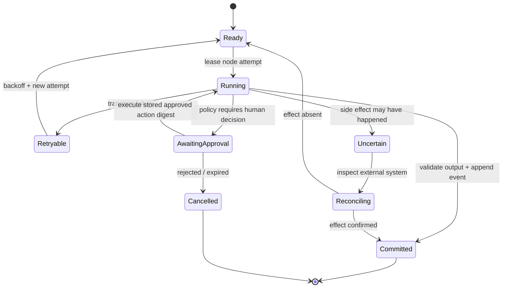

# Agent Orchestration Patterns

## TL;DR

Orchestration assigns control authority: which transitions are fixed in code, which choices a model may propose, which effects require policy or human approval, and which observations permit the run to advance. A workflow owns the graph in code; an agent selects paths from environment feedback. Chaining, routing, parallelization, orchestrator–workers, evaluator–optimizer loops, and autonomous loops are therefore different graph and join semantics, not a catalog of prompt recipes.

Choose the least adaptive graph that reaches the required workload. Every adaptive branch needs a typed state transition, budget reservation, termination rule, and verifier. Model-internal reasoning can change the amount of external search that is useful, but it cannot replace durable state, authority boundaries, idempotency, or independent verification.

---

## Workflows vs. Agents



This distinction, popularized by Anthropic's *Building Effective Agents*, separates two control authorities. Workflows trade flexibility for explicit state transitions; agents trade predictability for input-dependent reach. When the valid transitions and exceptional branches can be enumerated, code can enforce them, replay them, and attach exact retry policy. Asking a model to rediscover that graph adds variance without adding reach. Agency earns its cost only where observations reveal useful branches that cannot be specified economically in advance.

A useful corollary: **autonomy is a dial, not a binary.** The same task can ship as a workflow with one agentic step inside it, or as an agent constrained by a workflow-shaped plan. Move the dial toward autonomy only when evals show the rigid version failing on real inputs.

---

## Workflow Patterns

### Prompt Chaining

Decompose a task into a fixed sequence where each call consumes a versioned intermediate artifact. A gate decides whether that artifact satisfies the next transition's preconditions. Gates may be deterministic assertions, executable verification, calibrated semantic evaluation, or human authority; calling every gate “validation” hides very different error profiles.



Each stage record includes its input revision, output artifact, evaluator revision, attempt, and decision. On failure, retry only if the failure class is transient or the next attempt changes evidence or strategy; repeatedly regenerating behind the same gate produces correlated samples. Backtracking should invalidate the precise upstream artifact whose contract failed rather than append criticism to an ever-growing prompt.

The pattern fits a stable decomposition whose intermediate artifacts have checkable contracts. Its correctness boundary is the gate: without schema, provenance, or semantic verification between stages, a chain merely serializes and amplifies an early error.

### Routing

Classify the input, then dispatch to a specialized prompt, toolset, policy, or model. Routing may reduce cost by assigning simpler cases to cheaper targets, but the achievable split is an observed property of the traffic distribution and router operating point—not a fixed easy/hard percentage.

```python
ROUTES = {
    "refund":    {"model": SMALL, "system": REFUND_PROMPT,  "tools": [refund_lookup]},
    "technical": {"model": LARGE, "system": DEBUG_PROMPT,   "tools": [search_docs, run_repro]},
    "general":   {"model": SMALL, "system": GENERAL_PROMPT, "tools": []},
}

async def handle(ticket: str) -> str:
    route = await llm(f"Classify this ticket: {ticket}",
                      response_format=Route, model=SMALL)
    cfg = ROUTES[route.category]
    return await run(cfg, ticket)
```

Routing fits inputs whose classes require materially different tools, policies, models, or latency budgets. The router is a model release in its own right: calibrate confusion by slice, expose an `unknown` or abstention path, and make the fallback preserve security and capability requirements. Routing an uncertain high-impact request to the cheapest branch converts classification error directly into product loss.

### Parallelization

Two distinct forms:

- **Sectioning** — split independent subtasks, run concurrently, merge. (Review a PR for security, performance, and style in three parallel calls.)
- **Replication and aggregation** — run the *same* task (N) times, then apply a declared union, quorum, ranking, or adjudication rule. The value depends on error correlation and evaluator quality, while cost grows with every attempt.

```python
findings = await asyncio.gather(
    llm(SECURITY_REVIEW + diff),
    llm(PERF_REVIEW + diff),
    llm(STYLE_REVIEW + diff),
)                                   # sectioning

proposals = await asyncio.gather(*[
    run_candidate(case, seed=s) for s in selected_seeds
])
decision = aggregate(proposals, rule=qualified_join_policy)
```

Sectioning requires independence of both reads and writes; otherwise branches race or reason from inconsistent state. Voting requires sufficiently independent errors and a decision rule tied to evidence. A parallel join observes the slowest required branch, so fan-out trades serial latency for tail amplification and higher spend rather than making work free.

### Orchestrator–Workers

A model decomposes the task *at runtime* and proposes subtasks for admission before workers execute them. Unlike sectioning, the complete decomposition is not known in advance. The scheduler still owns dependency validity, read/write conflicts, capabilities, deadlines, and fan-out. The full distributed-systems treatment is in [Multi-Agent Systems](./03-multi-agent-systems.md).



### Evaluator–Optimizer

One node generates; another evaluates explicit criteria and returns defect-addressed feedback. The loop is justified only when evaluation has a useful operating point and the revision step produces measurable progress. Persist criterion-level results, protect dimensions that already pass, and stop on pass, budget exhaustion, score stagnation, or oscillation. If generator and evaluator share evidence, model family, or prompt assumptions, their errors may be correlated; a fluent `PASS` is not independent evidence. [LLM Evaluation](./10-llm-evaluation.md) owns judge qualification and uncertainty.

---

## The Agent Loop

When steps can't be enumerated, hand control flow to the model: tools in a loop, environment feedback each turn, harness-enforced budgets. The mechanics live in [Agent Fundamentals](./01-agent-fundamentals.md); what matters here is the macro-structure that makes loops reliable.

### Plan, Context Fork, and Durable Resume

A long agentic run externalizes a versioned plan as durable state, executes one admissible increment, and verifies the resulting environment before authorizing dependent work. The plan records task IDs, dependencies, ownership, base revisions, acceptance conditions, and status; it is an operational projection of run state, not a markdown narrative.



The plan changes only through recorded transitions: new evidence may add or invalidate nodes, but completed effects and rejected alternatives remain in history. A context fork receives a bounded task packet from one plan revision and returns typed evidence; it does not acquire implicit authority over shared state. Delegation is useful for context isolation or independent work even when it provides no wall-clock benefit. Tightly coupled work remains under one decision owner because every handoff discards latent context.

Compacted prompts, files, and model messages are context representations, not the authoritative run. A durable engine persists node transitions and external-action receipts, resumes from checkpoints, and replays recorded nondeterministic observations. Tool calls declare retry and reconciliation semantics; human decisions arrive as versioned signals. [Context Management](./08-context-management.md) owns context revisions, while [Harness Engineering](./09-harness-engineering.md) owns the runtime boundary.

## Orchestration as a Typed State Graph

The diagrams above describe control flow, but a deployed orchestrator needs a more exact model. Treat every workflow or agent run as a graph of **logical nodes**, and every execution of a node as an **attempt**. A node is not merely a prompt. It is a contract:

$$
N = (I, O, P, S, R, C, B)
$$

where $I$ and $O$ are versioned input and output schemas, $P$ is the precondition, $S$ is the success predicate, $R$ is the retry policy, $C$ is the compensation or reconciliation procedure, and $B$ is the node's resource budget. The model invocation is one implementation detail inside that contract. This distinction lets a model, a deterministic function, a human approval, and a remote tool participate in the same graph without pretending that they have the same failure semantics.



Persist transitions in an append-only event log and derive the current state from those events or from a transactionally maintained projection. A useful identity hierarchy is `run_id -> node_id -> logical_action_id -> attempt_id`. Retries receive a new `attempt_id` but retain the `logical_action_id`, which is also the idempotency key sent to external tools. Without that separation, a timeout followed by retry can create two refunds, two tickets, or two deployments while the trace misleadingly presents them as one action.

Control-plane decisions and data-plane effects should commit in a deliberate order. For a read-only model call, writing the result before advancing the graph is enough. For a side-effecting call, the orchestrator usually cannot atomically commit both its database transaction and a third-party API. It therefore needs one of three patterns: an idempotent remote operation, an outbox/inbox protocol, or reconciliation of an **uncertain** outcome. Treating a network timeout as evidence that an operation failed is a correctness bug.

Branching introduces another semantic choice: what does a join mean? `all` requires every child to satisfy its success predicate; `any` accepts the first valid child and cancels or ignores the rest; `quorum(k)` waits for enough independent evidence; `best-of-n` requires a ranking function and a deterministic tie policy. The join policy belongs in persisted workflow state. If it exists only in a prompt such as “combine the best answers,” restart behavior and auditability are undefined.

Cancellation is a propagated state transition, not process termination. Stop scheduling descendants, signal cancellable work, let non-cancellable external effects finish, and reconcile them before declaring the run cancelled. Compensation is similarly domain-specific: deleting an unpublished draft may reverse an action, while a sent email cannot be unsent and must instead be followed by a corrective action. “Rollback” is an unsafe abstraction unless every tool declares what reversal actually means.

### Determinism and Replay

Durable engines replay orchestration code to reconstruct decisions. Anything that can vary—wall-clock time, random numbers, model output, a feature flag, routing state—must be recorded as an event rather than recomputed during replay. The model call itself is never replay-deterministic. Persist its provider, model revision or alias resolution, request hash, response, finish condition, usage, and policy decision, then replay the recorded result. New orchestration code must be versioned so an old run does not encounter a branch that did not exist when it started.

This produces a useful boundary: **orchestration should be deterministic over recorded nondeterministic events**. That invariant is what makes crash recovery testable rather than hopeful.

## Reliability, Latency, and Cost Composition

Orchestration patterns compose quality, latency, and cost differently. If a sequential chain has independent per-stage success probabilities $p_i$, its first-order end-to-end success probability is

$$
P(\text{success}) = \prod_{i=1}^{n} p_i.
$$

Under independence, a ten-stage chain whose stages each succeed 98% of the time succeeds about 81.7% of the time before retries. Shared evidence and model behavior invalidate that product: dependence can make all-stage success higher or lower than the independent estimate even when marginal stage rates are unchanged. Estimate joint or conditional outcomes on complete traces. Gates help only when they detect errors with sufficient recall and do not introduce excessive false rejection or recovery cost.

For a sequential path, latency is approximately the sum of stage latencies plus queueing and retry time. For a parallel fork, completion latency is the maximum branch latency plus fork/join overhead:

$$
L_{\text{chain}} \approx \sum_i (Q_i + E_i), \qquad
L_{\text{fork-all}} \approx \max_i(Q_i + E_i) + J.
$$

The tail of the maximum gets worse as the fan-out grows. Ten parallel workers may improve mean wall-clock time while making p99 latency dependent on the slowest provider call. Hedging can reduce the tail, but duplicates spend and must not duplicate side effects. Prefer bounded fan-out, per-child deadlines derived from the parent deadline, and partial-result semantics when the product can use them.

Cost is additive across every attempted call, including discarded candidates, graders, retries, retrieval, tool execution, and context re-sent at each turn:

$$
C_{run} = \sum_{a \in attempts}
  (t^{in}_a c^{in}_{m_a} + t^{out}_a c^{out}_{m_a} + c^{tool}_a + c^{infra}_a).
$$

Budget admission must happen before expensive fan-out. Each child receives a reservation; unused budget returns to the parent; overruns cannot silently borrow from unrelated runs. A max-turn count alone is insufficient because one turn may contain a large context, multiple tool calls, or a high reasoning budget. Track tokens, currency, wall time, external operations, and concurrency separately.

Voting deserves special caution. If five samples share a model, prompt, retrieved context, and decoding regime, their errors are correlated; the textbook binomial majority-vote gain does not apply. Diversity must come from evidence sources, decomposition, model families, prompts, or independent execution paths. Even then, majority agreement establishes consensus, not truth. High-impact decisions need a ground-truth verifier or human authority.

Evaluator–optimizer loops need a **progress measure**. Store rubric scores by dimension, require the next revision to address named defects, reject regressions on dimensions that previously passed, and terminate when improvement falls below a threshold. Otherwise the loop can oscillate between two stylistic variants while spending until its cap.

## Human Control and Policy Boundaries

Human review is most reliable when represented as a first-class state with a frozen evidence package: proposed action, diff from prior state, tool arguments, provenance, predicted impact, and the policy rule that requested approval. An approval should authorize that exact action digest, not a vague future intent. If the action changes after feedback, its digest changes and previous approval no longer applies.

Policy enforcement belongs outside the model. The model may propose a route or claim that an action is safe; a policy service decides whether the authenticated principal, tenant, environment, data classification, and action parameters permit it. This prevents a retrieved document or tool response from “instructing” the agent to expand its own authority. The orchestrator should mint short-lived, least-privilege credentials for the selected tool call rather than place broad credentials in the model-visible environment.

Pause and resume are also policy operations. A paused run must release compute leases while retaining durable state; secrets or signed URLs may expire and need re-issuance on resume; the policy must be evaluated again because permissions and environment state may have changed. A month-old approved plan is not automatically authorized to execute against today's production system.

---

## Model-Internal Reasoning and External Control Flow

ReAct, Chain-of-Thought, Tree-of-Thought, self-consistency, and Reflexion exposed useful computation through prompt-level structures. Some reasoning-oriented models now perform more search, backtracking, and self-correction inside model-managed reasoning, sometimes with an effort or token budget. This changes where orchestration belongs: internal search can replace verbose reasoning scaffolds, but it cannot replace durable workflow state, independent verification, policy, or side-effect semantics.

| Technique | Computation it exposes | External orchestration role |
|---|---|---|
| ReAct (`Thought:/Action:` text) | Interleaved reasoning + tool use via parsed text | Structured tool protocols usually replace text parsing; the observe–act feedback pattern remains. |
| Chain-of-Thought ("think step by step") | Elicited intermediate reasoning | May be redundant on reasoning-oriented models; explicit concise rationales remain useful when the product requires reviewable decision evidence. |
| Self-consistency (sample N, vote) | Reliability via diversity | Survives as the voting form of parallelization — applied at the *task* level where verification is hard. |
| Tree-of-Thought (explicit search) | Explored alternative reasoning paths | External search remains valuable where candidates can be checkpointed, evaluated independently, or distributed. |
| Reflexion (verbal self-critique across retries) | Revision conditioned on a prior attempt | Useful only when feedback adds evidence or a qualified evaluator; self-critique alone can preserve the original blind spot. |

Do not assume a reasoning scaffold transfers across models, tasks, or tool environments. Compare it with the simplest goal-and-constraint request using paired evaluation. Allocate more internal or external search only while its marginal verified-success gain exceeds latency and cost, and distinguish private model reasoning from the concise decision evidence an auditor needs. External search remains appropriate when branches require different evidence, independent execution, checkpointing, or explicit control over termination.

---

## Pattern Selection

| Pattern | Control flow | Cost profile | Reach | Use when |
|---|---|---|---|---|
| Single call + typed contract | — | One generation | Low | One bounded transformation over supplied context |
| Prompt chaining | Code | n× sequential | Low | Stable decomposition, checkable steps |
| Routing | Code | Classifier plus selected branch | Low | Heterogeneous inputs, capability or cost tiering |
| Parallel: sectioning | Code | n× concurrent | Medium | Independent subtasks |
| Parallel: voting | Code | n× concurrent | Medium | Reliability below bar, weak verifiers |
| Orchestrator–workers | Model plans, code executes | Variable | High | Unpredictable decomposition (research, search) |
| Evaluator–optimizer | Code loop | Generation plus bounded evaluation/revision attempts | Medium | Qualified grading is easier than generating |
| Agent loop | Model | Input-dependent; bounded by admission | High | Open-ended, verifiable, tool-rich tasks |

Patterns can compose, but their contracts compose too. A router changes the eligible graph, an agent loop adds dynamic nodes, and a replicated branch adds a join and cancellation policy. Record each boundary in one run graph and admit each addition only when measured marginal value exceeds its latency, spend, and failure surface.

---

## Failure Modes

**Scaffold ossification** occurs when a workflow tuned around one model becomes a ceiling on its successor. A redundant extraction stage can add latency and lose information even after a newer model can perform the full task in one call. Re-run ablations—full workflow versus each simplified variant—during every model or prompt migration. Preserve a stage because it produces measured error containment, not because it appears architecturally sophisticated.

**Grader drift and shared blindness** turn an evaluator into a confidence amplifier. LLM judges can anchor on length, fluent explanations, or the same false premise used by the generator. Calibrate each rubric dimension against blinded human labels, track disagreement by slice, and send objective claims to executable or retrieval-backed verifiers. A grader's `PASS` is an observation with a known error rate, not a proof.

**Silent loop divergence** appears as repeated tool calls with cosmetically changed arguments, cyclic edits, or plans that grow without retiring work. Detect normalized action-signature repetition, unchanged environment state, score oscillation, and failure to reduce the open-goal set. The harness should force a strategy transition, request missing information, or terminate; another unconstrained retry is not recovery.

**Ambiguous side effects** are the most dangerous retry failure. A tool times out after committing, the orchestrator marks the node failed, and a retry repeats the operation. Idempotency keys and reconciliation of uncertain attempts must be designed before enabling automatic retries on write tools.

**Budget-free autonomy** converts a correctness bug into an unbounded resource incident. Parent deadlines and spend ceilings must be subdivided across children, and every retry or fan-out decision must reserve budget. Use observed workload distributions and product loss limits, not a convenient fixed number copied across tasks.

**Coordination without ownership** lets parallel workers mutate the same artifact or external state from inconsistent snapshots. The result may be syntactically mergeable and semantically contradictory. Partition write sets, use optimistic version checks at commit, and make synthesis a controlled merge step; [Multi-Agent Systems](./03-multi-agent-systems.md) develops these consistency models.

**Cancellation leakage** happens when the root run is reported cancelled while child jobs, provider streams, or tool operations continue. Propagate cancellation tokens, record which activities acknowledge them, and reconcile non-cancellable work. Otherwise a user sees a stopped workflow while costs and side effects continue in the background.

## Decision Framework

Start from the shape of uncertainty rather than from a fashionable agent pattern.

| Design question | Architectural consequence |
|---|---|
| Can valid steps be enumerated before seeing the request? | Encode them as a workflow; use the model only inside bounded nodes. |
| Is decomposition input-dependent but the final result cheaply verifiable? | Use orchestrator–workers or an agent loop with verifier-controlled commit. |
| Are subtasks independent in both reads and writes? | Parallel sectioning is safe; otherwise establish ownership or serialize commits. |
| Is failure transient, semantic, or an uncertain side effect? | Retry transient faults; revise strategy for semantic faults; reconcile uncertain effects. |
| Does evaluation have lower entropy than generation? | An evaluator–optimizer loop may pay for itself; otherwise it compounds model opinion. |
| Must a human authorize impact? | Persist an approval state bound to an exact action digest and revalidate on change. |
| Is p99 latency strict? | Bound fan-out, stream partial results, route by deadline, and avoid slowest-child joins. |
| Is spend strict? | Reserve hierarchical budgets before calls and degrade to cheaper bounded paths. |

Build the minimum graph that passes offline evaluations and shadow traffic. Then add one control-flow feature at a time and measure its marginal quality gain, latency cost, spend, and new operational failure surface. A useful decision record names the alternative that was rejected, the workload slice that justified the chosen pattern, and the evidence required to remove it later.

## Key Takeaways

- An orchestration step is a typed, versioned state transition with explicit retry and side-effect semantics; a prompt alone is not a runtime node.
- Workflow reliability multiplies across sequential stages, parallel latency inherits the slowest branch, and all attempted work contributes to cost.
- Durable execution requires stable logical identities, recorded nondeterminism, idempotency or reconciliation, versioned replay, and propagated cancellation.
- Voting and LLM grading reduce error only when their failures are sufficiently independent and calibrated against real ground truth.
- Models propose actions; policy code controls authority, approvals bind to exact actions, and external effects determine what compensation can mean.
- Choose autonomy only for uncertainty that code cannot enumerate and outcomes that the system can verify.

---

## References

- [Building Effective Agents](https://www.anthropic.com/research/building-effective-agents) — Anthropic; the workflow/agent taxonomy this article follows
- [DeepSeek-R1: Incentivizing Reasoning Capability in LLMs via Reinforcement Learning](https://arxiv.org/abs/2501.12948) — how reasoning got internalized
- [ReAct: Synergizing Reasoning and Acting](https://arxiv.org/abs/2210.03629), [Tree of Thoughts](https://arxiv.org/abs/2305.10601), [Reflexion](https://arxiv.org/abs/2303.11366), [Self-Consistency](https://arxiv.org/abs/2203.11171) — the historical scaffolds and what they taught the field
- [How We Built Our Multi-Agent Research System](https://www.anthropic.com/engineering/built-multi-agent-research-system) — orchestrator–workers at production scale
- [Don't Build Multi-Agents](https://cognition.ai/blog/dont-build-multi-agents) — Cognition; the context-sharing counterargument
- [Temporal](https://temporal.io/) — durable execution for long-running workflows
