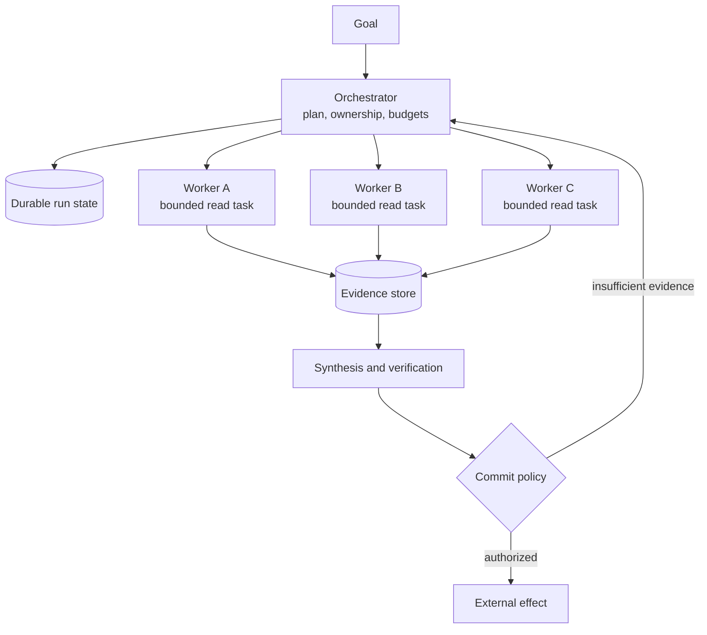

# Multi-Agent Systems

## TL;DR

Treat a multi-agent system as a distributed system with probabilistic, context-dependent workers. Its design hinges on work decomposition, state ownership, message semantics, concurrency control, failure isolation, admission control, provenance, and whether extra calls add independent information.

A robust starting topology inside one trust domain is an orchestrator with read-only workers. The orchestrator owns the goal, dependency graph, budgets, authoritative state, and final commit; workers explore bounded subproblems and return typed evidence. Multiple writers require enforced disjoint write sets or explicit concurrency control. Debate or aggregation buys evidence only when branches add meaningfully different information or failure modes—five correlated samples do not constitute five independent experts.

Multi-agent execution is justified when the task contains parallel information acquisition or separable deliverables whose value exceeds duplicated context, coordination, synthesis, and tail-latency costs. It is usually the wrong answer for one tightly coupled code change, one coherent document, a latency-sensitive interaction, or any decision without a reliable verifier.

---

## The Decision Before the Architecture

The phrase “multi-agent” conflates three different moves:

1. **Parallel sampling:** execute the same task several times and aggregate results.
2. **Functional decomposition:** assign different roles such as retrieval, execution, and review.
3. **Stateful delegation:** let one autonomous loop create and coordinate other autonomous loops.

They have different economics and failure modes. Parallel sampling buys diversity only to the extent that errors are uncorrelated. Functional decomposition is useful when boundaries have stable contracts. Stateful delegation extends effective context and search breadth but creates a distributed control plane.

A first-order value model is:

$$
V_{multi} = \Delta Q \cdot V_{outcome}
            + \Delta T \cdot V_{time}
            - C_{tokens}
            - C_{tools}
            - C_{coordination}
            - E[L_{failure}],
$$

where $\Delta Q$ is the measured quality improvement over the best single-agent baseline, $\Delta T$ is useful wall-clock reduction, and $E[L_{failure}]$ includes the expected loss from inconsistent or unauthorized actions. The system is worthwhile only when this quantity is positive on the actual workload distribution—not when an impressive best-case trace exists.

### Workload shape matters

| Workload | Likely architecture | Reason |
|---|---|---|
| Breadth-first research over independent sources | Orchestrator plus parallel researchers | Retrieval dominates; evidence can be unioned and deduplicated. |
| Large read-only audit | Partitioned reviewers plus one synthesizer | Read sets overlap safely; findings retain file/source coordinates. |
| One tightly coupled repository change | One writer, optional read-only investigators | Design intent and mutable state are shared; semantic merge conflicts dominate. |
| Independent services with versioned interfaces | Owner per service plus contract/integration stage | Write sets are separable and integration has an executable boundary. |
| Classification with weak single-sample accuracy | Ensemble only after correlation analysis | Voting may help, but shared errors can erase the theoretical gain. |
| High-impact decision with no ground truth | Human decision support | More model opinions do not create authority or truth. |

The most important baseline is not “one call.” It is the strongest single-agent system with the same tools, total compute budget, context management, and verifier. Otherwise a multi-agent design may appear superior merely because it received more tokens or better retrieval.

## Architecture Topologies

### Orchestrator–worker



This topology centralizes goal interpretation and commit authority. The orchestrator creates a dependency graph, assigns bounded work, and decides whether a worker result satisfies its contract. Workers return claims, evidence references, uncertainty, actions attempted, and unresolved questions—not their entire transcript.

The orchestrator is both a bottleneck and a consistency boundary. Scale it by separating deterministic scheduling from model-based planning: code tracks node state, leases, deadlines, and budgets; a model proposes decomposition or replanning at explicit decision points. Requiring the model to rediscover the whole run state on every scheduling decision is expensive and makes replay unstable.

### Pipeline

A pipeline gives each stage one input and output contract. It is appropriate when transformations are ordered and stable, such as extract → normalize → generate → verify. It is not inherently multi-agent; using separate model personas does not change the topology.

Under an independence approximation, if stage $i$ has an undetected semantic-error probability $e_i$, the chance of at least one undetected error is

$$
P(error) = 1 - \prod_i (1-e_i).
$$

Model stages often share source evidence and earlier artifacts, so their errors are dependent. Use the product only as an illustrative baseline; release evidence should estimate end-to-end outcomes or conditional error rates on complete traces.

Version schemas, validate at boundaries, and retain source provenance so a later stage can distinguish a source fact from an earlier model's inference. Backtracking must be explicit: a verifier should invalidate the specific upstream artifact that failed, not merely append “try again” to the last prompt.

### Blackboard

In a blackboard system, workers observe and contribute to shared structured state. This works for opportunistic search or constraint solving when partial results are independently useful. It fails when the blackboard is treated as a mutable text blob.

Model the board as typed records with immutable revisions. A contribution contains a stable ID, author, base revision, claims, evidence, affected entities, and status. Writes use compare-and-swap or append-only events. A controller selects which pending contribution to evaluate next and prevents every worker from waking on every update—a feedback pattern that otherwise creates quadratic call growth.

### Peer-to-peer and federated agents

Peer-to-peer topology is appropriate across organizational or trust boundaries where no party owns the other agent's internals. Agents exchange tasks and artifacts through a versioned protocol, not shared process memory. Capability discovery, authentication, deadlines, status, cancellation, and artifact transfer matter more than natural-language conversation.

At this boundary, assume at-least-once delivery, duplicated messages, clock skew, partial failure, incompatible schema versions, and independent policy. An agent's claim that work is complete is not a transaction commit in the caller's system. The caller validates the returned artifact and records its own state transition.

### Debate, critique, and ensemble topologies

Debate can expose competing assumptions when participants receive distinct evidence, roles, or constraints. If every participant sees the same prompt and model, repeated discussion often converges socially rather than epistemically: later agents copy fluent earlier claims, minority correct answers disappear, and token cost grows each round.

Use a blind first round to preserve independence. Require evidence-addressed claims. Aggregate with a verifier that sees original artifacts, not just arguments. Stop after a fixed information gain or budget threshold. Debate should produce a decision record containing disagreements and evidence; consensus alone is not a correctness criterion.

## The Core Control-Plane Model

A multi-agent run is a directed acyclic graph until dynamic decomposition adds nodes. Cycles may represent revision, but every cycle needs a bounded termination rule. The durable entities are:

- **Run:** original goal, principal, tenant, policy snapshot, global deadline, and budget.
- **Task:** logical unit of work, input contract, dependencies, read/write sets, success predicate, and owner.
- **Attempt:** one execution of a task with a lease, worker identity, start/end times, model/tool versions, and outcome.
- **Artifact:** immutable, content-addressed output with schema and provenance.
- **Claim:** an assertion linked to supporting or contradicting evidence.
- **Commit:** authorized transition from proposed artifact or action to authoritative state.

Use stable logical task IDs across retries and unique attempt IDs for each execution. A worker heartbeat renews a lease; lease expiry permits reassignment but does not prove the first attempt stopped. Results arriving after lease loss are marked late and may be used as evidence, but they cannot silently commit.

### Dynamic decomposition

An orchestrator may propose new tasks at runtime, but the scheduler should validate the proposal:

- every task has a bounded objective and output schema;
- dependencies exist and do not introduce an unintended cycle;
- the task's estimated reservation fits remaining budget and deadline;
- its requested tools are permitted for the run principal;
- its read and write sets do not violate ownership rules;
- its result has an identified consumer or verifier.

This turns “spawn another agent” into an admission-controlled graph mutation. It also prevents recursive delegation storms in which workers create workers faster than results can be consumed.

### Hierarchical budgets

Global caps are insufficient. Let a parent task allocate reservations to children:

$$
B_{parent} \ge B_{self} + \sum_j B_{child,j} + B_{reserve}.
$$

Track token, currency, wall-clock, tool-operation, and concurrency budgets separately. Refund unused reservations when a child finishes. Do not let a retry bypass admission. A child can request more budget with an explanation and intermediate evidence; the parent may reallocate or terminate lower-value branches.

Deadlines propagate similarly. A child deadline must leave enough time for aggregation, verification, and commit. If the root has 30 seconds remaining, starting a worker with a 30-second timeout guarantees an end-to-end miss.

## State Ownership and Consistency

Multi-agent correctness is primarily an ownership problem. Classify state by who may write it and how readers observe it.

| State | Typical owner | Consistency requirement |
|---|---|---|
| Goal, plan, task graph | Orchestrator | Linearizable or single-writer revision history |
| Worker scratch context | Worker | Private; disposable after result publication |
| Evidence and artifacts | Producing worker, then immutable | Content-addressed; append-only metadata |
| Shared derived view | Deterministic reducer | Rebuildable from events/artifacts |
| User-facing draft | One designated writer | Optimistic version or serialized commits |
| External side effects | Policy-authorized committer | Idempotency plus reconciliation |

### The one-writer default

One writer does not mean one model performs all work. Many workers can propose patches, sections, or actions; one owner validates and commits them against the latest base revision. This is equivalent to a database primary with speculative computation around it.

For source code, a worker output should identify the base commit, affected symbols/files, patch, assumptions, and tests. Before commit, the owner checks that the base is current, applies the patch, runs integration verification, and rejects semantic conflicts. Git can merge lines while still violating one architectural invariant in two different ways; text merge success is not a consistency proof.

### Partitioned writers

Multiple writers are safe when ownership partitions are real and enforced. Define write sets at a semantic level: service/API ownership, database tables, document sections, or resource namespaces. Integration contracts must be versioned before parallel work begins. If workers discover a cross-boundary change, they emit a contract-change proposal and pause dependent commits rather than editing another owner's domain.

Use fencing tokens with leases. Every commit includes the lease generation; a store rejects writes from a stale worker even if its process is still running. Optimistic concurrency (`expected_revision`) catches lost updates. Serializable transactions may be required for coupled state, but they do not resolve contradictory design intent; that still needs one decision owner.

### Event sourcing and projections

An append-only event stream gives replay, audit, and recovery, provided event semantics are versioned. Useful events include `TaskProposed`, `TaskAdmitted`, `AttemptStarted`, `ArtifactPublished`, `ClaimRetracted`, `ApprovalGranted`, and `CommitApplied`. Store the data necessary to reproduce deterministic state transitions, not raw chain-of-thought.

Projections such as “current plan” or “open tasks” may lag. Commands that require strong consistency should validate against the authoritative stream version. Observability dashboards may use eventually consistent projections. Mixing these expectations creates bugs where a worker acts on a stale “open” task after it was cancelled.

## Communication Semantics

Natural language is suitable for task content, not protocol state. A message envelope should contain at least:

```text
message_id, schema_version, run_id, task_id, attempt_id
sender, authenticated_principal, recipient
kind, created_at, expires_at, correlation_id
payload_ref_or_inline_payload, content_hash
trace_context, priority, expected_base_revision
```

The payload is schema-validated and can include prose. The envelope supplies deduplication, routing, expiry, tracing, and concurrency checks.

### Delivery guarantees

Exactly-once delivery across queues and arbitrary tools is generally unattainable. Design for at-least-once messages with idempotent consumers:

1. consume a message;
2. insert its `message_id` into an inbox table and apply the local state transition in one transaction;
3. write any outbound messages to an outbox in that transaction;
4. asynchronously publish the outbox; duplicates are harmless.

Ordering is usually per task or aggregate, not global. Include a sequence or expected revision. A response to a cancelled or superseded attempt remains auditable but cannot advance authoritative state.

### Context transfer is lossy compression

Delegation is a compression boundary. A good task packet includes the objective, why it exists, relevant constraints, accepted and rejected decisions, input artifact references, expected output, verifier, budget, and escalation conditions. It deliberately excludes irrelevant transcript history.

The worker's return packet distinguishes:

- observed facts with source coordinates;
- inferences and their premises;
- proposed changes;
- uncertainty and missing evidence;
- actions performed and their receipts;
- a compact result intended for the parent context.

This structure prevents “telephone game” provenance loss. The synthesizer can trace a claim back to source evidence instead of citing another model's summary as if it were primary evidence.

### Backpressure and overload

Every queue must be bounded. Admission considers tenant concurrency, worker-pool saturation, provider quotas, remaining deadline, and expected fan-out. When overloaded, shed low-value speculative branches, reduce ensemble size, route to a cheaper model, serialize work, or reject early. Letting the queue grow converts overload into expired work that still consumes tokens.

Use weighted fair scheduling so a single research run cannot occupy the fleet. Reserve limited capacity for interactive traffic and recovery work. Per-tenant and per-run concurrency caps also bound correlated spend incidents caused by a malformed decomposition.

## Scheduling and Straggler Control

Parallel completion time is governed by the slowest required child. If child latencies are $L_1, \ldots, L_n$, an `all` join observes $\max L_i$. Fan-out therefore improves median time for divisible work but can worsen the tail.

Mitigations depend on semantics:

- use partial joins when missing branches reduce coverage rather than invalidate the answer;
- split oversized tasks using observed cost, not equal item counts;
- speculatively duplicate only idempotent, high-tail read tasks and accept the first valid result;
- cancel redundant attempts and account for leaked provider work;
- reserve synthesis time and stop admitting children near the deadline;
- checkpoint long searches so a replacement worker resumes rather than starts over.

Estimate task size from input tokens, number and type of tools, expected output, historical slice, and model tier. A model-generated estimate can be one feature, but scheduler decisions should be corrected by observed durations and token usage.

## Reliability and Recovery

Failures occur at four layers:

1. **Infrastructure:** process loss, queue outage, provider timeout, quota rejection.
2. **Protocol:** duplicate, stale, malformed, or unauthorized messages.
3. **Semantic:** plausible but incorrect work, ignored constraint, incompatible outputs.
4. **Coordination:** missing dependency, cyclic delegation, inconsistent commit, orphaned child.

Retry only the first class automatically, plus explicitly idempotent protocol failures. Semantic failures require new evidence, a different strategy, or escalation. Retrying the same model with the same context is correlated sampling, not remediation.

The parent records child lifecycle independently from a live connection. On orchestrator restart it reconstructs the graph, reclaims expired leases, polls remote operations whose outcome is uncertain, and schedules only tasks that remain admissible. Orphan detection links every running attempt to a live lease and run state. Cancellation walks the descendant graph, signals workers, and reconciles side effects that cannot be cancelled.

### Sagas for external effects

When several agents contribute to a business transaction, the orchestrator owns the saga. Each committed step declares an idempotency key and, where meaningful, a compensation. Compensation is not necessarily reversal: after publishing a notification, remediation may be another notification. The saga log records irreversible boundaries so policy can require approval before crossing them.

## Security and Trust Boundaries

An agent is not a principal merely because it has a name. Authority derives from the authenticated user or service, attenuated for the assigned task. The orchestrator issues short-lived capabilities scoped to a tool, resource, action, tenant, and expiration. Workers should not receive the orchestrator's broad credentials.

Treat worker messages, retrieved documents, peer-agent cards, and tool output as untrusted data. None may modify system policy, grant capabilities, or alter destination routing through natural-language instructions. Validate schemas, enforce egress and resource allowlists, and isolate execution for untrusted code or files.

Cross-agent privacy requires field-level data classification. A task packet should include only necessary fields; secrets remain in a tool-side vault and are referenced by opaque handles. Logs and traces must redact model inputs, tool arguments, and artifacts according to tenant and retention policy. Immutable provenance does not justify retaining sensitive content indefinitely—retain hashes and deletion tombstones where full payload retention is prohibited.

Approvals bind to the action digest, resource version, principal, and expiry. A reviewer approving “send this draft” does not authorize a worker to change the recipient or regenerate the body afterward. Policy is re-evaluated at commit because privileges and external state may change during a long run.

## Evaluation and Observability

Evaluate the system at three levels.

**Component evaluation** measures router accuracy, decomposition validity, worker contract fulfillment, evidence precision/recall, and verifier calibration. **Coordination evaluation** injects duplicate messages, stale results, worker death, quota exhaustion, delayed branches, and conflicting writes. **End-to-end evaluation** measures task success, human correction, side-effect correctness, latency, and spend on a representative workload.

Compare against ablations:

- best single agent with equal total token budget;
- orchestrator without parallelism;
- workers without role-specific prompts;
- smaller fan-out;
- no debate or no second review;
- deterministic decomposition where available.

This identifies which complexity produces marginal value. Report quality versus cost and latency as a Pareto frontier rather than one score.

A trace should connect user request → run → task → attempt → model generation → tool call → artifact → claim → verifier → commit. Record model/provider resolution, prompt and tool-schema versions, token usage, cache status, queue and execution times, termination reason, retry cause, lease generation, and policy decisions. Do not store hidden reasoning; store observable actions, concise rationales where required, evidence, and state transitions.

Operational metrics include:

- useful completion rate and verified completion rate;
- tasks, attempts, and retries per run;
- fan-out and active-agent concurrency distributions;
- queue wait, worker time, join wait, synthesis time, and end-to-end percentiles;
- tokens and currency per successful run, not merely per call;
- stale-result, duplicate-message, orphan-attempt, and write-conflict rates;
- verifier disagreement, human override, and unsupported-claim rates;
- cancellation acknowledgement and post-cancellation spend.

Alerts should be slice-aware. A global completion rate can remain stable while one tenant, tool, language, or task type fails completely.

## Failure Modes

**Persona theater.** Several differently named agents use the same model, evidence, and prompt shape, so the architecture adds calls without independent capability. Ablations show whether specialization changes outcomes.

**Context fragmentation.** Each worker makes a locally sensible decision without the constraints or rejected alternatives known by the parent. Task packets must carry decision context and workers must surface assumptions rather than invent them.

**Semantic write conflicts.** Disjoint text edits encode incompatible design choices. Enforce one writer or semantic ownership, then run integration verification against the combined state.

**Correlated consensus.** Multiple agents repeat the same false retrieved claim and voting increases confidence. Preserve blind independence, diversify evidence, and use ground-truth verifiers.

**Delegation explosion.** Recursive spawning grows geometrically. Only the scheduler may admit tasks; depth, fan-out, concurrency, deadline, and spend budgets are hierarchical.

**Stale worker commit.** A timed-out worker returns after replacement and overwrites newer state. Lease fencing and expected revisions reject the late commit.

**Orphaned execution.** A parent cancels or crashes while children continue spending or causing effects. Durable parent-child state, propagated cancellation, and orphan reconciliation are required.

**Natural-language protocol ambiguity.** “Done,” “approved,” or “retry” means different things to different agents. Protocol state uses enums and schemas; prose is payload.

**Shared blackboard race.** Read-modify-write on a mutable collection loses contributions despite local locks in each process. Use transactional append, compare-and-swap, or an authoritative reducer.

**Reviewer laundering.** A reviewer sees only the proposed summary, not primary evidence, and certifies the generator's framing. Verifiers access original artifacts and return evidence-addressed failures.

**Tail amplification.** Required `all` joins wait for one pathological branch. Bound tasks, use partial semantics, and stop admitting work that cannot finish before the parent deadline.

**Authority propagation.** A subagent inherits credentials beyond its assignment or treats another agent's instruction as authorization. Mint attenuated capabilities and enforce policy at the tool and commit boundaries.

## Decision Framework

Use multi-agent execution only after answering these questions with workload evidence:

| Question | If yes | If no |
|---|---|---|
| Does the task contain independent information acquisition? | Parallel read-only workers may improve breadth or time. | Keep one continuous context. |
| Can write ownership be partitioned by an enforceable contract? | Assign owners and integrate through versioned boundaries. | Use one writer. |
| Are worker errors meaningfully independent? | Ensemble or debate may improve confidence. | More samples mainly multiply cost. |
| Is there a verifier stronger or cheaper than generation? | Permit bounded autonomy before commit. | Keep a human decision boundary. |
| Does task value cover coordination and duplicated context? | Size fan-out using the measured Pareto frontier. | Use a workflow or single call. |
| Can the system recover from worker loss and ambiguous effects? | Long-running delegation is supportable. | Restrict to short, read-only tasks. |
| Is tail latency compatible with the join policy? | Parallelize with deadlines and partial semantics. | Serialize or reduce fan-out. |

Choose the topology from state semantics:

- central authoritative goal and coupled output → orchestrator–worker;
- stable ordered transformation → pipeline;
- opportunistic independent contributions → versioned blackboard;
- organizational boundary → federated peer protocol;
- independent hypotheses plus external verifier → ensemble or debate.

Then define ownership, logical identities, message delivery, budget propagation, cancellation, and observability before tuning prompts. If those fields cannot be written down precisely, adding more agents will make the system harder to reason about rather than more capable.

## Key Takeaways

- Multi-agent design is distributed-systems design: ownership, consistency, delivery, leases, backpressure, and recovery dominate personas.
- Parallelize independent reads freely; serialize coupled writes unless write sets and integration contracts are enforceably separate.
- Delegation is lossy context compression. Exchange typed task and evidence packets with provenance, not raw conversational summaries.
- A scheduler—not an unconstrained model—admits dynamic tasks and subdivides deadlines, spend, tokens, tools, and concurrency.
- At-least-once messaging, stale attempts, uncertain side effects, and cancellation leakage must be normal states in the design.
- Consensus helps only when errors or evidence are sufficiently independent; agreement is not ground truth.
- Evaluate every multi-agent topology against an equal-budget single-agent baseline and keep only complexity with measured marginal value.

## References

- [How We Built Our Multi-Agent Research System](https://www.anthropic.com/engineering/built-multi-agent-research-system) — orchestrator–worker research architecture and token economics
- [Don't Build Multi-Agents](https://cognition.ai/blog/dont-build-multi-agents) — the context-sharing and coherence counterargument
- [AutoGen: Enabling Next-Gen LLM Applications](https://arxiv.org/abs/2308.08155) — multi-agent conversation framework
- [MetaGPT: Meta Programming for Multi-Agent Collaborative Framework](https://arxiv.org/abs/2308.00352) — role- and artifact-oriented collaboration
- [Improving Factuality and Reasoning in Language Models through Multiagent Debate](https://arxiv.org/abs/2305.14325) — debate as an inference strategy
- [Model Context Protocol specification](https://modelcontextprotocol.io/specification/) — agent-to-tool/context interoperability
- [Agent2Agent Protocol specification](https://a2a-protocol.org/latest/specification/) — inter-agent task and artifact exchange
- [Designing Data-Intensive Applications](https://dataintensive.net/) — logs, replication, consistency, and distributed coordination foundations
- [Temporal documentation: durable execution](https://docs.temporal.io/) — replay, activities, retries, signals, and workflow versioning
