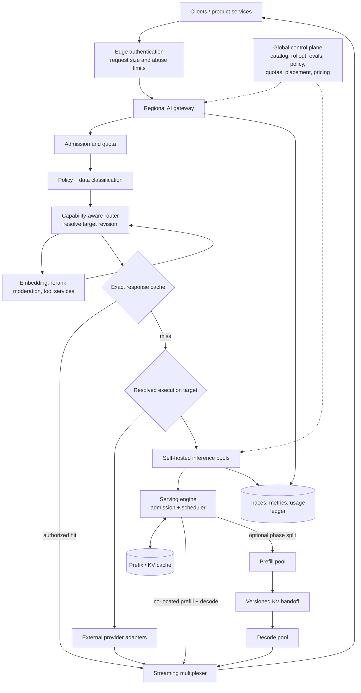

# LLM Infrastructure

## TL;DR

LLM infrastructure is a deadline-aware, quota-constrained distributed serving system around expensive stateful accelerators and fallible external providers. The platform must turn a logical model request into an admitted, policy-checked, version-pinned execution; schedule prefill and decode without allowing long prompts to starve interactive traffic; stream results with cancellation; account for tokens and cost; and preserve a trace across gateways, retrieval, model servers, and tools.

Separate the global **control plane**—model catalog, policy, evaluation evidence, rollout state, quotas, pricing, and placement—from regional **data planes**—admission, routing, caches, queues, inference pools, and streaming. A provider API and a self-hosted model should implement the same logical contract but retain different failure semantics. Provider fallback is not transparent if models differ in tokenization, context limits, tool schemas, safety behavior, or output distribution.

Optimize for goodput—the rate of requests that meet correctness, latency, and policy bounds—and report cost efficiency beside it. Raw GPU utilization, tokens per second, low API price, or goodput alone can each improve while another product constraint gets worse.

---

## Begin with the Workload and SLO

An infrastructure design is meaningful only for a specified workload distribution. Record at least:

- arrival rate by tenant, endpoint, and traffic class;
- input, cached-prefix, reasoning, and output token distributions;
- context length and image/audio dimensions for multimodal traffic;
- streaming versus batch behavior;
- tool-call frequency and inter-step think time;
- model and adapter mix;
- deadline, time-to-first-token (TTFT), inter-token latency (ITL), and completion SLOs;
- retry, cancellation, and disconnect rates;
- data residency, retention, safety, and availability requirements.

A chat request with 1,000 input tokens and 150 output tokens has a different resource shape from code generation with a 100,000-token repository prefix, offline document extraction, or an agent session that alternates short model bursts with long tool waits. Averages hide the tails that determine memory capacity and queueing.

Define SLOs at the user-visible boundary. A provider's model latency excludes your queue, rate limiter, retrieval, moderation, network, parser, retries, and client rendering. For streaming, separate:

$$
TTFT = Q + L_{route} + L_{prefill} + L_{network-first},
$$

$$
T_{complete} = TTFT + \sum_{j=1}^{T_{out}} ITL_j + L_{postprocess}.
$$

Goodput and cost efficiency are separate objectives:

$$
G = \frac{N_{qualified\ completions}}{time},
\qquad
E_C = \frac{N_{qualified\ completions}}{cost}.
$$

This prevents the platform from declaring success after batching increases throughput but violates interactive TTFT, or after an aggressive fallback improves availability but lowers answer quality below the product threshold.

## Reference Architecture



The edge rejects unauthenticated, malformed, or obviously oversized requests before expensive work. The gateway creates a stable generation ID, resolves the caller's product policy, reserves budget, selects a route, and owns the stream. Provider adapters translate the logical request into provider-specific APIs and normalize observable outcomes without pretending the models are equivalent.

### Logical generation contract

A request contract should include:

```text
generation_id, tenant_id, principal_id, product/use_case
requested capability and acceptable model set
messages/content references, tool-schema versions, output schema
max input/output/reasoning budgets
deadline and traffic class
data classification, residency, retention policy
idempotency key, trace context, experiment assignment
```

The response stream emits typed events such as `generation.started`, `content.delta`, `tool_call.proposed`, `usage.updated`, `generation.completed`, and `generation.failed`. A terminal event includes resolved model/provider revision where available, finish reason, input/output/cached/reasoning token accounting, safety/policy outcomes, and latency breakdown.

Do not encode control state only as provider-specific JSON. The logical contract is versioned, and each adapter declares which capabilities it supports. Unsupported combinations fail at admission rather than degrading silently—for example, routing a strict JSON-schema request to a model that only approximately follows JSON.

## Control Plane

### Model and capability catalog

The catalog maps a stable product capability to deployable targets. A target record includes:

- provider/model identifier or immutable artifact digest;
- tokenizer and context limits;
- modalities, tool-calling, structured-output, and streaming capabilities;
- region and data-handling constraints;
- measured quality by evaluation slice;
- latency and cost curves by input/output band;
- safety policy compatibility;
- rollout status, owner, and rollback target.

Model aliases are conveniences, not reproducibility identifiers. Resolve an alias once per generation and record the outcome. Long-running agent sessions need an explicit migration policy: pin the session, migrate at a turn boundary, or allow per-turn routing while accepting behavioral drift.

### Evaluation-gated rollout

A model or serving-stack change affects output behavior even when the API schema is unchanged. Promotion should link to evaluation artifacts and move through offline, shadow, canary, and gradual traffic stages. Compare not only quality but tokenization, output length, tool-call selection, structured-output validity, refusal behavior, TTFT, ITL, error rate, and cost.

Shadow traffic must respect data policy and does not create user-visible side effects. For agent requests, shadow only the model decision or run tools in read-only/simulated mode. A canary needs slice-aware abort conditions; global averages can hide a severe regression for one language, tenant, or tool.

### Configuration publication

Routing policy, quotas, and model deployments should be immutable revisions published through an atomic snapshot. Regional gateways cache a last-known-good snapshot and reject configurations whose schema or signature they cannot validate. Every generation records the control-plane revision it used.

This prevents half-deployed configurations where a router sends traffic to a pool that has not loaded the corresponding adapter or tokenizer. Rollback changes a small alias to a known-good compatible snapshot; it does not reconstruct configuration manually during an incident.

## Regional Data Plane

### Admission control

Admission is where the system protects latency and spend. Validate capability, policy, request size, deadline feasibility, tenant quota, and estimated resource reservation before joining an expensive queue.

Reserve multiple dimensions:

- request concurrency;
- input, cached, reasoning, and output tokens;
- provider currency or internal accelerator seconds;
- tool calls and retrieval fan-out;
- KV-cache memory for self-hosted serving.

Token estimates are uncertain because output length and agent steps are unknown. Start with a policy cap and workload-conditioned estimate; update the reservation as usage streams; terminate or request additional authority before exceeding a hard budget. Reconcile the estimate with actual usage in an append-only ledger.

Bound every queue. An unbounded queue does not increase capacity; it converts overload into requests that consume resources after their deadlines. Shed or degrade early by traffic class: reject batch work, reduce best-of-N, choose a smaller model, limit output, or return a retryable overload response. Never downgrade safety or tenant isolation.

### Routing is constrained optimization

Routing chooses a target subject to hard constraints, then optimizes a product objective:

$$
m^* = \arg\max_{m \in M_{eligible}}
  \left[Q(m,x) - \lambda_L E[L|m,x] - \lambda_C E[C|m,x] - \lambda_R Risk(m,x)\right].
$$

`M_eligible` is filtered by capability, region, policy, context length, availability, and experiment. Predictions should use observed workload features and be calibrated by slice. A small model can handle easy traffic only if the router recognizes hard examples with adequate recall; otherwise savings are purchased with invisible quality loss.

Use deterministic routing when requirements are crisp. A learned or LLM router may classify difficulty or intent, but policy constraints remain in code. Record candidate targets and the reason for selection so changes can be replayed and evaluated.

### Fallback semantics

Fallback is a product decision, not a generic retry. Classify failures:

- transient connection or server failure before any output;
- rate or quota rejection;
- timeout before first token;
- interrupted stream after partial output;
- invalid structured output;
- safety refusal;
- semantic quality failure.

A transient pre-output fault may retry the same target with jitter if deadline permits. Quota failure may route to a compatible target. Once tokens have reached the user, restarting on another model risks duplicated or contradictory content; the stream protocol must either resume from a supported checkpoint or terminate clearly. A safety refusal must not be bypassed automatically through a less restrictive model. Semantic failure needs a verifier-driven alternate strategy, not infrastructure retry.

Fallback compatibility includes tokenizer, system instruction, tool protocol, schema support, context limit, safety policy, and data residency. Maintain a tested compatibility graph rather than one ordered list of models.

## Self-Hosted Inference Data Path

The detailed GPU mechanics are in [GPU Inference Internals](./11-gpu-inference-internals.md). At the platform level, distinguish two phases:

- **Prefill** processes many input tokens in parallel and creates the KV cache. Long, well-batched prefills often expose enough matrix work to approach a compute or attention-kernel limit, but short or skinny shapes can remain launch- or bandwidth-limited; queueing plus prefill commonly dominates TTFT for long prompts.
- **Decode** generates one token per active sequence per step and repeatedly reads model weights and growing KV state. It is commonly memory-bandwidth-bound at low batch, while compute, KV traffic, or communication can dominate elsewhere.

Their different resource shapes motivate continuous batching, chunked prefill, or separate prefill/decode pools.

### Request scheduler

The scheduler operates on sequences, not HTTP requests. It tracks prompt tokens remaining, generated tokens, KV blocks, deadline, priority, tenant, adapter, cancellation, and sampling state. Continuous batching admits new sequences between decode iterations rather than waiting for a static batch to finish.

Scheduling objectives conflict:

- large batches improve device efficiency;
- long prefills can block decode and inflate ITL;
- short-request priority improves median latency but can starve long work;
- grouping by adapter or model improves locality but delays rare variants;
- prefix-cache affinity saves compute but may imbalance replicas.

Use traffic classes with bounded fairness. Chunk long prefills so decode receives regular service. Reserve memory headroom for active KV growth and reject or preempt before out-of-memory. If preemption swaps or recomputes KV state, include that cost in admission and SLO models.

### KV-cache management

For a transformer with $L$ layers, KV heads $H_{kv}$, head dimension $D$, sequence length $S$, and $b$ bytes per element, an approximate per-sequence KV footprint is:

$$
M_{KV} \approx 2 \times L \times H_{kv} \times D \times S \times b.
$$

The factor two stores keys and values. Tensor parallelism, page metadata, alignment, speculative branches, and implementation details change the physical amount. Since $S$ grows during decode, admitting to current free memory without reserving future growth causes late OOM failures.

Paged KV allocation reduces external fragmentation by assigning non-contiguous blocks and enables sharing for common prefixes or forked sequences. Prefix reuse requires an exact cache identity over token IDs and every state-affecting model option. Text equality is insufficient when templates, tool schemas, adapters, position handling, or multimodal inputs differ.

### Model loading and placement

Artifacts are content-addressed, signed, scanned, and accompanied by tokenizer, generation defaults, quantization metadata, adapter compatibility, and runtime requirements. A replica becomes ready only after weights load, kernels initialize, a warm-up generation passes, and the control plane confirms the expected digest.

Placement considers accelerator type and topology, model parallelism, memory, regional demand, failure domains, and load time. Large models may take minutes to load, so autoscaling from zero cannot satisfy interactive bursts. Maintain warm capacity or route predictable batch traffic to absorb idle headroom.

Rolling upgrades need surge capacity because old and new replicas coexist. Drain removes a replica from new admissions but lets active streams finish or migrate only if the runtime supports state transfer. Killing a pod with live KV state is an application-visible failure.

### Parallelism and disaggregation

Tensor parallelism shards each layer and requires frequent collectives; pipeline parallelism divides layers and introduces pipeline bubbles; expert parallelism routes mixture-of-experts tokens and can suffer load imbalance. Choose placement from interconnect topology, not only aggregate GPU count.

Prefill/decode disaggregation places phases on separately tuned pools. It helps when workload mix and phase interference justify KV transfer overhead and operational complexity. Chunked-prefill systems instead co-schedule phases on the same workers. Benchmark both on actual context/output distributions; neither is universally superior.

## Provider-API Infrastructure

Using provider APIs replaces GPU operations with vendor dependency management. You still own:

- per-project and per-model quota allocation;
- regional routing and data-handling configuration;
- timeout, retry, and stream parsing;
- provider-specific token accounting and price changes;
- model alias drift and deprecation;
- safety/retention contract mapping;
- idempotency of downstream tool effects;
- quality and fallback evaluation.

Use separate credentials and limits by environment and product, held in a secret manager. The gateway should expose no provider key to clients. Rate-limit before the provider, because discovering overload via paid rejected or timed-out requests is expensive.

Provider status is an input, not proof. Circuit breakers open on local outcome windows by target and region. Avoid synchronized retries with exponential backoff and jitter, but respect the request's deadline—backoff that outlives the user is wasted work. A half-open probe uses low-volume safe traffic.

Multi-provider designs reduce correlated business dependency only if application features are portable and capacity is pre-arranged. An untested fallback account with no quota is not redundancy. Periodically exercise failover with representative requests and verify quality, safety, tool calls, and accounting.

## Streaming, Cancellation, and Idempotency

The gateway owns the client stream even if the backend changes. It assigns monotonically ordered event sequence numbers, sends heartbeats where intermediaries have idle timeouts, applies backpressure, and records the terminal state. A slow client must not retain unlimited decoded tokens in memory; buffer to a bound and then pause, spill, or cancel according to protocol.

Client disconnect propagates cancellation to the provider or inference server. Cancellation is best effort: already submitted accelerator work or provider generation may continue. Track post-cancellation tokens and spend, and prevent cancelled results from populating caches unless policy explicitly allows it.

Idempotency keys identify a logical generation request, but replay semantics must be explicit. Returning a stored completed response is safe for deterministic product semantics even if sampling was nondeterministic originally. Joining a currently active stream requires retained event history and authorization equality. Starting a second generation with the same key is not idempotent.

For tool-using models, the generation ID and tool-call ID are separate. Retrying a model request must not re-execute a tool effect unless the orchestrator's durable action state permits it.

## Caching

Caching exists at several layers:

| Cache | Reuses | Principal risk |
|---|---|---|
| Exact response | Complete logical result | Stale policy/data; authorization mismatch; nondeterministic expectation |
| Semantic response | Similar intent result | False equivalence and cross-tenant leakage |
| Prompt/prefix KV | Prefill computation | Incorrect cache identity; memory pressure; replica imbalance |
| Provider prompt cache | Provider-side prefix work | Vendor-specific accounting and retention semantics |
| Retrieval/tool cache | Evidence or tool result | Freshness and permission changes |

Exact keys include tenant/policy domain, tokenized messages, system prompt, tool schema, model/adapter revision, sampling settings, output schema, and relevant data snapshot. Prefix caches maximize hit rate when stable content comes first and per-request content comes last. Do not include secrets or user-specific data in a shared prefix domain.

Cache admission should be value-aware. Large one-off prefixes can evict popular entries; use size-aware policies and tenant quotas. Report hit rate together with tokens or compute saved, because a high hit rate on tiny prompts may have little value.

## Safety and Policy Architecture

Safety is a sequence of enforceable boundaries:

1. authenticate principal and product;
2. classify data and permitted target set;
3. validate request size, modalities, and content policy;
4. restrict tools and retrieval by capability;
5. constrain model output structure;
6. inspect proposed high-impact actions before commit;
7. log policy decisions and provide appeal/escalation paths.

Use deterministic validators for schemas, allowlists, resource limits, and authorization. Classifiers and LLM judges can add semantic signals but require calibrated thresholds and failure behavior. A timeout in a safety dependency should fail according to risk tier, not automatically fail open for availability.

Prompts cannot protect credentials or network access. Run untrusted code in an isolated environment; restrict egress; mint short-lived scoped credentials; and keep policy enforcement outside model-visible text. The [Harness Engineering](./09-harness-engineering.md) chapter develops this boundary.

## Multi-Region and Disaster Recovery

The control plane may be global, but generation data often must remain regional. Replicate signed configuration and non-sensitive model artifacts broadly; keep prompts, outputs, KV caches, and traces within allowed regions. Routing first filters legal residency, then considers health, capacity, latency, and cost.

Active-active regional gateways avoid a global request bottleneck. Quotas require a consistency choice: strict global spend may use centrally leased token buckets, while low-latency regional quotas can overshoot by the amount leased to each region. State the bound explicitly.

Self-hosted recovery objectives must account for artifact availability and model load time. Preserve a last-known-good artifact in each recovery region and test cold bootstrap. Provider-based recovery depends on independent endpoints, quota, and contractual data policy. Restore drills should replay real control-plane snapshots and synthetic generations, not merely confirm that backups exist.

## Capacity and Cost Engineering

For provider traffic, estimate cost rate from the joint distribution and every attempt, including retries and discarded candidates. Let $\lambda_s$ be arrivals per unit time and express the fixed term over that same unit:

$$
C_{rate} = \sum_s \lambda_s E\!\left[
      \sum_{a\in A_s}
      \left(T^{fresh}_{sa}c_f + T^{cached}_{sa}c_h
            + T^{output}_{sa}c_o + T^{reason}_{sa}c_r
            + C^{tools}_{sa}\right)\right] + C_{fixed,rate}.
$$

Fresh and cached input are disjoint in this ledger. If a provider includes reasoning in output accounting or applies tiered pricing, the versioned pricing adapter maps reported usage into mutually exclusive billable categories before aggregation.

For self-hosting, model memory feasibility first, then goodput at the target SLO. Weight memory, KV capacity, interconnect, bandwidth, and scheduler behavior determine the feasible region. Benchmark the real prompt/output distribution with warm-up, concurrency sweeps, failures, and mixed traffic. Peak synthetic tokens/s is not capacity for an interactive SLO.

Provision for normal headroom, failure-domain loss, rollout surge, and forecast error. Effective capacity after losing one node or zone must still serve priority traffic within its degradation policy. Autoscaling signals should include queue age, KV pressure, admission rejection, TTFT, and model-load backlog; GPU utilization alone reacts late or encourages saturation beyond the latency knee.

Showback and chargeback use the immutable usage ledger. Attribute shared platform costs, failed attempts, cache savings, and reserved capacity consistently. Product teams need cost per successful task or user outcome, not only token totals.

## Observability and Operations

One trace should connect edge request, gateway admission, policy, routing, cache, provider/inference queue, prefill, decode, safety, tool calls, and stream completion. Use stable generation, session, and logical action IDs. OpenTelemetry's GenAI semantic conventions can provide a common vocabulary, but extend them with platform-specific queue, budget, rollout, and policy fields.

Record:

- requested capability and resolved target;
- control-plane, prompt, tool-schema, and policy versions;
- input/output/cached/reasoning tokens;
- queue, prefill, TTFT, ITL, completion, and postprocess times;
- admission, routing, fallback, retry, and finish reasons;
- cache keys by hash and hit type;
- safety decisions without indiscriminate sensitive payload logging;
- cost estimate, actual usage, and ledger reconciliation;
- cancellation time and work observed afterward.

Service dashboards slice by target, region, tenant class, context band, output band, traffic class, and rollout. Track verified useful completion, availability, TTFT/ITL percentiles, queue age, fallback, schema validity, policy blocks, cost per success, KV pressure, preemption, cache value, and provider quota consumption.

Incident response starts with a safe control surface: stop a rollout, disable one route, cap fan-out/output, drain a pool, lower batch admission, or force a known-good target. Every switch is authenticated, audited, scoped, expiring where appropriate, and tested before an incident.

## Failure Modes

**Optimizing utilization instead of goodput.** The fleet reaches 95% GPU use while queueing violates TTFT and cancellations waste decode. Capacity targets must be derived from useful SLO-compliant completions.

**Unbounded admission.** Requests queue beyond their deadlines and continue consuming spend. Use bounded, deadline-aware queues and reject or degrade before expensive execution.

**Transparent-fallback fiction.** A fallback target lacks the context length, tool schema, safety policy, or quality required by the request. Build and continuously test a compatibility graph.

**Retrying partial streams.** A second model response is appended after the first emitted tokens, producing duplicates or contradictions. Define terminal interruption or supported resume semantics.

**Safety failover bypass.** A refusal or policy timeout routes to a less restrictive model. Policy outcomes are not infrastructure availability failures.

**Configuration split brain.** Gateways, pools, and adapters observe incompatible rollout revisions. Publish signed atomic snapshots and record their IDs per generation.

**KV overcommit.** Admission accounts for current sequence length but not future decode or speculative branches. Reserve growth and reject before an unrecoverable OOM.

**Long-prefill starvation.** Large prompts monopolize compute and increase ITL for active streams. Chunk prefills, isolate traffic classes, or disaggregate phases after measurement.

**Autoscaling after saturation.** GPU utilization triggers scaling only once latency has collapsed, and replicas load too slowly. Scale on queue/KV forecasts and keep warm headroom.

**Cache identity omission.** A prefix generated under one tool schema, adapter, tenant, or policy is reused under another. Key every state-affecting input and isolate security domains.

**Alias drift without evidence.** A provider changes the model behind an alias and output behavior shifts invisibly. Pin where possible, continuously canary, and record resolved revisions and behavioral metrics.

**Observability data leak.** Prompts, tool arguments, and outputs are copied into broad-access traces. Apply data classification, field-level redaction, sampling, tenant isolation, and retention controls.

## Decision Framework

### Provider API, self-hosting, or hybrid

| Consideration | Provider API favors | Self-hosting favors |
|---|---|---|
| Demand | uncertain, bursty, many model experiments | sustained, predictable, high-volume workload |
| Capability | frontier/proprietary features | open weights, custom runtime, adapters, deterministic artifact control |
| Operations | small platform team | accelerator, kernel, scheduler, and SRE expertise |
| Data/control | contract satisfies residency and retention | strict placement, network, or artifact requirements |
| Economics | low utilization or rapid model churn | measured goodput gives lower total cost at required SLO |
| Availability | vendor quota and regional dependency acceptable | capacity can be reserved across owned failure domains |

Hybrid systems often use providers for frontier or burst traffic and self-hosted pools for stable high-volume paths. They still require a shared logical contract, evaluation, accounting, and explicit compatibility—not a lowest-common-denominator abstraction that hides important behavior.

### Design sequence

1. characterize workload distributions and user-visible SLOs;
2. define capability, safety, data, and reproducibility constraints;
3. specify logical generation and streaming contracts;
4. design admission, quotas, deadlines, and degradation;
5. choose eligible targets and measurable routing objective;
6. define retry, fallback, cancellation, and idempotency semantics;
7. for self-hosting, benchmark scheduler and memory feasibility on real traces;
8. build evaluation-gated rollout, immutable usage accounting, and end-to-end traces;
9. test zone/provider failure, quota exhaustion, configuration rollback, and cold recovery.

Prefer the least operationally complex architecture that meets quality, policy, availability, latency, and cost requirements. Self-hosting for theoretical token price or multi-provider routing for an untested availability story adds infrastructure without necessarily adding product resilience.

## Key Takeaways

- LLM infrastructure is a deadline- and budget-aware serving system; admission and degradation matter as much as model execution.
- Separate versioned global control state from regional request data planes and record the exact revision used for every generation.
- Provider and self-hosted targets can share a logical contract, but fallback must preserve capabilities, policy, context, and quality.
- Prefill, decode, KV memory, batching, and model placement create distinct scheduling constraints; plan capacity from goodput at the product SLO.
- Streaming, cancellation, partial output, and tool idempotency require explicit protocol semantics.
- Optimize cost per verified successful outcome and preserve an immutable, reconciled usage ledger.
- Policy is enforced in gateways, tools, sandboxes, and commit paths—not by trusting prompt instructions.

## References

- [Orca: A Distributed Serving System for Transformer-Based Generative Models](https://www.usenix.org/conference/osdi22/presentation/yu) — iteration-level scheduling and selective batching
- [Efficient Memory Management for Large Language Model Serving with PagedAttention](https://arxiv.org/abs/2309.06180) — paged KV-cache management and vLLM
- [SGLang: Efficient Execution of Structured Language Model Programs](https://arxiv.org/abs/2312.07104) — structured generation runtime and prefix reuse
- [DistServe: Disaggregating Prefill and Decoding for Goodput-optimized Large Language Model Serving](https://www.usenix.org/conference/osdi24/presentation/zhong-yinmin) — phase disaggregation
- [Taming Throughput-Latency Tradeoff in LLM Inference with Sarathi-Serve](https://www.usenix.org/conference/osdi24/presentation/agrawal) — chunked prefills and stall-free scheduling
- [FlashAttention-3: Fast and Accurate Attention with Asynchrony and Low-precision](https://arxiv.org/abs/2407.08608) — accelerator-aware attention kernels
- [OpenTelemetry GenAI semantic conventions](https://opentelemetry.io/docs/specs/semconv/gen-ai/) — trace and metric vocabulary for generative AI systems
- [NIST AI Risk Management Framework: Generative AI Profile](https://www.nist.gov/publications/artificial-intelligence-risk-management-framework-generative-artificial-intelligence) — generative-AI risk management guidance
