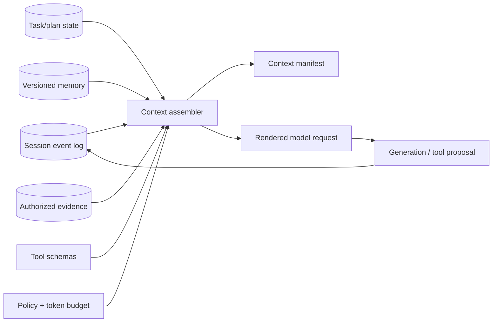

# Context Management

## TL;DR

Context management—often called *context engineering*—is the discipline of constructing the model's bounded working state on every call. A context is not a transcript dump. It is a versioned, policy-filtered materialized view assembled from instructions, session events, task state, retrieved evidence, tool observations, and persistent memory. Every item needs provenance, authority, freshness, token cost, and lifecycle semantics.

The window is finite; attention and recall are non-uniform; input is repeatedly processed in multi-turn systems; and compaction is lossy. Those properties require explicit budget allocation, stable-prefix design, bounded tool results, evidence selection, validated compaction, inspectable memory, and observability of exactly what entered each request. Optimize the lifecycle of information across the task, not one prompt string.

---

## The Context Window Is a Budget

Every request presents the model with one bounded sequence or equivalent ordered content structure: system instructions, tool definitions, conversation state, retrieved documents, the current message, and space reserved for the response. Advertised model limits continue to grow, but a large repository, long-running agent trace, or document corpus can still exceed them—and quality can degrade well before the hard limit.

The budget must be allocated before optional material is selected. Let $W_m$ be the qualified usable window for model $m$, which may be below its protocol maximum. Feasibility requires

$$
T_{instructions}+T_{tools}+T_{active\ state}+T_{evidence}+T_{history}
+T_{current}+R_{output}+R_{variance} \le W_m.
$$

The first terms may have minimum reservations or hard inclusion rules; optional evidence and history compete only for what remains. $R_{output}$ is a correctness reservation because truncation can cut a structured value or tool proposal. $R_{variance}$ covers token-estimation error, input growth, and any model-specific accounting that shares the limit. The allocator stores both planned and actual use by class, then recalibrates reservations from truncation, overflow, and task-success data. There is no portable percentage: limits follow the joint distribution of model, renderer, tool set, language, task, and output contract.

## Context Assembly as a Materialized View

Store canonical session and task state outside the model, then compile a request-specific view. A context item should carry:

```text
item_id, type, immutable content reference/hash
source and provenance, author/principal, trust class
created_at, valid_at, expires_at, supersedes
tenant/ACL policy, sensitivity and retention class
estimated tokens, priority, dependencies
compaction level and source-item IDs
```

The assembler resolves the authenticated principal, task and session revision, target model, and token budget. It fetches candidate items, removes unauthorized or expired state, resolves superseded facts, scores relevance and obligation, preserves required dependencies, and renders a deterministic ordered request. It emits a **context manifest** containing the selected item IDs, transformations, token counts, truncations, and final request hash.



The canonical state remains the event log, artifacts, plan, and memory records. The prompt is disposable. This prevents a compacted summary from becoming the only copy of a decision and lets an incident replay which source items were visible without storing all sensitive content inline in a general trace system.

### Allocation as constrained selection

Let item $i$ have expected utility $u_i$, token cost $t_i$, freshness risk $r_i$, and dependencies. Context selection approximates:

$$
\max_S \sum_{i\in S}(u_i-r_i)-redundancy(S)
\quad \text{subject to} \quad
T_{fixed}+\sum_{i\in S}t_i+T_{current}+T_{output}+T_{safety}\le W.
$$

Some items are mandatory rather than scored: system policy, current user intent, active constraints, tool result corresponding to an unresolved call, and evidence required for a cited claim. A dependency may require a table header with a selected row or an error message with the tool invocation that produced it. Greedy “top relevance per token” selection is a useful approximation only after these invariants are satisfied.

Use separate sub-budgets so one source cannot consume the window. Retrieval, history, memory, tool schemas, and current-turn attachments have different marginal value and different trust. When one exceeds its allocation, apply a type-specific policy: rerank evidence, prune superseded tool output, summarize old history, or expose tools through discovery instead of silently truncating the tail of the full request.

---

## Token Economics: The Bill Is Shaped Like a Triangle

Let turn $i$ append $d_i$ tokens and generate $o_i$ tokens. Without pruning, total input processed over $n$ turns is

$$
T_{input}=\sum_{i=1}^{n}\sum_{j=1}^{i} d_j.
$$

If each turn adds roughly $d$, this is $d n(n+1)/2$: quadratic in turn count. A long agent can therefore spend far more reprocessing history than generating the final answer.

Pricing and cache semantics differ by provider, model, deployment, and time, so retain variables rather than baking one multiplier into the architecture:

$$
C = c_f T_{fresh} + c_c T_{cached} + c_o T_{output}
    + c_r T_{reasoning} + C_{tools} + C_{storage}.
$$

In many offerings $c_c < c_f$, while output or reasoning tokens may be priced differently from fresh input. The exact ratios are configuration data. Architecture should maximize correctly reusable prefixes, bound repeated context, and measure provider-reported usage. Batch or asynchronous pricing can change the optimal path for evaluation and enrichment, but it must not be assumed for an interactive SLO.

Caching also reduces prefill work and can improve TTFT, but only for eligible prefixes and warm cache state. Capacity planning must include cold-cache events, eviction, model routing, and regional failover. A cost model that assumes every repeated token is cached will fail during rollout or incident traffic.

---

## Attention Is Not Uniform: Lost in the Middle and Context Rot

A context window is not random-access memory. *Lost in the Middle* demonstrated position-dependent accuracy on multi-document QA, with stronger use of evidence near boundaries than in the middle for the evaluated models and tasks. Later long-context evaluations show that recall, distractor sensitivity, and reasoning quality vary with model, position, formatting, evidence density, and task. “Context rot” is a useful name for degradation as irrelevant or conflicting material grows, but it is an empirical workload property rather than one universal curve.

Placement is therefore an evaluated part of context compilation. Mandatory policy and current intent receive stable, explicit structure; evidence stays adjacent to the claims or task segment it governs; chronology and table structure are not destroyed merely to place a high score at an edge. Repeating an obligation can increase salience but creates divergent copies unless every rendering is derived from one canonical field.

Selection quality matters as much as placement. Marginal evidence consumes tokens and can introduce distractors or contradictions, so evidence allocation should optimize sufficiency and redundancy rather than maximize chunk count. Qualification probes vary decisive-evidence position, distractor density, document structure, and context length on the actual task distribution. A synthetic needle measures one retrieval behavior, not the system's ability to reason over its own evidence.

---

## Prefix Identity, Reuse, and Revision

Prefix reuse is a derived optimization over one rendered request revision. A cache entry is correct only when its identity includes the token sequence and every state-affecting input: resolved model and tokenizer, adapter, template/compiler revision, tool schemas, position handling, multimodal content, and the provider/runtime's cache domain. Text equality alone is insufficient if another hidden input changes activations.

For request revisions $r_a$ and $r_b$, the reusable span is their longest compatible token prefix. Stable operator configuration and tool schemas therefore precede volatile per-turn content where the target protocol allows it. Canonical serialization prevents semantically irrelevant map order or whitespace changes from reducing reuse. Model migration, tool-set change, correction, minimization, and compaction create explicit divergence points; correctness and deletion obligations take precedence over preserving a cache hit.

The context manifest records the eligible prefix, compatibility inputs, cache decision, and reported reused tokens. Comparing consecutive manifests distinguishes a legitimate revision from a volatile timestamp, request ID, nondeterministic serializer, or routing change inserted too early. Hit count alone is weak: report fresh and reused tokens, prefill work avoided, entry size, eviction, and tenant/policy domain. The serving-side residency and routing consequences belong to [Agent Inference](./12-agent-inference.md).

---

## Long Context vs RAG

"Load the working set" and "retrieve only what is needed" are two selection policies. A larger window changes their feasible region but does not remove freshness, authorization, evidence-allocation, cache, or attention constraints.

**Long context** fits a bounded, request- or session-scoped working set whose contents are repeatedly used. It removes an online retrieval-miss boundary, but pays cold prefill, residency/eviction, and distractor costs. “Loaded” still does not mean “used correctly,” and source identity must survive rendering if claims require attribution.

**RAG** fits a corpus larger or more dynamic than one request should load, especially when access control, temporal selection, correction, deletion, or evidence ranking must happen before model exposure. It adds corpus-publication and retrieval failure boundaries but makes selection independently observable.

A hybrid uses retrieval to publish a bounded evidence snapshot and then reuses that snapshot across turns. **Just-in-time retrieval** instead lets observations determine later reads through typed tools. It reduces front-loaded context and supports exploratory tasks, but adds tool latency, stopping-policy, reproducibility, and wandering risk. These modes may coexist: load stable high-use evidence, retrieve the long tail, and record the exact source revisions seen.

| Dimension | Long context | RAG | Agentic (just-in-time) |
|---|---|---|---|
| Corpus scope | Bounded request/session snapshot | Indexed corpus | Tool-navigable namespace |
| Freshness boundary | Snapshot reload | Corpus publication lag | Source state at each read |
| Primary failure | Distractor/position use and cold prefill | Coverage or ranking miss | Incomplete search or wandering |
| Reproducibility | Pin rendered source revisions | Pin corpus/index snapshot | Persist read queries and receipts |
| Selection authority | Context assembler | Retrieval pipeline | Model proposes; tool/policy enforces |

---

## Compaction Lifecycle and Publication

A long-running session eventually crosses a qualified context, latency, or cost threshold. Compaction transforms a source event range into a smaller derived artifact plus lineage. It is not an in-place transcript edit. The canonical event graph, task state, and effect receipts remain authoritative under their retention policy; the compacted artifact is one materialized view.

A compaction job pins `source_revision`, declares the item classes and exact fields it must preserve, generates narrative compression only for residual prose, validates the result, and publishes a new context revision with compare-and-swap against the active base. If the session advances during the job, the artifact is stale and must be rebased or discarded. Publication also declares the cache divergence point and which source payloads can be rehydrated.

Trigger policy uses projected next-turn feasibility and the measured benefit of a smaller view, not turn count. Compaction consumes generation and verification work and can invalidate prefix reuse, so a premature revision can cost more than it saves. Negative constraints, approvals, identifiers, unresolved effects, and completion evidence remain structured fields rather than relying on a summarizer to remember them. The validation contract appears in [Compaction Correctness and Evaluation](#compaction-correctness-and-evaluation).

---

## Context Editing and Artifact Rehydration

Context editing changes a rendered view without deleting canonical events. Tool observations, retrieved documents, generated artifacts, and prior model deliberation have different useful lifetimes. Represent each large item with an inline excerpt plus a durable receipt containing artifact identity, source revision, access policy, size, truncation state, and a rehydration operation. Later revisions may replace the excerpt with that receipt once no active dependency requires the full payload.

Admission bounds result size before it enters the view. The boundary chooses among inline content, pagination, structured extraction, or an access-controlled artifact reference based on expected reuse and the cost of another read. A truncation marker must be machine-visible and preserve where the omitted content can be recovered; otherwise the model may treat an incomplete observation as complete. Model-internal reasoning has no independent evidentiary status and need not be retained in future contexts unless a provider protocol requires a continuation token or the product explicitly stores a concise decision record.

Editing creates a new manifest with source-item lineage and cannot remove unresolved tool-call/result pairs, approvals, current constraints, or evidence needed by a pending claim. Rehydration rechecks authorization, freshness, and base revision rather than assuming that an old reference still names visible or valid content. This is information-flow [backpressure](../06-scaling/07-backpressure.md): bound materialization while preserving the ability to retrieve canonical state.

---

## Memory: What Survives the Session

Everything above manages context *within* a session. Memory is policy-governed information that may outlive one run: declared user preferences, project conventions, or reviewed lessons. Canonical memory may use versioned files for a small inspectable scope or typed records for larger systems; retrieval indexes remain derived projections. The model may propose reads and writes, but the harness owns scope, validation, retention, revocation, and automatic loading.

The canonical record must remain inspectable and correctable. An embedding match is a retrieval candidate, not proof that an old claim is still valid for this user, project, or time. This is the same [feedback-loop contamination](../16-ml-systems/01-ml-system-fundamentals.md) problem as training on model-generated outcomes: an inferred memory can be repeatedly reintroduced until it appears authoritative unless provenance and review state remain visible.

The operational hazards are staleness and scope. A memory that was true in March ("the deploy script is `deploy.sh`") silently poisons sessions in July; memory entries need the same treatment as [dataset versioning](../16-ml-systems/11-dataset-management-versioning.md) gives data — provenance, and deletion when wrong. And memory written from one user's session must never load into another's: memory stores are per-tenant security boundaries, not shared caches.

### Memory lifecycle and write authority

A memory record should identify subject, claim, source, observation time, scope, confidence, expiry or review time, superseded record, and the principal allowed to read or change it. Separate user-declared preference from model-inferred preference. An inference such as “user prefers short answers” should be visible and revocable and should not overwrite an explicit setting.

Writing memory is a side effect. The model proposes a record; the harness validates schema, policy, duplication, and scope; sensitive or high-impact memory may require confirmation. Store immutable revisions and a current alias. Deletion writes a tombstone, removes indexes and caches, and follows the retention policy for old payloads. Memory loaded into a context records its revision ID so an incident can explain which stale belief influenced a response.

Do not write transient task state into long-term memory merely because it may be useful later. Use distinct stores for user profile, project conventions, task checkpoints, and episodic history, each with separate retention and retrieval policy. This limits both context pollution and cross-purpose privacy leakage.

## Context State, Branches, and Concurrency

Conversation history is an event stream, but an agent run may fork: parallel tool calls, regenerated responses, speculative plans, or user edits. Assign stable event IDs and parent references. A branch has a base revision; its output cannot commit to current task state if that base has been superseded without reconciliation.

The model-visible transcript may linearize concurrent events, but canonical state should preserve their causal relation. Tool call and result IDs must match; a late result from a cancelled branch is recorded but not inserted into the active context as current truth. When two branches produce candidate artifacts, the orchestrator selects or merges them explicitly rather than concatenating both and asking the model to infer which won.

Session migration between models may alter chat templates, tool encodings, context limits, and cache identity. Recompile from canonical events instead of forwarding provider-rendered messages. Validate that the destination can represent every active tool call and content modality; otherwise close or summarize the incompatible state at a controlled boundary.

## Compaction Correctness and Evaluation

Compaction is a lossy state transformation and should have an acceptance contract. Given source event set $E$ and compacted artifact $S$, validate that $S$ preserves:

- the latest goal and acceptance criteria;
- active constraints, prohibitions, approvals, and unresolved questions;
- decisions plus reasons and rejected alternatives that prevent repetition;
- exact identifiers and values whose mutation would change an action;
- open work, committed work, failures, and external side-effect receipts;
- provenance references for claims that may need rehydration.

Use deterministic extraction for identifiers and state where possible, then let a model compress narrative. Compare the result to canonical task state; reject a summary that contradicts it. Keep a recent verbatim tail and allow on-demand rehydration from archived events or artifacts.

Evaluate compaction by continuing representative tasks from either full or compacted state and comparing constraint adherence, completion, redundant actions, tool correctness, tokens, and latency. Add mutation tests that hide a negative constraint, change an ID, or omit a pending side effect; the validator should catch them. Summary fluency is not the metric.

## Context Observability

For each model call, record the context-manifest ID, token allocation by item type, selected and omitted item counts, truncations, compaction generation, cache-eligible prefix length, reported cached tokens, and source revisions. Store sensitive payloads by access-controlled reference and redact general traces.

Useful operational signals include input/output headroom, compaction rate and failure, tool-output truncation, memory injection and staleness, retrieval evidence density, cached-token share, cold-prefix TTFT, context-build latency, model truncation, and cost per successful task. Quality slices should correlate failures with context length, evidence position, compaction generation, and memory age.

Canary probes place required facts and constraints at controlled positions, verify recall, and exercise cache identity across request variants. Production-derived probes matter more than generic “needle” strings because formatting, distractors, and task semantics change attention behavior.

---

## Structure the Context for the Agent's Own Attention

Two context projections can isolate high-value state without changing canonical ownership.

**Active-obligation projection.** Compile the current goal, acceptance conditions, prohibitions, approvals, and open dependencies from structured run state near the decision they govern. Do not ask the model to maintain a second authoritative todo list. Projection cadence and placement are qualified against drift and token cost; every rendered copy carries the source revision so a correction updates all future views.

**Subagents as context partitions.** A bounded read-heavy subtask can consume its own context and return a provenance-rich result, keeping exploratory detail out of the parent. This trades context isolation and possible wall-clock parallelism for duplicated prefixes, coordination, and lossy handoff. Evaluate it against a single-agent baseline; [Multi-Agent Systems](./03-multi-agent-systems.md) defines the ownership and cost boundary.

---

## Failure Modes

**Quadratic cost blowup.** An agent loop with no caching and no pruning re-processes a growing transcript every turn; the bill grows with the square of the conversation length and nobody notices until the invoice. Defense: cache discipline first, then editing/compaction thresholds, and per-task token budgets with alerts.

**Cache thrash.** A timestamp in the system prompt, per-request tool filtering, or history rewriting silently drops the cache-hit rate to zero while everything still works. Defense: monitor cached-token share as an SLO; treat a drop as an incident, not a curiosity.

**Lost constraints after compaction.** The summary preserved the narrative and dropped the prohibition; the agent re-attempts something explicitly ruled out. Defense: compaction schemas with explicit slots for corrections/constraints, and keeping recent turns verbatim.

**Context poisoning.** A hallucinated "fact," a wrong tool output, or an injected instruction enters the transcript early and every later turn reasons from it — errors compound because the context *is* the agent's world-model. Defense: validate tool outputs at the boundary, keep untrusted retrieved content clearly delimited ([prompt injection](./06-prompt-engineering.md)), and prefer restarting a poisoned session over arguing with it.

**Context distraction.** Stuffing the window with marginally relevant retrieval measurably *lowers* accuracy versus a tighter context. Defense: rerank hard, cap retrieved tokens, and evaluate retrieval precision, not just recall.

**Stale memory.** Yesterday's convention, confidently injected today. Defense: memory provenance, easy deletion, user-visible memory contents, and skepticism about auto-injecting anything the user can't see.

**Summary as source of truth.** Compaction replaces the only copy of task decisions or external receipts. Defense: canonical event/artifact state outside the prompt and rehydratable summary references.

**Cross-tenant context reuse.** A response, semantic memory, or prefix cache crosses an authorization domain. Defense: tenant/policy identity in every cache and retrieval key, with provider cache semantics included in the threat model.

**Late branch contamination.** A result from a cancelled or superseded branch enters the active transcript as current state. Defense: causal event IDs, base revisions, and commit validation.

**Silent truncation.** A renderer drops the tail or a tool result to fit, removing the user question or decisive error. Defense: type-specific budget policy, explicit truncation markers, and manifest-level rejection when mandatory items do not fit.

---

## Decision Framework

Choose context architecture in dependency order:

| Decision | Mechanism | Required evidence |
|---|---|---|
| Authority and lifetime | Separate operator policy, run state, evidence, session events, and cross-session memory | Owner, provenance, valid time, ACL, retention |
| Mandatory versus optional state | Reserve instructions, active obligations, protocol pairs, and output before scored selection | Manifest proves no required item was silently omitted |
| Working-set selection | Load bounded snapshots, use RAG, or permit bounded just-in-time reads | Coverage, attention use, freshness, and latency by slice |
| Reuse boundary | Canonical renderer and complete prefix-compatibility identity | Reused tokens/work and legitimate invalidation reason |
| Overflow behavior | Type-specific pruning, artifact receipts, or validated compaction | Continuation eval and rehydration success |
| Branch and correction semantics | Parent-linked context revisions with compare-and-swap publication | Late branches cannot enter authoritative state |
| Persistent memory | Versioned canonical records plus optional derived index | Scope, revocation, expiry, and tenant isolation |

The correct context is the smallest authorized view that preserves the task's obligations and sufficient evidence at the required success rate. Cache value does not override correction, deletion, or policy; window fit does not prove attention; and compaction is unavailable until its acceptance contract can reject a lossy state mutation.

---

## Key Takeaways

1. A context is a policy-filtered materialized view; canonical task, evidence, effect, and memory state live outside the prompt.
2. Budget feasibility reserves mandatory state, output, and variance before allocating optional history or evidence.
3. Repeated context creates triangular input work; prefix reuse helps only under a complete compatibility identity and measured cache behavior.
4. Attention use is position-, task-, formatting-, and model-dependent; qualify selection and placement rather than equating fit with recall.
5. Long context, indexed retrieval, and just-in-time tools are complementary working-set policies with distinct freshness and failure boundaries.
6. Compaction publishes a lineage-preserving derived revision through validation and compare-and-swap; canonical payload retention follows policy, not tracing convenience.
7. Large observations become bounded excerpts plus rehydratable receipts, and every rehydration rechecks authorization and freshness.
8. Memory is a versioned, scoped, revocable store; similarity indexes are derived candidates, never authority.
9. Parent-linked context revisions prevent late branches, corrections, and model migrations from silently rewriting active state.
10. Context manifests connect allocation, omissions, truncation, cache reuse, compaction, source revisions, and task outcomes.

---

## References

1. [Lost in the Middle: How Language Models Use Long Contexts](https://arxiv.org/abs/2307.03172) — Liu et al., 2023
2. [Effective Context Engineering for AI Agents](https://www.anthropic.com/engineering/effective-context-engineering-for-ai-agents) — Anthropic, 2025
3. [Context Rot: How Increasing Input Tokens Impacts LLM Performance](https://research.trychroma.com/context-rot) — Chroma Research, 2025
4. [MemGPT: Towards LLMs as Operating Systems](https://arxiv.org/abs/2310.08560) — Packer et al., 2023
5. [Context Engineering for AI Agents: Lessons from Building Manus](https://manus.im/blog/Context-Engineering-for-AI-Agents-Lessons-from-Building-Manus) — Manus, 2025 (KV-cache discipline, recitation, filesystem-as-context)
6. [Prompt Caching — Anthropic Documentation](https://platform.claude.com/docs/en/build-with-claude/prompt-caching) — prefix semantics, TTLs, cache pricing
7. [LLMLingua: Compressing Prompts for Accelerated Inference](https://arxiv.org/abs/2310.05736) — Jiang et al., 2023
8. [How Long Contexts Fail](https://www.dbreunig.com/2025/06/22/how-contexts-fail-and-how-to-fix-them.html) — Breunig, 2025 (poisoning/distraction/confusion taxonomy)
