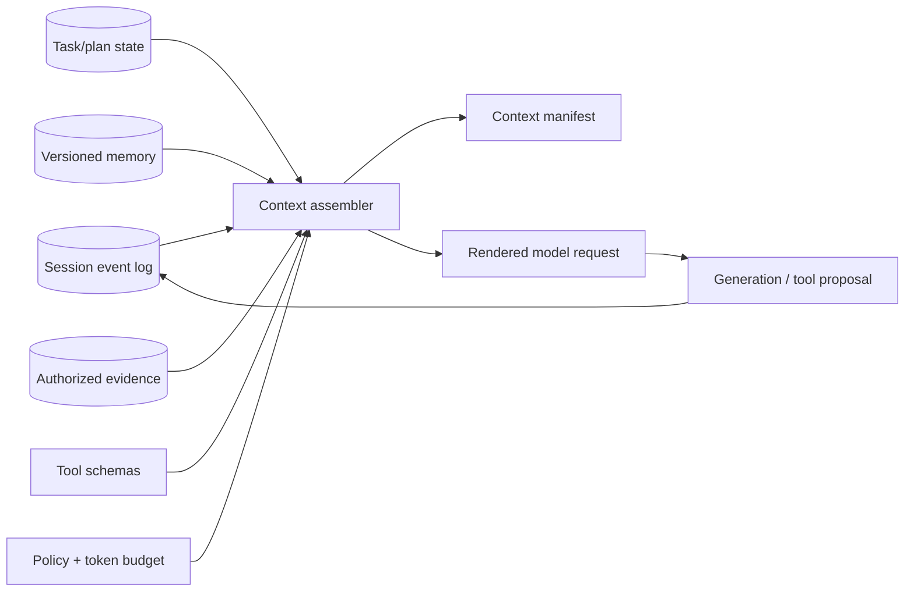

# Context Management

## TL;DR

Context management—often called *context engineering*—is the discipline of constructing the model's bounded working state on every call. A context is not a transcript dump. It is a versioned, policy-filtered materialized view assembled from instructions, session events, task state, retrieved evidence, tool observations, and persistent memory. Every item needs provenance, authority, freshness, token cost, and lifecycle semantics.

The window is finite; attention and recall are non-uniform; input is repeatedly processed in multi-turn systems; and compaction is lossy. Those properties require explicit budget allocation, stable-prefix design, bounded tool results, evidence selection, validated compaction, inspectable memory, and observability of exactly what entered each request. Optimize the lifecycle of information across the task, not one prompt string.

---

## The Context Window Is a Budget

Every request presents the model with one bounded sequence or equivalent ordered content structure: system instructions, tool definitions, conversation state, retrieved documents, the current message, and space reserved for the response. Advertised model limits continue to grow, but a large repository, long-running agent trace, or document corpus can still exceed them—and quality can degrade well before the hard limit.

The budget must be *allocated*, and unallocated budgets fail in a characteristic way: retrieval or history grows to fill all available space, the response gets squeezed, and quality drops precisely on the complex tasks that needed room to answer. A production system states its allocation explicitly:

```yaml
# Context budget for a support agent on a 200K-token model
context_budget:
  system_prompt_and_tools: 8_000     # fixed, cache-friendly prefix
  memory_and_user_profile: 2_000
  retrieved_documents: 40_000        # RAG results, capped at retrieval time
  conversation_history: 120_000      # compaction triggers at this threshold
  current_turn_headroom: 10_000
  reserved_for_output: 20_000        # never let input squeeze this
```

Two non-obvious rules hide in that YAML. First, *output reservation is a correctness constraint, not a courtesy*: a model that exhausts its generation allowance truncates an answer or tool call, and some APIs account internal reasoning against related output limits. Second, the compaction threshold must sit below the hard window by a measured safety margin for current-turn variance, tool schemas, output, and quality degradation. There is no universal percentage; qualify the threshold for each model, prompt shape, and workload slice.

## Context Assembly as a Materialized View

Store canonical session and task state outside the model, then compile a request-specific view. A context item should carry:

```text
item_id, type, immutable content reference/hash
source and provenance, author/principal, trust class
created_at, valid_at, expires_at, supersedes
tenant/ACL policy, sensitivity and retention class
estimated tokens, priority, dependencies
compaction level and source-item IDs
```

The assembler resolves the authenticated principal, task and session revision, target model, and token budget. It fetches candidate items, removes unauthorized or expired state, resolves superseded facts, scores relevance and obligation, preserves required dependencies, and renders a deterministic ordered request. It emits a **context manifest** containing the selected item IDs, transformations, token counts, truncations, and final request hash.



The canonical state remains the event log, artifacts, plan, and memory records. The prompt is disposable. This prevents a compacted summary from becoming the only copy of a decision and lets an incident replay which source items were visible without storing all sensitive content inline in a general trace system.

### Allocation as constrained selection

Let item \(i\) have expected utility \(u_i\), token cost \(t_i\), freshness risk \(r_i\), and dependencies. Context selection approximates:

\[
\max_S \sum_{i\in S}(u_i-r_i)-redundancy(S)
\quad \text{subject to} \quad
T_{fixed}+\sum_{i\in S}t_i+T_{current}+T_{output}+T_{safety}\le W.
\]

Some items are mandatory rather than scored: system policy, current user intent, active constraints, tool result corresponding to an unresolved call, and evidence required for a cited claim. A dependency may require a table header with a selected row or an error message with the tool invocation that produced it. Greedy “top relevance per token” selection is a useful approximation only after these invariants are satisfied.

Use separate sub-budgets so one source cannot consume the window. Retrieval, history, memory, tool schemas, and current-turn attachments have different marginal value and different trust. When one exceeds its allocation, apply a type-specific policy: rerank evidence, prune superseded tool output, summarize old history, or expose tools through discovery instead of silently truncating the tail of the full request.

---

## Token Economics: The Bill Is Shaped Like a Triangle

Let turn \(i\) append \(d_i\) tokens and generate \(o_i\) tokens. Without pruning, total input processed over \(n\) turns is

\[
T_{input}=\sum_{i=1}^{n}\sum_{j=1}^{i} d_j.
\]

If each turn adds roughly \(d\), this is \(d n(n+1)/2\): quadratic in turn count. A long agent can therefore spend far more reprocessing history than generating the final answer.

Pricing and cache semantics differ by provider, model, deployment, and time, so retain variables rather than baking one multiplier into the architecture:

\[
C = c_f T_{fresh} + c_c T_{cached} + c_o T_{output}
    + c_r T_{reasoning} + C_{tools} + C_{storage}.
\]

In many offerings \(c_c < c_f\), while output or reasoning tokens may be priced differently from fresh input. The exact ratios are configuration data. Architecture should maximize correctly reusable prefixes, bound repeated context, and measure provider-reported usage. Batch or asynchronous pricing can change the optimal path for evaluation and enrichment, but it must not be assumed for an interactive SLO.

Caching also reduces prefill work and can improve TTFT, but only for eligible prefixes and warm cache state. Capacity planning must include cold-cache events, eviction, model routing, and regional failover. A cost model that assumes every repeated token is cached will fail during rollout or incident traffic.

---

## Attention Is Not Uniform: Lost in the Middle and Context Rot

A context window is not random-access memory. Liu et al.'s *Lost in the Middle* (2023) established the canonical result: on multi-document QA, accuracy is highest when the relevant document is at the *beginning or end* of the context and drops substantially when it sits in the middle — a U-shaped attention curve that persists, attenuated, in current frontier models. Follow-on "needle in a haystack" testing became a standard model-qualification exercise, and the broader phenomenon — quality degrading as contexts grow long even when the needle is findable — is now commonly called *context rot*: models get distracted by irrelevant material, over-attend to recent tokens, and lose track of constraints stated once, early, in a 300K-token transcript.

The engineering responses are placement and hygiene rules rather than exotic machinery:

- **Put instructions at the edges.** Durable rules live in the system prompt (top); the current task and any binding constraints are restated near the end. Long-document prompts routinely repeat the question *after* the document for exactly this reason.
- **Order retrieved documents by importance, outside-in** — most relevant first and last, weakest in the middle — rather than by retrieval score order alone.
- **Don't ship irrelevant context.** Retrieval that pads the window with marginal chunks doesn't just waste money; it actively degrades answers by feeding the distraction failure. A reranker that cuts twenty chunks to five ([RAG Patterns](./04-rag-patterns.md)) is an attention optimization as much as a cost one.
- **Test your own needle.** Providers' needle benchmarks are synthetic. If your system depends on recall from position 200K of a legal contract, build a twenty-case retrieval probe from your own documents and run it when you change models — the same qualification discipline as any [offline evaluation](./10-llm-evaluation.md).

---

## Prefix Caching Discipline: The Load-Bearing Optimization

Prompt caching commonly reuses an exact or token-equivalent prefix according to provider-specific rules. A change near the start invalidates reuse for everything after it. This turns caching from a checkbox into an architecture constraint: assemble stable parts first and volatile parts last, and make turn \(N+1\) extend turn \(N\)'s prefix wherever the API permits.

The rules that follow are simple and violated constantly:

1. **Freeze the prefix.** System prompt and tool definitions render first; they must be byte-identical across calls. A timestamp, a request ID, or a "helpful" per-user greeting interpolated into the system prompt silently reprices the entire conversation to uncached rates.
2. **Append, never edit.** The message history must be append-only. Rewriting an earlier tool result, re-ordering messages, or re-serializing JSON with non-deterministic key order breaks the prefix at the edit point.
3. **Don't swap tools or models mid-session.** Tool definitions sit at position zero; adding or removing one invalidates the whole cache. Caches are also per-model — routing a conversation between models forfeits the cache each switch, which changes the math on "use the cheap model for easy turns" routing.
4. **Verify with usage fields, not assumptions.** Where the runtime reports cached-read tokens or cache decisions, record them. A low cached-token share on an eligible multi-turn workload suggests a silent invalidator; compare the canonical manifests of consecutive requests.

The serving-side mirror of this discipline — cache-aware routing, failover cost, fleet KV footprint — is in [Agent Inference](./12-agent-inference.md).

```python
# WRONG: rebuilds the prompt each turn; three separate cache-killers.
system = f"You are a support agent. Today is {datetime.now()}."   # (1) volatile prefix
messages = sorted(history, key=relevance)[-20:]                    # (2) reordered history
tools = pick_tools_for(query)                                      # (3) varying tool set

# RIGHT: stable prefix, append-only history, fixed tools; volatile info
# travels in the latest message where it invalidates nothing.
system = SYSTEM_PROMPT_FROZEN
messages = history + [{"role": "user",
                       "content": f"[context: {datetime.now():%Y-%m-%d}] {query}"}]
```

Compaction and caching interact: compacting the transcript necessarily rewrites history and invalidates the cache once. That is the right trade — one cache-write against a much smaller transcript — but it is why compaction should fire at *thresholds*, not every turn.

---

## Long Context vs RAG

"Just put it all in the context" and "retrieve only what's relevant" are the two poles of context management, and million-token windows have moved the boundary without dissolving it.

**Long context wins** when the working set is bounded and reused: a single repository, one contract, a book, this quarter's reports. Everything is visible, cross-document reasoning works without a separate retrieval miss, and prefix reuse may make repeated processing economical. The costs are the per-query price floor, slower first-token latency on cold prefixes, eviction risk, and context rot on tasks that need precise recall from deep positions.

**RAG wins** when the corpus is unbounded or fresh: millions of documents, data updated hourly, per-user permissioning on what may be seen at all, or the need for citations that point at a source rather than a position in a megaprompt. No window will ever hold the corpus, so selection is not optional — the question is only whether selection happens in a retrieval system you can measure and tune, or implicitly inside a model straining at a stuffed window.

The production pattern is usually the hybrid: **RAG selects the working set; long context holds it.** Retrieval narrows millions of documents to the fifty that matter for this session, the session loads them once into a cached prefix, and the conversation proceeds against that stable context. Agentic systems add a third mode — *just-in-time retrieval* — where the model itself fetches context through tools (`grep`, file reads, search APIs) mid-task instead of front-loading it; this trades pre-computed recall for the agent's ability to follow its nose, and most serious coding agents now rely on it more than on embedding indexes.

| Dimension | Long context | RAG | Agentic (just-in-time) |
|---|---|---|---|
| Corpus size | Bounded by the qualified model/workload limit | Unbounded | Unbounded but navigable |
| Freshness | Reload to update | Index latency (minutes) | Live at read time |
| Failure mode | Context rot, cost floor | Retrieval miss | Wandering, tool-call latency |
| Attribution | Weak (position) | Strong (source chunks) | Strong (explicit reads) |
| Best when | Bounded reused working set | Search over large corpora | Exploration, code, ops |

---

## Compaction: Surviving Past the Window

Every long-running conversation eventually faces the same event: the next turn will not fit. Compaction is the standard answer — summarize the older portion of the transcript into a compact digest, keep the recent turns verbatim, and continue with the digest in place of the history it replaced. Providers increasingly offer this server-side (the API summarizes and returns a compaction block you thread back), and every serious agent harness implements a client-side version; the design questions are the same either way.

**Trigger on measured thresholds, not turns.** Compact when projected next-turn input plus output and safety reserves crosses a qualified budget line. Compaction costs a summarization call and usually invalidates part of a reusable prefix, so doing it every turn pays that price without proportional benefit.

**The summary is a load-bearing artifact, not prose.** A generic "summarize this conversation" loses exactly the details that matter later. Production compaction prompts enumerate what must survive:

```text
Compact the conversation above into a handoff brief for an agent continuing
this task. Preserve, with exact literal values:
1. The task goal and acceptance criteria, as most recently amended.
2. Every decision made and its stated reason.
3. Constraints and user corrections (things tried and rejected — and why).
4. Exact identifiers: file paths, URLs, IDs, branch names, command flags.
5. Current state: what is done, what is in progress, what remains.
Omit: exploratory dead ends (except the lesson), verbatim tool output,
pleasantries. Target under 2,000 tokens.
```

The classic compaction bug is losing a *negative* constraint — the user said "don't touch the billing module" forty turns ago, the summary dropped it, and the agent, now unconstrained, touches the billing module. Corrections and prohibitions deserve explicit line items in the compaction schema precisely because they are short, rare, and catastrophic to lose.

**Keep the raw transcript anyway.** Compaction is for the model's working context; the full history should still land in your trace store for debugging, evaluation, and audit ([LLM Evaluation](./10-llm-evaluation.md)). Summarizing your only copy is destroying evidence.

---

## Context Editing: Pruning Instead of Summarizing

Compaction rewrites history; *context editing* deletes parts of it. In tool-heavy agent sessions, the bulk of the transcript is tool results — a 40K-token file read, a 25K-token test log — that were essential the turn they arrived and are dead weight ten turns later. Clearing stale tool results (while keeping the fact that the call happened) routinely reclaims half a transcript without touching the conversational content, and providers now expose this as a first-class API feature alongside client-side implementations.

The same logic applies at *write* time, which is cheaper than pruning after the fact:

- **Truncate tool results at the harness boundary.** No tool should be able to dump 100K tokens into the transcript; cap each result (with a "truncated, full output at `<path>`" marker) and let the agent request more if needed.
- **Offload large artifacts to the filesystem.** A generated report or fetched webpage goes to a file; the transcript carries the path and a two-line summary. The context holds *references*, the filesystem holds *content* — restorable on demand at the cost of a read.
- **Drop reasoning blocks from prior turns.** Extended-thinking output from earlier turns rarely helps later ones; most providers either strip it automatically or recommend clearing it.

The discipline mirrors [backpressure](../06-scaling/07-backpressure.md): bound what enters the queue rather than heroically draining it later.

---

## Memory: What Survives the Session

Everything above manages context *within* a session. Memory is the machinery for context that must outlive it—user preferences, project conventions, and lessons from past failures. For small, inspectable agent memory, **versioned files or records** are a strong default; larger systems may add structured stores and retrieval indexes without surrendering provenance or user control.

The pattern, popularized by MemGPT's OS analogy (context window as RAM, external store as disk) and now shipped as first-class "memory tools" by providers and standard in coding agents, gives the model tools to read and write a persistent directory, plus a small always-loaded index. The model decides what is worth writing; the harness decides what gets auto-loaded at session start (typically a bounded index file, not the whole store):

```text
memory/
  MEMORY.md            # index, always loaded (~1K tokens, hard-capped)
  project-conventions.md
  user-prefers-terse-replies.md
  lesson-vitest-not-jest.md    # one fact per file, written after a correction
```

Files make memory inspectable, correctable, and naturally versionable, and they encourage deliberate reads rather than automatic similarity injection. Structured records add validation and targeted revocation; embedding indexes add recall over large histories. The index should point to canonical memory records rather than become the source of truth. Its failure mode—confidently injecting an outdated “fact” because it is semantically similar—is exactly the [feedback-loop contamination](../16-ml-systems/01-ml-system-fundamentals.md) problem, so automatic injection should remain bounded and skeptical.

The operational hazards are staleness and scope. A memory that was true in March ("the deploy script is `deploy.sh`") silently poisons sessions in July; memory entries need the same treatment as [dataset versioning](../16-ml-systems/11-dataset-management-versioning.md) gives data — provenance, and deletion when wrong. And memory written from one user's session must never load into another's: memory stores are per-tenant security boundaries, not shared caches.

### Memory lifecycle and write authority

A memory record should identify subject, claim, source, observation time, scope, confidence, expiry or review time, superseded record, and the principal allowed to read or change it. Separate user-declared preference from model-inferred preference. An inference such as “user prefers short answers” should be visible and revocable and should not overwrite an explicit setting.

Writing memory is a side effect. The model proposes a record; the harness validates schema, policy, duplication, and scope; sensitive or high-impact memory may require confirmation. Store immutable revisions and a current alias. Deletion writes a tombstone, removes indexes and caches, and follows the retention policy for old payloads. Memory loaded into a context records its revision ID so an incident can explain which stale belief influenced a response.

Do not write transient task state into long-term memory merely because it may be useful later. Use distinct stores for user profile, project conventions, task checkpoints, and episodic history, each with separate retention and retrieval policy. This limits both context pollution and cross-purpose privacy leakage.

## Context State, Branches, and Concurrency

Conversation history is an event stream, but an agent run may fork: parallel tool calls, regenerated responses, speculative plans, or user edits. Assign stable event IDs and parent references. A branch has a base revision; its output cannot commit to current task state if that base has been superseded without reconciliation.

The model-visible transcript may linearize concurrent events, but canonical state should preserve their causal relation. Tool call and result IDs must match; a late result from a cancelled branch is recorded but not inserted into the active context as current truth. When two branches produce candidate artifacts, the orchestrator selects or merges them explicitly rather than concatenating both and asking the model to infer which won.

Session migration between models may alter chat templates, tool encodings, context limits, and cache identity. Recompile from canonical events instead of forwarding provider-rendered messages. Validate that the destination can represent every active tool call and content modality; otherwise close or summarize the incompatible state at a controlled boundary.

## Compaction Correctness and Evaluation

Compaction is a lossy state transformation and should have an acceptance contract. Given source event set \(E\) and compacted artifact \(S\), validate that \(S\) preserves:

- the latest goal and acceptance criteria;
- active constraints, prohibitions, approvals, and unresolved questions;
- decisions plus reasons and rejected alternatives that prevent repetition;
- exact identifiers and values whose mutation would change an action;
- open work, committed work, failures, and external side-effect receipts;
- provenance references for claims that may need rehydration.

Use deterministic extraction for identifiers and state where possible, then let a model compress narrative. Compare the result to canonical task state; reject a summary that contradicts it. Keep a recent verbatim tail and allow on-demand rehydration from archived events or artifacts.

Evaluate compaction by continuing representative tasks from either full or compacted state and comparing constraint adherence, completion, redundant actions, tool correctness, tokens, and latency. Add mutation tests that hide a negative constraint, change an ID, or omit a pending side effect; the validator should catch them. Summary fluency is not the metric.

## Context Observability

For each model call, record the context-manifest ID, token allocation by item type, selected and omitted item counts, truncations, compaction generation, cache-eligible prefix length, reported cached tokens, and source revisions. Store sensitive payloads by access-controlled reference and redact general traces.

Useful operational signals include input/output headroom, compaction rate and failure, tool-output truncation, memory injection and staleness, retrieval evidence density, cached-token share, cold-prefix TTFT, context-build latency, model truncation, and cost per successful task. Quality slices should correlate failures with context length, evidence position, compaction generation, and memory age.

Canary probes place required facts and constraints at controlled positions, verify recall, and exercise cache identity across request variants. Production-derived probes matter more than generic “needle” strings because formatting, distractors, and task semantics change attention behavior.

---

## Structure the Context for the Agent's Own Attention

Two lightweight patterns exploit the attention curve deliberately, and both look almost too simple to matter.

**Recitation.** Agents on long tasks drift from the goal — the "lost in the middle" victim is the objective itself, stated once, 200K tokens ago. Harnesses counter this by having the agent maintain a todo list or plan file and *re-append it* to the tail of the context as it updates — rewriting the goal into the high-attention recent-token zone every few turns. The todo list's value is less project management than attention anchoring.

**Sub-agents as context partitions.** When a subtask needs to consume a lot of context — read thirty files, digest a long log — spawning a sub-agent with a fresh window and getting back a summary keeps the orchestrator's context clean. The sub-agent burns its window on the exploration; the parent pays only for the distilled result. This is context *isolation*, the same reason [multi-agent systems](./03-multi-agent-systems.md) exist at all, and it is frequently a better answer than a bigger window: two focused 50K contexts outperform one distracted 300K context on many tasks.

---

## Failure Modes

**Quadratic cost blowup.** An agent loop with no caching and no pruning re-processes a growing transcript every turn; the bill grows with the square of the conversation length and nobody notices until the invoice. Defense: cache discipline first, then editing/compaction thresholds, and per-task token budgets with alerts.

**Cache thrash.** A timestamp in the system prompt, per-request tool filtering, or history rewriting silently drops the cache-hit rate to zero while everything still works. Defense: monitor cached-token share as an SLO; treat a drop as an incident, not a curiosity.

**Lost constraints after compaction.** The summary preserved the narrative and dropped the prohibition; the agent re-attempts something explicitly ruled out. Defense: compaction schemas with explicit slots for corrections/constraints, and keeping recent turns verbatim.

**Context poisoning.** A hallucinated "fact," a wrong tool output, or an injected instruction enters the transcript early and every later turn reasons from it — errors compound because the context *is* the agent's world-model. Defense: validate tool outputs at the boundary, keep untrusted retrieved content clearly delimited ([prompt injection](./06-prompt-engineering.md)), and prefer restarting a poisoned session over arguing with it.

**Context distraction.** Stuffing the window with marginally relevant retrieval measurably *lowers* accuracy versus a tighter context. Defense: rerank hard, cap retrieved tokens, and evaluate retrieval precision, not just recall.

**Stale memory.** Yesterday's convention, confidently injected today. Defense: memory provenance, easy deletion, user-visible memory contents, and skepticism about auto-injecting anything the user can't see.

**Summary as source of truth.** Compaction replaces the only copy of task decisions or external receipts. Defense: canonical event/artifact state outside the prompt and rehydratable summary references.

**Cross-tenant context reuse.** A response, semantic memory, or prefix cache crosses an authorization domain. Defense: tenant/policy identity in every cache and retrieval key, with provider cache semantics included in the threat model.

**Late branch contamination.** A result from a cancelled or superseded branch enters the active transcript as current state. Defense: causal event IDs, base revisions, and commit validation.

**Silent truncation.** A renderer drops the tail or a tool result to fit, removing the user question or decisive error. Defense: type-specific budget policy, explicit truncation markers, and manifest-level rejection when mandatory items do not fit.

---

## Decision Framework

*Where should this information live?* — The four-tier answer: in the **system prompt** if it is true for every request; in **memory files** if it must survive sessions; in the **transcript** if it is this conversation's working state; behind **retrieval or tools** if it is one working set among many. Most context bloat is information living one tier too high.

*Is the transcript append-only and the prefix frozen?* If not, fix that before any other optimization — it is the difference between cached and uncached economics.

*What fires when the budget is hit?* A system without an explicit compaction threshold has chosen "fail at the window limit" as its policy.

*Can the model find what it needs, or merely fit it?* Fitting 800K tokens is easy; recalling one clause from the middle is not. If precise recall matters, retrieve narrowly instead of stuffing broadly, and test recall at depth with your own documents.

*What survives the session, and who can read it?* Memory is a persistence layer with tenancy, staleness, and audit properties — design it like one.

---

## Key Takeaways

1. Context engineering has replaced prompt wording as the core skill: the question is what the model sees each call, across the whole task lifecycle, not how the instruction is phrased.
2. The window is a budget with explicit allocations, output and variance reserves, and a workload-qualified compaction threshold below the hard limit.
3. Repeated context creates triangular token growth; append-only history, stable prefixes, pruning, and measured cache reuse change both cost and TTFT.
4. Attention is U-shaped — instructions at the edges, weakest content in the middle, and never ship context you don't need, because irrelevant tokens actively degrade answers.
5. Million-token windows moved the long-context/RAG boundary but didn't dissolve it: RAG selects the working set, long context holds it, and agents increasingly retrieve just-in-time through tools.
6. Compaction is a schema, not a summary: decisions, constraints, corrections, and exact identifiers survive verbatim; the full transcript still goes to the trace store.
7. Prune at the boundary: cap tool results, offload artifacts to files, clear stale tool outputs — references in context, content on disk.
8. Memory needs canonical, inspectable, correctable records; files are a strong small-system default, while indexes remain derived retrieval structures with staleness and tenancy controls.
9. Recitation and sub-agent context partitions are cheap, high-leverage attention tools: rewrite the goal into the recent-token zone, and buy fresh windows instead of bigger ones.
10. Trace the context manifest and watch token allocation, cached-token share, compaction, staleness, truncation, and per-task spend; these failures are otherwise invisible.

---

## References

1. [Lost in the Middle: How Language Models Use Long Contexts](https://arxiv.org/abs/2307.03172) — Liu et al., 2023
2. [Effective Context Engineering for AI Agents](https://www.anthropic.com/engineering/effective-context-engineering-for-ai-agents) — Anthropic, 2025
3. [Context Rot: How Increasing Input Tokens Impacts LLM Performance](https://research.trychroma.com/context-rot) — Chroma Research, 2025
4. [MemGPT: Towards LLMs as Operating Systems](https://arxiv.org/abs/2310.08560) — Packer et al., 2023
5. [Context Engineering for AI Agents: Lessons from Building Manus](https://manus.im/blog/Context-Engineering-for-AI-Agents-Lessons-from-Building-Manus) — Manus, 2025 (KV-cache discipline, recitation, filesystem-as-context)
6. [Prompt Caching — Anthropic Documentation](https://platform.claude.com/docs/en/build-with-claude/prompt-caching) — prefix semantics, TTLs, cache pricing
7. [LLMLingua: Compressing Prompts for Accelerated Inference](https://arxiv.org/abs/2310.05736) — Jiang et al., 2023
8. [How Long Contexts Fail](https://www.dbreunig.com/2025/06/22/how-contexts-fail-and-how-to-fix-them.html) — Breunig, 2025 (poisoning/distraction/confusion taxonomy)
