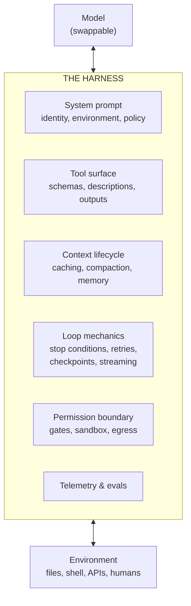
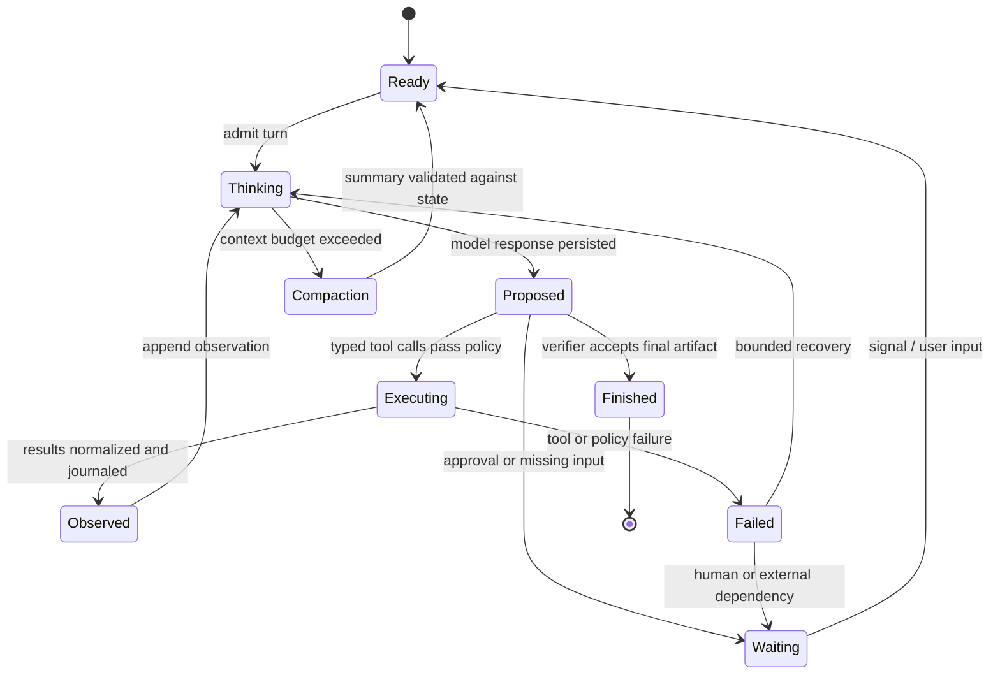
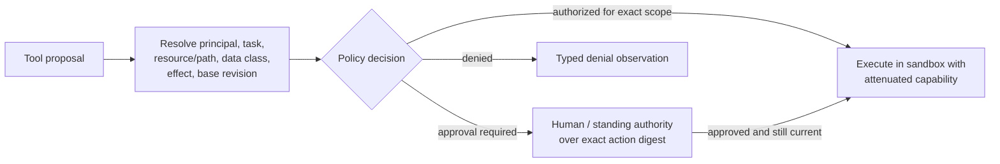

# Harness Engineering

## TL;DR

The harness is the trusted runtime between a probabilistic model and stateful tools. It compiles canonical task state into a model request, validates proposals, authorizes and schedules effects, journals observations, manages context revisions, enforces budgets, verifies completion, and emits evidence. Model and harness behavior are inseparable in an agent evaluation, but correctness guarantees belong to deterministic runtime boundaries.

Design the harness as a versioned state machine with typed provider and tool adapters. A crash, duplicate message, stale action, model migration, policy change, or user interruption must have defined semantics. Prompt assembly, context selection, and tool descriptions matter, but their canonical chapters are linked rather than repeated here.

---

## Why the Harness Is the Product



Capability is co-produced: model policy, context, tool affordances, environment feedback, and verifier jointly determine task success. The harness is also the control and security boundary because it owns credentials, scheduling, policy, and commit. Build it so a model change is an explicitly qualified configuration migration, not an implicit behavior update.

## The Harness as a Runtime

Treat the harness as a small operating system for a probabilistic process. The model proposes an event; the runtime validates it, applies policy, executes an effect, records the result, and exposes a new state to the next turn.



The durable identity hierarchy is `session_id → run_id → turn_id → action_id → attempt_id`. A retry creates a new attempt but retains the logical action ID, which is the idempotency key for an external write. Persist the model request manifest, tool proposals, policy decisions, results, workspace revision, and verifier output before advancing state. This makes a crash a resume point rather than an excuse to repeat an uncertain side effect.

The model is allowed to be nondeterministic; the runtime is not allowed to forget what happened. Record provider/model revision, prompt and tool-schema versions, input and output usage, finish reason, and policy snapshot. A replay uses recorded model responses for old turns and re-executes only explicitly safe, deterministic checks. Never replay a payment, deployment, or email merely because the process restarted.

---

## Request Assembly Boundary

The harness compiles canonical run state, tool capabilities, memory, evidence, recent events, and output constraints into one provider request plus a manifest. The compilation is deterministic for a fixed state revision and configuration. It preserves trust labels, canonical ordering, truncation decisions, schema digests, and token allocation so an incident can reconstruct what the model was allowed to observe.

The prompt is advisory configuration for the model, not the policy engine. Universal behavioral guidance belongs in a versioned prompt source; task state stays in durable records; evidence and tool results retain provenance; schemas enforce representable structure; authorization remains outside the request. [Prompt Engineering](./06-prompt-engineering.md) defines the compiler, and [Context Management](./08-context-management.md) defines selection and compaction.

Request assembly may fail before model admission: mandatory state does not fit, an active tool call cannot be represented by the target provider, a schema is unsupported, data residency excludes every model, or the context revision is stale. Return a typed error or invoke a declared migration/compaction policy; silently dropping a constraint is not graceful degradation.

---

## Tool Registry and Action Transactions

The registry separates model-facing selection metadata from execution metadata. A tool revision declares schema, handler artifact, authenticated principal type, read/write set, side-effect class, idempotency and reconciliation contract, timeout, output budget, data classification, network policy, owner, and compatibility state. Only an immutable qualified revision enters a run manifest.

An action transaction proceeds through `proposed → validated → authorized → leased → executing → committed | uncertain | failed | compensated`. Persist transitions before they become externally visible. A timeout after dispatch enters `uncertain`; it does not prove failure. Reconciliation queries the destination by logical action ID or receipt before retry. Compensation is domain-specific and may be corrective rather than reversible.

Tool discovery returns only capabilities allowed for the principal and task, then freezes selected schema revisions for the turn. A disappearing or mutated tool during a run becomes a compatibility event. General code execution receives a sandbox and attenuated capabilities; high-impact operations retain narrow typed interfaces even when code could technically invoke them. Detailed ergonomics live in [Coding Agent Tool Design](../19-compound-engineering/02-coding-agent-tool-design.md).

---

## Context Revision Lifecycle

The harness stores an append-only canonical event graph and produces disposable context revisions. A revision records source item IDs, trust/policy decisions, compaction lineage, selected tool schemas, token allocation, and rendered-request hash. Compaction or correction creates a new revision; it does not rewrite the evidence ledger.

Context budgets reserve mandatory state and output headroom before optional evidence. Tool results enter through a result envelope and may be represented later by a receipt or artifact reference. Memory writes are policy-checked effects with scope and expiry. Subagent contexts fork from an explicit parent revision and return typed claims/evidence, not an implicit shared transcript. The full lifecycle belongs to [Context Management](./08-context-management.md); the harness's job is enforcing its contracts.

---

## The Loop: Mechanics That Separate Demos from Products

```python
async def run(session: Session) -> Outcome:
    while True:
        budget.check(session)                      # turns, tokens, wall-clock, spend

        response = await model.call(
            system=PROMPT, tools=session.tools,
            messages=session.messages, stream=True,  # stream for UX + early interrupt
        )
        await session.checkpoint(response)          # durable: resume from any turn

        if response.stop_reason == "end_turn":
            return await verify_and_close(session)  # never trust "done" unverified

        calls = response.tool_calls
        decisions = await asyncio.gather(*[gate(c, session.policy) for c in calls])
        batches = conflict_aware_batches(calls, decisions, session.state)
        results = await execute_batches(batches, session.state)
        session.append(response, normalize(results))  # uniform shape, budget-truncated

        if loop_detector.repeating(session):         # same call-signature N times
            session.inject_steering("This approach is repeating. Re-read the plan "
                                    "and choose a different strategy, or escalate.")
```

The details that matter:

- **Stop conditions are a contract.** `end_turn` means the model *claims* completion — run the verifier before reporting success. Distinguish max-tokens truncation (continue), refusal (surface to human), and tool-use (loop).
- **Checkpoint every turn.** Serialized messages + workspace snapshot = resumable runs, replayable bugs, and the substrate for durable-execution engines. "The pod restarted" should cost one turn, not the task.
- **Interruptibility is a feature, not an edge case.** Humans steer mid-run; injected user messages must land between turns without corrupting tool-call/result pairing.
- **Normalize tool results.** One envelope (status, content, truncation marker, timing) regardless of source — models handle uniform structure measurably better than ad-hoc strings.
- **Detect loops in the harness.** Hash recent tool-call signatures; on repetition, inject steering or escalate. Models repeat failing actions with cosmetic variations; the harness sees the pattern before the model admits it.

`asyncio.gather` is safe only after the runtime has classified read/write sets and external-effect semantics. Two read-only calls can run concurrently; two writes to one artifact need serialization or an optimistic revision check; a write and a read of the same resource need an explicit snapshot rule. The scheduler also propagates the parent deadline and reserves child budgets before launching work. Otherwise parallelism creates races while appearing to improve latency.

### Durable workspace state

Files are not automatically durable just because they are on disk. The harness records workspace revision, changed paths, command exit status, and artifact hashes at checkpoints. A resumed run either restores a known snapshot or explicitly continues from the current revision after checking for user changes. External repositories, databases, and cloud resources require receipts or reconciliation; a local checkout cannot prove that a deployment did not happen.

### Verification layer

Expose independent observations wherever the environment permits: tests and invariants after edits, rendered-state inspection for interfaces, and diff or state review before commit. Executability does not guarantee coverage, but self-assessment is correlated with generation and cannot substitute for an acceptance contract. Where deterministic evidence is unavailable, a qualified semantic judge may route or gate only at the operating point established for that risk class; high-consequence uncertainty remains with human authority.

---

## Permission Boundary and Sandbox

Design for a persuadable model operating on untrusted input:



A tool name or workspace location does not determine safety. The policy input is the authenticated principal, delegated task, requested verb, semantic resource and path, data classification, destination, base revision, reversibility, and expected external effect. A read can expose a secret; a local write can alter executable policy or destructive configuration. Automatic authorization is valid only when the complete tuple matches a standing rule.

Execution then occurs in an isolation domain with explicit mounts, egress, resource limits, and a secret broker. Untrusted content remains data, but that label is not containment; the capability envelope must make the worst permitted effect acceptable even if the model follows a hostile instruction. Approval binds an exact digest and resource revision, and policy rechecks it at commit. Batch review and narrow standing rules reduce approval fatigue without broadening authority invisibly.

### Capability attenuation

The model should never receive a credential whose authority exceeds the current action. The gateway authenticates the human or service principal; the policy layer maps the requested effect to a capability; the sandbox broker mints a short-lived token scoped to resource, verb, tenant, and expiry. Tool output contains a receipt, not the secret used to obtain it. Approval binds to an action digest and base resource revision, so changing the recipient, command, or patch invalidates the approval.

Policy checks run again at commit. A plan approved ten minutes ago may now target a changed branch, expired URL, revoked user, or different production environment. “The model already asked” is not an authorization cache.

---

## Harness Verification and Fault Injection

The harness needs deterministic contract tests independent of model quality: request compilation, tool schema compatibility, policy decisions, idempotent inbox/outbox handling, action fencing, context revision checks, budget propagation, cancellation, workspace recovery, and trace redaction. Use a scripted model adapter to emit malformed calls, duplicate action IDs, late responses, cyclic plans, and completion claims without evidence.

State-machine tests kill the process between every durable transition. Tool simulators produce timeout-before-commit, timeout-after-commit, duplicate receipt, stale revision, partial stream, and compensation failure. Load tests inject provider throttling, queue saturation, cache loss, fan-out bursts, and slow clients. Security tests place hostile instructions in every data channel while observing whether capability policy—not model obedience—contains the effect.

End-to-end statistical evaluation then measures the model–harness pair on representative tasks. [LLM Evaluation](./10-llm-evaluation.md) owns dataset and judge methodology; this chapter's distinctive requirement is that harness faults and unsafe trajectories remain visible even when the final artifact happens to pass.

---

## Cost, Backpressure, and Tenant Isolation

Every run receives hierarchical reservations for model tokens/spend, wall time, tool operations, fan-out, and concurrency. A child cannot escape the parent's remaining budget. Admission rejects work that cannot finish within its deadline or tenant allocation; bounded queues shed or degrade before expired work reaches an expensive model.

Cost attribution includes every attempt, discarded branch, verifier, tool, storage artifact, sandbox, and human review. The denominator is verified successful tasks. Parallel reads can reduce critical-path time while increasing spend; delegation can protect parent context while multiplying prefixes; compaction saves future input but costs a generation and cache revision. Measure marginal value by task slice.

Tenant isolation covers queues, caches, memory, sandboxes, credentials, traces, and artifact stores. Weighted fair scheduling prevents one recursive agent from consuming the fleet. A global emergency control can cap fan-out, output, reasoning effort, or selected model tiers, but cannot weaken authorization or data isolation.

## Harness Versioning and Rollout

A harness release pins runtime code, state/event schema, provider adapters, prompt/context compiler, tool registry snapshot, policy revision, sandbox image, and verifier set. Long-running runs may span a release, so migration must choose one of three semantics: finish on the old revision, migrate at a versioned checkpoint, or terminate safely. Replaying old state with new branch logic without a version marker is nondeterministic workflow corruption.

Provider adapters expose a capability matrix rather than a lowest-common-denominator fiction: modalities, tool protocol, parallel calls, structured-output subset, context accounting, streaming events, cancellation, and usage fields. Admission fails or invokes an evaluated fallback when a target cannot represent the active state.

Rollout progresses through deterministic contract tests, offline task evaluation, shadow decisions with side effects suppressed, canary sessions pinned to one revision, and gradual traffic. Watch state-transition errors, tool/policy deltas, task success, latency, spend, and human intervention. Rollback keeps old runtime and schema readers available until in-flight state has drained or migrated.

---

## Failure Modes

| Failure | Symptom | Harness countermeasure |
|---|---|---|
| Context rot | Quality degrades late in long sessions | Earlier compaction; tool-output budgets; file-based plan |
| Goal drift | Output solves an adjacent task | Plan artifact + re-read after compaction; verify against original spec |
| Loop divergence | Same failing call, cosmetic variations | Signature detection → steering injection → escalation |
| Tool-selection confusion | Wrong tool among overlapping ones | Consolidate tools; sharpen descriptions; eval per-tool precision |
| Context flooding | One tool call fills the window | Hard output caps with informative truncation |
| Cache collapse | Cost spikes, latency up | Prefix-stability test in CI; cache-hit-rate alerting |
| Injection compliance | Agent follows instructions from data | Provenance tagging; trifecta decomposition; outward-action gates |
| Unverified success | "Done!" but tests fail | Verifier between `end_turn` and user-visible success |
| Lost runs | Crash/timeout loses hours of work | Per-turn checkpointing; durable execution; resumability tests |
| Stale side effect | Retry repeats an operation that may already have committed | Idempotency keys, receipts, reconciliation state |
| Write race | Parallel calls overwrite or semantically contradict one another | Read/write sets, fencing, serialized commit |
| Approval drift | Approved action changes before execution | Action digest and resource revision bound to approval |
| Budget leakage | Child retries or tool loops spend outside parent limits | Hierarchical reservations and admission before launch |

## Decision Framework

Choose harness complexity from the consequence of failure and the shape of work:

| Design question | Consequence |
|---|---|
| Is the task a fixed sequence with typed checks? | Use a workflow and keep model control local to bounded nodes. |
| Can the environment verify progress after each action? | A bounded agent loop is viable; make the verifier the commit gate. |
| Are actions read-only, reversible, or irreversible? | Increase sandboxing and approval strength as effect reversibility decreases. |
| Are concurrent tool calls independent? | Parallelize only after read/write and snapshot analysis. |
| Can a run outlive one process or context window? | Persist event state, workspace revisions, and idempotency/reconciliation data. |
| Is quality judged by a reliable oracle? | Automate acceptance; otherwise route uncertainty to a human. |
| Does the model see untrusted content and private data? | Remove an exfiltration channel or put outward effects behind a gate. |

Build the smallest runtime that makes the desired guarantee enforceable. Add compaction, delegation, speculative execution, or adaptive routing only when a measured workload failure justifies it and the state/recovery semantics are written down. A harness is complete when another engineer can explain what happens after a timeout at every state transition.

---

## Key Takeaways

1. Benchmark scores belong to model+harness pairs; the harness is the half you own, and it compounds across model generations.
2. Canonical state is an event graph; each prompt is a disposable, policy-filtered context revision with a reproducible manifest.
3. Tools execute through versioned action transactions with authority, read/write, retry, uncertainty, and reconciliation semantics.
4. The model claims; the harness verifies. Ground truth in the loop or a human at the gate.
5. Security lives in the permission boundary and sandbox — prompt text is advice, harness code is policy.
6. Verify the runtime with deterministic state-machine and fault-injection tests, then evaluate the model–harness pair statistically.
7. Version and progressively roll out the whole runtime tuple; long-running state needs explicit compatibility and migration semantics.

---

## References

- [Building Effective Agents](https://www.anthropic.com/research/building-effective-agents) — Anthropic
- [Effective Context Engineering for AI Agents](https://www.anthropic.com/engineering/effective-context-engineering-for-ai-agents) — Anthropic
- [Writing Effective Tools for Agents](https://www.anthropic.com/engineering/writing-tools-for-agents) — Anthropic
- [Code Execution with MCP](https://www.anthropic.com/engineering/code-execution-with-mcp) — scripts over chained tool calls
- [Claude Code Best Practices](https://www.anthropic.com/engineering/claude-code-best-practices) — a production harness, documented
- [Model Context Protocol](https://modelcontextprotocol.io/) — tool/context integration standard
- [The Lethal Trifecta for AI Agents](https://simonwillison.net/2025/Jun/16/the-lethal-trifecta/) — Simon Willison
- [Context Rot](https://research.trychroma.com/context-rot) — Chroma research on long-context degradation
- [SWE-bench Verified](https://www.swebench.com/), [Terminal-Bench](https://www.tbench.ai/), [τ-bench](https://arxiv.org/abs/2406.12045), [OSWorld](https://os-world.github.io/) — harness-sensitive benchmarks
- [OpenTelemetry GenAI Semantic Conventions](https://opentelemetry.io/docs/specs/semconv/gen-ai/) — tracing standard for LLM systems
- [Temporal](https://temporal.io/) — durable execution
