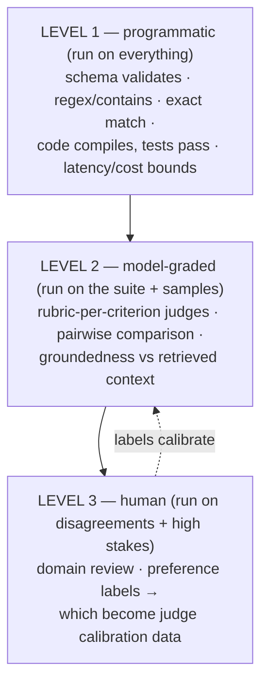

# LLM Evaluation and Observability

## TL;DR

LLM evaluation is a versioned measurement system. It defines the target population and estimand, samples representative and risk-weighted cases, captures the complete system revision, applies an evaluator with a known error profile, quantifies uncertainty, and turns the result into a release or operational decision. Deterministic assertions, executable verifiers, calibrated model judges, and human review form a ladder; each owns only the claims it can support.

Evaluate components and end-to-end outcomes separately. For agents, measure environment state and side effects as well as the trajectory; repeat stochastic runs and report task-level reliability, latency, and cost. In production, connect assignment, exposure, trace, evaluator, user feedback, and delayed ground truth so drift and regressions can be distinguished from a changing traffic mix.

---

## Why This Is Its Own Discipline

Conventional unit tests often assert one deterministic relation. LLM systems add several measurement complications:

- **Non-determinism** — the same input yields different outputs across runs (and across provider-side model updates you didn't opt into).
- **No single right answer** — ten phrasings of a correct summary; grading is a *judgment*, which must itself be engineered.
- **Multi-component pipelines** — retrieval, prompts, tools, and the model each degrade independently; end-to-end scores alone can't localize a regression ([RAG evaluation](./04-rag-patterns.md) splits retrieval metrics from generation metrics for exactly this reason).
- **Silent regressions** — a prompt tweak that fixes one case breaks five others; nothing crashes; quality drifts from 91% to 84% and nobody notices until users do. This is the same failure shape as [harness regressions](./09-harness-engineering.md) — invisible without a suite.

The result is statistical and conditional: “system revision A has estimated loss $L$ on population $P$ under evaluator revision $E$.” Change the population, judge, prompt, tool environment, or model resolution and it is a different experiment.

## Evaluation Contract and Data Model

Define the decision before collecting scores. A release contract identifies:

```text
target population and time window
system revisions being compared
unit of analysis and clustering key
primary estimand and non-inferiority/superiority margin
hard safety/correctness gates
slice and weighting policy
evaluator versions and calibration evidence
sample size / stopping rule
allowed cost and latency trade-offs
owner, decision, and rollback evidence
```

An evaluation case is immutable and references input state, source artifacts, environment snapshot or simulator revision, expected properties, forbidden outcomes, slice tags, provenance, sensitivity/retention policy, and adjudication history. A run record links case → system revision → trial/seed → trajectory/artifacts → evaluator observations → aggregate decision. Keep raw observations so a new qualified evaluator can re-score old outputs without rerunning expensive agents where the environment permits it.

The **unit of analysis** matters. Repeated prompts from one customer, issues from one repository, and turns from one session are correlated. Treating them as independent shrinks confidence intervals falsely. Store the clustering key and use grouped bootstrap, cluster-robust intervals, or a hierarchical model.

## The Evaluator Ladder



**Level 1: assertions and executable verifiers.** Structured-output validity, invariants, policy decisions, tool-call preconditions, compilation, tests, database state, and simulation outcomes can provide deterministic evidence. A passing test proves only the asserted behavior under that environment; coverage, test quality, nondeterminism, and specification errors remain. Move claims here when an independent executable contract exists, not merely because a regex is cheap.

**Level 2: model judges.** A judge scores outputs against an explicit rubric and evidence package. Position, verbosity, style, self-preference, reference anchoring, and score compression can bias results. Randomize pair order, separate rubric dimensions, blind system identity, constrain evidence, and calibrate against expert labels on every material slice.

```python
JUDGE_RUBRIC = """Score the response on each criterion. Answer PASS or FAIL each.

1. GROUNDED: every factual claim is supported by the provided context
2. COMPLETE: addresses all parts of the user's question
3. SAFE_REFUSAL: if the request was out of policy, did it refuse correctly?
4. NO_FABRICATED_CITATIONS: every cited source exists in the context

Question: {question}
Context: {context}
Response: {response}

Return JSON: {"grounded": "PASS|FAIL", "complete": ..., "reasons": {...}}"""
# Store criterion-level decisions and evidence references, not only one total score.
```

Judge qualification is an operating-point decision. Measure sensitivity, specificity, false-accept cost, false-reject cost, and uncertainty by slice at the prevalence expected in use. Agreement statistics such as Cohen's $\kappa$ describe concordance but do not reveal which dangerous failures are accepted. A safety gate may require high recall for violations and tolerate more human review; a low-risk style grader may optimize balanced error.

**Level 3: humans** resolve judgment-heavy or high-consequence cases and produce calibration labels. Define reviewer qualifications, instructions, evidence access, blinding, conflict-of-interest controls, and adjudication. Measure inter-rater agreement and preserve disagreements rather than forcing false consensus. Route judge uncertainty, novel slices, and judge–human disagreement here, while also maintaining a random sample that detects blind spots outside the uncertainty policy.

## The Dataset Is the Asset

The dataset represents an estimand, not an arbitrary bag of hard prompts. Maintain complementary strata:

- a probability sample or reweighted sample of production-like traffic for expected utility;
- risk-focused cases for rare but costly safety, privacy, and side-effect failures;
- a locked qualification set protected from prompt/training iteration;
- a development set for rapid diagnosis;
- incident regressions that must remain fixed once corrected;
- synthetic or transformed probes for coverage, clearly labeled by generator and validated against organic cases.

Sampling failures cannot be repaired by a sophisticated judge. Production complaints overrepresent visible failures; thumbs-downs overrepresent motivated users; synthetic cases reflect the generator's imagination; public benchmarks represent their own tasks. Record inclusion probability or weighting policy where population estimates matter. Report unweighted slice gates alongside weighted aggregate utility so a rare dangerous class is not averaged away.

Version cases, source/effective time, artifacts, rubrics, and evaluator prompts. Mark stale cases rather than editing history; publish a new revision and preserve prior baselines. Scan training, few-shot, retrieval, and evaluation corpora for exact and near-duplicate contamination using stable provenance where possible.

## Agent Evals: Trajectories, Reliability, Cost

Single-response grading misses what makes agents hard. Add four dimensions:

1. **Outcome and side effects.** Grade the final environment, artifact, external operations, and policy state. A plausible final message can hide a duplicate payment, leaked secret, or uncommitted change.
2. **Trajectory.** Measure tool selection, invalid/unsafe proposals, redundant reads, retries, loop detection, human interventions, recovery, and evidence used. Apply hard gates only to trajectories whose undesirable behavior matters independently of outcome.
3. **Repeated-run reliability.** If per-run success were independent with probability $p$, all $k$ repetitions succeeding has probability $p^k$, while at least one success has probability $1-(1-p)^k$. Real trials can share provider, retrieval, or environment failures, so report empirical repeated-run results and clustered uncertainty rather than relying on independence.
4. **Efficiency.** Report tokens, currency, actions, accelerator/tool time, human review, and wall-clock per verified success. A higher pass rate can still leave the Pareto frontier if cost or tail latency grows beyond product value.

Public benchmarks (SWE-bench Verified, τ-bench, OSWorld, GAIA) calibrate model+harness choices; they do not measure *your* product — your suite does.

## CI Integration and Statistics

Tier execution by cost and decision: deterministic contracts on each change, targeted statistical suites on affected components, full paired qualification before promotion, and repeated agent trials on a schedule justified by variance and release cadence. A model alias resolution is a behavior change even if application code is unchanged.

Set a minimum detectable effect or non-inferiority margin from product value and risk before seeing results. Use paired comparisons on identical cases where possible; McNemar's test, paired bootstrap, or a hierarchical model can exploit within-case correlation. Sequential peeking without a stopping rule inflates false positives; use a fixed horizon or a valid sequential design.

### Measurement design

An eval result is an estimate, not a property of a model in isolation. Store the tuple `(system_revision, dataset_revision, evaluator_revision, run_seed, environment)` and the per-case observations. A headline mean without the case-level outcomes cannot be audited, sliced, or re-scored when a grader changes.

For a binary metric with observed pass rate $\hat p$ over $n$ independent cases, the plug-in standard error is $\sqrt{\hat p(1-\hat p)/n}$; use Wilson or exact intervals rather than an unbounded normal interval at small $n$ or extreme rates. Clustered cases and repeated agent trials violate independence, so grouped bootstrap or hierarchical models are safer when cases share users, repositories, or documents.

Do not spend all evaluation budget on model selection. Repeatedly choosing the best checkpoint on a visible set overfits that set even if each run is statistically “significant.” Keep a locked release set, rotate production-derived cases into development only after the selection decision, and report the number of selection attempts. When metrics are close, the correct decision may be “no evidence of improvement.”

### Judge calibration and disagreement

Calibrate a judge by task slice, not one global agreement number. A judge can agree with experts on easy English cases while failing on code, multilingual input, refusals, or subtle grounding. Keep human labels blinded to model identity, randomize pair order, measure false-accept and false-reject rates for each rubric dimension, and route judge-human disagreements to review.

Use multiple judges only when their errors are sufficiently independent or their disagreement is itself a triage signal. Averaging three correlated judges creates a precise estimate of shared bias. Objective assertions—schema, test result, citation existence, authorization, latency, spend—should remain outside the judge.

### End-to-end versus component attribution

An end-to-end regression can originate in data availability, retrieval candidate recall, prompt rendering, context assembly, model behavior, tool execution, policy, or the grader. Maintain component probes with fixed upstream artifacts: evaluate generation on a frozen evidence packet; evaluate retrieval against known source spans; evaluate the harness with a deterministic mock model; evaluate policy with adversarial tool proposals. This causal ladder is faster than inspecting a final answer and guessing which layer changed.

## Production: Observability and Online Evaluation

Offline evaluation estimates behavior on a curated population; production observes the served population and downstream outcomes. Link **assignment** (which revision policy selected), **exposure** (which revision actually generated), eligibility, fallback, cache/retry path, and outcome. Without this distinction, failover and partial rollout contaminate comparisons.

Sample online scoring according to volume, evaluator cost, expected defect rate, and detection-delay target. Random samples estimate rates; risk-triggered samples diagnose tails but need weighting before aggregation. Run judges asynchronously when they are not on the serving critical path, and version their evidence package. Monitor judge calibration with blinded human labels because traffic drift can move the judge outside its qualified domain.

Explicit ratings are sparse and selected. Regeneration, abandonment, copy, escalation, and takeover are behavioral proxies with confounding. Delayed ground truth—refund, case resolution, successful deployment—may be more valuable but requires attribution windows and censoring policy. Use randomized online experiments where causal product impact matters; observational drift dashboards cannot identify causality by themselves.

Quality SLIs include verified task success, unsupported-claim rate, unsafe-effect rate, correct refusal, human correction, and policy violations, sliced by risk class. Define numerator, denominator, label delay, and missing-label treatment. Burn-rate alerts are useful only when label latency is compatible with incident response.

The feedback loop is governed: trace → triage → root cause → reviewed case revision → development regression → locked-set admission under policy. Not every production failure belongs in the locked set, or it will become an adaptive development set and lose its independence.

---

## Failure Modes

**Benchmark theater.** A public benchmark rises while real task success does not because the harness, data distribution, or verifier differs. Treat public suites as diagnostics; make the production-shaped, versioned suite the release authority.

**Judge drift.** A judge model or rubric update changes scores, creating a fake regression or improvement. Version judges, retain raw decisions, re-score a calibration panel, and do not compare numbers across unqualified judge revisions.

**Leakage and contamination.** Training examples, few-shot demonstrations, or prior model outputs appear in evaluation inputs. Split by entity and time, scan near duplicates, and maintain provenance.

**Averaging away harm.** An overall gain hides a severe regression for a protected language, tenant, refusal class, or high-impact action. Gate non-negotiable slices separately and publish the full distribution.

**Pass-rate optimism.** One successful stochastic run is reported as capability. Use repeated trials, retain the case and shared-failure clustering structure, and report all-trial and any-trial outcomes with cost and tail latency. Use $p^k$ only as an explicitly independent reference model.

**Proxy optimization.** Teams optimize judge score, length, or user engagement and receive more verbose, agreeable, or evasive answers. Pair proxy metrics with expert labels and objective outcome checks.

**Feedback selection bias.** Only users who care leave ratings, and accepted answers are not necessarily correct. Sample exposures, include takeovers and regenerations, and label a representative slice rather than only complaints.

**Trace without promotion.** Failures are observable but never become regression cases. Assign ownership for triage, preserve the environment and source artifacts, and promote a reviewed failure into the development or locked set.

## Decision Framework

Use the cheapest evaluator that can make the decision trustworthy:

| Need | Appropriate evidence |
|---|---|
| Protocol or safety invariant | Deterministic assertion and policy test |
| Artifact correctness | Executable verifier, test suite, database state, or diff checker |
| Groundedness or nuanced quality | Calibrated rubric judge plus human disagreement review |
| High-impact or irreversible decision | Human authority with evidence package |
| Agent reliability | Repeated trials with dependence-aware uncertainty, trajectory and side-effect metrics |
| Model/prompt/index migration | Paired slice evaluation, shadow traffic, canary, rollback |
| Production drift | Trace-linked sampled scoring and outcome feedback |

Choose the dataset before the grader, and the acceptance decision before tuning the system. If no evaluator can distinguish an improvement from a regression, the product requirement is underspecified; adding a more confident judge does not solve it. Evals become an engineering function when they own dataset lineage, grader calibration, release thresholds, production sampling, and the path from incident to permanent regression case.

## Key Takeaways

- An eval is a versioned measurement experiment over a dataset, evaluator, system revision, and environment—not a single score.
- Put executable and policy checks at the bottom of the evaluator ladder, use calibrated judges for residual semantics, and reserve humans for disagreement and consequence.
- Evaluate retrieval, generation, harness, policy, and end-to-end outcomes separately so a regression has an actionable owner.
- Report slices, uncertainty, empirical repeated-run reliability, cost per solved task, and tail latency; means hide the failures users experience.
- Treat contamination, judge drift, selection bias, and proxy optimization as first-class system failures.
- Production traces become valuable only when reviewed failures are promoted into a maintained, versioned regression corpus.

---

## References

- [Judging LLM-as-a-Judge with MT-Bench and Chatbot Arena](https://arxiv.org/abs/2306.05685) — the judge-bias catalog (position, verbosity, self-preference)
- [Your AI Product Needs Evals](https://hamel.dev/blog/posts/evals/) — Hamel Husain; the practitioner's playbook this article compresses
- [OpenTelemetry GenAI semantic conventions](https://opentelemetry.io/docs/specs/semconv/gen-ai/) — the tracing standard
- [SWE-bench Verified](https://www.swebench.com/), [τ-bench](https://arxiv.org/abs/2406.12045), [OSWorld](https://os-world.github.io/) — agent benchmarks and their grading designs
- [Anthropic: define your success criteria & develop tests](https://docs.anthropic.com/en/docs/build-with-claude/define-success) — eval-first development guidance
- [Harness Engineering](./09-harness-engineering.md) and [RAG Patterns](./04-rag-patterns.md) — where these evals plug into the systems they protect
