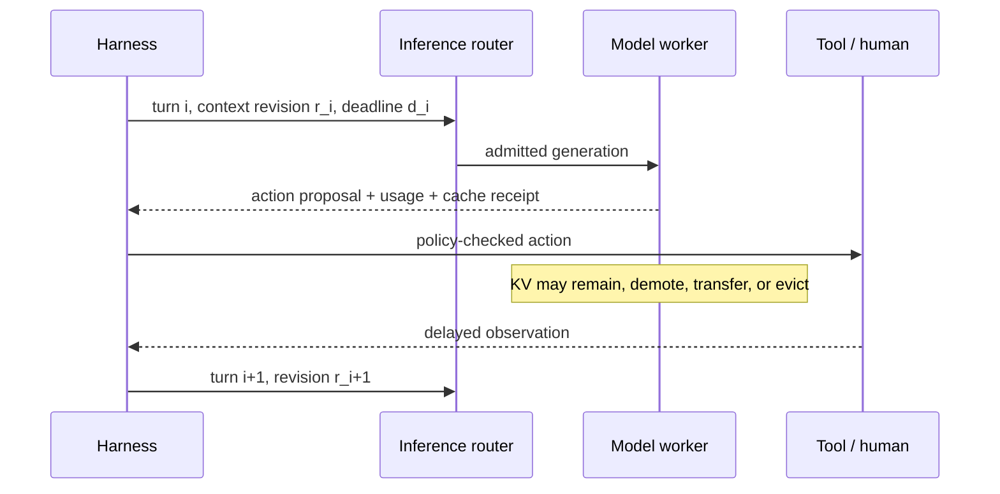

# Agent Inference: Serving Multi-Step LLM Workloads

## TL;DR

Agent inference is a session-level workload, not a collection of independent chat calls. A task alternates model turns with tools and approvals; its context usually grows; most prior tokens are prefix-reusable; siblings may share a base prefix; and orchestrator fan-out converts one logical decision into a burst of concurrent prefills. The fleet must optimize task goodput under deadline, spend, and memory constraints—not request throughput in isolation.

The durable serving state is a logical session and context revision. KV cache is a derived, evictable acceleration artifact tied to an exact model/runtime/context identity; losing it changes latency and cost, not correctness. Routing therefore balances cache reuse against queueing, failure domains, and tenant fairness. Residency policy compares the opportunity cost of holding idle KV with the expected cost of demotion, transfer, or re-prefill when the session returns.

Capacity planning needs the joint distribution of steps per task, fresh and reusable tokens per step, tool-wait time, output length, fan-out, cache residency, model tier, and completion probability. Report cost and deadline success per task, plus the per-step metrics that explain them.

---

## The Workload Is an Alternating Session

An agent task alternates two planes:



This creates several differences from one-shot traffic:

| Dimension | Independent generation | Agent task |
|---|---|---|
| Scheduling unit | Request | Turn inside a task and deadline |
| Reuse | Coincidental prefix overlap | Structural overlap between consecutive revisions and siblings |
| Idle period | Ends after response | Tool or approval wait while reusable state may remain valuable |
| Latency contract | One TTFT/decode path | Sum and critical path across turns, tools, joins, and retries |
| Cost attribution | Request or token | Successful task including failed attempts and fan-out |
| Burst shape | Arrival process of users/jobs | Arrival process multiplied by model-directed fan-out |
| Cancellation | Stop one generation | Stop descendants, streams, and derived cache reservations |

Do not substitute averages for distributions. A mean of twelve turns can combine many two-turn tasks with a long tail of hundred-turn sessions; that tail dominates accumulated context, KV residency, failure recovery, and spend risk. Segment by task class, model, context band, tool-wait band, fan-out, and outcome.

## Logical State and Derived Cache State

The harness owns correctness state:

```text
task_id, session_id, turn_id, context_revision
model/prompt/tool/policy revisions
parent deadline and remaining budgets
action and side-effect status
completion evidence
```

The serving system may attach a **cache receipt**:

```text
cache_object_id, exact prefix digest, token count
model + adapter + tokenizer + template + runtime digest
security/tenant domain, creation and last-access times
residency tier and worker/failure-domain location
size, generation/fencing token, expiry/eviction status
```

KV state is not the transcript and must not become the source of truth. It can disappear on eviction, deployment, worker failure, or model migration. The next turn is reconstructed from canonical context and may pay re-prefill. This separation lets the platform use aggressive cache policy without risking semantic loss.

Cache identity includes every input that affects hidden state: exact token IDs, multimodal embeddings, model weights, adapter, positional configuration, attention implementation where incompatible, and relevant runtime format. Tenant and policy domain belong in the key or physical isolation boundary. A “similar” prefix is not safe KV reuse.

### Context revisions and forks

Consecutive turns usually extend revision \(r_i\), but compaction, edited history, model migration, speculative branches, and subagent creation can fork it. Represent the context as a parent-linked revision graph. Cache reuse is the longest compatible ancestor prefix, not an assumption that all messages in one session are append-only.

A late response from a superseded revision cannot commit merely because its worker still holds warm KV. The harness validates the base context revision and action state. Serving affinity improves performance; it does not confer commit authority.

## Task-Level Resource Ledger

For turn \(i\), let:

- \(P_i\): total input tokens;
- \(H_i\): compatible prefix tokens actually reused;
- \(U_i=P_i-H_i\): fresh tokens that require prefill;
- \(O_i\): generated tokens billed in the output category;
- \(R_i\): model-internal reasoning tokens when reported and billed separately;
- \(A_i\): attempted generations, including retries and discarded candidates;
- \(C_i^{tool}\): retrieval/tool cost attributable to the turn.

A provider-price model is:

\[
C_{task}=\sum_i\sum_{a\in A_i}
\left(c_f U_{ia}+c_h H_{ia}+c_o O_{ia}+c_r R_{ia}+C_{ia}^{tool}\right)
+C_{storage}+C_{coordination},
\]

where prices and the mapping from provider usage fields to mutually exclusive billable categories are versioned configuration. If reasoning is included in reported output rather than separate, set \(R=0\) and include it once in \(O\). A self-hosted model replaces per-token price with accelerator time, reserved capacity, energy, and platform overhead; the same fresh/reused/output decomposition still explains the work.

Without reuse, a transcript that appends roughly \(\Delta\) tokens per turn produces triangular prefill work. With perfect prefix reuse, prior prefix computation is retained and fresh prefill is closer to the sum of increments. Real systems sit between those bounds because caches expire, routing changes, compaction rewrites the prefix, workers fail, and storage tiers add transfer cost.

### Cost per successful task

The product denominator is verified success:

\[
C_{success}=\frac{\sum C_{attempted\ tasks}}
{N_{verified\ successful\ tasks}}.
\]

A cache policy that lowers per-turn cost but increases timeouts or task abandonment may worsen this metric. Include unsuccessful tasks, safety refusals where execution was attempted, cancelled generations that continued consuming backend work, and fan-out branches discarded by synthesis.

## KV Capacity and Residency Economics

For a model with per-token KV footprint \(k_m\), a session with \(S\) retained tokens occupies approximately \(S k_m\) bytes before paging metadata, replication, and speculative branches. Agent fleets can therefore be capacity-bound by many idle sessions waiting on tools even when active decode utilization is low.

At the end of a turn, the platform can keep KV in HBM, demote it to host/remote storage, transfer it to another worker, or evict it. A first-order decision compares:

\[
C_{hold}=v_{tier}\,M_{KV}\,E[W]
\]

with

\[
C_{release}=p_{return}\,
\min(C_{promote},C_{transfer},C_{reprefill})+C_{metadata},
\]

where \(v_{tier}\) is the opportunity cost of capacity, \(W\) is wait time, and \(p_{return}\) is the probability the session resumes before its state becomes obsolete. These values depend on queue pressure, session age, prefix length, model, tenant priority, and tool class.

Short predictable API waits may justify HBM retention. Human approval or long batch jobs usually justify demotion or eviction. A survival model over observed wait times is better than one fixed TTL. Policy also needs a maximum residency so abandoned sessions cannot pin capacity indefinitely.

### Tiered cache

HBM, host memory, remote memory, and SSD offer decreasing cost per byte and increasing access latency. Promotion adds data transfer:

\[
T_{promote}\ge \frac{M_{KV}}{\eta B_{path}}+T_{lookup}+T_{queue}.
\]

Demotion is useful only when the next-turn latency saved over re-prefill exceeds promotion and coordination cost. Storage tiers also create failure and security surfaces: stale directory entries, partial writes, data remanence, cross-tenant leakage, and regional residency. Encrypt and authenticate objects, bind them to a cache generation, and make deletion/expiry observable.

## Routing: Reuse Versus Queueing

Pure session hashing preserves affinity but can overload one worker. Pure least-loaded routing discards useful prefixes. A cache-aware router scores eligible workers using both:

\[
score(w)=V_{reuse}(H_w)-\lambda_q E[Q_w]
-\lambda_r Risk_w-\lambda_m MigrationCost_w,
\]

after hard filters for model/adapter compatibility, tenant and region, policy, deadline, and worker health. `V_reuse` estimates prefill saved by the longest compatible cached prefix. Queue cost must include prompt size and scheduled prefills, not only request count.

The cache directory is itself distributed state. Heartbeats and asynchronous eviction make it stale. Route with cache generation/fencing tokens and let the worker reject a stale cache claim; fallback to prefill without failing correctness. Do not synchronously replicate every cache event globally merely to improve an optimization hint.

### Failure and drain

When a worker fails, surviving canonical session state allows re-prefill elsewhere. The lost-work distribution is age-weighted: older sessions often have larger prefixes, so failure cost is not uniform per request. Track re-prefill tokens caused by worker loss, drain, rollout, and load balancing.

Graceful drain stops new admissions, lets short active generations finish, and either demotes valuable cache state or accepts later re-prefill. The right choice follows the drain deadline and transfer ledger. A model rollout changes cache compatibility and needs cold-prefix headroom; otherwise a nominally healthy rollout creates a TTFT incident.

## Deadlines and Admission Across Turns

For a sequential task with \(N\) turns:

\[
T_{task}=\sum_{i=1}^{N}
(Q_i+T^{prefill}_i+T^{decode}_i+T^{tool}_i)+T_{joins}+T_{human}.
\]

The number of future turns and tool times is uncertain. Admission should use a task-class forecast, remaining deadline, and remaining resource budget. Each turn receives a child deadline that leaves time for verification and response delivery. A per-request timeout equal to the remaining task deadline is unsafe because it leaves no budget for subsequent turns.

Queue priority can combine deadline slack, task value, age, tenant share, and estimated remaining work. Shortest-job-first improves mean latency but can starve long valuable sessions; strict age priority protects sunk work but can let one runaway task monopolize capacity. Use bounded fairness and explicit service classes.

Streaming improves user feedback but does not automatically reduce completion time. Early dispatch of a tool call is safe only once its object is complete, validated, and independent of later model output. Starting an irreversible action from partial streamed arguments is a protocol error.

## Fan-Out and Shared Prefixes

An orchestrator that creates \(n\) workers turns one logical event into a correlated burst. Let \(S\) be a shared prefix and \(D_j\) the divergent context for child \(j\). Without reuse, prefill input is

\[
nS+\sum_j D_j.
\]

With one compatible shared-prefix computation and successful sharing, ideal fresh work approaches

\[
S+\sum_j D_j,
\]

plus lookup, copy-on-write metadata, and any inter-worker transfer. This ideal requires identical tokenization and model state, shared material before divergent instructions, and routing to workers that can access the cache object. Security domains can prohibit sharing even when bytes match.

Fan-out latency under an `all` join follows the slowest child; capacity demand arrives simultaneously. The scheduler should reserve or cap fan-out before launch, place related children without creating one-worker hotspots, and support partial/quorum joins when product semantics allow them. An orchestrator cannot promise parallel latency if the inference tier queues all children behind one another.

Track amplification:

\[
A_{tokens}=\frac{\text{all attempted child + parent tokens}}
{\text{tokens in the best qualified single-agent baseline}}.
\]

The numerator includes retries, synthesis, and cancelled branches. Shared-prefix reuse reduces prefill work but not child decode or tool cost.

## Speculation and Structured Agent Output

Agent turns often emit tool objects, code, diffs, or repeated file content. Some slices have predictable next tokens and may benefit from prompt lookup, an auxiliary draft model, multiple-token prediction, or externally supplied candidate output. The relevant variable is measured acceptance—not the label “agent traffic.”

For draft length \(k\), acceptance probability, drafter cost, verifier shape, batching level, and rollback overhead determine speedup. Speculation consumes spare compute to reduce sequential target-model steps; it can hurt when the target is already compute-bound, acceptance is low, or the drafter competes for scarce capacity. Measure by output class and concurrency, including quality equivalence and tail latency.

Grammar-constrained decoding is complementary. It removes invalid syntactic continuations and may accelerate deterministic spans, but it does not make tool arguments semantically valid or authorized. Schema compilation and mask diversity can become visible when every task generates a distinct schema.

## Service Classes and Overload

Agent traffic benefits from explicit classes:

| Class | Scheduling and cache posture |
|---|---|
| Interactive supervised task | Tight TTFT/ITL, bounded turn effort, preserve useful affinity, rapid cancellation |
| Background durable task | Deadline-aware queue, larger batches, aggressive KV demotion during waits |
| Evaluation/backfill | Reproducible pinned configuration, high batching, no competition with interactive reserve |
| Approval-waiting task | No active accelerator lease; demote/evict state and resume from canonical context |
| High-impact action turn | Reserved verification/approval time; no unsafe fallback under deadline pressure |

Admission reserves task concurrency, expected turns/tokens, fan-out, and KV growth. Under overload, reduce speculative candidates, fan-out, reasoning effort, or model tier only where the task's quality policy permits it. Reject work that cannot finish before its deadline. Do not let queued expired turns consume prefill merely to return a timeout afterward.

Tenant fairness operates on task cost rather than raw request count. One task spawning fifty children should consume the parent's concurrency and spend allocation. Weighted fair queues and hierarchical token buckets prevent fan-out from becoming a noisy-neighbor attack.

## Observability and Capacity Planning

Trace task → session → turn → generation attempt → cache decision → worker → tool action. Record:

- total, fresh, reused, and generated tokens by turn;
- cache identity, residency tier, lookup, transfer, hit length, miss reason, and eviction cause;
- queue, prefill, TTFT, ITL, decode, tool-wait, join, and end-to-end task latency;
- remaining deadline and budgets at admission;
- routing candidates and selected reuse/queue trade-off;
- fan-out, child cancellation, and synthesis cost;
- re-prefill caused by rollout, failure, compaction, and load balancing;
- post-cancellation tokens and cost;
- verified task outcome and human intervention.

Fleet planning replays or models the joint distribution rather than multiplying averages:

```text
tasks/day
× task-class distribution
× steps and fan-out conditional on class/outcome
× fresh/reused/output token distributions by step age
× cache residency and failure policy
× measured phase goodput at each model tier
× headroom for bursts, failure domains, and rollout
```

Validate the model with open-loop load and trace replay. Include cold starts, cache-directory staleness, long tool waits, compaction, worker drain, fan-out bursts, tenant skew, and cancellation. Report task-level deadline goodput and cost alongside per-turn diagnostics.

## Failure Modes

**Affinity collapse.** Least-loaded routing scatters consecutive turns, converting reusable prefixes into repeated prefill while request-level health remains green. Track hit length and miss reason by session age; include reuse value in routing.

**Sticky hotspot.** Hash affinity pins several long, KV-heavy sessions to one worker while peers idle. Bound affinity by queue/KV pressure and use cache-aware fallback with fair placement.

**Stale cache directory.** The router selects a worker for a cache object already evicted or superseded. Fence cache generations and treat a miss as an optimization failure with safe re-prefill.

**Idle-KV exhaustion.** Approval- or tool-waiting sessions occupy HBM until active requests are rejected or preempted. Base residency on wait distributions and capacity value; demote or evict abandoned state.

**Re-prefill cascade.** Memory pressure evicts large sessions; their return adds heavy prefill load, which raises queues and forces more eviction. Reserve headroom, make eviction cost-aware, and shed admissions before the cascade.

**Fan-out storm.** Model-directed children exceed concurrency and evict unrelated warm prefixes. Admit fan-out hierarchically, reserve capacity, and cap children per parent/tenant.

**Deadline-blind turn admission.** A model turn starts although no time remains for its tool, verification, or final response. Propagate child deadlines and reject infeasible work before prefill.

**Partial-stream side effect.** A tool begins from incomplete streamed arguments and later tokens change the intended action. Dispatch only complete validated action objects with stable IDs.

**Retry duplicates work or effects.** An infrastructure retry repeats a generation, while the harness repeats an already committed tool call. Separate generation attempts from logical actions; reconcile side effects by idempotency key.

**Cache-domain leak.** KV or prefix metadata crosses tenant, model, adapter, or policy boundaries. Make the full security/runtime identity part of cache compatibility and audit shared-cache access.

**Metric level mismatch.** Per-request TTFT improves while tasks take more turns, fail more often, or cost more. Make verified task goodput and cost per success the release metrics.

## Decision Framework

| Question | Design consequence |
|---|---|
| Does the task return quickly after model turns? | Retain warm KV when reuse value exceeds HBM opportunity cost. |
| Are waits long or unbounded? | Release accelerator leases and demote/evict; canonical context guarantees recovery. |
| Is the prefix large and stable across turns? | Invest in exact cache identity, affinity, and reuse-aware routing. |
| Does compaction or model routing change the prefix frequently? | Discount affinity value and provision cold prefill capacity. |
| Do siblings share a large base prefix? | Put shared material first and route to a compatible sharing domain, subject to isolation. |
| Is fan-out bursty? | Reserve hierarchical concurrency and use partial joins where semantics permit. |
| Is output predictable under measurement? | Evaluate speculation per slice at target concurrency; disable it when verifier/drafter cost wins. |
| Is the task interactive? | Optimize step TTFT/ITL and rapid cancellation under an end-to-end deadline. |
| Is the task background or evaluative? | Trade latency for batching while preserving pinned configuration and deadline feasibility. |

Begin with canonical session state and task-level measurement. Add affinity only after measuring reusable-prefix value; add tiered KV only after comparing promotion with re-prefill; add speculation only after acceptance profiling; and add disaggregated or heterogeneous placement only when phase-specific goodput justifies its queues and transfers. Every optimization must degrade to correct cold execution when its derived state disappears.

## Key Takeaways

- The unit of operation is a task composed of turns, tools, waits, and fan-out; request metrics alone misprice and misdiagnose it.
- Canonical context and action state are durable. KV is an exact-identity, security-scoped, evictable performance artifact.
- Cache hit rate is produced by context construction, routing, residency, failure, and rollout policy; it is not a fixed workload constant.
- Hold/demote/evict decisions compare capacity opportunity cost with expected promotion or re-prefill cost under the tool-wait distribution.
- Routing optimizes reuse value against queueing, risk, transfer, fairness, and deadline—not affinity at any cost.
- Fan-out creates correlated burst load; shared prefixes reduce only the common prefill component and require compatible placement.
- Speculation and constrained decoding are slice-specific optimizations whose benefit depends on acceptance, batching, schema diversity, and available compute.
- Capacity and release decisions use verified task goodput, cost per success, and task-level deadlines, supported by step-level diagnostics.

## References

- [SGLang: Efficient Execution of Structured Language Model Programs](https://arxiv.org/abs/2312.07104) — radix-tree prefix reuse and structured-program execution
- [Efficient Memory Management for Large Language Model Serving with PagedAttention](https://arxiv.org/abs/2309.06180) — paged KV allocation and sharing
- [Pensieve: Retaining Contexts for Multi-turn Dialogue in Large Language Model Serving](https://arxiv.org/abs/2312.05516) — multi-turn KV retention and migration
- [DistServe: Disaggregating Prefill and Decoding for Goodput-optimized Large Language Model Serving](https://www.usenix.org/conference/osdi24/presentation/zhong-yinmin) — phase-specific goodput and disaggregation
- [Mooncake: A KVCache-centric Disaggregated Architecture for LLM Serving](https://arxiv.org/abs/2407.00079) — distributed KV cache and disaggregated serving
- [Fast Inference from Transformers via Speculative Decoding](https://arxiv.org/abs/2211.17192) — exact speculative decoding
- [Orca: A Distributed Serving System for Transformer-Based Generative Models](https://www.usenix.org/conference/osdi22/presentation/yu) — iteration-level scheduling
- [Context Management](./08-context-management.md) — context construction, compaction, and token economics
- [GPU Inference Internals](./11-gpu-inference-internals.md) — phase rooflines, KV footprint, kernels, and parallelism
- [LLM Infrastructure](./05-llm-infrastructure.md) — admission, routing, streaming, rollout, and regional serving architecture
