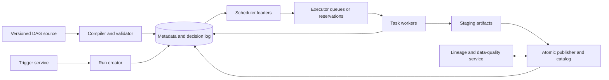

# DAG Orchestration

## TL;DR

A DAG orchestrator turns a versioned dependency graph into durable task instances whose outputs can be published, retried, backfilled, and audited. The graph is only the static plan. Correctness lives in the run identity, logical data interval, task-attempt state machine, artifact commit protocol, and rules for partial replay. A scheduler may execute independent vertices concurrently, but it must not confuse “upstream process exited successfully” with “the expected partition is complete and valid.” Backfills are new production workloads pinned to code, input, and policy versions; they must not silently overwrite newer outputs or consume unbounded shared capacity. Dynamic mapping can expand one graph node into millions of task instances, making scheduler metadata the bottleneck. Use DAG orchestration for bounded computations with explicit dependencies and materialized outputs. Use durable execution for long-lived entity state and general stream processors for unbounded event-time computation.

---

## Scope: Bounded Graph Runs and Published Artifacts

This chapter owns graph compilation, run/task identity, dependency readiness, retries and partial reruns, data intervals, backfills, and artifact publication.

- [Batch Processing](../13-data-pipelines/01-batch-processing.md) owns execution-engine internals such as shuffle, stages, and worker-side data processing.
- [Stream Processing](../13-data-pipelines/02-stream-processing.md) owns unbounded event time, watermarks, state, and checkpointing.
- [Durable Execution](04-durable-execution-workflow-engines.md) owns replayed per-entity histories, durable timers, and code determinism.
- [Distributed Scheduling and Timers](03-distributed-cron-scheduling.md) owns trigger uniqueness and durable time-based firing.
- [Priority, Fairness, and Backpressure](07-priority-fairness-backpressure.md) owns multi-tenant allocation and admission.

A DAG can invoke a stream job or durable workflow, but it does not inherit those systems' semantics. The task boundary must state what “submitted,” “running,” and “complete” mean for the external system.

---

## Durable Identity Is the Foundation

The minimal identifiers are:

```text
definition = (dag_id, definition_version)
run        = (dag_id, logical_run_id)
task       = (dag_id, logical_run_id, task_id, map_index)
attempt    = (dag_id, logical_run_id, task_id, map_index, attempt_number)
publish key= (dataset_id, namespace, logical_partition)
generation = (publish_key, generation_id, producer_task, manifest_hash)
```

`logical_run_id` is stable across scheduler retries and is scoped by `dag_id`; carrying the complete run key prevents two DAGs with similar run/task names from colliding. `attempt_number` changes whenever execution is retried. Attempts target the same logical publication key, but naming alone does not elect a winner: the catalog's compare-and-swap and attempt epoch choose one immutable generation. External submission/idempotency keys use the full logical task key plus an operation purpose, while callbacks and completion updates also validate the current attempt epoch.

For scheduled data pipelines, attach an explicit half-open data interval such as `[2026-07-17T00:00Z, 2026-07-18T00:00Z)`. The wall-clock time at which the scheduler happens to launch is not the interval. A delayed daily run still processes the same logical day; a retry next week does not switch inputs because “yesterday” changed.

### Definition versions are immutable inputs

Store a content-addressed or otherwise immutable graph definition with each run:

- task code/image and parameters;
- dependency edges and trigger rules;
- input dataset snapshots or resolution policy;
- output schema/contract version;
- retry/resource/priority policy;
- secrets/config references by version, not secret values.

Editing the UI's current DAG must not rewrite the meaning of an in-flight or historical run. New runs may use a new definition version; migrating an existing run is an explicit state transition with compatibility checks.

---

## Graph and Task Invariants

For graph $G=(V,E)$:

1. the compiled definition is acyclic;
2. every edge references a task in the same immutable definition or an explicit external dependency contract;
3. a task becomes eligible only when its trigger predicate over upstream terminal states is true;
4. one logical task has at most one committed output generation for a given publication policy;
5. a terminal run result is derived from task states and trigger policy, not set independently;
6. clearing/rerunning a task records a new attempt or run revision; it never erases prior evidence;
7. dynamic expansion is deterministic from a versioned manifest and bounded before materialization.

“All upstream succeeded” is one trigger predicate. Others include “all finished,” “any succeeded,” or a branch/short-circuit outcome. Model skipped, canceled, upstream-failed, and removed tasks explicitly; treating every non-success as generic failure makes joins and cleanup unsafe.

---

## Architecture: Compiler, Scheduler, Executor, Artifact Plane



The **control plane** compiles definitions, creates logical runs, evaluates readiness, enforces concurrency/policy, and records decisions. The **execution plane** launches task attempts and reports status. The **artifact plane** validates and publishes outputs. Combining them in one process is possible at small scale, but the durable contracts remain distinct.

### Scheduler transition

A task state machine can be:

```text
BLOCKED -> READY -> RESERVED(epoch) -> RUNNING(epoch)
                     |                   |
                     v                   v
                  BLOCKED/READY       SUCCEEDED_PENDING_PUBLISH
                                          |
                                          v
                        SUCCEEDED | RETRY_WAIT | FAILED | CANCELED
```

`RESERVED` prevents two scheduler replicas from intentionally dispatching the same task. An epoch/lease prevents a late stale worker from winning completion after reassignment. At-least-once execution can still occur, so artifact/effect publication must be idempotent.

The scheduler consumes durable changes rather than rescanning every task on every loop. When an upstream state changes, update dependent readiness counters or enqueue dependency evaluations. Periodic reconciliation repairs missed notifications and state drift.

### External executor submission has an ambiguous state

A task that submits work to a remote batch, query, or ML system needs a durable submission protocol:

```text
READY
  -> SUBMITTING(stable_submit_token, attempt_epoch)   # durable before RPC
  -> SUBMITTED(remote_execution_id)
  -> RUNNING
  -> SUCCEEDED_PENDING_PUBLISH | FAILED | CANCEL_REQUESTED

SUBMITTING + lost response -> UNKNOWN -> query by stable token -> ADOPTED or retry submit
```

The remote API should accept the stable token idempotently or support lookup by that token. After a timeout, query before resubmitting. Store the returned remote ID under the current attempt epoch; a callback is deduplicated by remote event/execution ID and cannot complete a reassigned task. Cancellation is a durable request, not proof of termination. Define whether a late remote success is adopted, quarantined, or discarded, and reconcile `SUBMITTING`, `UNKNOWN`, `CANCEL_REQUESTED`, and apparently running tasks periodically.

---

## Graph Compilation and Readiness

### Cycle detection

Kahn's algorithm computes indegrees, repeatedly removes zero-indegree vertices, and detects a cycle if fewer than $|V|$ vertices are emitted. Complexity is $O(|V|+|E|)$. Run this at definition publication, not after production tasks have started.

Dynamic dependencies require a bounded compile/expansion phase. A runtime task that can arbitrarily add an edge back to an ancestor turns the model into a general workflow graph and invalidates DAG scheduling assumptions.

### Incremental readiness

Maintain per-task counters by upstream terminal class, or derive them from an append-only task-state log. A transition is accepted only for the current attempt epoch and updates dependent counters once. Duplicate completion messages must not decrement remaining-upstream count twice.

The readiness predicate includes more than edges:

- data interval and run state;
- `not_before`/retry delay;
- tenant/pool concurrency;
- required dataset partitions and schema quality;
- external resource availability;
- branch/trigger rule;
- manual approval or policy gate where declared.

Record *why* a task is not ready. “Queued for 12 hours” could mean no worker, quota denial, missing upstream artifact, retry delay, or scheduler corruption; those require different action.

---

## Data Intervals and Input Resolution

A periodic run maps a logical interval to input partitions. Never let task code call `now()` to decide its correctness input. The orchestrator passes:

```json
{
  "run_id": "sales-daily/2026-07-17",
  "data_interval": {
    "start": "2026-07-17T00:00:00Z",
    "end": "2026-07-18T00:00:00Z"
  },
  "input_snapshot": "orders-manifest:sha256:...",
  "definition_version": "git:9af3..."
}
```

Input completeness is a data contract. A file existing is not proof that a partition is complete. Use an atomic manifest/catalog publication from the producer, including schema, row/file counts where meaningful, checksums, source watermark, and producer run identity.

Late data policy is explicit:

- immutable cutoff: interval closes at a watermark and later data enters a correction run;
- rolling restatement: recent partitions are recomputed under a versioned window;
- append correction: publish deltas/retractions rather than overwrite;
- manual exception: quarantine and approve material late changes.

The streaming engine determines event-time completeness; the DAG orchestrator schedules the bounded correction/materialization work.

---

## Artifact Commit Protocol

Task success should mean the declared output is durable, validated, and discoverable—not merely that a process exited zero.

Use staging and idempotent atomic publication:

```text
1. task records an immutable candidate `generation_id`, publication key, expected predecessor, attempt epoch, and eventual manifest hash
2. attempt writes to `staging/<full_logical_task>/<attempt_epoch>/...`
3. writer produces and validates the immutable manifest with checksums and schema
4. publisher performs compare-and-swap from the expected predecessor to the candidate generation
5. `current == candidate` is idempotent success; another current generation is a real conflict requiring policy
6. task records `SUCCEEDED` with the same generation; downstream readiness consumes that durable association
7. a reconciler adopts catalog candidates whose task update was lost and repairs task records without republishing
8. losing/stale staging data is garbage-collected after a safety window
```

For object storage, a catalog/manifest pointer supplies the atomic visibility boundary; listing a directory of incrementally uploaded files does not. For a transactional table format, commit the snapshot using its optimistic concurrency protocol. The publisher rejects stale run/definition epochs and declares whether a backfill may replace, branch, or append to a current partition.

The CAS response can be lost after the catalog commit. On retry, the publisher first reads the key: if it already points to the exact candidate generation, publication succeeded and the task record can be repaired; if it still equals the expected predecessor, retry the CAS; if it names another generation, execute the declared conflict policy. A deterministic filename or last-writer-wins object upload cannot provide this distinction.

Outputs with external effects use the effect protocol in [Effect Commit Protocols](06-retry-idempotency-compensation.md), not a filesystem-success marker.

---

## Backfills and Partial Reruns

A backfill creates a set of logical runs over historical intervals. It is not “set the scheduler start date in the past.” Pin:

- definition/code version;
- input resolution rule or source snapshot;
- output namespace/publication mode;
- interval set and ordering constraints;
- tenant/resource/priority budget;
- cancellation and resume cursor;
- validation and promotion policy.

### Publication modes

- **reproduce:** write a separate forensic namespace without changing production;
- **repair:** replace selected partitions if compare-and-swap proves the expected prior generation;
- **restate:** publish a new dataset generation, validate it, then atomically move an alias;
- **append correction:** add versioned deltas/retractions.

A historical run must not overwrite a newer production partition merely because it finishes later. Include source snapshot, semantic version, and expected predecessor in the publication CAS.

### Concurrency with live runs

Backfills consume the same databases, APIs, shuffle, catalog, and workers as current work. Admit them under a separate bounded class, preserve live-run reserve, and pace them by the tightest downstream budget. When backfill output intersects a live interval, establish one writer policy or publish into isolated generations and reconcile.

### Partial rerun closure

Rerunning task A may invalidate descendants B and C. Compute the affected descendant closure unless an artifact contract proves a descendant remains valid. A UI “clear task only” action that leaves derived downstream output marked successful creates mixed-generation data.

Record the run revision and lineage; do not mutate old attempt states to look as though the rerun happened originally.

---

## Dynamic Mapping and Metadata Capacity

Dynamic task mapping expands one logical node from an upstream manifest. It is safe when expansion is deterministic and bounded:

```text
manifest hash -> ordered item keys -> map indexes -> task identities
```

If a retry reads a changed external list, it can create different task identities and orphan outputs. Persist the expansion manifest before instantiating children.

Let $R$ be runs retained, $V$ static tasks per run, $M$ total mapped task instances per run, and $A$ mean attempts per task. Metadata rows are approximately:

$$
N_{task\ attempts} \approx R(V+M)A
$$

A single upstream list of ten million objects can overwhelm a scheduler that comfortably handles a thousand-node static DAG. Prefer range/partition tasks, executor-native parallelism, or hierarchical child workflows rather than materializing one scheduler row per record.

Metadata write capacity includes state transitions, heartbeats, dependency updates, logs, and lineage. Archive old detail while retaining immutable audit summaries and artifact lineage. Index scheduler queries by active state/run/next eligibility; unbounded historical scans on the scheduling database are a control-plane outage.

---

## Execution Capacity and Critical Path

For task service demands $s_v$, total work is $W=\sum_v s_v$. The graph's critical-path length (span) is the greatest summed service along any dependency path, $S_{crit}$. With $C$ perfectly compatible workers, completion time has a lower bound:

$$
T \ge \max\left(\frac{W}{C}, S_{crit}\right)
$$

Adding workers cannot beat the critical path. Resource shapes, queue delay, data transfer, retries, and skew increase actual time.

Track available parallelism over the run, not only total task count. A graph with 100,000 tasks may expose only one ready task at a time. Conversely, a fanout of 100,000 can stampede a downstream service unless concurrency is bounded by pool/tenant/dependency.

Scheduler throughput must exceed task-transition arrival rate with failure headroom. If each attempt creates $e$ durable control-plane events and attempts complete at $q$ per second, baseline event rate is $eq$ before heartbeats and retries. Prefer leased heartbeats at a cadence justified by recovery SLO; per-second updates from millions of tasks can dominate metadata storage.

---

## Failure Modes

### Process success publishes partial data

A worker uploads files directly to the final prefix, fails midway, and exits after a retry later succeeds. Readers see a mixture. Stage immutable artifacts and publish one validated manifest/snapshot atomically.

### Catalog commit succeeds, task update is lost

The publication CAS installs generation G, then the publisher crashes before marking the task successful. A blind retry expects the old predecessor and labels its own result a conflict. Persist G as the candidate before publication, treat `current == G` as success, and reconcile the catalog-to-task association.

### Remote submission response is lost

The external engine accepted work, but the orchestrator remains `SUBMITTING`. A retry creates a second expensive execution, and both later publish. Persist a stable submission token before RPC, query/adopt by token after ambiguity, deduplicate callbacks, and allow only the current attempt epoch to publish.

### Retry resolves a different interval

Task code uses “today minus one” and a retry occurs after midnight. One logical task processes two days across attempts. Pass immutable interval and input snapshot in the task contract.

### Backfill overwrites a newer partition

A slow historical repair finishes after a live restatement and blindly replaces the catalog pointer. Use publication CAS with expected predecessor and explicit repair/restate namespaces.

### Dynamic map explodes scheduler metadata

An upstream query returns one row per customer and maps millions of tasks. Scheduler/database latency collapses before workers are busy. Bound expansion, aggregate into partitions, or move fine-grained parallelism into the execution engine.

### Scheduler failover decrements dependency twice

Duplicate completion delivery causes readiness counter to reach zero early. Deduplicate transitions by `(task, attempt_epoch, target_state)` or derive readiness from authoritative terminal states during reconciliation.

### Clearing one task leaves stale descendants

An operator reruns an upstream transform but downstream tasks remain “success” and publish mixed generations. Compute invalidation closure from lineage or require explicit proof that downstream artifacts are independent.

### Backfill starves current production

Historical demand fills every worker and downstream connection. Give live intervals reserved capacity; admit/pause backfills through the shared fairness and dependency budgets.

---

## Security and Governance

The orchestrator can execute privileged code across many systems. Enforce:

- authenticated authorship and reviewed/versioned definition publication;
- per-DAG/task service identities and least-privilege secret references;
- tenant/pool/resource authorization at admission and dispatch;
- immutable audit of manual rerun, skip, override, and backfill actions;
- signed or allowlisted execution artifacts/images;
- log/output redaction and access aligned to dataset classification;
- protection against parameter injection and unbounded dynamic expansion;
- separation between scheduler metadata access and task data access.

Do not serialize secret values into DAG definitions, task arguments, lineage, or scheduler logs. A historical run must resolve only secret versions it is authorized to use; reproducing data does not justify resurrecting revoked credentials.

---

## Observability and Repair

Expose both graph and data views:

- runs by definition version, interval, state, age, and critical-path progress;
- task counts by blocked reason, ready age, reservation/dispatch latency, run time, retry cause, and epoch conflict;
- dependency-evaluation lag and reconciliation repairs;
- scheduler loops/events per second, metadata latency, hot queries, and dynamic-map cardinality;
- artifact staging/publish latency, CAS conflicts, validation failures, and orphan bytes;
- data freshness/coverage by logical partition and source watermark;
- backfill progress, estimated drain time, publication mode, and live-work capacity impact;
- lineage from input snapshot through task attempt to published generation.

A run can be green while data is incomplete. Alert on missing/late partitions and quality contracts, not merely task failure. A task can be red after its external job actually succeeded; reconciliation adapters should query the external system by stable submission ID before resubmitting.

Repair operations are durable commands—clear, retry, mark skipped, adopt external result, invalidate descendants, republish artifact—not direct database edits. Each command records actor, reason, expected prior state, affected closure, and new run revision.

---

## Evolution and Verification

### Definition rollout

1. compile and statically validate a candidate graph;
2. diff tasks, edges, contracts, resource/secret scopes, and schedule semantics;
3. run against a representative historical interval in an isolated output namespace;
4. validate artifacts and compare lineage/quality to the current definition;
5. publish an immutable version for new runs;
6. keep old workers/code available for in-flight versions or migrate explicitly;
7. monitor the first live runs and retain prior definition for rollback.

Changing a task ID can orphan historical lineage; changing an interval definition can double-process or skip time. Treat both as schema migrations.

### Fault and property tests

- cycle and missing-edge rejection at compile time;
- duplicate scheduler events and controller failover at every task transition;
- worker death before/after artifact upload and before/after publication;
- publisher death immediately before and after catalog CAS, and before the task-state update;
- remote submission timeout after accept, duplicate callback, cancel/complete race, and late completion after reassignment;
- stale attempt completion after reassignment;
- retries across wall-clock/date boundaries;
- late/missing input partitions and schema mismatch;
- dynamic map retry with changed source list;
- overlapping live run and backfill publication;
- partial rerun invalidation closure;
- metadata overload, queue admission, and downstream throttling;
- restore of scheduler metadata plus artifact catalog from backup.

Property tests assert that no task becomes ready before its trigger predicate, at most one artifact generation wins a publication key, and replaying duplicate state events yields the same run state.

---

## Decision Framework

Use a DAG orchestrator when work is bounded, dependencies are knowable for a run, intermediate artifacts are meaningful, and operators need interval/backfill/partial-rerun control.

Prefer another model when:

| Need | Better owner |
|---|---|
| Millions of per-record parallel operations | Batch/stream execution engine |
| Unbounded event-time state and continuous results | Stream processor |
| One entity lives for months with signals and durable timers | Durable workflow engine |
| One independent deferred function | Background job queue |
| Cross-service business effects and compensation | Durable workflow plus effect protocol |

Before choosing, answer:

1. What identifies a run, interval, task, attempt, and artifact generation?
2. How is input completeness proven?
3. What atomic action makes output visible?
4. Which definition/input versions does a retry or backfill use?
5. How are downstream artifacts invalidated after partial rerun?
6. What bounds dynamic expansion and metadata growth?
7. How does the scheduler recover without double-counting transitions?
8. How are live work and backfills isolated at every dependency?

---

## Key Takeaways

1. A DAG is the plan; durable run/task/artifact identities are the execution contract.
2. Logical data intervals and input snapshots must not depend on retry wall time.
3. Process exit is not artifact commit; stage, validate, and atomically publish.
4. Backfills are versioned production workloads with isolated outputs and capacity budgets.
5. Partial reruns require lineage-aware descendant invalidation.
6. Dynamic task mapping can move the bottleneck from workers to scheduler metadata.
7. Completion time is bounded by both total work/capacity and graph critical path.
8. Scheduler decisions and repairs must be durable, replayable, and epoch-fenced.

---

## References

- Michael Isard et al., [*Dryad: Distributed Data-Parallel Programs from Sequential Building Blocks*](https://www.microsoft.com/en-us/research/publication/dryad-distributed-data-parallel-programs-from-sequential-building-blocks/), EuroSys, 2007.
- Derek G. Murray et al., [*Naiad: A Timely Dataflow System*](https://www.microsoft.com/en-us/research/publication/naiad-a-timely-dataflow-system/), SOSP, 2013.
- Apache Airflow, [DAG Runs](https://airflow.apache.org/docs/apache-airflow/stable/core-concepts/dag-run.html) and [Dynamic Task Mapping](https://airflow.apache.org/docs/apache-airflow/stable/authoring-and-scheduling/dynamic-task-mapping.html), current documentation.
- Apache Beam, [The Beam Model](https://beam.apache.org/documentation/basics/), current documentation.
- Delta Lake, [Transaction Log Protocol](https://github.com/delta-io/delta/blob/master/PROTOCOL.md), protocol specification.
- Apache Iceberg, [Reliability](https://iceberg.apache.org/docs/latest/reliability/) and [Specification](https://iceberg.apache.org/spec/), current documentation.
- Jeffrey D. Ullman, [*NP-complete Scheduling Problems*](https://doi.org/10.1016/S0022-0000(75)80008-0), Journal of Computer and System Sciences, 1975.
