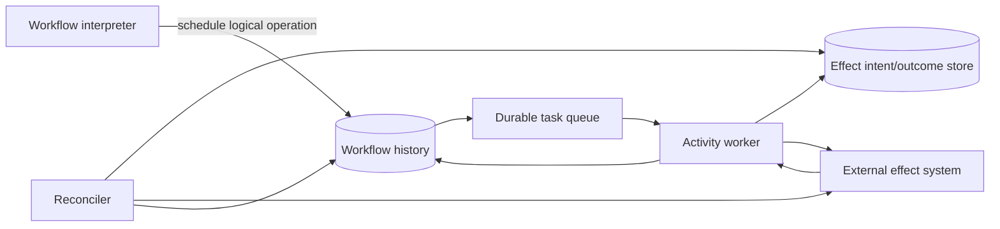

# Effect Commit Protocols for Workflows

## TL;DR

A workflow engine can durably record that a step *should* run, but it cannot atomically commit its history with an arbitrary external effect. A worker can charge a card and crash before recording success; after recovery, the engine sees an incomplete step and retries. The central design question is therefore not “how many retries?” It is:

> How does one logical workflow step converge to one accepted external outcome when attempts, acknowledgments, and recovery can repeat?

There is no universal protocol. Choose one based on the effect boundary:

- commit workflow state and a local effect in one database transaction;
- pass a stable operation key to an idempotent remote API;
- record a durable intent/outcome and reconcile ambiguous calls;
- reserve, then confirm or release a capacity-constrained resource;
- publish through a transactional outbox and consume through an inbox;
- compensate completed business effects when forward completion is no longer valid.

Workflow effect commit and recovery are scoped here. [Retries, Timeouts, and Hedging](../06-scaling/10-retries-timeouts-hedging.md) covers generic retry policy; [Idempotency](../01-foundations/08-idempotency.md) covers generic idempotency; [Delivery Guarantees](../05-messaging/04-delivery-guarantees.md) covers broker delivery; [Durable Execution](./04-durable-execution-workflow-engines.md) covers workflow replay.

---

## 1. The Unavoidable Commit Gap

Consider one workflow step:

```text
1. call external system
2. external system commits effect
3. record step outcome in workflow history
4. acknowledge task
```

Crashes create two dangerous intervals:

- **before the external commit:** retry is required or the effect is lost;
- **after the external commit but before durable outcome:** retry may repeat the effect.

Reversing the order does not help:

```text
1. mark step complete
2. call external system
```

A crash between those operations records success for an effect that never happened. Without a shared atomic transaction, no ordering removes the gap.

### 1.1 System model

Assume:

- workflow history is durable and may be replayed;
- task delivery is at least once;
- workers can pause, crash, or lose connectivity;
- timeouts are ambiguous;
- the external system may commit even when its response is lost;
- cancellation races with completion;
- a workflow or activity may be retried on another worker;
- clocks are not a global ordering source.

The achievable guarantee is scoped:

> For one logical operation identity, all attempts converge to one recorded outcome, or to an explicit unresolved/repair state.

That is stronger and more useful than claiming exactly-once execution.

### 1.2 Invariants

1. **Stable operation identity:** every attempt of one logical effect carries the same key.
2. **Parameter immutability:** reusing a key with different semantic input is rejected.
3. **Durable intent:** the system can prove which effect it meant to perform before issuing it.
4. **Monotonic outcome:** terminal success cannot be overwritten by a later timeout or cancellation.
5. **Attempt fencing:** a stale worker cannot publish an outcome for a superseded execution lease.
6. **Replay safety:** history replay does not issue the effect directly.
7. **Explicit ambiguity:** unknown outcomes remain `UNKNOWN`; they are never guessed to be failure.
8. **Compensation identity:** reversal attempts have their own stable key and durable state.
9. **Bounded retention:** idempotency and outcome records live at least as long as any possible retry or replay.
10. **Repairability:** an operator can query, reconcile, and resolve stuck operations without editing history by hand.

---

## 2. Separate Workflow Decisions From Effect Execution



The workflow interpreter decides *what should happen* and records a command. An activity worker performs non-deterministic I/O. Replay reconstructs decisions from history; it does not rerun already recorded effects.

Use a logical operation identifier such as:

```text
effect_key =
  workflow_namespace /
  workflow_id /
  workflow_run_or_business_epoch /
  step_name /
  logical_sequence
```

Do not derive the key from the worker attempt number. Attempt 2 must look like the same operation to the external system. Conversely, a workflow retry that represents a genuinely new business action needs a new business epoch or logical sequence.

### 2.1 Effect state machine

```text
PLANNED
  -> DISPATCHED
  -> SUCCEEDED
  -> FAILED_FINAL
  -> COMPENSATION_PLANNED
  -> COMPENSATED

DISPATCHED -> UNKNOWN -> RECONCILING
RECONCILING -> SUCCEEDED | FAILED_FINAL | MANUAL_REPAIR
```

`UNKNOWN` is essential. A timeout is evidence that the caller lacks an answer, not evidence that the effect failed.

An outcome record may contain:

```text
effect_key
workflow_id
step_name
semantic_request_digest
state
attempt_epoch
external_operation_id
external_status
result_digest
created_at
last_attempt_at
next_reconcile_at
retention_until
compensation_key
```

Hash canonical semantic inputs and store the digest. A duplicate request with the same key but a different amount, tenant, destination, or payload must fail closed; silently replaying the first result would attach the wrong effect to the workflow.

---

## 3. Protocol A: One Transaction Boundary

If workflow state and the intended effect live in the same database, commit them together:

```text
BEGIN
  insert processed_step(effect_key, request_digest)
    on conflict verify same digest

  apply business mutation

  append workflow outcome / outbox record
COMMIT
```

A unique constraint on `effect_key` makes duplicate attempts return the stored outcome. This is the strongest and simplest protocol because the dedup record and effect share one atomic boundary.

### 3.1 Claiming is not committing

A lease or `RUNNING` marker prevents concurrent normal execution, but it does not make the effect safe. A worker may outlive its lease and continue writing. If ownership can change, pass a monotonically increasing fencing token into the database write and accept only the current epoch.

The transaction should distinguish:

- `STARTED`: useful for diagnosis but not proof of effect;
- `COMMITTED`: effect and outcome committed atomically;
- `FAILED_FINAL`: deterministic rejection committed;
- absent/expired claim: eligible for another attempt.

### 3.2 Limits

This protocol ends at the database boundary. An email, payment gateway, object store, message broker, or SaaS API cannot join merely because the worker transaction is durable. Use another protocol for the remote effect.

---

## 4. Protocol B: Idempotent Remote API

The preferred remote contract accepts a caller-supplied operation key:

```text
POST /charges
Idempotency-Key: order-82/payment-1

{ amount, currency, account }
```

The provider atomically:

1. inserts the key and canonical request digest if absent;
2. performs the operation;
3. stores the terminal result;
4. returns the stored result for duplicate requests;
5. rejects key reuse with a different digest.

### 4.1 Provider state matters

A robust provider does not use a single `seen=true` bit. It needs states such as:

```text
IN_PROGRESS -> SUCCEEDED
IN_PROGRESS -> FAILED_RETRIABLE
IN_PROGRESS -> FAILED_FINAL
```

If the first executor dies while `IN_PROGRESS`, another attempt needs a recovery rule: lease expiry plus fencing, provider-side reconciliation, or a queryable operation status. Returning permanent “already seen” would lose the operation; immediately running again without fencing could duplicate it.

### 4.2 Retention window

The provider must retain operation identities longer than every source of delayed repetition:

```text
retention >= max(
  workflow retry horizon,
  queue redelivery horizon,
  offline client retry horizon,
  disaster replay horizon,
  manual repair horizon
) + clock/operational margin
```

If a workflow can be retried for 30 days but the provider forgets keys after 24 hours, the guarantee expires after one day. Retention is part of the API contract.

### 4.3 Query by operation identity

For ambiguous timeouts, support:

```text
GET /operations/{effect_key}
```

The response should distinguish `NOT_FOUND`, `IN_PROGRESS`, `SUCCEEDED`, and `FAILED_FINAL`. A caller may safely retry after authoritative `NOT_FOUND`; it should reconcile rather than create a new key after `IN_PROGRESS`.

---

## 5. Protocol C: Intent, Dispatch, and Reconciliation

Some external APIs do not support caller idempotency. Record intent before calling:

```text
transaction 1:
  persist effect intent(effect_key, request, PLANNED)

worker:
  claim intent with attempt_epoch
  set DISPATCHED
  call external system
  record response
```

This does not make the call exactly once. It makes ambiguity durable and recoverable.

### 5.1 Reconciliation strategies

After an ambiguous response:

1. query the external system by a business reference placed in the original request;
2. inspect provider event/webhook history;
3. search by a narrow semantic tuple only if uniqueness is guaranteed;
4. wait for a provider-specific settlement window;
5. route to manual repair if existence cannot be determined safely.

Never blindly issue a second irreversible effect merely because the first call timed out.

If the provider accepts a merchant reference but does not promise idempotency, use a unique reference and make the reconciler search it before retrying. This is weaker than atomic provider deduplication but gives an evidence path.

### 5.2 Transactional dispatch with outbox

When the “external effect” is message publication, commit business state and an outbox row together, then publish at least once. Consumers use an inbox or effect key at their own commit boundary. The canonical protocol is in [Outbox Pattern](../05-messaging/07-outbox-pattern.md).

Do not mark the workflow effect complete merely when the broker accepts a message if the business contract requires downstream application. Record separate milestones:

```text
INTENT_COMMITTED
PUBLISHED
CONSUMED
BUSINESS_EFFECT_CONFIRMED
```

The required terminal milestone depends on the workflow's contract.

---

## 6. Protocol D: Reserve, Confirm, Release

Capacity-constrained effects often support a hold:

```text
AVAILABLE -> RESERVED(expires_at) -> CONFIRMED
AVAILABLE <- RELEASED/EXPIRED <-
```

Examples include inventory, seats, credit limits, quotas, and appointment slots. Reservation separates reversible allocation from irreversible confirmation.

### 6.1 Reservation invariants

- a reservation has a stable key and resource identity;
- capacity is decremented atomically with reservation creation;
- confirmation is idempotent;
- release is idempotent;
- expiry uses provider authority, not a worker's local clock;
- confirmation after expiry is rejected or follows an explicit late-confirm policy;
- the workflow records the reservation ID before advancing.

### 6.2 Expiry races

1. Workflow sends confirmation near expiry.
2. Provider confirms, but response is delayed.
3. Workflow timer fires and sends release.
4. Release must not undo a confirmed reservation.

The provider state machine, not arrival order alone, decides. `CONFIRMED` is terminal with respect to ordinary release; a business compensation requires a separate cancellation operation.

Reservations create temporary capacity loss. If arrival rate is 4,000 holds per minute, average hold duration is 8 minutes, and 12 percent eventually confirm, Little's Law estimates:

```text
outstanding holds = 4,000/min * 8 min = 32,000
```

About 28,160 of those holds will eventually release or expire. The system must provision both reservation state and the temporary inventory impact; excessively long holds reduce usable capacity even when final demand is modest.

---

## 7. Compensation Is a Forward Effect

Compensation does not erase history. It creates a new semantic effect such as refund, release, revoke, or issue corrective entry.

```text
forward effect key: order-82/charge
compensation key:  order-82/refund-charge/v1
```

### 7.1 Compensation contract

For every compensable step, define:

- trigger conditions;
- whether forward completion or backward compensation is preferred;
- stable compensation identity;
- allowed amount/scope;
- preconditions on current external state;
- retry and reconciliation behavior;
- whether compensation can itself be compensated;
- business state after success;
- deadline and escalation owner.

Compensation may be lossy: a refund does not undo exchange-rate movement; cancellation may incur a fee; a sent email cannot be unsent. The workflow must model these as business outcomes, not pretend the original transaction vanished.

### 7.2 Ordering and parallel branches

Reverse-order compensation is correct only when dependencies require it. In a parallel workflow DAG, build a compensation graph from committed effects and their dependencies. Independent reversals can run concurrently; a child whose reversal depends on its parent's continuing existence must run first.

Record the exact set of committed forward effects. Replaying workflow code to infer what “must have happened” is unsafe if code or conditions changed.

### 7.3 Compensation can fail permanently

A refund may be rejected after a settlement boundary. A resource may no longer exist. The state machine needs `COMPENSATION_FAILED_FINAL` or `MANUAL_REPAIR`, with an owner and customer-impact workflow. Infinite retries are not recovery.

---

## 8. Cancellation Races

Cancellation is a request to transition, not proof that work stopped:

1. workflow requests cancellation;
2. worker or provider may already have committed;
3. cancellation and success notifications race;
4. history must converge according to state precedence.

Define legal transitions:

```text
PLANNED -> CANCELLED
DISPATCHED -> CANCELLATION_REQUESTED
CANCELLATION_REQUESTED -> SUCCEEDED
CANCELLATION_REQUESTED -> CANCELLED
SUCCEEDED -> COMPENSATION_PLANNED
```

A late success after cancellation request is not discarded. If the business no longer wants the effect, the engine schedules compensation from the observed success.

Workers should propagate cancellation to cancellable calls and stop before issuing new effects, but they must not assume a closed connection revoked an already committed remote operation.

---

## 9. Capacity and Cost Model

Assume:

- 20,000 new logical effects per second;
- 1.08 mean attempts per effect;
- 0.6 percent ambiguous outcomes requiring status queries;
- each intent/outcome record is 900 bytes before index/replication overhead;
- records retained for 35 days;
- storage replication and indexes add a factor of 3.2.

Attempt traffic:

```text
20,000 * 1.08 = 21,600 calls/s
```

Reconciliation queries:

```text
20,000 * 0.006 = 120 queries/s
```

Raw retained records:

```text
20,000/s * 86,400 s/day * 35 days * 900 bytes
= 54.4 TB
```

With the stated storage factor:

```text
54.4 TB * 3.2 = 174 TB
```

The design therefore needs partitioning, lifecycle tiers, compact terminal records, and perhaps different retention by effect class. Do not truncate operation identity merely to save storage if disaster replay or late provider callbacks can still repeat the effect.

Retry and compensation load must be admitted separately from new work. During a dependency recovery, releasing the whole backlog at once can re-create the outage. Use per-provider concurrency limits, jittered scheduling, and a retry budget owned by the canonical overload-control layer.

---

## 10. Multi-Region and Disaster Recovery

Choose where operation identity is authoritative:

- **home-region per workflow:** route every attempt and callback to the same region;
- **globally consistent outcome store:** higher latency, simpler cross-region uniqueness;
- **provider-owned global key:** local stores may race, but the external provider deduplicates;
- **region-scoped keys:** safe only when the underlying effect is also region-scoped.

Two regions independently issuing the same payment key is safe only if the provider treats that key globally. A local unique constraint in each region is not global deduplication.

Disaster recovery must retain:

- workflow history;
- effect intent/outcome records;
- idempotency keys and request digests;
- external operation identifiers;
- outbox/inbox checkpoints;
- compensation state;
- reconciliation cursors.

Restoring history without the outcome store can cause replay to reissue old effects. Test restore of both as one consistency set or design recovery to query the provider before dispatch.

---

## 11. Security and Tenant Isolation

Effect workers often hold powerful credentials. Apply:

- per-provider and per-operation least privilege;
- short-lived workload identity;
- tenant in every operation key and storage partition;
- canonical request digest that includes tenant and authorization scope;
- encrypted payloads with minimal retained sensitive data;
- secret redaction in history and logs;
- signed callbacks with replay protection;
- allowlisted destinations and effect types;
- separate approval for high-value manual repair;
- immutable audit records for outcome overrides.

An attacker must not be able to choose an existing operation key and receive another tenant's stored result. Authenticate before dedup lookup, bind the key to tenant/principal, and authorize access to the underlying resource.

Do not place provider secrets or raw payment/health data in workflow history simply because it is durable. History is widely replicated and retained; store references or encrypted, access-controlled payloads.

---

## 12. Failure Traces

### 12.1 Stable key, unstable parameters

1. First attempt charges EUR 40 under key `order-82/payment`.
2. Workflow code changes amount to EUR 55 but reuses the key.
3. Provider returns the stored EUR 40 result.
4. Workflow assumes EUR 55 was charged.

**Prevention:** bind canonical semantic request digest to the key and reject mismatch.

### 12.2 Dedup record written before remote effect

1. Worker marks key complete.
2. Process crashes before the remote call.
3. Retry sees “complete” and skips.
4. Effect is lost.

**Prevention:** only use atomic local completion when effect shares the transaction; otherwise record `PLANNED`/`DISPATCHED` and reconcile.

### 12.3 Provider forgets the key

1. Workflow retries after a week-long incident.
2. Provider retained idempotency records for only 24 hours.
3. Same key is treated as new.
4. Effect is duplicated.

**Prevention:** align retention contracts or query/reconcile before retry beyond the provider window.

### 12.4 Stale worker records failure after success

1. Attempt epoch 7 times out.
2. Epoch 8 succeeds and records the outcome.
3. Epoch 7 wakes and writes `FAILED`.
4. Workflow compensates a successful effect.

**Prevention:** monotonic terminal state and fenced attempt epochs.

### 12.5 Callback precedes local response

1. Provider commits and sends a webhook.
2. Webhook consumer records success.
3. Original caller times out and writes `UNKNOWN`.
4. Outcome regresses.

**Prevention:** compare-and-swap transitions; `SUCCEEDED` dominates `UNKNOWN`.

### 12.6 Compensation is duplicated

1. Refund succeeds but response is lost.
2. Compensation retries with a new key.
3. Provider issues a second refund.

**Prevention:** compensation has its own stable operation key and reconciliation path.

---

## 13. Observability and Repair

Track by effect type, provider, tenant class, region, and outcome—not by raw operation key in metric labels:

- logical effects versus attempts;
- duplicate-key replay rate;
- key-parameter mismatch count;
- time in `PLANNED`, `DISPATCHED`, `UNKNOWN`, and `RECONCILING`;
- ambiguous outcome rate;
- reconciliation query result and age;
- stale-attempt/fencing rejection count;
- compensation requested, succeeded, failed, and aged;
- provider latency, throttling, and error classification;
- idempotency retention utilization;
- manual repair backlog and oldest age.

Every operation should be queryable by workflow ID, effect key, external operation ID, and business entity. The repair API should support evidence-backed transitions such as:

- attach external operation ID;
- mark confirmed success after provider proof;
- retry with the same key;
- schedule compensation;
- quarantine for domain review.

Never let an operator rewrite workflow history or delete a dedup record to “make it run again.” A genuine new effect requires a new logical operation identity and an auditable relationship to the prior one.

---

## 14. Verification

1. **State-machine tests:** every event order, duplicate, and illegal transition.
2. **Property tests:** same key + same input converges; same key + different input rejects.
3. **Crash-point tests:** terminate before/after intent commit, dispatch, provider commit, outcome commit, and task ack.
4. **Callback races:** callback before response, after timeout, duplicated, and out of order.
5. **Lease tests:** stale workers cannot publish terminal outcomes.
6. **Retention tests:** delayed redelivery near and beyond configured windows.
7. **Provider contract tests:** exact scope of key uniqueness, status lookup, and error permanence.
8. **Compensation tests:** duplicates, partial reversals, permanent rejection, and parallel dependency order.
9. **DR tests:** restore history plus outcomes and prove old effects are not reissued.
10. **Reconciliation game day:** simulate ambiguous calls while provider status is intermittently unavailable.

Use deterministic fault injection around every durable boundary. A happy-path unit test cannot exercise the commit gap.

---

## 15. Decision Framework

Use the narrowest protocol that closes the actual boundary:

| Effect boundary | Preferred protocol | Residual risk |
|---|---|---|
| Same transactional database | atomic effect + outcome | stale worker without fencing |
| Remote API with idempotency + status | stable key + query | provider retention/scope mismatch |
| Remote API with searchable reference | durable intent + reconcile | ambiguous duplicates if search is incomplete |
| Message publication | local outbox + consumer inbox | duplicate delivery |
| Capacity allocation | reserve/confirm/release | expiry and confirmation races |
| Irreversible multi-step business flow | durable committed-effect set + compensation | compensation may be lossy or fail |
| Non-queryable, non-idempotent external effect | human/contract redesign | safe automatic retry may be impossible |

Before shipping a workflow step, answer:

1. What is the logical operation key, and what semantic fields are bound to it?
2. Where is the atomic commit boundary?
3. What does a timeout mean in the state machine?
4. Can the effect provider report status by key or reference?
5. How long can retries, replays, callbacks, and repairs occur?
6. Can stale workers or regions still act, and how are they fenced?
7. What terminal evidence advances the workflow?
8. If the business reverses course, what compensation is possible and what cannot be undone?
9. How is tenant scope enforced before outcome replay?
10. Can an operator repair ambiguity without inventing history?

If the external system is neither idempotent nor queryable and the effect is irreversible, automation cannot manufacture safety. Change the provider contract, add a mediating system that owns identity, or require supervised execution.

---

## Primary References

- [Garcia-Molina and Salem: Sagas](https://dl.acm.org/doi/10.1145/38713.38742)
- [Stripe API: Idempotent Requests](https://docs.stripe.com/api/idempotent_requests)
- [Amazon Builders' Library: Making Retries Safe with Idempotent APIs](https://aws.amazon.com/builders-library/making-retries-safe-with-idempotent-APIs/)
- [Temporal Documentation: Activity Execution](https://docs.temporal.io/activities)
- [OpenTelemetry: Messaging Semantic Conventions](https://opentelemetry.io/docs/specs/semconv/messaging/)
- [PostgreSQL: Transaction Isolation](https://www.postgresql.org/docs/current/transaction-iso.html)

---

## Related Chapters

- [Durable Execution and Workflow Engines](./04-durable-execution-workflow-engines.md)
- [Leases, Heartbeats, and Recovery](./08-leases-heartbeats-recovery.md)
- [Idempotency](../01-foundations/08-idempotency.md)
- [Delivery Guarantees](../05-messaging/04-delivery-guarantees.md)
- [Outbox Pattern](../05-messaging/07-outbox-pattern.md)
- [Retries, Timeouts, and Hedging](../06-scaling/10-retries-timeouts-hedging.md)
