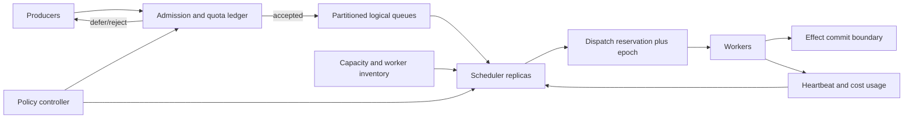

# Priority, Fairness, and Backpressure

## TL;DR

A shared job scheduler separates admission, ordering, placement, and execution control. Strict priority can starve; round robin ignores cost; weighted fair queueing and deficit round robin allocate consumed service; dominant-resource fairness extends allocation across resource types. Apply backpressure at admission, charge retries to the original tenant and class budget, and operate against queue-age SLOs with a gaming-resistant cost model and failover-safe accounting.

---

## Scope: Scheduling Policy for Durable Work

Scheduling policy covers priority, fair share, quotas, admission, placement, and preemption among defined job classes and tenants.

- [Background Jobs and Worker Pools](02-background-jobs-worker-pools.md) covers job lifecycle, dispatch, and worker execution.
- [General Backpressure](../06-scaling/07-backpressure.md) covers end-to-end overload propagation in request and data paths.
- [Rate Limiting](../06-scaling/05-rate-limiting.md) covers generic token/leaky-bucket algorithms at service boundaries.
- [Multi-Tenant Isolation](../06-scaling/12-multi-tenancy.md) and [Cell-Based Architecture](../06-scaling/11-cell-based-architecture.md) cover broader placement and blast-radius boundaries.
- [ML Training Pipelines](../16-ml-systems/05-training-pipelines.md) covers GPU-specific gang scheduling and checkpoint economics.

Here, backpressure is narrower: should a durable-work system accept another job, defer it to a known future window, or reject it because the promised completion time is already impossible?

---

## State the Scheduler Contract

One queue cannot express the policy. A schedulable job needs stable metadata:

```yaml
job_id: 01J...
tenant_id: tenant-42
class: interactive
base_priority: 80
enqueue_sequence: 918337
not_before: 2026-07-18T12:00:00Z
deadline: 2026-07-18T12:00:15Z
attempt: 2
estimated_cost:
  cpu_seconds: 0.4
  memory_gib_seconds: 0.2
  outbound_api_tokens: 1
requirements:
  runtime: payments-v7
  region: eu-west
checkpointable: false
```

The scheduler's durable state includes logical queue membership, quota/debt counters, reservations, dispatch lease/epoch, and terminal outcome. Do not infer tenant or priority from an untrusted payload at dequeue time.

Useful invariants are testable:

1. **Bounded admission:** accepted outstanding work per class/tenant never exceeds its configured work or age envelope.
2. **No double ownership:** at most one current dispatch epoch is authoritative for a job; stale attempts cannot commit effects.
3. **Share guarantee:** over a declared measurement interval and while demand exists, each eligible tenant receives at least its configured service share, subject to resource feasibility.
4. **Urgency reserve:** critical work has reserved capacity or a bounded preemption path; it does not depend on every lower class becoming idle.
5. **No unbounded starvation:** an eligible non-best-effort job eventually gains service when its required resource is available.
6. **Retry conservation:** retries and speculative attempts are charged to the same logical workload budget; failure cannot create free demand.
7. **Policy monotonicity:** lowering a tenant's entitlement cannot increase its admitted or scheduled share under the same demand/capacity state.

“High priority usually runs first” is not a contract. Define the interval, reserve, maximum queue age, and exceptions such as unavailable resource shapes.

---

## Control Plane and Data Path



The **data path** is admission → durable enqueue → eligibility → reservation → worker lease → effect commit → accounting. The **control plane** versions tenant weights, priority reserves, resource pools, queue bounds, and cost estimators.

Policy publication needs an epoch. A scheduler evaluates one decision under one policy version and records that version with the dispatch. During rollout, two scheduler replicas may run different code, but they must interpret the same durable policy schema or refuse leadership. A malformed policy must fail to a safe prior version, not reset every tenant to unlimited share.

### Centralized versus distributed scheduling

A centralized logical scheduler has a complete view of demand and capacity, making global fairness easier. Its throughput and availability are control-plane concerns; shard by queue/tenant while keeping a consistent quota ledger or hierarchical allocation.

Distributed “power of two choices” or probe-based schedulers reduce central bottlenecks but make exact global fairness and placement harder. Local decisions operate on stale worker state and can collide. Use them for short, homogeneous work where approximate placement is acceptable; retain authoritative admission and quota accounting outside the probes.

---

## Admission: Reject Work Before It Becomes Useless

Durability does not make overload safe. If accepted work arrives faster than effective service, durable backlog grows until deadlines expire, storage fills, or recovery becomes impractical.

For class $i$ with arrival rate $\lambda_i$, mean service demand $E[S_i]$, and $c_i$ equivalent service slots, offered utilization is:

$$
\rho_i = \frac{\lambda_i E[S_i]}{c_i}
$$

A steady state requires effective utilization below 1 with headroom for variance, retries, maintenance, and failures. The exact safe target is workload-specific; publishing one universal percentage would hide service-time variance and resource coupling.

Admission evaluates more than queue length:

- oldest and predicted start/completion time by class;
- outstanding estimated work units, not only job count;
- current service rate under the required resource shape;
- tenant quota and burst balance;
- deadline and `not_before` window;
- downstream dependency budgets;
- failure/maintenance reserve;
- duplicate logical command state.

For a FIFO-like class with sustainable drain rate $\mu$ work units/s and queued work $B$, a first estimate of queue delay is $B/\mu$. Reject or defer when predicted completion exceeds the job's deadline or class maximum age. A 10,000-item queue may be harmless when jobs take 1 ms and disastrous when they take 30 seconds.

### Admission outcomes are product semantics

Return one of:

- **accepted:** durable job ID plus declared service class/deadline semantics;
- **deferred:** a reservation/window is durable and does not require the producer to pollute the immediate queue;
- **rejected retryable:** no durable work was accepted; include a bounded retry hint;
- **rejected final:** quota, invalid class, impossible deadline, or policy denial.

If a timeout leaves the producer unsure whether enqueue committed, resolve by stable job/command ID before retrying. Otherwise overload creates duplicate durable jobs.

---

## Priority: Urgency With an Explicit Budget

Strict priority always serves the highest non-empty class. It is appropriate only when lower work may legitimately receive zero capacity during sustained high-priority demand. That is rare outside true best effort.

Prefer one of three bounded designs:

### Reserved capacity plus borrowing

Reserve a fraction or fixed number of slots for urgent work. When urgent demand is absent, lower classes borrow the reserve; borrowers are preemptible or stop receiving new leases when urgent work arrives. This gives urgency a capacity guarantee without permanently idling the reserve.

### Weighted priority bands

Allocate service across bands by weights, then schedule priority within each band's allocation. Critical work receives a high share, but standard work retains a floor. This is easier to reason about than unbounded aging across dozens of numeric priorities.

### Deadlines and slack

Where deadlines are real and execution estimates credible, schedule by earliest deadline or least slack:

$$
slack = deadline - now - estimated\ remaining\ service
$$

A negative slack job cannot meet its promise; running it ahead of feasible work may reduce total useful completions. The product must decide whether to drop, downgrade, or run late.

### Aging

Aging increases effective priority with wait time to bound starvation. It is a fallback for classes without hard deadlines, not a substitute for a guaranteed share. Cap the boost and preserve tenant quotas; otherwise a large old backlog can suddenly become an “urgent” flood.

### Preemption is a protocol

Preemption is safe only if execution supports it:

1. scheduler issues a higher dispatch epoch or cancellation;
2. worker stops accepting new subwork;
3. checkpoint is durably published if supported;
4. external effects are committed or abandoned through an idempotent boundary;
5. resource reservation is released;
6. remaining work re-enters with charged checkpoint/preemption cost.

Killing a process is not safe preemption when it may have completed an unrecorded payment or holds a non-fenced lease.

---

## Fairness: Charge Service, Not Items

Round robin gives each queue one job per turn. If tenant A submits 10 ms jobs and tenant B submits 10 minute jobs, equal turns are not equal service. Fair scheduling needs a cost unit.

### Weighted fair queueing

In ideal generalized processor sharing, backlogged tenant $i$ receives fraction $w_i / \sum_j w_j$ of the service. Packet-style weighted fair queueing approximates this by assigning virtual finish times. For job $k$ of tenant $i$ with estimated cost $L_i^k$:

$$
F_i^k = \max(F_i^{k-1}, V(a_i^k)) + \frac{L_i^k}{w_i}
$$

where $V(a)$ is system virtual time at arrival. Schedule the smallest eligible finish value. This makes high weight advance faster and large jobs pay more virtual time.

Non-preemptive long jobs still block a worker once started, so the approximation is coarse when job sizes vary widely. Partition resource classes, limit maximum slice duration, or make long work checkpointable.

### Deficit round robin

Deficit round robin (DRR) is often simpler:

1. each active tenant receives quantum proportional to its weight;
2. a job may dispatch when estimated cost fits the tenant's deficit;
3. dispatch subtracts cost; unused deficit carries forward;
4. tenant rotates to the back of the active list.

Carrying deficit lets a tenant eventually run a job larger than one quantum without letting large jobs become free. Correct estimates remain critical.

### Multi-resource fairness

Jobs consume vectors: CPU, memory, GPU, disk bandwidth, licenses, or downstream concurrency. Equal CPU seconds can still let one tenant monopolize GPUs. Dominant-resource fairness compares each tenant's largest normalized share and schedules the tenant with the smallest weighted dominant share, subject to feasible placement.

No scalar cost perfectly captures every bottleneck. Use hierarchical policy:

```text
global tenant entitlement
  -> resource-pool entitlement (GPU, CPU-large-memory, external-API)
      -> class priority
          -> job ordering
```

This prevents a tenant from evading a global quota by spreading demand across pools.

---

## Cost Estimation and Gaming Resistance

Schedulers must estimate cost before execution and learn actual cost afterward. Inputs can include job type, input size, historical quantiles, declared resources, and downstream operations. Charge actual usage when measurable; reconcile reservation versus actual at completion.

Protect the estimator:

- never trust a tenant's declared cost without bounds;
- use conservative cold-start defaults for new job types;
- cap one dispatch slice and quarantine repeated underestimation;
- include failed, canceled, retry, speculative, and checkpoint work in usage;
- version estimators and record prediction error by job class;
- avoid using protected/sensitive payload values as metric labels.

If a job estimates one token and consumes 1,000, it has borrowed from every other tenant. Debt can reduce later share, but debt alone cannot recover an SLO already broken; isolate or terminate severe overruns.

---

## Placement, Head-of-Line Blocking, and Fragmentation

A globally fair order can be physically impossible. The next tenant may require a GPU, region, runtime, or 64 GiB contiguous memory unavailable now. If the scheduler waits only for that job, compatible work behind it stalls.

Use **eligibility queues** or indexed logical queues by resource shape, then choose fairly among tenants with feasible work. Preserve the tenant's global entitlement across shapes. Backfilling can run a smaller job in a temporary gap only if it will finish/checkpoint before a reservation needed by higher policy.

Gang-scheduled jobs need multiple units simultaneously. Partial allocation wastes capacity and can deadlock when several gangs each hold some units. Reserve atomically or queue until the full set is available.

Placement fragmentation is observable: free resources exist but no pending job fits. Track free capacity by shape, pending demand by shape, reservation age, and packing efficiency. Autoscaling on total queue depth misses this mismatch.

---

## Retry and Speculation Budgets

A retry is not a new entitlement. It inherits tenant, class, logical job identity, deadline, and cost ledger. Usually it should not jump ahead of fresh work unless the remaining deadline makes that policy explicit.

Set budgets at multiple levels:

- attempts per logical job;
- retry work units per tenant/class/window;
- concurrent attempts per downstream dependency;
- speculation copies per logical job;
- fleet-wide failure reserve.

When a dependency slows, reduce admission and retry concurrency for jobs that use it. A generic worker-capacity signal may look healthy while the dependency's safe concurrency is exhausted.

Speculative execution can cut stragglers but doubles work until a winner commits. Charge both copies, use one effect-commit key, and cancel losers through the dispatch epoch. Never speculate non-idempotent external effects.

---

## Scheduler High Availability and Dispatch Safety

Scheduler replicas may fail between reserving and dispatching, or dispatching and recording the worker acknowledgment. Durable state transitions should be explicit:

```text
QUEUED -> RESERVED(epoch 41, expires T) -> RUNNING(epoch 41)
       -> SUCCEEDED | FAILED | CANCELED
```

On scheduler failover, a new controller may reclaim an expired reservation with epoch 42. A late worker from epoch 41 can still run, so the effect sink or job state transition must reject its stale epoch. Heartbeats improve recovery speed but do not fence old attempts; [Leases, Heartbeats, and Recovery](08-leases-heartbeats-recovery.md) owns that protocol.

Quota accounting must also survive controller failover. Reconstructing usage only from live workers loses reservations and briefly over-allocates. Persist reservations in the authoritative scheduler store or rebuild them from an append-only decision log before issuing new work.

---

## Failure Modes

### Priority flood starves standard work

A producer marks every job urgent. Strict priority keeps standard queues non-empty for hours. Authenticate class assignment, reserve a bounded urgent share, enforce tenant urgent quotas, and alert on sustained reserve occupancy.

### One giant job buys a cheap queue position

Round robin counts jobs, so a ten-hour job receives the same charge as a ten-millisecond job. It pins a worker and destroys fairness. Schedule/charge estimated service or resource-time, isolate long jobs, and reconcile actual usage.

### Retry storm receives fresh quota

Attempts are enqueued as new jobs, each receiving normal burst tokens. A downstream outage multiplies admitted work. Preserve logical identity and charge retry/speculation to the original tenant and retry budget.

### Stale scheduler double-dispatches

Two scheduler leaders issue attempts after a partition. Both workers complete an external effect. Use a majority/epoch authority for scheduling ownership and an effect boundary keyed by logical job plus dispatch fencing where possible.

### Cost estimator can be gamed

Tenants underdeclare memory/API cost and dominate constrained resources. Reconcile predicted versus actual, apply conservative bounds/debt, and isolate repeated offenders. Entitlement inputs are authorization policy.

### Preemption cannot make progress

Urgent work arrives, but all workers run non-checkpointable long jobs. A “preemptible” label in the scheduler cannot recover resources safely. Keep a real urgent reserve or require bounded slices/checkpoints for borrowed capacity.

### Fair globally, unfair at one bottleneck

CPU share looks correct while one tenant consumes every database connection. Model constrained downstream slots as a resource pool with its own entitlement/admission, not an invisible worker detail.

---

## Observability and Policy Evidence

Measure service received, not just queue contents:

- admitted, rejected, deferred, and expired work units by tenant/class/reason;
- oldest age, predicted start/completion, and deadline-miss rate;
- offered load, completed useful work, retries, speculation, and canceled work;
- worker-seconds/resource-seconds consumed versus configured weighted share;
- dominant share by constrained resource and unused capacity by shape;
- priority reserve occupancy, borrowing, preemptions, checkpoint time, and lost work;
- cost estimate error distribution and underestimation offenders;
- scheduler decision/dispatch latency, reservation age, epoch conflicts, and stale completions;
- downstream admission/concurrency pressure per dependency;
- policy version and rollout cohort.

Queue depth must be partitioned by cost/resource class to be meaningful. High-cardinality tenant metrics can be kept in an aggregate ledger with top-offender sampling rather than unbounded telemetry labels.

For an incident, retain the decision record: eligible candidates, policy version, quota balances, capacity snapshot, chosen job, estimate, and dispatch epoch. Without it, operators can see unfairness but cannot prove why the scheduler made the choice.

---

## Rollout, Migration, and Verification

### Introduce policy without changing execution first

1. classify tenants/classes and collect cost/age telemetry under FIFO;
2. run the new scheduler in shadow mode, recording decisions without dispatch;
3. compare predicted shares, starvation bounds, and deadline outcomes;
4. canary a small tenant/pool with conservative quotas and a fallback policy version;
5. enable actual-cost reconciliation before expanding;
6. test scheduler failover and stale dispatches;
7. roll out by resource pool, retaining a kill switch to the last safe policy.

Changing weights moves contractual capacity. Version it, audit it, and communicate it like an API/SLO change.

### Deterministic policy tests

Use a simulated clock and worker fleet. Assert:

- weighted service converges within a declared error bound under continuous demand;
- a small tenant progresses during a large-tenant flood;
- strict urgent demand cannot exceed its reserve/quota unless explicitly borrowing;
- varied job sizes do not make item-count fairness pass falsely;
- infeasible head jobs do not block compatible jobs forever;
- attempts, retries, and speculation conserve quota;
- policy/controller restart preserves reservations and debt;
- stale dispatch epochs cannot commit completion/effects;
- estimator underreporting triggers bounds without starving innocent tenants;
- lost workers, dependency slowdown, and capacity removal cause admission to contract.

Property-based tests can generate arrival/service traces and check invariants over every prefix. Replay production decision logs through both old and candidate scheduler versions before rollout.

---

## Decision Framework

| Workload | Scheduling starting point |
|---|---|
| One trusted producer, homogeneous short jobs | Bounded FIFO with deadline/age rejection |
| Urgent plus batch in one domain | Reserved priority bands with borrowing and bounded slices |
| Many tenants, one dominant resource | Weighted fair queueing or DRR with quota ledger |
| Heterogeneous CPU/memory/GPU constraints | Hierarchical pools plus dominant-resource accounting |
| Hard deadlines with credible service estimates | Deadline/slack policy with infeasible-job rejection |
| Long checkpointable work | Fair allocation plus safe preemption/backfill |
| Non-checkpointable external effects | Admission reserve; avoid kill-based preemption |

Before production, answer:

1. What unit is charged—job, CPU-second, dominant share, downstream slot?
2. Which class may legitimately starve, and for how long?
3. What capacity is reserved and what can borrow it?
4. At what predicted age/deadline does admission stop?
5. Are retries/speculation conserved under the same budget?
6. Can stale scheduler/worker epochs commit an effect?
7. How are inaccurate or malicious cost declarations contained?
8. What evidence proves the scheduler honored the policy?

---

## Key Takeaways

1. Admission, ordering, placement, and execution control are separate scheduler decisions.
2. Priority needs a capacity budget; otherwise urgency becomes starvation policy.
3. Fairness must charge service/resource cost, not item count.
4. Multi-resource workloads need hierarchical or dominant-share accounting.
5. Backpressure rejects work when useful completion is impossible; durable queueing cannot repeal capacity.
6. Retries, speculation, and failed attempts consume entitlement and must not amplify quota.
7. Scheduler failover needs durable reservations and epochs; heartbeats alone do not fence stale workers.
8. Queue age, useful completed work, and received share are stronger signals than raw depth.

---

## References

- A. Demers, S. Keshav, and S. Shenker, [*Analysis and Simulation of a Fair Queueing Algorithm*](https://dl.acm.org/doi/10.1145/75247.75248), SIGCOMM, 1989.
- M. Shreedhar and George Varghese, [*Efficient Fair Queueing Using Deficit Round Robin*](https://dl.acm.org/doi/10.1145/217391.217453), SIGCOMM, 1995.
- Ali Ghodsi et al., [*Dominant Resource Fairness: Fair Allocation of Multiple Resource Types*](https://www.usenix.org/conference/nsdi11/dominant-resource-fairness-fair-allocation-multiple-resource-types), NSDI, 2011.
- Abhishek Verma et al., [*Large-scale Cluster Management at Google with Borg*](https://research.google/pubs/large-scale-cluster-management-at-google-with-borg/), EuroSys, 2015.
- Kay Ousterhout et al., [*Sparrow: Distributed, Low Latency Scheduling*](https://people.eecs.berkeley.edu/~matei/papers/2013/sosp_sparrow.pdf), SOSP, 2013.
- John D. C. Little, [*A Proof for the Queuing Formula: L = λW*](https://doi.org/10.1287/opre.9.3.383), Operations Research, 1961.
- Jeff Dean and Luiz André Barroso, [*The Tail at Scale*](https://research.google/pubs/the-tail-at-scale/), Communications of the ACM, 2013.
