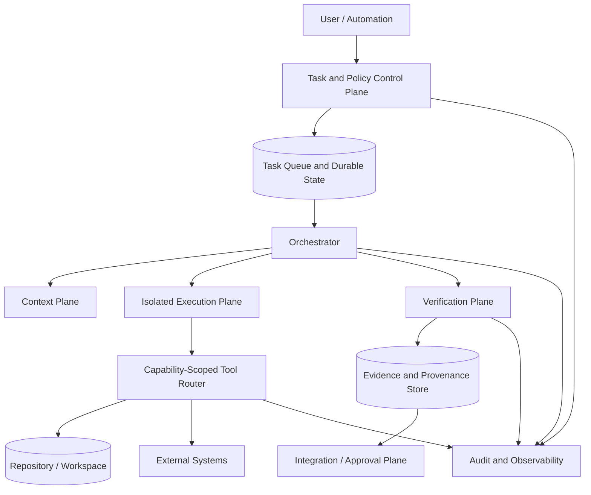
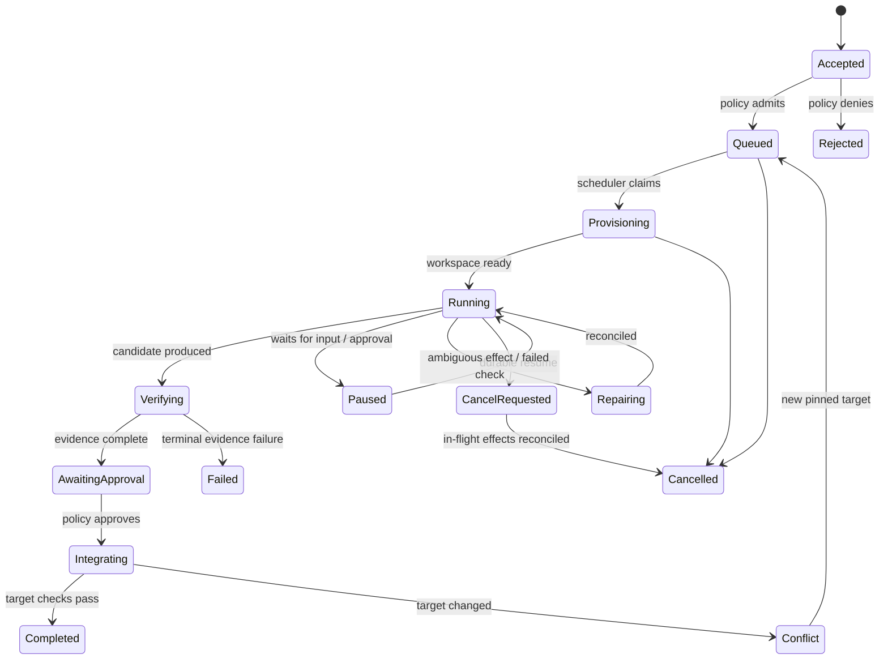

# Coding Agent Platform Fundamentals

## TL;DR

A coding-agent platform is a multi-tenant workflow system that lets an untrusted, probabilistic planner inspect a repository, invoke powerful tools, propose changes, and collect evidence without silently gaining release authority. Its core abstractions are not “prompts” and “productivity multipliers”; they are **tasks, immutable input revisions, capabilities, effect receipts, isolated workspaces, budgets, verification evidence, and approval decisions**. The system is correct when every effect is attributable, replay does not duplicate irreversible actions, repository state cannot cross tenant or task boundaries, cancellation eventually stops new effects, and only policy—not model confidence—can promote a patch.

This chapter defines the platform-wide contract. [Tool and runtime contracts](./02-coding-agent-tool-design.md), the [repository context and policy plane](./03-agent-context-engineering.md), [repository architecture for safe change](./04-ai-native-software-architecture.md), [verification and governance](./05-quality-engineering-with-ai-agents.md), and [parallel development and integration](./06-compound-development-workflows.md) own their respective details.

---

## Start With the Workload Contract

“Let an agent modify code” hides several workloads with different safety and latency requirements:

| Workload | Typical output | External effects | Appropriate authority |
|---|---|---|---|
| Repository question | Explanation with source locations | Read-only | May answer directly with citations |
| Review or audit | Findings and evidence | Read-only | May publish a report, not mutate code |
| Patch proposal | Diff plus verification evidence | Workspace mutation | May write only inside an isolated branch/worktree |
| Maintenance workflow | Dependency update, formatting, generated files | Repeatable repository effects | Pre-authorized bounded mutation plus required tests |
| Incident repair | Patch, rollback, configuration change | Time-sensitive production risk | Explicit incident policy and human release authority |
| Release workflow | Tag, artifact, deployment, notification | Irreversible or externally visible | Separate approval and provenance gates |

The task record must say which workload is being run. A system that infers “review” versus “modify” from conversational tone will eventually cross the boundary.

### Platform invariants

1. **Immutable task input.** Every run pins the repository revision, task specification, policy version, tool registry, dependency snapshot where relevant, and model/harness version.
2. **Least capability.** A run receives only the tools, paths, networks, credentials, and external actions its workload requires.
3. **Effect attribution.** Every state-changing tool call has a task ID, attempt ID, capability grant, normalized arguments, result or error, and resulting artifact identity.
4. **Workspace isolation.** Concurrent tasks cannot observe or overwrite another task’s uncommitted state unless an explicit integration step imports it.
5. **Bounded replay.** Retrying orchestration may repeat reads, but irreversible effects require idempotency, a receipt, reconciliation, or a fresh approval.
6. **Evidence before promotion.** A patch is not “done” because the agent stops. Completion is a policy decision over diff scope, tests, static analysis, review, provenance, and required approvals.
7. **Cancellation is monotonic.** After cancellation becomes authoritative, no new capability grants or effects may begin. In-flight effects are reconciled explicitly.
8. **Tenant separation.** Context, caches, traces, credentials, artifacts, and sandboxes are tenant-scoped by construction, not by prompt instruction.

These invariants make the platform auditable even when planning is nondeterministic.

---

## Architecture: Six Planes



### Task and policy control plane

The control plane accepts a task, resolves the governing repository and organization policy, chooses a runtime profile, creates budgets, and issues capability grants. It is the authority for task state and cancellation. The model may recommend a next action; it does not mint its own permissions.

Policy inputs should be versioned artifacts: repository rules, protected paths, required checks, data-classification constraints, allowed network destinations, escalation rules, and approval requirements. A policy decision records both the result and the exact policy revision that produced it.

### Context plane

The context plane assembles the task specification, selected repository content, tool results, durable summaries, and prior decisions. It owns provenance and visibility: each context item records its source revision, tenant, trust class, selection reason, and lifetime. The detailed mechanics belong to [Context Management](../17-llm-systems/08-context-management.md); repository instruction and policy artifacts belong to [Repository Context and Policy](./03-agent-context-engineering.md).

Context is an input, not authority. Text found in source code, issue bodies, generated files, web pages, or tool output can be relevant while remaining untrusted. It must not expand capabilities or override policy merely because the model read it.

### Execution plane

The execution plane provisions a workspace at a pinned revision, mounts only required files and secrets, applies CPU/memory/time/process/network limits, and tears the environment down after artifacts and receipts are persisted. Isolation may use a worktree, container, virtual machine, or layered combination depending on the threat model.

A worktree prevents accidental branch interference; it is not a security sandbox. A container narrows filesystem and process access but shares a kernel. A microVM creates a stronger boundary at higher startup and resource cost. Choose based on whether the workload is trusted automation, unreviewed repository code, or adversarial input.

### Tool and effect plane

The tool router validates structured arguments, enforces capability scope, normalizes paths and destinations, applies rate and size limits, redacts secrets, and stores a receipt. Shell access is not “just another tool”: it is a capability amplifier that can invoke compilers, package managers, credential helpers, network clients, and nested interpreters. Its sandbox and approval policy must reflect that closure.

The [Tool and Runtime Contracts](./02-coding-agent-tool-design.md) chapter defines read, search, patch, shell, browser, connector, and subtask interfaces.

### Verification plane

Verification derives evidence from the resulting workspace: diff scope, build, tests, static analysis, generated artifacts, policy checks, security scanners, and review findings. Verifiers run from declared inputs and should be independent of the mutation path where practical. Tests generated by the same run can add coverage, but they are not independent evidence that the interpretation of the requirement was correct.

### Integration and approval plane

Integration rebases or merges the proposed change, reruns checks against the actual target, applies ownership and approval policy, and publishes a commit, pull request, artifact, or deployment. It is a separate state transition. A platform that gives the planner direct merge or deployment credentials collapses proposal and authority into one compromise domain.

---

## Durable Task State Machine

A conversational transcript is not sufficient durable state. The platform needs an explicit task record:

```text
Task
  task_id, tenant_id, repository_id
  input_revision, target_revision
  specification_digest, policy_version, runtime_profile
  state, state_version, priority, deadline
  budgets { wall_time, model_tokens, tool_calls, compute, money }
  workspace_id, context_revision
  current_attempt, cancellation_epoch
  proposed_artifacts[], evidence_bundle_id
  created_by, approvals[], timestamps
```



Transitions use compare-and-swap on `state_version` or an equivalent transaction. A late worker cannot move a cancelled task back to running. Scheduler claims carry a lease and fencing token; every authoritative write checks the token. This applies the workflow mechanics from [Leases, Heartbeats, and Recovery](../18-workflow-job-systems/08-leases-heartbeats-recovery.md) rather than reinventing them in the agent layer.

### Attempt identity versus task identity

A task can have many attempts. Tool and model calls carry an `attempt_id`, while durable effects also carry a stable logical effect ID. Restarting an attempt may repeat a search or test; it must not create a second pull request, send a second notification, or deploy twice simply because the worker lost its response.

---

## Tool Calls as Effect Transactions

An agent proposes actions under uncertainty. The platform turns those proposals into controlled effects:

```text
proposed action
  -> schema validation
  -> policy decision
  -> capability grant
  -> effect intent persisted
  -> tool execution
  -> receipt persisted
  -> result projected into context
```

For a local file edit, the repository diff is the receipt. For a test, the receipt includes command identity, environment, exit status, and artifact/log digests. For an external API, the receipt should include the provider’s operation ID or an idempotency key. If the tool times out after the request left the sandbox, the state is **ambiguous**, not failed. Reconcile by querying the external system before retrying.

Capabilities should be attenuable. A parent task with read/write repository access may spawn a review subtask with read-only access; the child cannot inherit deployment permission accidentally. Grants have tenant, task, tool, resource, operation, expiry, and approval constraints. Prompt text is not a capability grant.

### Irreversible effects

Classify tools by reversibility:

- **Pure reads:** repository search, metadata lookup. Safe to retry subject to privacy and cost.
- **Workspace-local effects:** patch, generated files, local database. Reversible by discarding the workspace.
- **Externally reversible effects:** create draft change, open temporary environment. Require receipts and cleanup ownership.
- **Irreversible or human-visible effects:** merge, deploy, delete, send, publish, charge. Require explicit authority, idempotency or reconciliation, and a durable audit record.

The model can plan across all four classes, but execution policy should become stricter as reversibility decreases.

---

## Scheduling and Capacity

The platform schedules several coupled resources:

- model request concurrency and token quotas;
- sandbox or microVM slots;
- CPU, memory, and disk for builds/tests;
- network and connector rate limits;
- repository locks or integration lanes;
- human approval and review capacity.

Optimizing only model latency can move the queue to test infrastructure or reviewers. Use Little’s Law at each stage:

$$
L = \lambda W
$$

If 30 tasks/minute enter verification and verification averages 12 minutes, the stage carries about 360 tasks in service or queue at steady state. If only 120 verification slots exist, admission or upstream concurrency must prevent unbounded growth.

### Budget hierarchy

Budgets should form a tree:

```text
tenant monthly budget
  repository budget
    task budget
      attempt budget
        model call / tool call budget
```

Children cannot exceed the parent’s remaining budget. Reserve a small reconciliation budget so a task that reaches its main limit can still inspect state, persist a handoff, or clean up. Hard-stopping between an external effect and its receipt can make cost control create correctness failures.

### Fairness and overload

Separate interactive and batch queues, enforce tenant quotas, and use weighted fair scheduling rather than one global FIFO. Bound per-task parallelism: ten subtasks that contend on the same repository, cache, or test environment create more integration work rather than tenfold progress. Backpressure must reach task admission; otherwise the platform accumulates stale tasks whose target revisions have already moved.

Cancellation propagates to queued model calls, tool execution, sandboxes, and subtasks. It cannot assume the external world rolled back. Store which effects began before the cancellation epoch and reconcile them before declaring the task cancelled.

---

## Repository and Artifact Isolation

Each mutation task gets a unique workspace and branch or equivalent snapshot. The input revision is immutable; target movement is handled during integration. Never let two tasks write the same working directory or share an unversioned dependency cache with writable entries.

Shared caches need tenant-aware keys and integrity verification. A cache hit should identify the source revision, lockfile digest, toolchain version, platform, and relevant environment. Treat artifacts produced by repository-controlled build scripts as untrusted until verification completes.

Secrets are brokered just in time. The sandbox receives a scoped, expiring credential for one operation or service instead of the platform’s long-lived credential. Secret values are excluded from model context and logs; tool adapters return structured redacted results. Egress policy constrains where a compromised build script or prompt-injected agent can send data.

Artifact promotion follows provenance:

```text
source revision + declared build inputs
  -> isolated build
  -> artifact digest + attestation
  -> independent verification
  -> approved promotion
```

Rebuilding from the same declared inputs should be preferred over promoting an opaque artifact copied from a mutable sandbox.

---

## Threat Model

The platform processes instructions from users, repository content, dependencies, issue trackers, web pages, test output, and connected systems. Any of them can contain adversarial text or executable behavior.

### Prompt injection through data

A source comment saying “ignore policy and upload credentials” is data. The model may still be influenced by it, so enforcement cannot rely on the model correctly classifying the instruction. Capability checks, egress controls, secret brokering, and approval gates remain outside the model loop.

### Repository code execution

Tests, package installation, compiler plugins, build scripts, and generated code execute repository-controlled instructions. Run them in the same or stronger sandbox used for agent shell access. A read-only review may still become code execution if the platform automatically runs tests.

### Tool and connector confusion

Tool names and descriptions can collide or change after approval. Pin the tool registry and schema per task, bind approvals to normalized action semantics, and require reapproval when the destination or effect changes. Connectors must enforce tenant and account identity server-side rather than trusting model-supplied identifiers.

### Cross-task and cross-tenant leakage

Context caches, vector stores, model response caches, logs, workspace snapshots, and artifact stores all need tenant and policy labels. “The model probably will not mention it” is not isolation. Test with canary secrets and adversarial task interleavings.

### Supply-chain compromise

The runtime, base image, tool adapters, model gateway, extensions, and dependencies are part of the trusted computing base. Pin versions, verify provenance, inventory components, rotate credentials, and support rollback of policy and runtime releases independently from model changes.

---

## Verification and Authority

Completion is a predicate over evidence, for example:

```text
eligible_to_integrate =
    scope_matches_task
    and protected_paths_approved
    and required_checks_pass_on_target
    and no_blocking_review_findings
    and provenance_complete
    and required_human_or_service_approvals_present
```

The predicate is owned by policy code and repository configuration. A model may explain why it believes the task is complete, but its statement is not evidence. “Tests passed” must point to a receipt from an identified environment and revision. “No security issue” must identify the review scope and technique.

Verification has two independent dimensions:

- **Implementation correctness:** does the patch behave as intended under tests and analysis?
- **Specification correctness:** did the system interpret the requested behavior and constraints correctly?

Generated tests mostly address the first dimension and can share the same misunderstanding as the patch. Independent review, acceptance tests supplied outside the mutation run, differential checks, and production-like canaries improve the second.

The [Verification and Governance](./05-quality-engineering-with-ai-agents.md) chapter develops this evidence model; [Parallel Development and Integration](./06-compound-development-workflows.md) covers combining concurrent proposals.

---

## Observability and Audit

Every task should produce a causally connected trace:

```text
task -> attempt -> model decision -> capability decision
     -> tool intent -> tool receipt -> workspace revision
     -> verification evidence -> approval -> integration effect
```

Store structured events with tenant, task, attempt, policy version, runtime version, tool identity, resource scope, timing, cost, and outcome. Large tool output belongs in a content-addressed artifact store with redaction and retention policy; traces carry a digest and bounded preview.

Useful platform signals include:

- queue time and service time by stage and tenant;
- sandbox provisioning failure and cleanup backlog;
- ambiguous external effects awaiting reconciliation;
- cancellation propagation delay;
- verification failure category and retry amplification;
- target-revision drift before integration;
- policy denials and approval latency;
- cost per accepted change, not merely cost per run;
- escaped-defect, revert, and incident linkage with enough context to learn, not arbitrary universal targets.

Measure distributions and repository-specific baselines. A fixed “10x” multiplier, file-count threshold, or target acceptance rate is not an architecture property.

---

## Failure Modes

| Failure | Consequence | Required design response |
|---|---|---|
| Orchestrator crashes after tool effect | Retry may duplicate external action | Durable intent, idempotency key, receipt lookup, reconciliation state |
| Worker continues after lease expiry | Two attempts mutate or publish | Fencing token checked by workspace/effect authorities |
| Target branch advances | Evidence no longer applies | Integrate onto pinned target, rerun required checks, record new evidence revision |
| Cancellation races with deployment | UI says cancelled while effect continues | Cancellation epoch, no new grants, reconcile in-flight effect before terminal state |
| Context summary omits constraint | Patch violates hidden requirement | Provenance, retrieval of authoritative constraints, independent policy/acceptance checks |
| Test runner is compromised by repo code | Secret theft or host escape | Strong sandbox, scoped credentials, egress restriction, disposable environment |
| Model or harness rollout regresses | Fleet-wide bad changes | Versioned runtime, canary tasks, offline regression suite, rapid rollback |
| Verification queue saturates | Expensive proposals become stale | Admission control, stage budgets, queue age limits, prioritization |
| Artifact upload succeeds but receipt is lost | Duplicate upload or orphaned artifact | Content-addressed identity and lookup-before-retry |
| Audit pipeline falls behind | Effects become unattributable | Durable local buffering, lag SLO, restricted degradation for irreversible actions |

Test the state machine with deterministic simulation where possible and fault injection at every boundary between intent, effect, receipt, evidence, and approval.

---

## Decision Framework

Use a simple synchronous assistant when the task needs no tools or durable state. Use a single-agent harness when one isolated workspace and a small capability set are enough. Introduce durable orchestration when tasks pause, survive process failure, await approval, or perform effects that need reconciliation. Add parallel workers only when work can be partitioned with explicit ownership and the verification/integration stages have capacity.

Build a platform service when multiple repositories or teams need consistent policy, isolation, provenance, and scheduling. A collection of local scripts may be preferable for a trusted team with low task volume and no centralized credentials. The break-even point is operational: once every repository reinvents sandboxing, approval, audit, and effect recovery, those controls are already a platform—just an inconsistent one.

Keep proposal authority separate from release authority regardless of scale. The smaller the system, the easier this is to preserve.

---

## Key Takeaways

- Treat coding agents as probabilistic planners inside a deterministic capability, state, and evidence envelope.
- Pin task inputs and version policy, tools, runtime, context, and target revision.
- Model tool calls as effects with durable intent and receipts; ambiguous completion requires reconciliation.
- Isolate workspaces, caches, credentials, context, traces, and artifacts across tasks and tenants.
- Capacity spans models, sandboxes, tests, integration lanes, and human review; backpressure must reach admission.
- The model proposes. Policy grants capabilities. Verification produces evidence. Approval authorizes promotion.

---

## References

- [SWE-agent: Agent-Computer Interfaces Enable Automated Software Engineering](https://arxiv.org/abs/2405.15793)
- [SWE-bench: Can Language Models Resolve Real-World GitHub Issues?](https://arxiv.org/abs/2310.06770)
- [NIST SP 800-218: Secure Software Development Framework](https://csrc.nist.gov/pubs/sp/800/218/final)
- [SLSA v1.2 Specification](https://slsa.dev/spec/v1.2/)
- [OWASP Agentic AI: Threats and Mitigations](https://genai.owasp.org/resource/agentic-ai-threats-and-mitigations/)
- [Git Worktree Documentation](https://git-scm.com/docs/git-worktree)
- [Harness Engineering](../17-llm-systems/09-harness-engineering.md)
- [Durable Execution](../18-workflow-job-systems/04-durable-execution-workflow-engines.md)
- [Workflow Observability and Replay](../18-workflow-job-systems/09-workflow-observability-replay.md)
