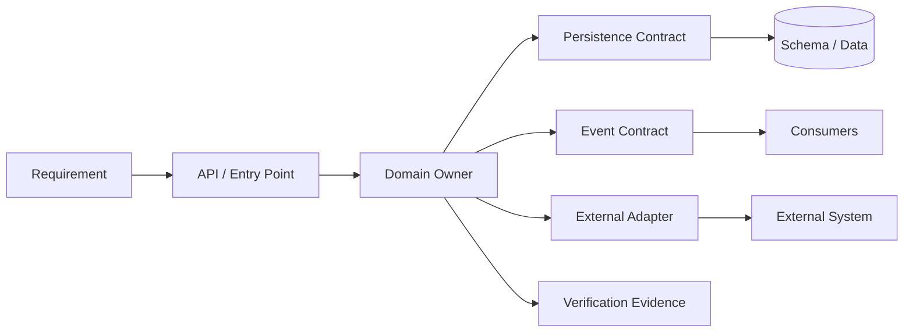

# Repository Architecture for Safe Agentic Change

## TL;DR

A repository is safe to change when a bounded requirement maps to a bounded, discoverable change surface; contracts make invalid combinations difficult to represent; tests and analysis observe the important behavior; and a failed change can be isolated, reverted, or migrated without guessing. Those properties help humans, automation, and coding agents for the same reason: they reduce hidden coupling. There is no universal “agent-ready” file size, token count, coverage percentage, or five-file rule. Measure the repository’s dependency graph, change history, verification selectivity, rollback behavior, and escaped defects, then improve the boundaries that create costly cross-cutting changes.

This chapter owns repository structure and evolvability. The platform runtime is defined in [Coding Agent Platform Fundamentals](./01-compound-engineering-fundamentals.md), repository instructions and policy in [Repository Context and Policy](./03-agent-context-engineering.md), and independent evidence in [Verification and Governance](./05-quality-engineering-with-ai-agents.md).

---

## The Architectural Contract

An implementation task begins with a requirement $R$ and produces a candidate change $C$. Let:

- $D(C)$ be the dependency closure that must be understood or rebuilt;
- $I(C)$ be the invariants and interfaces the change can affect;
- $V(C)$ be the verification evidence needed to distinguish a correct change from a plausible one;
- $M(C)$ be the migration and rollback surface if old and new behavior coexist.

Repository architecture is effective when common changes keep these sets explicit and proportionate to the requirement. Small line count is neither necessary nor sufficient. A ten-line change to a global serialization format may have a larger semantic radius than a thousand-line isolated adapter.

### Invariants

1. **One authoritative owner per state transition.** A domain invariant is enforced in a named module or service, not duplicated across controllers, jobs, clients, and tests.
2. **Dependencies point through stable contracts.** Callers depend on an interface or schema that states errors, timeouts, idempotency, and version behavior.
3. **Generated and derived artifacts declare their source.** Humans and agents edit the source of truth, then reproduce derivatives deterministically.
4. **Environment behavior is explicit.** Build flags, runtime configuration, feature gates, and deployment capabilities are versioned inputs rather than hidden machine state.
5. **Change can coexist during rollout.** Persisted data, events, APIs, and clients evolve through compatible phases with an explicit point of no return.
6. **Verification observes the invariant.** Tests are placed at the boundary where a regression becomes distinguishable, not merely where code is easy to exercise.
7. **Repository policy is enforceable.** Import rules, ownership, generated-file constraints, protected paths, and required checks have machine-readable enforcement in addition to prose.

These are software-architecture properties. An agent exposes their absence faster because it has less tacit organizational knowledge to compensate for them.

---

## Model the Repository as a Graph

Directory trees are useful navigation, but change impact follows several overlapping graphs:



- the **compile/import graph** determines build and static-analysis impact;
- the **runtime call graph** determines latency, failure, and authority propagation;
- the **data lineage graph** determines schema and deletion impact;
- the **ownership graph** determines who can approve a change;
- the **test coverage graph** maps behavior to evidence;
- the **deployment graph** determines which old and new versions overlap.

A repository map should expose these relationships without dumping the entire tree into context. Useful generated indexes include module ownership, public entry points, dependency edges, schema producers/consumers, build targets, and test-to-target mappings. They are navigation aids, not substitutes for reading the authoritative code.

### Change locality

Change locality means related behavior and its verification are reachable through a clear boundary. It does not mean putting everything in one file. A module may span several files while retaining one state owner, one public interface, and one focused test surface.

Evaluate locality from history:

- Which files and modules usually change together?
- Which “small” changes trigger repository-wide builds or reviews?
- Where do bugs arise because one of several parallel implementations was missed?
- Which APIs produce repeated compatibility migrations?
- Which modules have high fan-in, fan-out, or cross-team ownership?

Co-change analysis can reveal a boundary that the nominal directory structure hides. Treat it as evidence for investigation, not an automatic command to merge files: files may change together because a migration is underway or generated output follows a source.

---

## State Ownership Before Code Organization

The most important boundary is who can authoritatively change state.

Consider an order status replicated in an API database, event stream, search document, analytics table, and cache. Only one representation should own transitions such as `PAID -> FULFILLED`; the others are projections. If several modules can “fix” the status independently, no directory layout or context document can make changes safe.

Define for each durable state:

```text
authority          component allowed to accept transitions
invariants         conditions checked atomically
command contract   inputs, idempotency, authorization, expected version
event contract     facts emitted after commit
projections        derived stores and their freshness/error behavior
reconciliation     how divergence is detected and repaired
schema lifecycle   compatibility and deletion rules
```

Make the command path and projection path visibly different in code. A search index adapter should not expose a method that looks equivalent to the authoritative repository’s `updateOrderStatus`.

### Transaction boundaries

Aggregate together state that must satisfy an invariant atomically. Keep unbounded or independently owned data outside and model the coordination explicitly. The correct boundary is driven by contention, access patterns, and failure semantics—not a fixed class or file size.

When a transaction crosses systems, encode the workflow, idempotency, and compensation in a durable orchestrator rather than hiding it behind a method that appears synchronous. Cross-link to [Distributed Transactions](../02-distributed-databases/07-distributed-transactions.md), [Outbox](../05-messaging/07-outbox-pattern.md), and [Durable Execution](../18-workflow-job-systems/04-durable-execution-workflow-engines.md) instead of reimplementing those mechanisms locally.

---

## Contracts as Change Boundaries

An interface is useful when it constrains behavior, not merely when it renames a function call.

### Public contract content

For an in-process interface, service API, event, or file format, specify:

- semantic identity and owner;
- input/output schema and validation;
- errors and retry classification;
- timeout, cancellation, and backpressure behavior;
- idempotency and concurrency expectations;
- authorization and tenant scope;
- versioning and compatibility window;
- observability fields and privacy classification;
- deprecation and removal process.

Types can encode part of this contract. Distinguish identifiers that share a primitive representation, model state transitions rather than arbitrary strings, and use explicit result variants for expected failures. Types do not replace runtime validation at trust boundaries.

### Schema-first, not schema-only

A schema catches structural incompatibility but cannot express every invariant. `amount >= 0` does not prove currency conversion, authorization, or exactly-once charging. Pair schemas with semantic tests, compatibility fixtures, and owner documentation.

Store schemas next to the authoritative producer and generate clients or validators deterministically. Generated code carries a header with source path, source digest, generator version, and regeneration command. CI rejects manual edits to derivatives.

### Error contracts

Generic exceptions force every caller to infer retry and user behavior. Define whether an error is invalid input, conflict, unavailable dependency, deadline, permission denial, rate limit, or ambiguous completion. A caller cannot implement safe retry without that distinction.

The same principle applies to command-line tools used by agents: stable exit categories and structured diagnostics are more reliable than parsing human-oriented output.

---

## Dependency Direction and Seams

Stable policy and domain logic should not depend directly on volatile frameworks, generated SDKs, clocks, random sources, or external services. Introduce a seam where substitutability or failure control matters:

```text
domain policy
  -> application operation / use case
    -> port (persistence, clock, queue, payment, identity)
      -> production adapter
      -> deterministic test adapter
```

Do not create an interface for every class. A seam has value when it isolates volatility, authority, nondeterminism, or an expensive dependency. Excess abstraction scatters simple behavior across many files and increases the change surface it was meant to reduce.

### Dependency enforcement

Documenting “domain must not import infrastructure” is weaker than checking it. Use build targets, package visibility, lint rules, architecture tests, or module boundaries to enforce direction. Generate a dependency graph in CI and reject newly introduced forbidden edges.

Exceptions need an owner, rationale, and expiry or review point. A permanent ignore list becomes a second undocumented architecture.

---

## Design for Deterministic Verification

Agent-safe architecture separates pure decisions from effects so tests can control time, randomness, concurrency, and external responses.

### Verification layers

- **Pure invariant tests** exercise state transitions with generated and adversarial inputs.
- **Contract tests** run every adapter against the same behavioral suite.
- **Integration tests** validate storage, transactions, serialization, and external protocol assumptions.
- **End-to-end tests** prove a small number of critical user and operational paths.
- **Migration tests** run old/new schema and version combinations, backfill restart, rollback, and dual-read comparisons.
- **Production verification** uses canaries, shadow reads, reconciliation, and SLOs for properties a test environment cannot reproduce.

Tests must identify their authoritative fixture revision and environment. A green test from a stale target or mocked-away failure boundary is not applicable evidence.

### Hermeticity and selective execution

A build target declares source files, dependencies, tools, environment, and outputs. Hermetic targets improve cache safety and reproducibility; fine-grained target graphs allow verification to run the affected closure instead of either guessing too narrowly or running everything.

Selective testing is a correctness mechanism only when dependency metadata is accurate. Periodically compare selection against broader runs and audit dynamic dependencies, reflection, generated code, and configuration that the build graph may miss.

### Fault injection

Expose controlled seams for dependency timeout, stale read, partial commit, duplicate delivery, cancellation, clock skew, and process restart. This does not mean production code accepts a universal “fail now” flag; adapters and test environments implement the failure protocol at real boundaries.

---

## Configuration and Feature Evolution

Configuration is versioned input with schema, ownership, rollout, and rollback. Hidden environment variables and mutable global defaults create behavior that repository inspection cannot reconstruct.

For every configuration value, define:

```text
type and semantic unit
default and whether absence is valid
scope: fleet, tenant, region, service, request
authority and readers
distribution consistency and stale behavior
safe range and validation
rollout and rollback procedure
secret classification
observability label policy
```

Feature flags are temporary compatibility mechanisms, operational controls, experiments, or entitlements; those categories have different owners and lifetimes. The architecture should make flag evaluation deterministic for the chosen subject and version, preserve a kill path, and remove obsolete branches after rollout. See [Feature Flags](../15-deployment/02-feature-flags.md) for the control-plane design.

---

## Evolving Persisted Data and APIs

Changes to local implementation can be reverted. Changes to data and public contracts often cannot.

Use expand/migrate/contract:

1. **Expand:** deploy readers and schemas that accept old and new forms.
2. **Migrate:** introduce the new writer, backfill or dual-read under measured reconciliation, and track completion by durable cursor.
3. **Contract:** remove the old form only after every producer, consumer, backup/restore path, and rollback window has crossed the compatibility boundary.

Name the point of no return. A rollback after new data is written may require a reverse migration rather than a code deploy. Repository architecture should colocate compatibility fixtures, migration code, ownership, and removal criteria so an implementation task cannot update one without discovering the others.

Events need the same discipline. A consumer may replay years of retained data; compatibility is with the retained log, not merely the currently deployed producer.

---

## Generated Code, Vendored Code, and Large Artifacts

Not every large file is a design problem. Generated clients, parsers, fixtures, lockfiles, and data tables can be large while requiring no manual reasoning if their source and regeneration path are explicit.

Mark artifact classes:

- **authoritative source:** reviewed and edited;
- **generated derivative:** never edited, reproducible from pinned inputs;
- **vendored dependency:** updated through a controlled import with license/provenance;
- **fixture or snapshot:** changed through a named test/update workflow;
- **runtime artifact:** not committed; stored and verified separately.

Repository search and context tooling should default to authoritative source, then retrieve derivatives on demand. Excluding generated material blindly can hide API behavior; including it blindly can bury the source of truth.

---

## Metrics Without Universal Thresholds

Measure architecture against repository and workload baselines:

| Signal | Question it answers |
|---|---|
| Change-set distribution by module | Where do ordinary changes spread unexpectedly? |
| Co-change and dependency centrality | Which boundaries are hidden or overly coupled? |
| Build/test critical path | Which targets dominate feedback latency? |
| Test selection recall | Does the affected test set miss failures found by broader runs? |
| Contract/migration defect rate | Which interfaces evolve unsafely? |
| Revert and repair time | Can a bad change be isolated and recovered? |
| Review handoffs and ownership fanout | How many authorities must understand a routine change? |
| Generated-artifact drift | Are derivatives reproducible from the declared source? |

File length, coverage percentage, or number of files touched can be investigation triggers, not acceptance criteria. Calibrate using defects and review outcomes. A cohesive 700-line parser may be safer than seven mutually coupled 100-line wrappers; 90% line coverage may still omit the transaction failure that matters.

---

## Failure Modes

| Failure | Architectural cause | Improvement |
|---|---|---|
| Change updates one of several validators | Invariant duplicated across layers | One owner plus shared contract/adapter tests |
| Small API edit breaks distant consumers | Undeclared dependency or compatibility | Versioned schema, consumer inventory, compatibility fixtures |
| Tests pass locally but fail in CI | Hidden environment/tool input | Hermetic target and pinned toolchain |
| Agent edits generated file | Source/derivative identity absent | Generated header, write protection, deterministic regeneration |
| Migration cannot roll back | Point of no return unnamed | Expand/migrate/contract with reverse path and evidence |
| Repository map is stale | Manually maintained architecture inventory | Generate graph from build/schema/ownership sources and version it |
| Interface layer adds indirection only | Abstraction without volatility or authority seam | Collapse wrapper; keep boundaries that carry semantics |
| Selective tests miss regression | Dependency graph incomplete | Periodic broad-run comparison and dynamic-edge audit |
| Context contains many unrelated modules | Boundary or navigation failure | Improve module ownership and generated indexes; do not impose arbitrary token caps |
| Shared fixture masks tenant behavior | Test boundary omits isolation dimension | Tenant-scoped fixtures and adversarial cross-tenant tests |

Run change simulations: schema evolution, dependency replacement, region-specific behavior, cancellation, and rollback. Architecture is proven by how these changes propagate, not by the diagram alone.

---

## Migration Path for an Existing Repository

Start from observed pain rather than a cosmetic rewrite:

1. Build dependency, ownership, schema, and test maps from current sources.
2. Select a recurring change or defect class with expensive fanout.
3. Identify the missing state owner, contract, or verification seam.
4. Introduce the boundary behind compatibility adapters.
5. Move one producer/consumer slice at a time and compare behavior.
6. Enforce the new dependency direction mechanically.
7. Remove the old path, adapter, flag, and stale documentation when migration evidence is complete.

Avoid “modularization” projects that move files without changing authority or dependency direction. They create new paths while preserving the original coupling.

---

## Decision Framework

Split a module when it contains independently changing responsibilities with a stable seam, distinct state ownership, or materially different security/failure policy. Keep behavior together when it enforces one invariant and splitting would require chatty, leaky coordination. Introduce a service boundary only when independent deployment, scaling, isolation, ownership, or failure containment justifies distributed-systems cost.

Adopt schema generation when multiple consumers need a stable machine-readable contract; keep hand-written types for local details that do not cross a trust or version boundary. Add repository maps when the graph cannot be discovered cheaply from normal tooling; generate them from authoritative metadata rather than maintaining a second architecture by hand.

The goal is not architecture “for agents.” It is a repository in which intent, authority, dependency, evidence, and migration are explicit enough that a reviewer can verify a change without relying on tribal memory.

---

## Key Takeaways

- Optimize semantic change radius, not universal file or token thresholds.
- Put durable state transitions and invariants under one explicit authority.
- Make interfaces carry failure, retry, idempotency, authorization, and version semantics.
- Enforce dependency direction and source/generated boundaries mechanically.
- Design data and API evolution as compatible phases with a named point of no return.
- Measure coupling, verification selectivity, recovery, and defect outcomes against repository-specific baselines.

---

## References

- [D. L. Parnas, On the Criteria To Be Used in Decomposing Systems into Modules](https://dl.acm.org/doi/10.1145/361598.361623)
- [NIST SP 800-218: Secure Software Development Framework](https://csrc.nist.gov/pubs/sp/800/218/final)
- [Bazel: Hermeticity](https://bazel.build/basics/hermeticity)
- [Google Engineering Practices: Code Review](https://google.github.io/eng-practices/review/)
- [Semantic Versioning 2.0.0](https://semver.org/)
- [Database Schema Migrations](../15-deployment/03-database-migrations.md)
- [Service and Platform Migration](../15-deployment/06-migration-strategies.md)
- [Data Modeling for Access Patterns](../02-distributed-databases/10-data-modeling.md)
