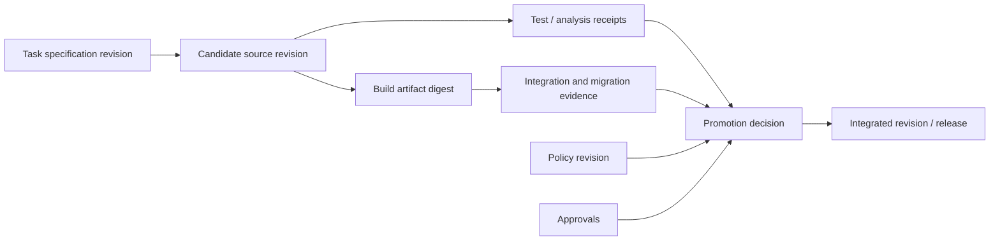

# Verification and Governance for Agentic Change

## TL;DR

An agent-generated patch is a proposal, not proof. A trustworthy engineering system converts the task into explicit acceptance claims, records the provenance of the candidate, gathers independent evidence against the actual target revision, and lets policy plus accountable reviewers decide whether the evidence authorizes integration. The hardest failure is **correlated evidence**: the same run misunderstands the requirement, writes the implementation, generates tests for its interpretation, and then declares those tests sufficient. Separate specification, mutation, verification, and release authority where risk justifies it.

This chapter owns evidence, review, and promotion decisions. Runtime and tool isolation belong to [Platform Fundamentals](./01-compound-engineering-fundamentals.md) and [Tool Contracts](./02-coding-agent-tool-design.md); repository structure belongs to [Repository Architecture](./04-ai-native-software-architecture.md); application-security mechanisms belong to [Security](../10-security/04-api-security.md).

---

## Define the Claims Before the Checks

Verification begins by translating a task into claims that can be disproved. “Implement feature flags” is not a claim. Examples of testable claims are:

```text
behavior
  an eligible tenant receives the new path for a stable assignment
  an ineligible tenant can never receive it

compatibility
  old clients and new clients can overlap for the rollout window
  stored data remains readable by the rollback version

failure
  stale flag configuration fails according to the documented policy
  disabling the kill switch reaches every evaluator within the stated bound

security
  callers cannot choose another tenant's evaluation subject
  audit events contain decision metadata but no sensitive attributes

operations
  rollout and rollback produce observable, attributable state transitions
```

Each claim names its authority, evidence type, and applicability. A unit test may prove a pure assignment function; it cannot prove configuration propagation across a fleet. A staging result may exercise integration but not production cardinality. A reviewer should be able to see which claims remain unsupported.

### Requirement ledger

Store a versioned requirement ledger with:

```text
claim_id
source and source_revision
statement
risk / effect class
affected invariant or interface
required evidence classes
owner / approver
status and evidence references
explicit exclusions and assumptions
```

The ledger prevents completion from shrinking to whatever the implementation happened to cover. If a claim changes, prior evidence is stale until re-evaluated against the new revision.

---

## Evidence Graph, Not a Green Badge

Evidence is meaningful only when connected to the artifact and environment it evaluated.



An evidence record includes:

- claim IDs addressed;
- source and target revisions;
- tool and verifier identity/version;
- environment and dependency digests;
- command or structured operation;
- start/end time, status, and resource limits;
- result summary and content-addressed full artifact;
- coverage scope and known exclusions;
- producer identity and independence class.

“CI passed” is a presentation of several records, not one fact. A rerun on a rebased target creates new evidence; copying the old badge does not.

### Independence classes

Evidence can be classified by how likely it is to share the mutation run’s error:

1. **Self-produced:** the same attempt wrote the code and the check.
2. **Same-harness independent pass:** another run or model reviews the diff but shares prompts, tools, and context sources.
3. **Independent verifier:** deterministic compiler, static analyzer, existing acceptance suite, contract fixture, or external policy engine.
4. **Independent authority:** domain owner, security reviewer, change-management service, or production canary with separately defined success criteria.

Self-produced evidence is useful but should not be mislabeled. Two agents using the same task interpretation and test oracle are correlated, not independent consensus.

---

## The Co-Generation Problem

Suppose a task requires rejecting an expired credential. A run misreads “expired” as “older than the cache TTL,” implements that rule, and generates tests for it. Implementation and tests agree perfectly while the requirement is still violated.

Mitigations operate on different sources of independence:

- acceptance examples supplied with the task rather than inferred after coding;
- existing regression suites and production fixtures unknown to the mutation path;
- property and metamorphic tests derived from invariants;
- differential comparison with the current system or another implementation;
- mutation testing to check whether tests detect meaningful faults;
- review that begins from the requirement and independently derives expected behavior before reading the patch explanation;
- staged or shadow execution with predeclared metrics and rollback rules.

Do not hide all acceptance evidence from the agent as a general rule; that can make debugging wasteful and encourage benchmark gaming. Separate a small independent evaluation set or invariant suite when objective measurement matters, while exposing enough diagnostic evidence to repair failures safely.

### Correlated reviewers

Multiple reviewers improve coverage only if their scopes or methods differ. Useful decomposition includes:

- specification and edge-case review;
- state/transaction and concurrency review;
- security/authority and data-boundary review;
- performance/capacity review;
- migration/rollback and operations review;
- test adequacy and evidence-provenance review.

A final integrator resolves contradictions and checks the union against the requirement ledger. Counting reviewer votes is not a correctness proof.

---

## Candidate Provenance and Scope

Every candidate records:

```text
base and target revision
task and requirement revision
agent/model/runtime/tool registry revisions
context and policy revisions
workspace and attempt identity
changed, added, deleted, generated, and permission-changed paths
dependency and lockfile changes
migration, configuration, flag, and infrastructure changes
verification evidence bundle
```

Scope checks compare the candidate with task authority. Unexpected changes are not automatically wrong, but they require explanation and possibly broader approval. Protected paths—authentication, authorization, cryptography, release workflows, billing, data deletion, and policy—can require named owners regardless of test results.

Generated artifacts link to their source and generator receipt. Binary artifacts require provenance or are rebuilt in a trusted verifier. Dependency changes surface transitive, license, provenance, and lifecycle impact rather than appearing as an opaque lockfile diff.

### Diff review order

A robust review sequence is:

1. Read the requirement ledger and derive expected invariants.
2. Inspect file/status scope, generated artifacts, dependencies, permissions, and migrations.
3. Trace state ownership and external effects through the diff.
4. Review failure, concurrency, retry, cancellation, and rollback paths.
5. Inspect tests and evidence for claim coverage and independence.
6. Run or request missing verification against the actual target.
7. Record findings, unresolved assumptions, and the decision.

Reading the candidate’s confident summary first can anchor the reviewer to the same mistaken interpretation.

---

## Verification Layers

No single layer is sufficient.

### Static structure and policy

Fast gates establish that the repository is internally coherent: formatting, parsing, type checking, schema validation, dependency direction, generated-file integrity, forbidden APIs, secret scanning, and protected-path policy. They provide high-volume deterministic evidence but rarely prove runtime semantics.

### Unit and property verification

Unit tests target pure invariants and state transitions. Property-based tests explore generated inputs; model-based tests compare an implementation with a simple state machine. Include concurrency schedules, duplicate delivery, cancellation, and boundary values where those are part of the contract.

Line or branch coverage indicates execution, not correctness. Use uncovered critical paths to guide investigation; do not treat a universal percentage as release authority.

### Contract and compatibility verification

Run every adapter against the same behavioral contract. Validate producer/consumer schema combinations, retained events, old/new clients, rollback binaries, feature-flag states, and database expand/migrate/contract phases. Compatibility evidence must cover the versions that will actually overlap.

### Integration and end-to-end verification

Use real protocol and storage boundaries for transaction, serialization, permission, timeout, and lifecycle behavior. Keep end-to-end suites focused on high-value paths; broad brittle scripts can create slow feedback without clear diagnosis.

### Security verification

Threat-model the change’s trust boundaries and effects. Apply deterministic scanners where relevant, then inspect authorization subject/object binding, tenant isolation, secret flow, injection boundaries, dependency execution, audit behavior, and abuse controls. Generic vulnerability lists belong to the [Security section](../10-security/01-authentication-fundamentals.md); this layer maps those mechanisms to the candidate’s actual change surface.

### Migration and recovery verification

Test interrupted backfills, duplicate workers, stale versions, rollback after partial rollout, backup restore with the new schema, control-plane outage, and reconciliation. A migration that works only from an empty database does not prove production safety.

### Production verification

For changes whose behavior depends on real traffic, use shadow reads, dark launches, canaries, cell-by-cell rollout, and reconciliation. Declare success and rollback predicates before exposure. Guardrail metrics need minimum sample or time requirements and must fail safely when data is missing or invalid.

---

## Risk and Effect-Based Governance

Governance should follow effect, reversibility, and uncertainty rather than whether a human or agent typed the patch.

| Dimension | Lower risk | Higher risk |
|---|---|---|
| Effect | Workspace-local, no external state | Money, identity, deletion, release, public communication |
| Reversibility | Discard branch or simple revert | Data migration, irreversible side effect, long rollback horizon |
| Blast radius | One test fixture or isolated tenant | Shared control plane, global fleet, security boundary |
| Novelty | Established pattern and mature tests | New protocol, dependency, architecture, or failure mode |
| Evidence | Independent, reproducible, production-like | Self-generated, incomplete, flaky, or stale |
| Observability | Fast detection and reconciliation | Silent corruption or delayed discovery |

Policy maps the dimensions to required evidence and approvals. Avoid fixed formulas such as “more than 300 lines requires review”; a one-line permission change can outrank a large generated fixture.

### Decision states

Use more than pass/fail:

- **eligible:** every required claim has applicable evidence and approvals;
- **needs evidence:** implementation may be plausible, but required proof is missing or stale;
- **changes requested:** a concrete defect or requirement mismatch exists;
- **policy denied:** scope/effect is unauthorized regardless of implementation quality;
- **ambiguous:** external or migration state must be reconciled before another action;
- **superseded:** target/specification changed and prior evidence no longer applies.

The decision is durable and references policy, evidence, findings, approvers, and expiry.

---

## Approval and Separation of Duties

Approval authorizes a normalized effect: repository, target revision or range, path/effect scope, environment, and validity window. A generic “yes” in conversation should not authorize a materially different destination discovered later.

For high-impact changes, separate:

- task requester;
- candidate producer;
- evidence producer;
- domain/security approver;
- integration or deployment authority.

Small teams may combine roles, but the system should still record which role made each decision. Automation can act as an authority only under an explicit service identity and policy.

Stale approvals expire when the requirement, target, protected scope, dependency set, migration plan, or evidence changes materially. Cosmetic rebases may be handled by policy if the resulting tree and checks are equivalent; do not assume every rebase is cosmetic.

---

## CI/CD as an Evidence Pipeline

A pipeline stage consumes identified inputs and emits evidence, not merely console text.

```text
candidate revision
  -> scope/provenance checks
  -> build/type/static evidence
  -> unit/property evidence
  -> contract/integration/migration evidence
  -> security and policy evidence
  -> target integration evidence
  -> approval and promotion decision
```

Parallelize independent checks while preserving fail-fast signals. Expensive checks can be selected by an authoritative dependency/risk map; periodically audit selection against full runs. Cache only when keys cover source, dependencies, toolchain, environment, and policy inputs. A cache hit produces a receipt linking to the original evidence.

Flaky checks are uncertain evidence. Track, quarantine with owner and expiry, and repair them; blindly retrying until green biases the pipeline toward false acceptance. Record every attempt, not only the successful one.

The pipeline itself is protected code. Changes to workflow definitions, verifier images, test-selection logic, approval policy, and artifact provenance require elevated review because they can manufacture green evidence.

---

## Findings and Review Protocol

A review finding should be independently actionable:

```text
severity / decision impact
claim or invariant violated
exact source location
concrete failure scenario
why existing evidence does not cover it
minimal remediation or evidence needed
confidence and assumptions
```

Rank correctness, security, data loss, and release blockers above style. Keep plan deviations, implementation bugs, and missing tests separate; a missing test is not itself proof of an implementation defect, and a passing test does not excuse divergence from the accepted requirement.

When no finding remains, say so explicitly while listing verification scope and limitations. “No findings” means no issue was identified in the inspected scope, not proof that none exists.

---

## Observability and Learning

Connect task, candidate, evidence, approval, integration, deployment, incident, revert, and repair records. Useful signals include:

- time and queueing at each verification/approval stage;
- evidence invalidated by target drift;
- failure categories by verifier and change type;
- flaky/retried checks and eventual result;
- findings by invariant and escape stage;
- revert, rollback, and repair linkage;
- defects found after integration versus before;
- cost per accepted and retained change;
- approval overrides and their outcomes.

Use repository-specific baselines and distributions. A high rejection rate can indicate effective review, poor task definition, weak generation, or an overzealous verifier. Metrics need causal investigation, not universal targets or incentives to hide failures.

Feed escaped defects back into acceptance claims, fixtures, properties, policy, and repository architecture. Do not merely add a prompt reminder; put the learning at the deterministic boundary that would have caught the recurrence.

---

## Failure Modes

| Failure | Why it happens | Designed response |
|---|---|---|
| Patch and generated tests share one misconception | Co-generated evidence is correlated | Independent acceptance claims, existing fixtures, separate review/oracles |
| Green result belongs to old revision | Target changed after verification | Bind every receipt to source/target; rerun applicable checks |
| Agent claims a check passed without execution | Narrative confused with evidence | Accept only verifier receipts from authorized environments |
| CI retries flaky test until green | Failed attempts hidden | Preserve all attempts, classify uncertainty, quarantine with ownership |
| Protected workflow weakens its own gates | Pipeline has broad self-modification authority | Elevated ownership and bootstrap policy for verification infrastructure |
| Reviewer follows confident summary | Anchoring and shared interpretation error | Requirement-first review and independently derived invariants |
| Two reviewers agree for same reason | Correlated tools/context/oracle | Diverse scopes and methods; do not count votes as proof |
| Migration passes on empty fixture | Production state/history absent | Snapshot-scale, interrupted, rollback, and mixed-version tests |
| Canary metric is missing | Automation treats no data as success | Typed missing/non-finite state and conservative promotion policy |
| Approval reused for broader effect | Authorization not bound to normalized scope | Scope/destination/revision-bound approval with expiry |

Fault-inject the evidence pipeline: lost receipts, stale caches, verifier crashes after artifact creation, policy rollout during a run, target rebase, cancelled approval, and partial deployment. Governance is a distributed workflow and needs the same recovery discipline as the system it protects.

---

## Decision Framework

Use deterministic automated gates for properties that tools can establish reproducibly. Add independent model or human review when specification interpretation, architectural trade-offs, security boundaries, or unfamiliar changes dominate. Require domain authority for persistent-data, public-contract, money, identity, deletion, and production-control effects.

Increase evidence independence and production realism with risk. Do not demand every possible check for every documentation edit; do not waive critical evidence because a patch is small or tests were generated quickly. The decision is proportional to potential harm, reversibility, detectability, and uncertainty.

The system is ready to integrate a candidate when every required claim has applicable evidence, unresolved findings are consciously accepted by the right authority, and the promotion mechanism will not exceed the approved scope.

---

## Key Takeaways

- Convert requirements into durable claims before judging the implementation.
- Bind every result to specification, source, target, tool, environment, and policy revisions.
- Distinguish self-produced evidence from independent oracles and authorities.
- Govern by effect, reversibility, blast radius, detectability, and evidence—not line count or universal coverage targets.
- Protect the evidence pipeline and approval policy as part of the trusted computing base.
- Feed escaped defects into deterministic contracts, tests, architecture, and policy rather than prompt folklore.

---

## References

- [NIST SP 800-218: Secure Software Development Framework](https://csrc.nist.gov/pubs/sp/800/218/final)
- [SLSA v1.2 Specification](https://slsa.dev/spec/v1.2/)
- [in-toto Attestation Framework](https://github.com/in-toto/attestation)
- [Google Engineering Practices: Code Review](https://google.github.io/eng-practices/review/)
- [OWASP Web Security Testing Guide](https://owasp.org/www-project-web-security-testing-guide/)
- [Coding Agent Platform Fundamentals](./01-compound-engineering-fundamentals.md)
- [Repository Architecture for Safe Agentic Change](./04-ai-native-software-architecture.md)
- [Deployment Strategies](../15-deployment/01-deployment-strategies.md)
