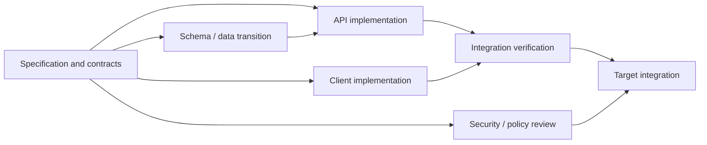
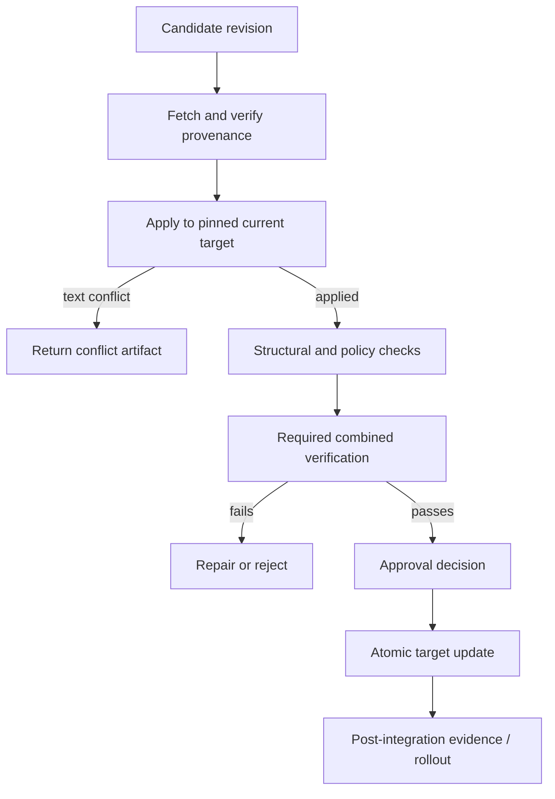

# Parallel Development and Integration

## TL;DR

Parallel coding agents turn software delivery into a scheduling and merge problem. Safe parallelism requires a dependency graph, explicit ownership of files and semantic invariants, isolated workspaces pinned to known revisions, bounded child budgets, durable handoffs, and an integration queue that revalidates every candidate against the actual target. The speedup is limited by the serial fraction—specification, shared interfaces, verification, conflict resolution, and approval—and by downstream capacity. More workers can increase wall-clock time when they duplicate context, contend on the same state, overload tests, or create semantic conflicts that textual merge tools cannot see.

Platform state, capabilities, and effect receipts are defined in [Coding Agent Platform Fundamentals](./01-compound-engineering-fundamentals.md). This chapter owns decomposition, workspace isolation, coordination, handoff, integration, and recovery of concurrent software changes.

---

## Decompose the Change Graph, Not the To-Do List

A useful work item has a clear input revision, bounded ownership, explicit output, acceptance claims, and no hidden dependency on another worker’s uncommitted state.

Represent the change as a directed acyclic graph where possible:



Parallelize nodes whose outputs meet at stable contracts. If API and UI workers must repeatedly negotiate an unnamed response shape, the contract node is unfinished and their apparent independence is false.

### Work-item contract

```text
work_item_id and parent_task_id
objective and requirement revision
input repository / artifact revisions
owned paths, symbols, schemas, or analysis domain
readable dependencies
forbidden effects and protected boundaries
expected artifact / finding schema
acceptance claims and required evidence
budget, priority, deadline, cancellation linkage
integration prerequisites and consumers
```

Ownership can be syntactic (exclusive paths) or semantic (one worker owns the public schema while several implement against it). Semantic ownership matters more: two changes in different files can still race on one database invariant, flag name, generated contract, or migration phase.

### Decomposition tests

Before dispatch, ask:

- Can each worker complete against immutable inputs?
- Are shared contracts already versioned, or is one worker the explicit contract owner?
- Can outputs be verified independently before integration?
- Can a worker fail or be cancelled without invalidating unrelated work?
- Does integration have a deterministic order?
- Is the combined verification cost within downstream capacity?

If not, keep the work serial until the boundary is established.

---

## Parallelism Has a Serial Fraction

For $N$ workers and serial fraction $s$, Amdahl’s Law gives an upper bound:

$$
\text{speedup}(N) \le \frac{1}{s + \frac{1-s}{N}}
$$

If specification, contract decisions, integration, and review consume 40% of the critical path, unlimited workers cannot exceed 2.5x speedup even before coordination overhead. Real systems add:

$$
T(N) = T_{serial} + \frac{T_{parallel}}{N} + T_{coord}(N) + T_{verify}(N) + T_{conflict}(N)
$$

`T_coord` includes context packaging and handoffs; `T_verify` may rise when every branch runs expensive suites; `T_conflict` grows sharply when ownership overlaps. Measure these terms for the repository rather than promising a universal multiplier.

### Downstream bottlenecks

Parallel mutation consumes shared resources:

- sandbox slots and build cache bandwidth;
- database/service test environments;
- package registries and external API quotas;
- merge queue capacity;
- domain, security, and release reviewers.

If 20 workers each produce a candidate every 15 minutes but integration can safely validate two candidates every 15 minutes, the system accumulates stale branches. Admission control should stop dispatching more mutation work or route capacity to verification and integration.

---

## Workspace Isolation

Every mutation work item receives a unique branch and workspace at a pinned base revision.

```text
repository
  main worktree / protected target
  linked worktree A -> branch task/A @ base X
  linked worktree B -> branch task/B @ base X
  integration worktree -> target + selected candidates
```

A linked worktree isolates the index, checked-out files, and branch while sharing immutable object storage. It protects against accidental overwrite and makes a candidate diff attributable. It does not sandbox untrusted code; builds and tests still require the runtime isolation from [Tool Contracts](./02-coding-agent-tool-design.md).

### Workspace lifecycle

1. Resolve and record the immutable base and intended target.
2. Create a unique branch/worktree and lock its ownership to the work item.
3. Provision dependencies through scoped, integrity-checked caches.
4. Apply changes and persist intermediate checkpoints or commits according to policy.
5. Produce a candidate artifact and evidence bundle.
6. Freeze the candidate revision for review/integration.
7. Remove the worktree only after artifacts are durable and no reconciliation remains.
8. Delete the local branch after integration or explicit abandonment.

Cleanup is a workflow, not a best-effort shell command. Track orphaned workspaces, running processes, mounted secrets, temporary environments, and remote draft artifacts. A worker crash transfers cleanup ownership to the platform.

### Base strategy

Starting all workers from the same target snapshot simplifies independent comparison. A dependent work item can instead pin its parent’s candidate revision, creating a stack. Record the edge explicitly; if the parent changes, the child’s evidence is stale.

Do not let workers continuously pull or merge a moving target during implementation. That destroys reproducibility and makes it unclear which target their tests covered. Target movement is handled by the integration stage.

---

## Ownership and Conflict Prevention

Textual path locks are a useful first layer:

```text
exclusive write: migrations/2026_07_*, schema/order.json
shared read:      src/orders/**, contracts/**
generated output: sdk/** (owned by contract generator only)
review domain:    authorization boundary, no mutation
```

But conflicts occur at several levels:

1. **Textual conflict:** two patches modify overlapping lines.
2. **Structural conflict:** files merge but imports, generated output, or schema versions disagree.
3. **Semantic conflict:** changes compile separately and together but violate an invariant.
4. **Operational conflict:** rollouts require incompatible ordering or capacity.
5. **Authority conflict:** workers make different decisions about one protected contract.

Prevent conflicts by assigning one owner to shared contracts, schemas, migrations, dependency versions, and generated sources. Consumers use fixtures or pinned prerelease artifacts from that owner rather than inventing local variants.

### Optimistic versus reserved ownership

Use optimistic parallelism for low-coupling modules: workers proceed and integration detects rare conflicts. Reserve ownership for central schemas, migration ordinals, release workflows, or files with high contention. Reservations carry leases so abandoned work does not block the repository forever, but a stale worker still needs fencing at the integration authority.

---

## Coordination Protocol

Workers communicate through durable artifacts and state transitions, not informal transcript assumptions.

### Contract publication

The contract owner publishes a versioned schema, interface, fixture set, or design decision. Consumers record the exact revision. If the contract changes incompatibly, the scheduler invalidates dependent evidence and either restarts or creates an explicit migration task.

### Progress events

Emit coarse structured progress:

```text
started
contract_required / contract_published
candidate_checkpointed
blocked { dependency, evidence }
verification_started / verification_failed / verification_passed
candidate_ready
cancel_requested / reconciled / cancelled
```

Do not stream every reasoning token into the parent. Large logs and transcripts go to an artifact store with retention policy; coordination state remains bounded and queryable.

### Blocking and help

A worker that lacks authority, input, or a contract transitions to `blocked` with the missing item and evidence gathered. The orchestrator may satisfy the dependency, reassign ownership, or ask for a decision. Repeatedly guessing around a missing requirement produces divergent branches.

### Cancellation

Cancelling a parent propagates an epoch to children. No child may begin new effects after observing it. Each child persists its candidate/checkpoint, stops processes, releases reservations, and reports ambiguous external effects for reconciliation. The parent reaches terminal cancelled state only after required child cleanup or explicit abandonment policy.

---

## Durable Handoffs

A handoff is a compact state transfer:

```text
work item and candidate revision
requirement / contract revisions used
owned scope and actual changed scope
decisions and rejected alternatives
invariants affected
verification run, receipts, and failures
known gaps, assumptions, and ambiguous effects
migration / rollout / rollback notes
next authorized action
```

Every claim links to source or evidence. “Mostly done” is not a state. Use `candidate_ready`, `blocked`, `needs_repair`, or another defined state.

The receiving worker validates that revisions still exist and the target has not invalidated assumptions. A handoff summary can be wrong; durable source, diff, and receipts remain authoritative.

### Session boundaries

Long-running work should checkpoint at semantic boundaries: contract accepted, migration expand phase complete, candidate built, verification failed with diagnosis. A checkpoint records durable task state and artifacts, not an instruction to trust a generated summary blindly.

---

## Integration as a Transaction

Integration must serialize changes that affect one target and re-establish evidence after composition.



### Merge queue

Candidates enter a priority/fairness queue. The integrator creates a speculative target containing the latest protected target plus the candidate, runs required checks, and atomically updates the target only if it has not changed. If another candidate wins first, rebase/reapply and rerun applicable evidence.

Batching several candidates can improve throughput but makes failure attribution harder. Use bisection or smaller batches when combined checks fail. High-risk migrations and policy changes should often integrate alone.

### Evidence invalidation

Evidence produced on the candidate branch remains useful for local invariants but may not prove the composed target. Dependency, generated-code, integration, and end-to-end checks run again when affected. The verification policy defines which receipts are reusable based on content and dependency digests.

### Conflict artifacts

Do not ask a model to resolve a conflict from console text alone. Persist base, target, candidate, conflict hunks, ownership, relevant contracts, and prior decisions. Conflict repair is a new candidate revision with new evidence.

### Atomic target update

The final branch/ref update uses compare-and-swap against the target revision verified. A late integrator cannot overwrite a newer target. External publication—pull request, artifact, deployment—stores its own idempotency key and receipt.

---

## Stacked and Incremental Changes

Large migrations are safer as a dependency chain of reviewable states:

```text
A: introduce compatible interface
B: migrate one implementation behind interface
C: switch traffic / writers
D: remove legacy path after evidence window
```

Each step must be safe when deployed independently. Children pin the parent candidate or integrated revision; rewriting a parent invalidates child evidence. A stack manager tracks dependency and updates review order.

Avoid splitting only to satisfy a diff-size heuristic. A change is a useful slice when it has a coherent invariant, compatibility posture, verification, and rollback story.

---

## Cost and Capacity Control

Budget actual resources:

```text
task budget
  planning/model inference
  workspace compute and storage
  dependency downloads
  build/test minutes
  external API operations
  integration retries
  human review time
```

Parallel execution may reduce elapsed time while increasing total work through duplicated repository discovery, builds, and reviews. Cache immutable artifacts by complete input digest, share read-only repository objects, and reuse applicable evidence, but isolate writable caches and tenant data.

The scheduler should prefer the critical path, not maximize active workers. If the schema task blocks five consumers, allocating stronger compute or earlier review to it can outperform launching more downstream attempts.

Set queue-age limits. A low-priority candidate based on a target that moved substantially may be cheaper to regenerate than repeatedly rebase and reverify.

---

## Observability

Trace parent task, work item, workspace, candidate, evidence, integration attempt, target update, and cleanup. Measure:

- runnable, blocked, verifying, and integrating time;
- critical-path length and fanout;
- workspace provisioning and orphan cleanup;
- ownership reservation contention;
- textual, structural, semantic, and operational conflict rates;
- evidence reuse versus invalidation after integration;
- merge-queue wait and speculative-check waste;
- cancellation and cleanup latency;
- total compute/model/review cost per retained integrated change;
- repair and revert linkage.

Do not optimize “agents active” or raw output. High utilization can mean the platform is producing stale work faster than it can validate.

---

## Failure Modes

| Failure | Consequence | Response |
|---|---|---|
| Two workers own one schema | Divergent clients and migrations | One contract owner; versioned publication and dependent invalidation |
| Workers share a directory | Lost or unattributable changes | Unique workspace/index/branch per mutation work item |
| Worktree treated as sandbox | Repository code reaches host credentials/network | Execute in container/microVM with scoped capabilities |
| Parent summary omits child caveat | Unsafe integration | Handoff links durable evidence, assumptions, and state |
| Candidate tests pass on stale base | False confidence after target moved | Integration-stage reapply and affected verification |
| Text merge succeeds, invariant fails | Semantic conflict | Combined contract/property/integration checks and domain review |
| Merge queue saturated | Branches age and retry repeatedly | Admission control, priority/fairness, queue-age policy |
| Worker dies holding reservation | Shared contract blocked | Lease plus fencing at integration authority |
| Cancellation leaves server/process | Resource and credential leak | Process-group/sandbox teardown and tracked cleanup workflow |
| Parallel review repeats one oracle | Correlated confidence | Diverse review scopes and independent evidence |
| Child recursively spawns children | Budget explosion | Depth/fanout/total-budget limits inherited from parent |
| External draft created twice | Retry after lost response | Logical effect ID, provider lookup, idempotency receipt |

Exercise the workflow with deterministic scheduler tests and faults after workspace creation, contract publication, candidate persistence, verification completion, target comparison, atomic update, and cleanup.

---

## Decision Framework

Parallelize when work items have stable boundaries, independent verification, and enough downstream capacity. Keep work serial when the specification is still converging, one state invariant spans the tasks, migration order is delicate, or integration cost dominates implementation.

Use optimistic integration for low-conflict modules and reserved ownership for central contracts and migrations. Use stacked changes when each step is independently safe and reviewable; use one coherent candidate when splitting would create invalid intermediate states.

The objective is not maximum concurrency. It is minimum safe time from accepted requirement to verified integrated behavior.

---

## Key Takeaways

- Decompose around contracts, state ownership, evidence, and integration order.
- Account for the serial fraction and downstream test/review capacity before adding workers.
- Give each mutation an isolated pinned workspace; a worktree is not a security sandbox.
- Coordinate through versioned contracts, durable state, receipts, and bounded handoffs.
- Treat integration as a compare-and-swap transaction followed by evidence against the composed target.
- Measure retained integrated outcomes and conflict/retry cost, not worker count or promised multipliers.

---

## References

- [Git Worktree Documentation](https://git-scm.com/docs/git-worktree)
- [Amdahl’s Law](https://dl.acm.org/doi/10.1145/1465482.1465560)
- [Bors-NG: A Merge Bot for GitHub Pull Requests](https://bors.tech/documentation/)
- [Google Engineering Practices: Small CLs](https://google.github.io/eng-practices/review/developer/small-cls.html)
- [Workflow and Job System Fundamentals](../18-workflow-job-systems/01-workflow-system-fundamentals.md)
- [DAG Orchestration](../18-workflow-job-systems/05-dag-orchestration.md)
- [Verification and Governance](./05-quality-engineering-with-ai-agents.md)
